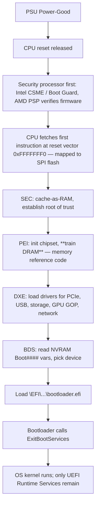

# How BIOS / UEFI Works

> **Level:** Advanced · **Related:** [Motherboard](motherboard.md) · [OS](../03-os-and-software/operating-system.md) · [RAM](ram.md) · [Drivers](../03-os-and-software/drivers.md)

## 1. What firmware does

When you press the power button, RAM is untrained, the CPU caches are empty, PCIe devices are unenumerated and no disk driver exists. **Firmware** — historically the **BIOS** (Basic Input/Output System), today **UEFI** (Unified Extensible Firmware Interface) — is the code stored in an SPI flash chip on the motherboard that brings the hardware to a usable state, finds a boot loader, and hands over control to the OS.

"BIOS" is still used colloquially for UEFI firmware setup screens.

| | Legacy BIOS | UEFI |
|---|---|---|
| Era | 1981 (IBM PC) – ~2020 | 2005+ (mandatory for Windows 11) |
| CPU mode | 16-bit real mode, 1 MB address space | 32/64-bit protected/long mode |
| Disk scheme | MBR: 4 primary partitions, 2 TB limit | GPT: 128+ partitions, 9.4 ZB limit |
| Boot target | 446-byte boot code in sector 0 | `.efi` PE executables on the EFI System Partition (FAT32) |
| Services | `INT 13h` (disk), `INT 10h` (video) | Boot Services, Runtime Services, protocols |
| Security | None | Secure Boot, signed capsules, measured boot |
| Legacy support | — | CSM (Compatibility Support Module), removed on most new boards |

## 2. Power-on to OS: the full sequence



UEFI phases per the PI (Platform Initialization) spec:

1. **SEC (Security)** – runs from flash with no RAM; uses the CPU cache as temporary RAM ("Cache-as-RAM"/NEM).
2. **PEI (Pre-EFI Initialization)** – minimal init: memory controller, **DRAM training** (reads SPD, calibrates timings; see [RAM](ram.md)), CPU microcode update.
3. **DXE (Driver Execution Environment)** – full driver model; enumerates PCIe, initializes USB, storage (AHCI, NVMe), graphics via **GOP** (Graphics Output Protocol), networking (PXE/HTTP boot). Builds **ACPI** tables and **SMBIOS** tables for the OS.
4. **BDS (Boot Device Selection)** – consults NVRAM variables `BootOrder`, `Boot0000`…; shows setup UI if a key is pressed.
5. **TSL (Transient System Load)** – runs the OS loader.
6. **RT (Runtime)** – after `ExitBootServices()`, only Runtime Services (get/set variables, time, reset, capsule update) remain available to the OS.

In parallel: **POST** (Power-On Self-Test) checks and beep/LED/POST-code diagnostics (the two-digit "Q-Code" displays on enthusiast boards).

## 3. Legacy BIOS boot, for contrast

1. BIOS loads sector 0 (MBR, 512 bytes) to `0x7C00`, checks signature `0x55AA`, jumps.
2. MBR code finds the active partition, loads its Volume Boot Record.
3. Chain-loads a bootloader (GRUB stage 1.5/2, Windows `bootmgr`).
4. Everything uses 16-bit `INT` calls until the OS switches CPU modes itself.

## 4. What the OS gets from firmware

| Interface | Purpose |
|---|---|
| **ACPI** tables (DSDT, SSDT, FADT, MADT, …) + AML bytecode | Describe devices, power states (S0–S5, C-states, P-states), thermal zones, battery; OS runs AML interpreter |
| **SMBIOS / DMI** | Vendor, model, serial, RAM slots (`dmidecode`, `Win32_ComputerSystem`) |
| **Memory map** (`GetMemoryMap` / E820) | Which physical ranges are usable RAM vs reserved |
| **UEFI Runtime Services** | NVRAM variables (boot entries, Secure Boot keys), RTC, reset |
| **Device Tree** (ARM/embedded instead of ACPI) | Hardware description blob |
| **SMM** (System Management Mode) | Invisible ring −2 handler for power/thermal/legacy emulation — triggered by SMIs |

## 5. The EFI System Partition (ESP)

A FAT32 partition (GPT type `C12A7328-F81F-11D2-BA4B-00A0C93EC93B`):

```
ESP/
└── EFI/
    ├── Boot/bootx64.efi          # fallback loader for removable media
    ├── Microsoft/Boot/bootmgfw.efi
    ├── ubuntu/shimx64.efi, grubx64.efi
    └── systemd/systemd-bootx64.efi
```

| Task | Windows | Linux |
|---|---|---|
| Check firmware mode | `msinfo32` → BIOS Mode "UEFI" | `[ -d /sys/firmware/efi ] && echo UEFI` |
| List boot entries | `bcdedit /enum firmware` | `efibootmgr -v` |
| Mount ESP | `mountvol S: /S` | usually `/boot/efi` or `/efi` |
| Reboot to firmware setup | `shutdown /r /fw /t 0` | `systemctl reboot --firmware-setup` |
| Read UEFI variables | `Get-SecureBootUEFI -Name PK` | `/sys/firmware/efi/efivars/`, `efivar -l` |
| Firmware version | `Get-CimInstance Win32_BIOS` | `dmidecode -t bios` |
| Update firmware | Vendor tool / Windows Update capsule | `fwupdmgr refresh && fwupdmgr update` (LVFS) |
| ACPI tables | — | `sudo acpidump > acpi.dat; iasl -d` |

## 6. Security: Secure Boot and measured boot

**Secure Boot** verifies every executable in the chain against keys in NVRAM:

```
PK (Platform Key, OEM)
 └── KEK (Key Exchange Keys: OEM, Microsoft)
      ├── db  (allowed signatures/certs: Microsoft Windows CA, Microsoft UEFI CA 2011/2023)
      └── dbx (revoked hashes/certs — e.g., BlackLotus-vulnerable boot managers)
```

Linux distros boot through **shim** (signed by Microsoft's UEFI CA) which then verifies GRUB/kernel with the distro key or a user-enrolled **MOK** (`mokutil`).

**Measured boot** extends a hash of each stage into **TPM PCRs** (PCR0 firmware, PCR7 Secure Boot policy, …). BitLocker and LUKS+`systemd-cryptenroll --tpm2-pcrs=7` seal disk keys to those values: tampering changes the PCRs → no automatic unlock.

**Hardware roots of trust:** Intel Boot Guard, AMD Platform Secure Boot — fused keys verify the initial firmware block before the CPU runs it.

**Threats:** UEFI bootkits/rootkits (LoJax, MosaicRegressor, CosmicStrand, BlackLotus), SMM vulnerabilities, unsigned option ROMs. Defense: firmware updates, Secure Boot on, BIOS password, flash write protection, `dbx` updates. See [Malware](../06-security-and-data/malware.md).

## 7. Writing a tiny UEFI application (C)

```c
// hello.c — build with gnu-efi or EDK II; copy to ESP as \EFI\Boot\bootx64.efi
#include <efi.h>
#include <efilib.h>

EFI_STATUS EFIAPI efi_main(EFI_HANDLE image, EFI_SYSTEM_TABLE *st) {
    InitializeLib(image, st);
    Print(L"Hello from UEFI! Firmware vendor: %s\n", st->FirmwareVendor);
    UINTN key_index; EFI_INPUT_KEY key;
    uefi_call_wrapper(st->BootServices->WaitForEvent, 3, 1, &st->ConIn->WaitForKey, &key_index);
    return EFI_SUCCESS;
}
```

Test without hardware: `qemu-system-x86_64 -bios OVMF.fd -drive format=raw,file=fat:rw:esp/`.

## 8. Firmware setup options that matter

- **XMP/EXPO** – apply rated RAM speeds (otherwise JEDEC defaults)
- **Resizable BAR** – lets CPU map the whole GPU VRAM
- **VT-x/AMD-V, VT-d/IOMMU** – needed for Hyper-V, WSL2, KVM, device passthrough
- **fTPM / PTT** – firmware TPM 2.0 (Windows 11 requirement)
- **CSM** off + Secure Boot on
- **Boot order**, fan curves, power limits (PL1/PL2, PPT), C-states

## Further reading
- UEFI Specification & PI Specification (uefi.org)
- TianoCore **EDK II** open-source reference implementation; **coreboot** and **LinuxBoot** alternatives
- Microsoft docs: "Secure Boot", "Windows boot process"; Linux kernel `Documentation/admin-guide/efi-stub.rst`
