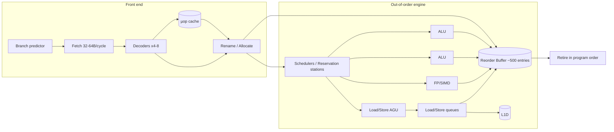

# How a CPU Works

> **Level:** Advanced · **Related:** [RAM](ram.md) · [Motherboard](motherboard.md) · [Compilation](../03-os-and-software/code-compilation.md) · [OS](../03-os-and-software/operating-system.md)

## 1. The one-sentence model

A CPU is a synchronous state machine that repeatedly **fetches** an instruction from memory, **decodes** it into control signals, **executes** it on arithmetic/logic units, and **writes back** the result — billions of times per second, with enormous machinery built around that loop to hide the latency of memory and the dependencies between instructions.

## 2. From transistors to logic

| Layer | What it is | Example |
|---|---|---|
| Transistor | Voltage-controlled switch (MOSFET; modern: FinFET / GAAFET "nanosheet") | TSMC N3, Intel 18A |
| Logic gate | 2–12 transistors wired as NAND/NOR/NOT | CMOS NAND = 4 transistors |
| Combinational block | Gates computing a pure function | Adder, multiplexer, decoder |
| Sequential block | Gates + feedback = memory | Flip-flop, latch, register |
| Datapath | Registers + ALUs + buses | Integer pipeline |
| Control | Decides what the datapath does each cycle | Decoder, scheduler |

**The clock.** A crystal oscillator + PLL produces a square wave (e.g., 5 GHz = 0.2 ns period). On each rising edge flip-flops latch their inputs. The longest combinational path between two flip-flops (the *critical path*) sets the maximum frequency. Pipelining exists precisely to shorten that path.

**Power:** dynamic power ≈ `α · C · V² · f`. Voltage matters quadratically, which is why DVFS (Dynamic Voltage & Frequency Scaling — Intel SpeedStep/Speed Shift, AMD CPPC, Linux `cpufreq` governors) is the main power lever.

## 3. The Instruction Set Architecture (ISA)

The ISA is the contract between software and hardware: registers, instructions, memory model, privilege levels.

| ISA | Style | Where |
|---|---|---|
| x86-64 (AMD64) | CISC front, variable length 1–15 bytes | PCs, servers |
| ARMv8/ARMv9 (AArch64) | RISC, fixed 32-bit | Phones, Apple M-series, AWS Graviton |
| RISC-V | Open RISC, modular extensions | Embedded, growing everywhere |

A C++ line and what it becomes:

```cpp
int add(int a, int b) { return a + b; }
```

```asm
; x86-64 (System V ABI: a in edi, b in esi, return in eax)
add:
    lea eax, [rdi + rsi]
    ret

; AArch64 (a in w0, b in w1, return in w0)
add:
    add w0, w0, w1
    ret
```

Modern x86 decodes CISC instructions into internal RISC-like **micro-ops (µops)**; inside, x86 and ARM cores look very similar.

## 4. The classic 5-stage pipeline

```
Cycle:     1    2    3    4    5    6    7
Instr 1:  IF   ID   EX   MEM  WB
Instr 2:       IF   ID   EX   MEM  WB
Instr 3:            IF   ID   EX   MEM  WB
```

- **IF** – fetch from L1 instruction cache using the Program Counter (PC)
- **ID** – decode, read register file
- **EX** – ALU operation / address calculation
- **MEM** – load/store to L1 data cache
- **WB** – write result to register file

**Hazards** break the ideal 1 instruction/cycle:

| Hazard | Cause | Fix |
|---|---|---|
| Data (RAW) | `add r1,..` then `sub .., r1` | Forwarding/bypass networks; stall if load-use |
| Control | Branch target unknown until EX | **Branch prediction** + speculation |
| Structural | Two instructions need one unit | Duplicate units, multiport caches |

Modern cores have 14–20+ stages, so a branch misprediction costs ~15–20 cycles of flushed work.

## 5. Superscalar, out-of-order execution (the real modern core)



1. **Branch prediction** – TAGE-style predictors hit >97% accuracy using global history; a Branch Target Buffer (BTB) predicts *where* jumps go; a Return Stack Buffer predicts `ret`.
2. **Register renaming** – the 16 architectural x86 registers map onto ~200–300 physical registers. This removes false dependencies (WAR/WAW) so independent instructions can run in parallel.
3. **Reorder Buffer (ROB)** – instructions *execute* out of order, but *retire* in order, so exceptions are precise.
4. **Schedulers** dispatch a µop the moment its inputs are ready (dataflow execution).
5. **Memory disambiguation** – loads may speculatively pass older stores whose addresses are unknown; if they alias, the load is replayed.

Throughput is measured as **IPC** (instructions per cycle). Apple/ARM and Intel/AMD big cores sustain 4–8+ IPC on friendly code.

### Speculation and its security cost
Speculatively executed instructions leave traces in caches even when discarded. **Spectre** (branch misprediction) and **Meltdown** (permission check deferred) exploit this through cache-timing side channels. Mitigations: KPTI (Linux kernel page-table isolation), retpolines, IBRS/IBPB/STIBP, `lfence` barriers. On Linux, see `/sys/devices/system/cpu/vulnerabilities/`; on Windows, `Get-SpeculationControlSettings` (PowerShell module).

## 6. The memory hierarchy (why caches dominate performance)

| Level | Size (typical 2025 desktop) | Latency |
|---|---|---|
| Registers | ~KB | 0 cycles |
| L1 I/D | 32–64 KB each per core | ~4–5 cycles |
| L2 | 1–3 MB per core | ~12–16 cycles |
| L3 (LLC) | 16–128 MB shared (AMD 3D V-Cache stacks more) | ~40–60 cycles |
| DRAM | 16–128 GB | ~80–100 ns ≈ 300–500 cycles |

- Caches operate on **64-byte lines**, are **set-associative**, and use pseudo-LRU replacement.
- **Hardware prefetchers** detect strides and fetch ahead.
- **TLB** caches virtual→physical page translations; a TLB miss triggers a **page-table walk** (4–5 levels on x86-64).
- **Coherence** (MESI/MOESI/MESIF) keeps per-core caches consistent. Writing to a line another core holds invalidates it — the root of **false sharing**:

```cpp
// False sharing: both counters live on one 64-byte cache line
struct Counters { std::atomic<long> a; std::atomic<long> b; };

// Fix: pad each to its own line
struct alignas(64) Padded { std::atomic<long> v; };
Padded counters[2];
```

Cache-friendly traversal matters more than instruction count:

```cpp
// Row-major: sequential, prefetcher-friendly (fast)
for (int i = 0; i < N; ++i) for (int j = 0; j < N; ++j) sum += m[i][j];
// Column-major on row-major data: a new cache line every access (slow, often 5-10x)
for (int j = 0; j < N; ++j) for (int i = 0; i < N; ++i) sum += m[i][j];
```

## 7. SIMD / vector units

One instruction, many data lanes: SSE (128-bit), AVX2 (256-bit), AVX-512 (512-bit), ARM NEON (128-bit), SVE/SVE2 (scalable). Compilers auto-vectorize simple loops; intrinsics give control:

```cpp
#include <immintrin.h>
void add8(const float* a, const float* b, float* out) {
    __m256 va = _mm256_loadu_ps(a);
    __m256 vb = _mm256_loadu_ps(b);
    _mm256_storeu_ps(out, _mm256_add_ps(va, vb)); // 8 float adds in one instruction
}
```

Also: AMX (Intel matrix tiles), ARM SME — CPUs are absorbing NPU-like matrix engines.

## 8. Multicore, SMT and hybrid designs

- **SMT** (Hyper-Threading): one physical core exposes 2 logical CPUs sharing execution units, filling idle slots.
- **Hybrid**: Intel P-cores + E-cores, ARM big.LITTLE / DynamIQ. The OS scheduler needs hints — Intel **Thread Director** feeds Windows 11 and Linux (`intel_hfi`) with per-thread class data.
- **Chiplets**: AMD Zen puts cores on CCDs and I/O on an IOD, connected by Infinity Fabric. Cross-chiplet latency is higher → NUMA-like effects.
- **Memory ordering**: x86 is TSO (strong: only store→load reordering visible); ARM is weakly ordered, so correct lock-free code needs acquire/release:

```cpp
std::atomic<bool> ready{false}; int data;
// producer
data = 42;
ready.store(true, std::memory_order_release);
// consumer
while (!ready.load(std::memory_order_acquire)) {}
assert(data == 42); // guaranteed by release/acquire pairing
```

## 9. Privilege, interrupts and the OS contract

- **Rings**: x86 ring 0 (kernel) vs ring 3 (user); ARM EL0 (user), EL1 (kernel), EL2 (hypervisor), EL3 (secure monitor).
- **System calls**: `syscall` (x86-64) / `svc` (ARM) switch to kernel mode through a fixed entry point.
- **Interrupts**: devices raise signals via the APIC (x86) / GIC (ARM); the CPU saves state and jumps through the IDT / vector table.
- **Virtualization**: VT-x/AMD-V add a "root mode" and nested page tables (EPT/NPT) for hypervisors (Hyper-V, KVM).
- **MMU**: translates virtual addresses per process using page tables pointed to by CR3 (x86) / TTBR (ARM).

## 10. Observing a CPU yourself

**Linux**
```bash
lscpu                         # topology, caches, flags
cat /proc/cpuinfo | grep -m1 flags
perf stat -e cycles,instructions,cache-misses,branch-misses ./app   # IPC, misses
perf record -g ./app && perf report                                 # hot spots
cpupower frequency-info       # DVFS governor
taskset -c 2 ./app            # pin to core 2
```

**Windows**
- Task Manager → Performance → CPU (base speed, cores, L1–L3 sizes)
- `wmic cpu get name,numberofcores,numberoflogicalprocessors` (legacy) or `Get-CimInstance Win32_Processor`
- Windows Performance Recorder/Analyzer (WPR/WPA), Intel VTune, AMD uProf
- Process affinity: `start /affinity 4 app.exe`

**Measure branch prediction from Python** (the famous sorted-array effect is visible even here with NumPy-free pure loops, but clearest in C++):

```cpp
// Summing only values >= 128: much faster if data is sorted (predictable branch)
for (int x : data) if (x >= 128) sum += x;
// Branchless version the compiler may emit (cmov): same speed sorted or not
for (int x : data) sum += (x >= 128) ? x : 0;
```

## 11. Key takeaways

1. The CPU is fast; memory is slow. Most performance engineering is cache engineering.
2. Out-of-order + speculation extracts parallelism from sequential code — at a security cost.
3. The ISA is the stable contract; micro-architecture changes every generation.
4. Branch predictability, data locality and vectorization are the three levers developers control.

## Further reading
- Hennessy & Patterson, *Computer Architecture: A Quantitative Approach*
- Agner Fog, *The microarchitecture of Intel, AMD and VIA CPUs* (agner.org)
- Intel® 64 and IA-32 Architectures Software Developer's Manuals; Arm Architecture Reference Manual
- Ulrich Drepper, *What Every Programmer Should Know About Memory*
