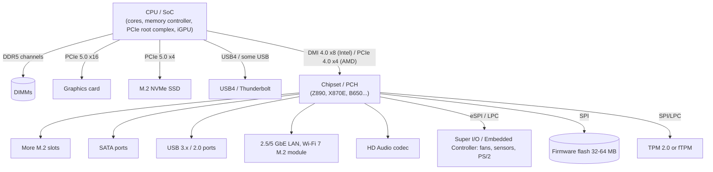

# How a Motherboard Works

> **Level:** Advanced · **Related:** [CPU](cpu.md) · [RAM](ram.md) · [BIOS/UEFI](bios.md) · [GPU](gpu.md) · [Drivers](../03-os-and-software/drivers.md)

## 1. Role

The motherboard is a multi-layer **printed circuit board (PCB)** that:

1. **Delivers power** — converts 12 V from the PSU into ~0.7–1.5 V at hundreds of amps for the CPU.
2. **Connects** the CPU to RAM, GPU, storage, USB, network and audio with high-speed signal traces.
3. **Hosts** the chipset, firmware flash, clock generators, embedded controller, TPM, sensors.
4. **Orchestrates** power-on sequencing and system management.

## 2. Anatomy

```
┌───────────────────────────────────────────────────────────────┐
│ [I/O shield: USB, LAN, audio, display out]   [8-pin EPS 12V]  │
│  ┌────────┐  ┌──────────────┐  ║ ║ ║ ║   DIMM slots (DDR5)   │
│  │ VRM    │  │  CPU socket  │  ║ ║ ║ ║   (A1 A2 B1 B2)       │
│  │ phases │  │  LGA1851/AM5 │  ║ ║ ║ ║                       │
│  └────────┘  └──────────────┘  ║ ║ ║ ║   [24-pin ATX power]  │
│  [M.2 slot — CPU PCIe 5.0 x4]                                 │
│  ════════ PCIe x16 slot (CPU lanes, GPU) ═════════            │
│  [M.2 slots — chipset]      ┌─────────┐   [SATA ports]        │
│  ════ PCIe x4 slot (chipset) │ Chipset │                       │
│  [Audio codec] [SPI BIOS flash] [Super I/O/EC] [CMOS battery] │
│  [Front panel header] [USB headers] [Fan headers] [TPM hdr]   │
└───────────────────────────────────────────────────────────────┘
```

**Form factors:** ATX (305×244 mm), Micro-ATX, Mini-ITX (170×170 mm), E-ATX; laptops use custom boards with soldered components.

## 3. Topology: who connects to whom

The old "northbridge" (memory controller, PCIe for GPU) moved into the CPU around 2008–2011. Today:



**Key insight:** everything behind the chipset shares the single CPU↔chipset link. Two chipset-attached NVMe drives copying to each other compete for that ~8–16 GB/s.

## 4. Power delivery: the VRM

The CPU needs e.g. 1.2 V at up to 250+ A with voltage changing in microseconds. The **Voltage Regulator Module** is a multi-phase **buck converter**:

```
12V ──[High-side MOSFET]──┬──[Inductor/choke]──┬── Vcore → CPU
                          │                    │
                    [Low-side MOSFET]      [Capacitors]
                          │                    │
                         GND                  GND
   PWM controller switches phases in turn (e.g., 16 phases × 80 A "smart power stages")
```

- **Duty cycle** ≈ Vout/Vin (1.2/12 = 10%).
- **Multiphase** interleaving spreads heat and reduces ripple.
- The CPU requests voltage digitally via **SVID** (Intel) / **SVI3** (AMD).
- **Load-line calibration (LLC)** counteracts Vdroop under load.
- Poor VRMs overheat → throttling. This is why "VRM quality" matters for high-core-count CPUs.

## 5. High-speed buses

| Bus | Per-lane rate | x16 bandwidth (one direction) | Notes |
|---|---|---|---|
| PCIe 3.0 | 8 GT/s (128b/130b) | ~16 GB/s | |
| PCIe 4.0 | 16 GT/s | ~32 GB/s | |
| PCIe 5.0 | 32 GT/s | ~64 GB/s | Needs retimers / better PCB material |
| PCIe 6.0 | 64 GT/s, PAM4 + FLIT + FEC | ~128 GB/s | Servers first |
| DDR5 | 4800–8400 MT/s | ~38–67 GB/s per 64-bit channel | Short, length-matched traces |
| USB4 v2 | 80 Gbps | | Tunnels PCIe, DisplayPort |
| SATA III | 6 Gb/s | ~550 MB/s | |

**PCIe is packet-based**, point-to-point, with layers: Transaction (TLPs: memory read/write, config), Data Link (sequence numbers, ACK/NAK, CRC), Physical (serializer, 128b/130b encoding, link training/LTSSM). Devices appear in a tree: `bus:device.function` (e.g., `01:00.0`). Each has a **config space** with vendor/device IDs and **BARs** (Base Address Registers) mapping its registers into the physical address space (**MMIO**). Devices perform **DMA** into RAM, protected by the **IOMMU** (Intel VT-d, AMD-Vi).

**Signal integrity**: at 16–32 GHz Nyquist, traces act as transmission lines — impedance-controlled (85 Ω differential), length-matched, with vias back-drilled, on 8–12 layer boards. This is why PCIe 5.0 boards cost more.

**Lane bifurcation / sharing:** CPU x16 can split to x8/x8 for two GPUs or x4x4x4x4 for M.2 carrier cards; some M.2 slots disable SATA ports (read the manual's lane-sharing table).

## 6. Clocks, sensors, and management

- **Clock generator**: 100 MHz BCLK/reference clock → PLLs in CPU multiply it (e.g., ×57 = 5.7 GHz).
- **Embedded Controller / Super I/O** (ITE, Nuvoton): reads thermistors, PWM-controls fans, handles power button, keyboard on laptops.
- **Sensors** via SMBus/I²C: VRM temperature, voltages, DIMM temperature (DDR5 SPD hub).
- **RTC + CMOS battery** (CR2032): keeps time and (legacy) settings; "Clear CMOS" jumper resets firmware settings.
- **Servers** add a **BMC** (baseboard management controller, IPMI/Redfish) for remote power/console.

## 7. Power-on sequence (hardware level)

1. Standby rail (5VSB) powers the EC/PCH while the PC is "off" (S5).
2. Power button → EC → PCH asserts `PS_ON#` → PSU starts main rails.
3. PSU raises **PWR_OK** after rails stabilize (~100–500 ms).
4. VRMs ramp in required order; PCH releases CPU reset (`PLTRST#`).
5. CPU begins executing firmware → see [BIOS/UEFI](bios.md).

Debug aids: POST code displays, "EZ Debug" LEDs (CPU/DRAM/VGA/BOOT), beep codes.

## 8. Inspecting your motherboard

**Linux**
```bash
sudo dmidecode -t baseboard           # vendor, model
lspci -tv                             # PCIe tree
sudo lspci -vv -s 01:00.0 | grep -i 'LnkCap\|LnkSta'   # negotiated PCIe gen/width
lsusb -t                              # USB topology
sensors                               # lm-sensors: VRM/CPU temps, fans (after sensors-detect)
cat /sys/class/dmi/id/board_name
```

**Windows**
```powershell
Get-CimInstance Win32_BaseBoard | Select Manufacturer, Product
Get-PnpDevice -PresentOnly | Sort Class       # all devices
# Device Manager → View → "Devices by connection" shows the PCIe/USB tree
# HWiNFO64: sensors, PCIe link speeds; CPU-Z "Mainboard" tab
```

A quick Python check of PCIe link state on Linux:

```python
from pathlib import Path
for dev in Path("/sys/bus/pci/devices").iterdir():
    try:
        cur = (dev / "current_link_speed").read_text().strip()
        width = (dev / "current_link_width").read_text().strip()
        print(dev.name, cur, "x" + width)
    except FileNotFoundError:
        pass
```

## 9. Choosing / troubleshooting cheat-sheet

- GPU in the top x16 slot (CPU lanes); primary NVMe in CPU-attached M.2.
- RAM in the slots the manual marks for dual-channel (usually A2/B2).
- Not POSTing: check EPS 12 V cable, reseat RAM (one stick), clear CMOS, read debug LEDs.
- Slow SSD: check if it runs at the expected PCIe gen/width.

## Further reading
- PCI-SIG PCI Express Base Specification (overview chapters)
- Intel/AMD platform datasheets (chipset block diagrams)
- Buildzoid (Actually Hardcore Overclocking) VRM breakdowns
