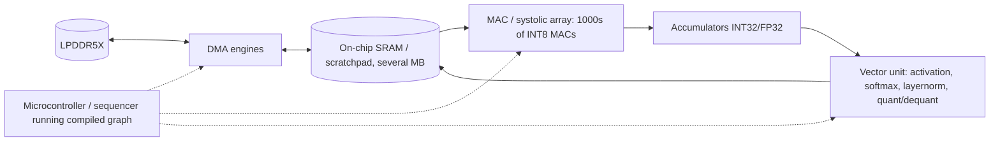

# How an NPU Works

> **Level:** Advanced · **Related:** [GPU](gpu.md) · [CPU](cpu.md) · [AI Image Detection](../07-ai/image-detection.md)

## 1. What an NPU is

An **NPU (Neural Processing Unit)** is an accelerator specialized for the arithmetic of neural networks: huge numbers of **multiply-accumulate (MAC)** operations on low-precision numbers (INT8, INT4, FP16, BF16, FP8) arranged as matrix multiplications and convolutions. It sacrifices generality to win on **performance per watt** — the metric that matters on phones and laptops.

Examples: Apple Neural Engine, Qualcomm Hexagon NPU, Intel NPU (Meteor/Lunar/Arrow Lake), AMD XDNA (Ryzen AI), Google Edge TPU / Tensor G-series TPU, MediaTek APU. Data-center relatives: Google TPU, AWS Inferentia/Trainium.

| | CPU | GPU | NPU |
|---|---|---|---|
| Programmability | Anything | Any data-parallel code | Neural-network operators |
| Efficiency (TOPS/W) | Low | Medium | High (often 5–20× GPU at edge) |
| Typical laptop TOPS | ~5–10 (with VNNI/AMX) | 30–200+ (discrete more) | 40–50+ ("Copilot+ PC" floor: 40 TOPS) |
| Best at | Control, small models | Training, large batches | Always-on, low-latency inference |

## 2. The workload: why matrices?

Almost every layer reduces to `Y = W·X + b` followed by a nonlinearity:

- **Fully connected / linear layer** → matrix multiply (GEMM)
- **Convolution** → GEMM via im2col or direct convolution
- **Attention (Transformers)** → `softmax(QKᵀ/√d)·V` = two GEMMs + softmax

A 7B-parameter LLM needs ~14 GFLOPs per generated token; a ResNet-50 image ~4 GFLOPs. The operations are regular, predictable and tolerant of low precision — perfect for fixed hardware.

## 3. Core architecture: the systolic array / MAC array

```
          weights flow down ↓
          w00   w01   w02   w03
   x0 → [MAC]→[MAC]→[MAC]→[MAC]→
   x1 → [MAC]→[MAC]→[MAC]→[MAC]→     activations flow right →
   x2 → [MAC]→[MAC]→[MAC]→[MAC]→     partial sums accumulate in place
   x3 → [MAC]→[MAC]→[MAC]→[MAC]→
```

In a **systolic array** (Google TPU style) each processing element (PE) does `acc += a * w`, then passes `a` to its right neighbor and keeps (or passes down) the weight. Data is read from memory **once** and reused across a whole row/column of PEs. That reuse is the entire point: moving a byte from DRAM costs ~100–1000× more energy than a MAC.

| Operation | Approx. energy (45 nm, Horowitz) |
|---|---|
| 8-bit integer add | 0.03 pJ |
| 8-bit integer multiply | 0.2 pJ |
| 32-bit float multiply | 3.7 pJ |
| 32-bit SRAM read (8 KB) | 5 pJ |
| 32-bit DRAM read | 640 pJ |

So an NPU is mostly a **data-movement machine**: large on-chip SRAM, DMA engines, and a MAC array, orchestrated to minimize DRAM traffic.

Typical NPU block:



Variants: Intel's NPU uses "Neural Compute Engines" with MAC arrays + SHAVE DSPs; AMD XDNA is a spatial **dataflow** array of AI Engine tiles (VLIW cores with local memory connected by a programmable interconnect); Apple ANE and Qualcomm Hexagon combine tensor, vector and scalar units.

## 4. Quantization: why low precision works

Neural networks tolerate noise. Converting FP32 weights to INT8:

```
real_value ≈ scale × (int_value − zero_point)
```

```python
import numpy as np
w = np.random.randn(1024).astype(np.float32)
scale = np.abs(w).max() / 127
q = np.clip(np.round(w / scale), -127, 127).astype(np.int8)   # symmetric INT8
w_hat = q.astype(np.float32) * scale
print("max error:", np.abs(w - w_hat).max())
```

- INT8 MAC ≈ 1/16 the area/energy of FP32 MAC → 4× less memory traffic too.
- **PTQ** (post-training quantization) with calibration data, or **QAT** (quantization-aware training) for better accuracy.
- INT4 / FP4 / mixed precision for LLM weights; accumulations stay in INT32/FP32.

## 5. The software stack: compiling a graph

NPUs do not run arbitrary code; they run a **compiled graph**:

1. Model trained in PyTorch/TensorFlow → exported to **ONNX**, TFLite, Core ML, or similar.
2. **Graph compiler** performs: operator fusion (Conv+BN+ReLU → one op), layout transforms (NCHW↔NHWC), **tiling** to fit SRAM, scheduling DMA double-buffering, quantization.
3. Unsupported ops **fall back** to CPU/GPU (a major performance cliff — partition boundaries cost copies).
4. Runtime loads the compiled blob and feeds tensors.

| Platform | Runtime / API |
|---|---|
| Windows | **Windows ML / ONNX Runtime** with Execution Providers (QNN for Qualcomm, OpenVINO for Intel, VitisAI for AMD), DirectML; NPU driver exposed via MCDM (compute-only WDDM) — visible in Task Manager as "NPU" |
| Linux | `accel` subsystem in kernel (`/dev/accel/accel0`): `intel_vpu`/`ivpu`, `amdxdna`, `qaic`; OpenVINO, ONNX Runtime |
| Android | NNAPI (deprecated) → LiteRT (TFLite) delegates, QNN |
| Apple | Core ML → ANE |

Running on an NPU from Python with ONNX Runtime:

```python
import onnxruntime as ort, numpy as np
print(ort.get_available_providers())
sess = ort.InferenceSession("model_int8.onnx",
        providers=["QNNExecutionProvider", "CPUExecutionProvider"],
        provider_options=[{"backend_path": "QnnHtp.dll"}, {}])   # Windows on Snapdragon
x = np.random.rand(1, 3, 224, 224).astype(np.float32)
out = sess.run(None, {sess.get_inputs()[0].name: x})
```

With OpenVINO on Intel:

```python
import openvino as ov
core = ov.Core(); print(core.available_devices)   # ['CPU', 'GPU', 'NPU']
compiled = core.compile_model("model.xml", "NPU")
result = compiled(x)
```

In the browser, **WebNN** (JavaScript) exposes `navigator.ml.createContext({deviceType: "npu"})`.

## 6. Tiling and double buffering (the key scheduling trick)

A large GEMM does not fit in SRAM, so the compiler splits it:

```
for each output tile (Mt × Nt):
    acc = 0
    for each K-slice:
        DMA-load A[Mt×Kt], B[Kt×Nt] into buffer[next]   # overlapped...
        MAC-array computes on buffer[current]            # ...with compute
        swap(current, next)
    vector-unit: activation + requantize → write tile
```

Overlapping DMA with compute keeps the MAC array busy. If loads can't keep up, the NPU is **bandwidth-bound** — the dominant limit for LLM token generation (weights must be streamed every token), which is why memory bandwidth, not TOPS, often decides real LLM speed.

## 7. What NPUs are used for

- Camera pipelines: segmentation, portrait blur, night mode, HDR fusion, super-resolution
- Always-on audio: wake words, noise suppression, live captions
- Windows Studio Effects, Recall/semantic search, on-device small LLMs (Phi Silica), Apple Intelligence
- Face ID / biometrics, object detection

## 8. Limits and pitfalls

- **Operator coverage**: new layer types may not be supported → CPU fallback.
- **Static shapes** often required; dynamic sequence lengths cause recompiles.
- **TOPS marketing** counts peak sparse INT8/INT4; real utilization is often 20–60%.
- Accuracy loss from quantization must be validated per model.

## Further reading
- Jouppi et al., *In-Datacenter Performance Analysis of a Tensor Processing Unit* (ISCA 2017)
- Sze et al., *Efficient Processing of Deep Neural Networks* (tutorial & book)
- ONNX Runtime Execution Providers docs; Intel NPU Acceleration Library; Linux kernel `Documentation/accel/`
