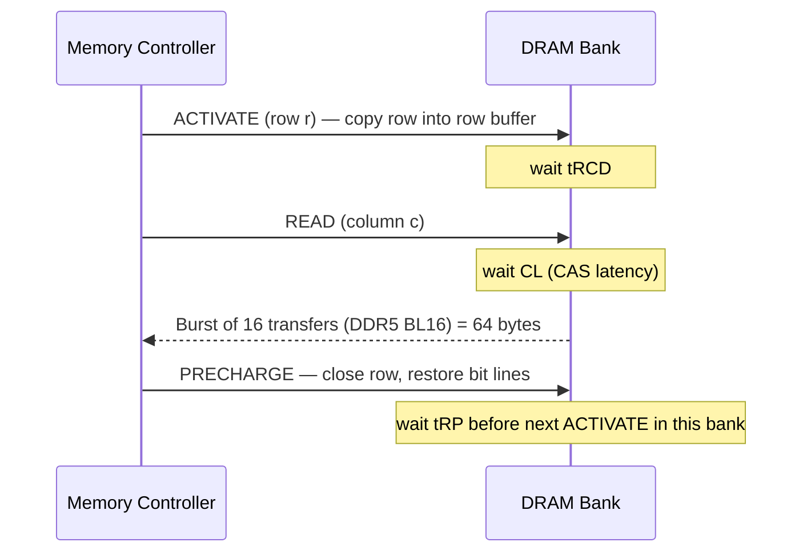

# How RAM Works

> **Level:** Advanced · **Related:** [CPU](cpu.md) · [Motherboard](motherboard.md) · [OS](../03-os-and-software/operating-system.md) · [BIOS](bios.md)

## 1. The job of RAM

**RAM (Random Access Memory)** is the working memory the CPU can address directly with load/store instructions. "Random access" means any address takes roughly the same time. It is **volatile** — contents vanish without power. Main memory in PCs is **DRAM**; CPU caches are **SRAM**.

| | SRAM | DRAM |
|---|---|---|
| Cell | 6 transistors (flip-flop) | 1 transistor + 1 capacitor (1T1C) |
| Density | Low | ~6–10× higher |
| Speed | ~1 ns | ~15 ns cell access (tens of ns end-to-end) |
| Refresh | No | Yes (every 32–64 ms) |
| Use | L1/L2/L3 cache, register files | Main memory, VRAM (GDDR), HBM |

## 2. The DRAM cell

```
 Word line (row) ──────┬──────────
                       │
                    ┌──┴──┐  access transistor
 Bit line (column) ─┤     ├──┐
                    └─────┘  │
                            ═╪═  storage capacitor (~10 fF)
                             │
                            GND
```

- A charged capacitor = 1, discharged = 0 (or inverted).
- Capacitors **leak**, so every row must be **refreshed** periodically (typically 8192 refresh commands per 64 ms window, at < 85 °C).
- Reading is **destructive**: the tiny charge is shared with the bit line; a **sense amplifier** detects the small voltage swing, amplifies it to a full 0/1, and writes it back.

## 3. Organization: channels → DIMMs → ranks → chips → banks → rows → columns

```
Memory controller (inside CPU)
└── Channel (64-bit bus; DDR5 splits each DIMM into 2 × 32-bit subchannels)
    └── DIMM (module)
        └── Rank (set of chips answering together, e.g. 8 × x8 chips = 64 bits)
            └── Chip
                └── Bank groups (DDR5: 8) → Banks (DDR5: 32 per chip)
                    └── Array: ~65,536 rows × 1,024 columns
                        └── Row buffer (sense amps) = "open page", ~8 KB across rank
```

The **memory controller** maps a physical address to (channel, rank, bank group, bank, row, column) using an interleaving hash so consecutive lines spread across banks/channels for parallelism.

## 4. A read, step by step (and the timings on your RAM sticker)



"DDR5-6000 CL30-38-38-96" means:

| Timing | Meaning | Cycles |
|---|---|---|
| CL (tCL) | READ → first data | 30 |
| tRCD | ACTIVATE → READ/WRITE | 38 |
| tRP | PRECHARGE → next ACTIVATE | 38 |
| tRAS | ACTIVATE → PRECHARGE minimum | 96 |

Clock: DDR5-6000 = 6000 MT/s, I/O clock 3000 MHz → one cycle ≈ 0.333 ns → CL30 ≈ 10 ns. First-word latency has stayed ~10–15 ns for 20 years; **bandwidth** is what grew.

- **Row hit** (row already open): only CL → fast.
- **Row miss / conflict**: PRE + ACT + CL → ~3× slower.

Controllers reorder requests (FR-FCFS scheduling) to maximize row hits.

## 5. DDR generations

| Gen | Data rate (MT/s) | Voltage | Notable |
|---|---|---|---|
| DDR3 | 800–2133 | 1.5 V | 8n prefetch |
| DDR4 | 1600–3200 (OC 5000+) | 1.2 V | Bank groups |
| DDR5 | 4800–8400+ | 1.1 V | 2 subchannels/DIMM, on-DIMM PMIC, on-die ECC, BL16, 32 banks |
| LPDDR5X | up to ~10,700 | ~0.5 V I/O | Phones/laptops, soldered |
| GDDR7 | 28–36+ Gbps/pin | PAM3 signaling | GPU VRAM |
| HBM3e | ~9.6 Gbps/pin, 1024-bit per stack | | 3D-stacked, via TSVs next to GPU |

Peak bandwidth per channel = transfers/s × bytes per transfer. DDR5-6000 dual-channel: 6000 M × 8 B × 2 = **96 GB/s**.

**DDR** = Double Data Rate: data on both clock edges. **Prefetch** means the internal array is slow (~200–400 MHz) but reads many bits at once and serializes them onto the fast bus.

## 6. Reliability: refresh, ECC, Rowhammer

- **ECC DIMMs** add 8 bits per 64 (SECDED): correct 1-bit, detect 2-bit errors. DDR5 "on-die ECC" protects only inside the chip — it is *not* full ECC.
- **Rowhammer**: rapidly activating one row disturbs neighbor rows' capacitors, flipping bits — exploited for privilege escalation. Mitigations: TRR, higher refresh, DDR5 RFM (Refresh Management), ECC.
- **Cold boot attack**: DRAM retains data for seconds after power loss (longer when cooled) → motivation for memory encryption (AMD SME/SEV, Intel TME).

## 7. Training and configuration (the BIOS side)

At boot, the firmware's memory reference code reads each DIMM's **SPD** EEPROM (capacity, timings, **XMP**/**EXPO** profiles), then **trains** the interface: adjusting per-lane delays (read/write leveling, Vref) so signals sample at the eye's center. DDR5 training is long — first boot after changing RAM can take minutes. See [BIOS](bios.md).

## 8. How the OS uses RAM: virtual memory

Programs never see physical addresses. The OS and MMU give each process its own **virtual address space**, mapped in **pages** (4 KB; huge pages 2 MB/1 GB).

```
Virtual address (x86-64, 48-bit)
[ PML4 9 | PDPT 9 | PD 9 | PT 9 | offset 12 ]  → 4-level page walk → physical frame
```

- **Demand paging**: pages are mapped only when first touched (page fault → kernel allocates a frame).
- **Copy-on-write**: `fork()` shares pages until one side writes.
- **Swapping / paging file**: cold pages written to disk.
- **Page cache**: free RAM caches files — "free" memory is wasted memory.

| Concept | Linux | Windows |
|---|---|---|
| Overview | `free -h`, `/proc/meminfo`, `vmstat 1` | Task Manager → Memory, Resource Monitor, RAMMap |
| Per-process | `/proc/<pid>/status` (VmRSS), `/proc/<pid>/smaps`, `pmap` | Working Set, Private Bytes, Commit (Process Explorer) |
| Swap | swap partition/file, zram, `vm.swappiness` | `pagefile.sys`, memory compression (in "System" / "Memory Compression" process) |
| Huge pages | THP (`/sys/kernel/mm/transparent_hugepage`), `hugetlbfs` | Large pages (`SeLockMemoryPrivilege`, `MEM_LARGE_PAGES`) |
| Out of memory | OOM killer (`dmesg | grep -i oom`) | Commit limit reached → allocation failure |
| Allocate raw memory | `mmap()` | `VirtualAlloc()` |
| Hardware | `sudo dmidecode -t memory`, `decode-dimms` | `Get-CimInstance Win32_PhysicalMemory` |
| Test | `memtester`, MemTest86 (boot) | Windows Memory Diagnostic (`mdsched.exe`), MemTest86 |

Watching demand paging from C++ (Linux):

```cpp
#include <sys/mman.h>
#include <cstdio>
int main() {
    size_t sz = 1ull << 30; // 1 GiB of *virtual* memory
    char* p = (char*)mmap(nullptr, sz, PROT_READ|PROT_WRITE, MAP_PRIVATE|MAP_ANONYMOUS, -1, 0);
    // RSS is still tiny here: nothing is backed by physical RAM yet
    for (size_t i = 0; i < sz; i += 4096) p[i] = 1;   // one page fault per 4 KB page
    puts("now ~1 GiB resident"); getchar();
}
```

Python view of the same idea:

```python
import mmap, os, psutil
p = psutil.Process(os.getpid())
m = mmap.mmap(-1, 1 << 30)             # reserve 1 GiB anonymous mapping
print(p.memory_info().rss >> 20, "MiB")  # small
for i in range(0, len(m), 4096): m[i] = 1
print(p.memory_info().rss >> 20, "MiB")  # ~1024 MiB more
```

## 9. Performance implications for programmers

1. **Latency is ~100 ns**; a pointer-chasing linked list pays it per node. Arrays + prefetching amortize it.
2. **Bandwidth** is shared by all cores; memory-bound code stops scaling after a few threads.
3. **NUMA** (multi-socket, some chiplet designs): memory attached to another socket is slower — Linux `numactl --hardware`, Windows `GetNumaNodeProcessorMask`.
4. Populate all memory channels (e.g., 2 DIMMs in the right slots for dual-channel) — single-channel halves bandwidth.

## Further reading
- Ulrich Drepper, *What Every Programmer Should Know About Memory* (2007, still essential)
- JEDEC JESD79-5 (DDR5) standard
- Kim et al., *Flipping Bits in Memory Without Accessing Them* (Rowhammer, ISCA 2014)
