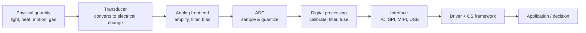

# How Sensors and Detectors Work

> **Level:** Advanced · **Related:** [Drivers](../03-os-and-software/drivers.md) · [GPS](../04-wireless-and-telecom/gps.md) · [AI Image Detection](../07-ai/image-detection.md) · [NFC](../04-wireless-and-telecom/nfc.md)

## 1. The universal pipeline

Every sensor — a phone's accelerometer, a smoke detector, a camera, a thermometer — follows the same chain:



A **sensor** measures a quantity continuously; a **detector** decides whether an event occurred (threshold, classification). A smoke detector is a sensor + a comparator + an alarm.

## 2. Transduction principles

| Principle | Physics | Examples |
|---|---|---|
| **Resistive** | Resistance changes with quantity | Thermistor (NTC), strain gauge, photoresistor, MOx gas sensor |
| **Capacitive** | Plate distance/area/dielectric changes | Touchscreens, MEMS accelerometers, humidity, fingerprint |
| **Piezoelectric** | Mechanical stress → charge | Microphones, knock sensors, ultrasound transducers |
| **Photoelectric** | Photon → electron-hole pair | Photodiodes, CMOS image sensors, LiDAR SPADs |
| **Thermoelectric** | Temperature difference → voltage (Seebeck) | Thermocouples, thermopile IR thermometers |
| **Hall effect** | Magnetic field deflects charge carriers | Magnetometers (compass), lid-closed switch, current sensors |
| **Inductive** | Field changes induce current | Metal detectors, proximity sensors, [NFC](../04-wireless-and-telecom/nfc.md) |
| **Ionization** | Radiation ionizes gas/semiconductor | Ionization smoke detectors (Am-241), Geiger counters |
| **Electrochemical** | Chemical reaction produces current | CO detectors, glucose meters |
| **Time-of-flight** | Measure echo delay | LiDAR, ultrasonic parking sensors, radar, ToF depth cameras |

## 3. Deep dive: key sensor types

### 3.1 MEMS accelerometer & gyroscope (IMU)

MEMS = Micro-Electro-Mechanical Systems: moving silicon structures microns in size.

```
    fixed plate ║   ║ proof mass ║   ║ fixed plate
                ║ C1║ ←──m──→   ║C2 ║
    Acceleration moves the mass: C1 grows, C2 shrinks.
    Differential capacitance ΔC ∝ displacement ∝ acceleration (F = ma, spring F = kx)
```

- **Gyroscope**: a mass vibrates at resonance; rotation produces a **Coriolis force** perpendicular to the vibration, measured capacitively.
- Typical parts: Bosch BMI270, TDK ICM-42688; noise ~70 µg/√Hz; rates up to 6.4 kHz.
- **Errors**: bias, scale factor, temperature drift, cross-axis sensitivity → calibration.

### 3.2 CMOS image sensor (camera)

Each pixel: **photodiode** collects electrons for the exposure time → transfer gate → floating diffusion → source-follower amplifier → column ADC.

- **Color**: Bayer filter (RGGB) → demosaicing in the ISP.
- **Rolling vs global shutter**; **BSI** (back-side illumination) and stacked sensors with DRAM for fast readout.
- The **ISP** (image signal processor) performs black-level, demosaic, white balance, noise reduction, tone mapping, often with [NPU](npu.md) assistance. Output feeds [image detection](../07-ai/image-detection.md).

### 3.3 Temperature

- **NTC thermistor**: `R(T) = R₀·e^{B(1/T − 1/T₀)}` — read via voltage divider + ADC.
- **Silicon bandgap** sensors in every CPU (digital thermal sensors, read via MSRs → `coretemp` on Linux).
- **Thermocouple** for high temperatures; needs cold-junction compensation.

### 3.4 Smoke detectors

- **Ionization**: Am-241 ionizes air between two plates → small current; smoke particles absorb ions → current drops → alarm. Fast for flaming fires.
- **Photoelectric**: IR LED and photodiode at an angle in a dark chamber; smoke **scatters** light onto the photodiode. Better for smoldering fires.

### 3.5 Motion detectors (PIR)

Pyroelectric crystals generate charge when their temperature *changes*. A **Fresnel lens** divides the field into zones; a warm body moving between zones produces an alternating signal on a dual-element sensor → detected by a window comparator. Stationary people become invisible to PIR — that's why **mmWave radar** (60 GHz) presence sensors, which detect breathing micro-motion, are replacing them.

### 3.6 Magnetometer, barometer, proximity, ambient light

- Magnetometer (Hall/AMR/TMR): compass heading; needs hard/soft-iron calibration.
- Barometer (piezoresistive MEMS membrane): altitude to ~10 cm resolution; helps [GPS](../04-wireless-and-telecom/gps.md) with floor detection.
- Proximity: IR LED + photodiode measures reflected light; turns off the screen during calls.
- Fingerprint: capacitive (ridge/valley capacitance), optical (under-display camera), ultrasonic (3D).

## 4. From analog to digital

**Sampling (Nyquist):** sample at > 2× the highest frequency of interest, with an analog **anti-aliasing filter** before the ADC.

**Quantization:** an N-bit ADC over range `V_ref` gives resolution `V_ref / 2ᴺ`; ideal SNR ≈ `6.02·N + 1.76 dB`.

| ADC type | Speed | Resolution | Use |
|---|---|---|---|
| SAR | 100 kS/s – 5 MS/s | 10–18 bit | General MCU ADCs |
| Sigma-delta (ΔΣ) | slow–audio rates | 16–32 bit | Audio, precision scales, IMUs |
| Pipeline / flash | 100 MS/s – GS/s | 8–14 bit | Radio, oscilloscopes |

## 5. Digital signal processing and sensor fusion

Raw sensor data is noisy and biased. Common steps:

1. **Calibration**: `x_cal = S · (x_raw − bias)`, temperature-compensated.
2. **Filtering**: moving average, IIR low-pass, median (for spikes).
3. **Fusion**: combine complementary sensors.

Complementary filter (accelerometer is noisy but drift-free; gyro is smooth but drifts):

```python
import math
def complementary_filter(angle, gyro_rate, accel_x, accel_z, dt, alpha=0.98):
    accel_angle = math.degrees(math.atan2(accel_x, accel_z))
    return alpha * (angle + gyro_rate * dt) + (1 - alpha) * accel_angle
```

**Kalman filter** — optimal estimator for linear-Gaussian systems; predicts state then corrects with measurements weighted by uncertainty:

```python
import numpy as np
class Kalman1D:
    def __init__(self, q=1e-3, r=0.1):
        self.x, self.p, self.q, self.r = 0.0, 1.0, q, r
    def update(self, z):
        self.p += self.q                 # predict: uncertainty grows
        k = self.p / (self.p + self.r)   # Kalman gain
        self.x += k * (z - self.x)       # correct with measurement
        self.p *= (1 - k)
        return self.x
```

Phones fuse accelerometer + gyro + magnetometer into an orientation quaternion (Android `TYPE_ROTATION_VECTOR`), often on a low-power **sensor hub** MCU so the main CPU can sleep.

**Detection** = decision theory: choose a threshold that trades **false positives** vs **false negatives** (ROC curve). Add **hysteresis** and **debouncing** to avoid chattering:

```cpp
bool detect(float v, bool state, float on = 2.0f, float off = 1.5f) {
    return state ? (v > off) : (v > on);   // hysteresis band 1.5–2.0
}
```

## 6. Interfaces

| Bus | Wires | Speed | Typical sensors |
|---|---|---|---|
| I²C | 2 (SDA, SCL) | 100 kHz – 3.4 MHz | Temperature, IMU, light, barometer |
| SPI | 4+ | up to ~50 MHz | High-rate IMU, ADCs, displays |
| I3C | 2 | up to 12.5 Mbps | Newer phone sensors (in-band interrupts) |
| MIPI CSI-2 | lanes | Gbps | Cameras |
| USB HID | USB | | Laptop sensor hubs ("HID Sensor") |
| 1-Wire, UART, analog | | | DIY, GPS modules |

Reading a register over I²C in Python (Linux, e.g., Raspberry Pi):

```python
from smbus2 import SMBus
BMP280_ADDR, CHIP_ID_REG = 0x76, 0xD0
with SMBus(1) as bus:
    print(hex(bus.read_byte_data(BMP280_ADDR, CHIP_ID_REG)))   # 0x58 for BMP280
```

## 7. OS integration

**Linux**
- **IIO** (Industrial I/O) subsystem: `/sys/bus/iio/devices/iio:device0/in_accel_x_raw`, `in_temp_input`; buffered reads via `/dev/iio:device0`.
- **hwmon**: `/sys/class/hwmon/*/temp1_input` (CPU/GPU/motherboard temps); `sensors` command.
- **input** subsystem for touch/buttons: `/dev/input/event*`, `evtest`.
- `iio-sensor-proxy` exposes orientation/light to desktops over D-Bus.
- Cameras via **V4L2** (`/dev/video0`) and libcamera.

**Windows**
- **Sensor API / Windows.Devices.Sensors** (UWP/WinRT): `Accelerometer`, `LightSensor`, `SimpleOrientationSensor`.
- **HID Sensor Collection** class driver for sensor hubs; Sensor Class Extension (SensorsCx) for custom drivers.
- Cameras via **Media Foundation** / Windows Camera Frame Server.
- Thermal/fan data mostly via ACPI and vendor WMI.

JavaScript in the browser (Generic Sensor API):

```js
const acc = new Accelerometer({ frequency: 60 });
acc.addEventListener("reading", () => console.log(acc.x, acc.y, acc.z));
acc.start();
```

## 8. Specs that matter when choosing a sensor

Range · resolution · accuracy vs precision · noise density · bandwidth/ODR · drift (bias instability) · linearity · hysteresis · response time · power consumption · operating temperature.

## Further reading
- Jacob Fraden, *Handbook of Modern Sensors*
- Analog Devices / TI application notes on ADCs and signal conditioning
- Linux kernel `Documentation/driver-api/iio/`; Microsoft Learn "Sensors" (Windows drivers)
