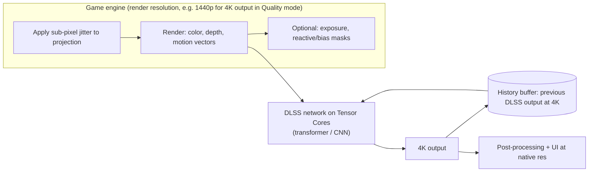

# How DLSS Works

> **Level:** Advanced · **Related:** [Frame Generation](frame-generation.md) · [Ray Tracing](ray-tracing.md) · [Computer Graphics](computer-graphics.md) · [GPU](../01-hardware/gpu.md) · [NPU](../01-hardware/npu.md)

## 1. What DLSS is

**DLSS (Deep Learning Super Sampling)** is NVIDIA's family of AI-based rendering technologies running on **Tensor Cores** in GeForce RTX GPUs. The core feature renders a game at a **lower internal resolution** and uses a neural network — fed with motion vectors and multiple previous frames — to reconstruct a high-resolution image that is often as sharp as, or sharper than, native rendering with TAA.

The DLSS umbrella today includes:

| Feature | What it does | Hardware |
|---|---|---|
| **Super Resolution (SR)** | AI temporal upscaling | All RTX (20-series+) |
| **DLAA** | Same network at native resolution → anti-aliasing only | All RTX |
| **Ray Reconstruction (RR)** | AI denoiser for ray-traced effects, fused with upscaling | All RTX |
| **Frame Generation (FG)** | Generates an extra frame between rendered frames | RTX 40+ |
| **Multi Frame Generation (MFG)** | Up to 3 generated frames per rendered frame | RTX 50+ |

This page covers upscaling/reconstruction; see [Frame Generation](frame-generation.md) for FG/MFG.

## 2. Evolution

| Version | Year | Approach |
|---|---|---|
| DLSS 1.0 | 2018 | Per-game trained spatial upscaler (single frame) — blurry, artifacts |
| DLSS 2.x | 2020 | **Generic temporal** network (one model for all games) using motion vectors + history — the breakthrough |
| DLSS 3 | 2022 | Adds Frame Generation (Ada Optical Flow Accelerator) |
| DLSS 3.5 | 2023 | Adds Ray Reconstruction |
| DLSS 4 | 2025 | **Transformer** model for SR/RR/DLAA (replacing CNN), Multi Frame Generation, FG via AI model instead of hardware optical flow |
| DLSS 4.5 | 2026 | Second-generation transformer SR model; further MFG modes |

## 3. Why upscaling is possible: temporal super sampling

A single low-res frame lacks detail. But across **several frames**, if the camera **jitters** by a different sub-pixel offset each frame (a Halton sequence), each frame samples a *different* location inside each output pixel. Accumulating them gives many samples per pixel over time — like supersampling spread across frames.

```
Frame N-3   Frame N-2   Frame N-1   Frame N      Accumulated (1 output pixel)
 ·            ·            ·            ·       ┌───────┐
   (jitter A)  (jitter B)  (jitter C) (jitter D) │ · ·   │  4 distinct sub-pixel
                                                 │   · · │  samples → higher detail
                                                 └───────┘
```

The difficulty: things **move**. Reusing history requires **reprojection** with **motion vectors**; and history must be **rejected** where it's invalid (disocclusion, lighting change, transparency, particles). Classic TAA uses hand-tuned heuristics (neighborhood color clamping) that cause **ghosting** or **blur**. DLSS replaces those heuristics with a trained neural network.

## 4. The pipeline



**Inputs** the engine must provide (via the NVIDIA Streamline SDK / NGX):
1. Low-res **color** (pre-post-processing, pre-UI, HDR linear preferred)
2. **Depth** buffer
3. **Motion vectors** (per-pixel screen-space velocity, including for animated/skinned objects)
4. **Jitter offset** of the current frame
5. Exposure / pre-exposure value, camera reset flag on cuts
6. For Ray Reconstruction: noisy RT signals + G-buffer guides (albedo, normals, roughness, specular hit distance)

**Outputs:** high-res anti-aliased color. Post-effects (bloom, film grain, UI) are applied afterward at output resolution.

## 5. The network

What the network learns to do per pixel:
- **Warp** history using motion vectors.
- **Decide** how much to trust history vs current sample (implicit rejection) — avoiding ghosting on disocclusions.
- **Reconstruct** sub-pixel detail (thin wires, text, fences) from jittered samples.
- **Anti-alias** edges and suppress flicker.

**Training** (offline on NVIDIA supercomputers): render the same content at low-res with jitter and at very high "ground truth" quality (e.g., 16K or 64 spp supersampled). Loss functions compare network output to ground truth over sequences (to penalize temporal instability, not just per-frame error). One generic model generalizes across games.

**CNN → Transformer (DLSS 4):** convolutional networks see a local neighborhood; vision transformers use **self-attention** over the frame (tokenized patches), letting each pixel weigh far-away and temporal context. NVIDIA reported the transformer has ~2× parameters and ~4× compute of the CNN, yielding better stability, less ghosting and more detail in motion. See [AI Image Detection](../07-ai/image-detection.md) for CNN vs ViT basics.

**Cost:** executes in ~0.5–2 ms per frame on Tensor Cores (FP16/INT8/FP8), depending on GPU and resolution.

## 6. Quality modes

| Mode | Scale per axis | Render res for 4K output | Pixel fraction |
|---|---|---|---|
| DLAA | 1.0× | 3840×2160 | 100% |
| Quality | 1/1.5 (66.7%) | 2560×1440 | 44% |
| Balanced | 1/1.72 (58%) | 2227×1253 | 34% |
| Performance | 1/2 (50%) | 1920×1080 | 25% |
| Ultra Performance | 1/3 (33%) | 1280×720 | 11% |

Fewer pixels shaded → big speedups in GPU-bound scenarios, especially with [ray tracing](ray-tracing.md) where cost scales with pixel count.

## 7. Ray Reconstruction

Real-time RT uses ~1 sample per pixel → extremely noisy. Traditional pipelines run a **separate hand-tuned denoiser per effect** (reflections, GI, shadows) and then upscale — each stage loses detail. Ray Reconstruction trains **one network** that denoises and upscales together, using G-buffer guides and ray hit distances, preserving reflections' sharpness and reducing lag in lighting changes.

## 8. Integration details engineers hit

- **Mip bias**: since textures are sampled at lower render resolution, set LOD bias ≈ `log2(renderWidth/outputWidth)` (e.g., −1 for Performance) so final output has native texture detail.
- **Motion vectors for everything**: missing MVs on particles/animated textures → smearing. Use reactive/transparency masks for these.
- **Jitter** must be applied to the projection matrix but *removed* from motion vectors (or DLSS told which convention).
- **Camera cuts**: reset history to avoid ghosting across scenes.
- **UI** must be rendered after upscaling.
- Plugins for Unreal Engine and Unity; DirectX 11/12 and Vulkan supported. The DLL (`nvngx_dlss.dll`) can be updated independently of the game; the NVIDIA App offers a "DLSS override" to force newer models.

Pseudo-integration (C++-ish, Streamline style):

```cpp
sl::DLSSOptions opts{};
opts.mode = sl::DLSSMode::eMaxQuality;          // Quality
opts.outputWidth = 3840; opts.outputHeight = 2160;
slDLSSSetOptions(viewport, opts);

// Each frame:
sl::Constants c{};
c.jitterOffset = {jx, jy};                       // same jitter used in projection
c.mvecScale = {1.0f / renderW, 1.0f / renderH};  // motion vector units
c.cameraMotionIncluded = sl::Boolean::eTrue;
c.reset = sceneCut ? sl::Boolean::eTrue : sl::Boolean::eFalse;
slSetConstants(c, *frameToken, viewport);
sl::ResourceTag tags[] = { colorIn, depth, motionVectors, colorOut };
slSetTag(viewport, tags, 4, cmdList);
slEvaluateFeature(sl::kFeatureDLSS, *frameToken, &viewport, 1, cmdList);
```

## 9. Competitors and cross-vendor standards

| Tech | Vendor | Method | Hardware |
|---|---|---|---|
| **FSR 1** | AMD | Spatial (Lanczos-like + sharpen) | Any GPU |
| **FSR 2/3** | AMD | Hand-tuned temporal upscaler (open source) + FG | Any GPU |
| **FSR 4 / "FSR Redstone"** | AMD | ML-based temporal upscaling | RDNA 4+ |
| **XeSS** | Intel | ML temporal; XMX path on Arc, DP4a fallback on others | Any (best on Arc) |
| **PSSR** | Sony | ML upscaler | PS5 Pro |
| **MetalFX** | Apple | Spatial / temporal | Apple silicon |
| **DirectSR** | Microsoft | Common API in D3D12 over vendor upscalers | Windows |

## 10. Limitations

- Artifacts: ghosting on objects lacking motion vectors, shimmering on fine geometry, disocclusion blur, smearing on particles.
- Works best with high output resolutions; 1080p output from 540p (Performance) is weak because too little data.
- Upscaling doesn't reduce CPU-bound limitations.

## Further reading
- NVIDIA DLSS Programming Guide & Streamline SDK (GitHub)
- Edward Liu, *DLSS 2.0 — Image Reconstruction for Real-time Rendering with Deep Learning* (GTC 2020)
- Brian Karis, *High-Quality Temporal Supersampling* (SIGGRAPH 2014) — TAA foundations
