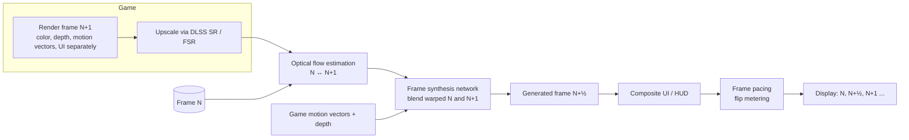

# How Frame Generation Works

> **Level:** Advanced · **Related:** [DLSS](dlss.md) · [Computer Graphics](computer-graphics.md) · [GPU](../01-hardware/gpu.md)

## 1. The idea

**Frame generation (FG)** creates **synthetic frames** between (or after) frames the game actually renders, raising the displayed frame rate without running the game engine or full rendering pipeline more often.

```
Rendered:    R1 ───────────── R2 ───────────── R3
Displayed:   R1 ──── G1.5 ─── R2 ──── G2.5 ─── R3        (2× FG)
Displayed:   R1 ─ G ─ G ─ G ─ R2 ─ G ─ G ─ G ─ R3        (4× Multi Frame Generation)
```

It is a descendant of **motion interpolation** on TVs ("motion smoothing"), but uses game-engine data (motion vectors, depth, UI separation) and, in modern versions, neural networks — giving far better quality and far lower latency than TV interpolation.

| Technology | Vendor | Method |
|---|---|---|
| DLSS 3 Frame Generation | NVIDIA (RTX 40+) | Optical Flow Accelerator + AI network, 1 generated frame |
| DLSS 4 (Multi) Frame Generation | NVIDIA (FG: RTX 40+, MFG: RTX 50+) | AI model computes flow; up to 3 (later more) generated frames; hardware **flip metering** paces them |
| FSR 3 / 3.1 Frame Generation | AMD (any GPU, open source) | Analytical optical flow + game motion vectors; FSR 4/"Redstone" adds ML frame gen |
| XeSS Frame Generation (XeSS 2) | Intel | ML-based, with Xe Low Latency |
| AFMF (Fluid Motion Frames) | AMD driver-level | No engine data (works on any DX11/12 game), lower quality |
| Lossless Scaling FG | Third-party app | Captures frames, works everywhere, higher latency |
| Async/Space Warp (ATW/ASW) | VR (Meta) | *Extrapolates* using latest head pose to keep 72–120 Hz |

## 2. Interpolation vs extrapolation

- **Interpolation** (DLSS FG, FSR FG): needs frames N and N+1, then synthesizes the one in between. Quality is higher (both endpoints known) but frame N+1 must be **held back** → adds latency (roughly half a rendered frame plus processing).
- **Extrapolation** (VR ASW, some research like Intel's "ExtraSS"): predicts the future frame from the past → no hold-back latency but more artifacts on unpredictable motion.

## 3. The pipeline (interpolation-based FG)



### Why two kinds of motion?

- **Game motion vectors** describe how *geometry* moves — accurate for surfaces.
- They do **not** describe motion of **shadows, reflections, particles, lighting changes, transparency** (a reflection moves differently than the mirror surface). **Optical flow** — computed from pixel content itself — captures this apparent motion.
- The network combines both, plus depth (to resolve which object is in front on occlusions), and decides per pixel how to blend warped images from N and N+1.

### Optical flow in brief
For each pixel/block, find displacement `(dx, dy)` minimizing difference between images — classic **block matching** or **Lucas–Kanade/Farnebäck**, now learned (RAFT-style networks). Python illustration with OpenCV:

```python
import cv2, numpy as np
f0 = cv2.imread("frame0.png"); f1 = cv2.imread("frame1.png")
g0, g1 = (cv2.cvtColor(f, cv2.COLOR_BGR2GRAY) for f in (f0, f1))
flow = cv2.calcOpticalFlowFarneback(g0, g1, None, 0.5, 3, 21, 3, 5, 1.1, 0)  # H×W×2

# Naive midpoint interpolation: backward-warp both frames halfway and blend
h, w = g0.shape
gx, gy = np.meshgrid(np.arange(w), np.arange(h))
map0 = np.dstack([gx - 0.5 * flow[..., 0], gy - 0.5 * flow[..., 1]]).astype(np.float32)
map1 = np.dstack([gx + 0.5 * flow[..., 0], gy + 0.5 * flow[..., 1]]).astype(np.float32)
w0 = cv2.remap(f0, map0, None, cv2.INTER_LINEAR)
w1 = cv2.remap(f1, map1, None, cv2.INTER_LINEAR)
mid = cv2.addWeighted(w0, 0.5, w1, 0.5, 0)   # real FG adds occlusion reasoning + learned blending
cv2.imwrite("frame_half.png", mid)
```

The hard cases this naïve version gets wrong — and that learned FG handles better:
- **Disocclusion**: background revealed behind a moving object exists only in one frame.
- **UI/HUD**: static text over moving world would smear → engines pass the UI separately or a UI-less "hudless" buffer.
- **Fast/non-linear motion** and repeated patterns (fences) → wrong flow matches.

## 4. Latency: the fundamental trade-off

Frame generation raises **smoothness** (motion clarity, displayed fps) but not **responsiveness**: input is only sampled for *rendered* frames.

| Scenario | Rendered fps | Displayed fps | Approx. input latency |
|---|---|---|---|
| Native | 60 | 60 | baseline (e.g., ~50 ms) |
| Native + Reflex | 60 | 60 | lower (~35 ms) |
| 2× FG + Reflex | 60 | 120 | ≈ native-without-Reflex or slightly more |
| 4× MFG + Reflex | 60 | 240 | similar to 2× FG + small overhead |

That's why FG is always paired with a **latency reducer** — NVIDIA **Reflex** (and Reflex 2 Frame Warp), AMD **Anti-Lag 2**, Intel **Xe Low Latency** — which removes the CPU→GPU render queue.

**Rule of thumb:** use FG when the base frame rate is already ≥ 50–60 fps; generating from 30 fps feels laggy and shows more artifacts because frames are far apart.

## 5. Frame pacing

Generated frames must be presented at evenly spaced times, e.g., for 60 → 240 fps, one every 4.17 ms. CPU-side presentation timing is jittery; DLSS 4 on RTX 50 moved **flip metering** into display-engine hardware for consistent pacing. Pacing interacts with V-Sync/VRR (G-Sync/FreeSync) — FG generally recommends VRR with a frame cap slightly below the refresh rate.

## 6. Integration requirements (engine side)

1. Provide depth, motion vectors, camera matrices, and a **hudless** color buffer (or UI in a separate layer).
2. Mark camera cuts (reset) so the network doesn't interpolate across scenes.
3. Present via the SDK's swap-chain hook (Streamline / FidelityFX API) so it can insert frames.
4. Windows: runs on D3D12 (and some D3D11/Vulkan paths); requires **Hardware-accelerated GPU scheduling** for DLSS FG on Windows 10/11. Linux: supported via Proton/VKD3D-Proton and native Vulkan drivers for newer versions.

## 7. Artifacts to recognize

- Smearing/warping around fast-moving edges and character silhouettes
- Flickering or doubled UI text (if UI not separated)
- Garbled disoccluded regions (look behind a moving pillar)
- Artifacts are shown for only a few ms each, so perceived quality is usually higher than stills suggest

## 8. Relationship to other techniques

- [DLSS Super Resolution](dlss.md) reduces pixels per frame (spatial); FG increases frames per rendered frame (temporal). Combined, 4K Performance + 4× MFG means only ~1/16 of displayed pixels are traditionally rendered.
- **Reflex 2 Frame Warp** is extrapolation for *latency*: it shifts the just-rendered frame based on the latest mouse input right before scan-out, then inpaints holes.

## Further reading
- NVIDIA *DLSS 3/4 technical blogs*; Streamline SDK docs
- AMD GPUOpen: *FidelityFX Frame Generation* (source code on GitHub)
- Meta: *Asynchronous SpaceWarp* developer docs
- Teed & Deng, *RAFT: Recurrent All-Pairs Field Transforms for Optical Flow* (ECCV 2020)
