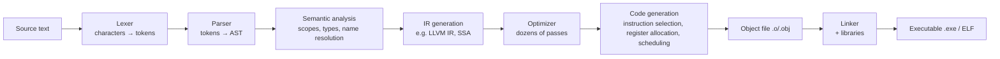

# How Code Compilation Works

> **Level:** Advanced · **Related:** [Lexical Environment](lexical-environment.md) · [Software/Apps](software-and-apps.md) · [CPU](../01-hardware/cpu.md) · [Shaders](../02-graphics/shaders.md)

## 1. The big picture

A **compiler** translates a program from one language (source) into another (target) while preserving meaning. Usually the target is machine code or bytecode that is cheaper to execute.



**Front end** (language-specific) → **middle end** (language- and target-independent optimization) → **back end** (target-specific). This separation lets LLVM serve C, C++, Rust, Swift, Zig… on x86, ARM, RISC-V, WebAssembly, GPUs.

## 2. The C++ pipeline, concretely

```bash
g++ -E main.cpp -o main.i        # 1. Preprocess: #include, #define, #if expansion
g++ -S main.i  -o main.s         # 2. Compile to assembly
g++ -c main.s  -o main.o         # 3. Assemble to object code (ELF relocatable)
g++ main.o util.o -o app         # 4. Link
# Windows (MSVC): cl /c main.cpp → main.obj; link main.obj util.obj /OUT:app.exe
# See it all: g++ -v -save-temps main.cpp ; clang -### main.cpp
```

Godbolt Compiler Explorer (godbolt.org) shows source → assembly live; indispensable for learning.

## 3. Lexical analysis (tokenizing)

The lexer groups characters into **tokens** using regular-expression rules (implemented as a DFA) and drops whitespace/comments.

```
int total = price * 2;   →   KW_INT  IDENT(total)  ASSIGN  IDENT(price)  STAR  INT(2)  SEMI
```

A working lexer in Python:

```python
import re
TOKEN_SPEC = [
    ("NUMBER", r"\d+(\.\d+)?"), ("IDENT", r"[A-Za-z_]\w*"),
    ("OP", r"[+\-*/()=]"), ("SKIP", r"\s+"), ("ERROR", r"."),
]
MASTER = re.compile("|".join(f"(?P<{n}>{p})" for n, p in TOKEN_SPEC))

def tokenize(src):
    for m in MASTER.finditer(src):
        kind, text = m.lastgroup, m.group()
        if kind == "SKIP": continue
        if kind == "ERROR": raise SyntaxError(f"Unexpected {text!r} at {m.start()}")
        yield (kind, text)

print(list(tokenize("x = 3 * (y + 42)")))
```

## 4. Parsing → Abstract Syntax Tree

A **grammar** (context-free, often in EBNF) defines valid structure:

```
expr   := term (('+' | '-') term)*
term   := factor (('*' | '/') factor)*
factor := NUMBER | IDENT | '(' expr ')'
```

Parsers: **recursive descent** (hand-written; used by Clang, GCC's C++ front end, V8, CPython's PEG parser since 3.9), **LR/LALR** (generated by yacc/bison), **Pratt parsing** (operator precedence — elegant for expressions).

A recursive-descent parser + tree-walking evaluator (continuing the lexer above):

```python
class Parser:
    def __init__(self, tokens): self.toks, self.i = list(tokens), 0
    def peek(self): return self.toks[self.i] if self.i < len(self.toks) else (None, None)
    def eat(self, text=None):
        tok = self.peek()
        if text and tok[1] != text: raise SyntaxError(f"expected {text}, got {tok}")
        self.i += 1; return tok
    def expr(self):
        node = self.term()
        while self.peek()[1] in ("+", "-"):
            op = self.eat()[1]; node = (op, node, self.term())
        return node
    def term(self):
        node = self.factor()
        while self.peek()[1] in ("*", "/"):
            op = self.eat()[1]; node = (op, node, self.factor())
        return node
    def factor(self):
        kind, text = self.peek()
        if text == "(":
            self.eat("("); node = self.expr(); self.eat(")"); return node
        self.eat()
        return ("num", float(text)) if kind == "NUMBER" else ("var", text)

ast = Parser(tokenize("2 * (y + 40)")).expr()
print(ast)   # ('*', ('num', 2.0), ('+', ('var', 'y'), ('num', 40.0)))

def evaluate(n, env):
    match n:
        case ("num", v): return v
        case ("var", name): return env[name]
        case (op, a, b):
            x, y = evaluate(a, env), evaluate(b, env)
            return {"+": x + y, "-": x - y, "*": x * y, "/": x / y}[op]
print(evaluate(ast, {"y": 2}))   # 84.0
```

That's a complete **interpreter**. A compiler instead *emits code* from the AST.

## 5. Semantic analysis

- **Name resolution**: bind each identifier to its declaration using **scopes** (symbol tables) — the compile-time counterpart of [lexical environments](lexical-environment.md).
- **Type checking / inference**: `int + string` error in C++; `auto`/templates resolved; Hindley–Milner in ML-family languages; TypeScript's structural typing (then *erased* to JavaScript).
- **Overload resolution, template instantiation** (C++), **borrow checking** (Rust), constant evaluation (`constexpr`).

## 6. Intermediate representation & SSA

Compilers lower the AST to an **IR** that's easier to optimize. Most modern IRs use **SSA (Static Single Assignment)**: every variable assigned exactly once; merges use φ (phi) nodes.

```cpp
int f(int a, int b) {
    int x = a * 2;
    if (b > 0) x = x + b;
    return x;
}
```

LLVM IR (`clang -O1 -S -emit-llvm`), simplified:

```llvm
define i32 @f(i32 %a, i32 %b) {
entry:
  %x0 = shl i32 %a, 1              ; a*2 strength-reduced to shift
  %cmp = icmp sgt i32 %b, 0
  %x1 = add i32 %x0, %b
  %x = select i1 %cmp, i32 %x1, i32 %x0   ; branch turned into select (cmov)
  ret i32 %x
}
```

**Control Flow Graph (CFG)**: basic blocks (straight-line code) connected by jumps — the structure most analyses run over.

## 7. Optimization

| Optimization | Before → After |
|---|---|
| Constant folding/propagation | `x = 3 * 4` → `x = 12` |
| Dead code elimination | Remove unused computations / unreachable blocks |
| Common subexpression elimination | Compute `a*b` once |
| Inlining | Replace call with callee body (enables everything else) |
| Loop-invariant code motion | Hoist `n*k` out of the loop |
| Strength reduction | `i*4` → shift / pointer increment |
| Loop unrolling & **vectorization** | Use SIMD (AVX2/NEON) for 8 elements at a time |
| Tail-call elimination | Recursion → loop |
| Escape analysis | Heap allocation → stack (JITs, Go) |
| LTO / PGO | Cross-module optimization; optimize using profiling data |

Example — this entire loop:

```cpp
int sum_to(int n) { int s = 0; for (int i = 0; i < n; ++i) s += i; return s; }
```

compiles at `-O2` (Clang) to closed-form arithmetic `n*(n-1)/2` — no loop at all (scalar evolution).

**Undefined behavior** in C/C++ (signed overflow, out-of-bounds, data races) lets optimizers assume it never happens — surprising results if it does. Use `-fsanitize=address,undefined` to catch it.

## 8. Code generation

1. **Instruction selection** — pattern-match IR onto target instructions (LLVM SelectionDAG/GlobalISel).
2. **Register allocation** — map unlimited virtual registers onto 16 (x86-64) / 31 (AArch64) physical ones; graph coloring or linear scan; **spill** to stack when out.
3. **Instruction scheduling** — reorder to avoid pipeline stalls ([CPU](../01-hardware/cpu.md)).
4. **Emission** — machine code + relocations + debug info (DWARF on Linux, PDB on Windows).

## 9. Linking

Object files contain code with **unresolved symbols** and **relocations** ("patch this address once you know where `printf` is").

- **Static linking**: copy needed library code into the executable (`.a` / `.lib`).
- **Dynamic linking**: record dependency; resolve at load time (`.so` / `.dll` + import `.lib`). See [Software/Apps](software-and-apps.md#4-loading-from-double-click-to-main).
- **Name mangling**: C++ encodes types into symbol names — `_Z3addii` (Itanium ABI, GCC/Clang) vs `?add@@YAHHH@Z` (MSVC). `extern "C"` disables it.
- Linkers: GNU ld, gold, **lld**, **mold** (Linux); `link.exe`, lld-link (Windows).

## 10. JavaScript: JIT compilation in V8

JS engines compile **at run time**, tiering up as code gets hot:


**Speculative optimization**: V8 observes that `add(a, b)` has only seen small integers and emits integer-add machine code guarded by type checks. If a string arrives, it **deoptimizes**. **Hidden classes (maps)** + **inline caches** make property access as fast as a C struct when object shapes are consistent.

```js
function add(a, b) { return a + b; }
for (let i = 0; i < 1e6; i++) add(i, 1);   // optimized for Smi (small integer)
add("a", "b");                              // type feedback changes → deopt
// Run with: node --trace-opt --trace-deopt script.js
```

Performance tips that follow directly: keep object shapes consistent (initialize all properties in the constructor, same order), avoid mixing types in arrays, avoid `delete` on hot objects.

## 11. Python: compile to bytecode, then interpret

CPython compiles source → AST → **bytecode** (cached in `__pycache__/*.pyc`), executed by a stack-based VM in `ceval.c`. Since 3.11 it has a **specializing adaptive interpreter** (quickening: `BINARY_OP` → `BINARY_OP_ADD_INT`), and 3.13+ ships an experimental copy-and-patch **JIT**.

```python
import dis, ast
src = "def f(x):\n    return x * 2 + 1"
print(ast.dump(ast.parse(src), indent=2))   # the AST
code = compile(src, "<demo>", "exec")
ns = {}; exec(code, ns)
dis.dis(ns["f"])
#  LOAD_FAST  x
#  LOAD_CONST 2
#  BINARY_OP  5 (*)
#  LOAD_CONST 1
#  BINARY_OP  0 (+)
#  RETURN_VALUE
```

Alternatives: **PyPy** (tracing JIT), **Cython** / **mypyc** (compile to C), **Numba** (LLVM JIT for numeric functions).

## 12. AOT vs JIT vs interpretation

| | AOT (C++, Rust) | JIT (JS, Java, C#) | Interpreter (CPython baseline) |
|---|---|---|---|
| Startup | Fast | Slower (warm-up) | Fast |
| Peak speed | High | High — can exploit runtime profile | Low |
| Portability | Per-target binaries | Bytecode everywhere | Source/bytecode everywhere |
| Memory | Low | JIT code + profiling data | Low |

Other targets: **WebAssembly** (compile C++/Rust with Emscripten/`wasm32` → browser JITs it), **transpilers** (TypeScript → JS, Babel), **shader compilers** ([Shaders](../02-graphics/shaders.md)), **bootstrapping** (compilers written in their own language, e.g., GCC in C++, Rust in Rust).

## Further reading
- Aho, Lam, Sethi, Ullman, *Compilers: Principles, Techniques, and Tools* ("Dragon Book")
- Robert Nystrom, *Crafting Interpreters* (free, craftinginterpreters.com) — build a full language in Java & C
- LLVM "Kaleidoscope" tutorial; V8 blog (v8.dev); CPython Developer Guide ("Design of CPython's compiler")
