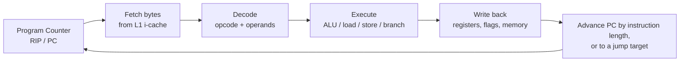

# How Machine Code Works

> **Level:** Advanced · **Related:** [CPU](../01-hardware/cpu.md) · [Code Compilation](code-compilation.md) · [Software/Apps](software-and-apps.md) · [OS](operating-system.md)

## 1. What machine code is

**Machine code** is the only language a CPU actually executes: a sequence of **binary-encoded instructions** stored in memory. Each instruction is a pattern of bytes that the CPU's decoder recognizes as an operation — "add these registers", "load from this address", "jump if zero". Every program — C++, Python, JavaScript — ultimately becomes machine code, either ahead of time (compilers), at run time (JIT compilers), or executed by an interpreter which is itself machine code.

```
Source (C++)      int r = a + b;
Assembly (text)   add eax, esi                  ← human-readable mnemonic
Machine code      01 F0                          ← the bytes the CPU fetches
Bits              00000001 11110000
```

**Assembly language** is a 1:1 textual form of machine code; an **assembler** turns it into bytes, a **disassembler** turns bytes back into mnemonics.

## 2. The ISA: the vocabulary of machine code

The **Instruction Set Architecture** defines registers, instruction formats, addressing modes and the meaning of each opcode (see [CPU §3](../01-hardware/cpu.md#3-the-instruction-set-architecture-isa)).

| | x86-64 | AArch64 (ARM64) | RISC-V (RV64) |
|---|---|---|---|
| Instruction length | Variable, 1–15 bytes | Fixed 4 bytes | 4 bytes (2 with the "C" extension) |
| General registers | 16 × 64-bit (RAX…R15) | 31 × 64-bit (X0–X30) + SP/ZR | 32 × 64-bit (x0 hardwired 0) |
| ALU ops on memory | Yes (`add rax, [rbx]`) | No — load/store architecture | No — load/store |
| Style | CISC | RISC | RISC |

Because x86 is variable-length and register-rich, it's compact but complex to decode; RISC ISAs are simpler to decode (fixed width) at the cost of more instructions.

## 3. The fetch–decode–execute cycle



Everything the CPU does is this loop; the [CPU article](../01-hardware/cpu.md) covers how modern cores pipeline, reorder and parallelize it.

## 4. Anatomy of an instruction

An instruction encodes an **operation** plus its **operands**. Operands come from **addressing modes**:

| Mode | Example (x86 AT&T/Intel) | Meaning |
|---|---|---|
| Immediate | `mov eax, 5` | Constant embedded in the instruction |
| Register | `add eax, ebx` | Operand is a register |
| Direct/memory | `mov eax, [0x1000]` | Fixed address |
| Register indirect | `mov eax, [rbx]` | Address held in a register |
| Indexed/scaled | `mov eax, [rbx + rcx*4 + 8]` | Base + index×scale + displacement (great for arrays) |
| PC-relative | `lea rax, [rip + 0x20]` | Relative to the next instruction (position-independent code) |

### x86-64 encoding sketch
```
[prefixes] [REX] [opcode 1–3 B] [ModR/M] [SIB] [displacement] [immediate]
```
- **REX** prefix (`0x40–0x4F`) enables 64-bit operands and registers R8–R15.
- **ModR/M** selects registers or a memory operand; **SIB** encodes scaled-index addresses.

A few complete encodings:

| Assembly | Bytes | Notes |
|---|---|---|
| `ret` | `C3` | Return from function |
| `nop` | `90` | Do nothing |
| `mov eax, 1` | `B8 01 00 00 00` | 32-bit immediate, little-endian |
| `add eax, esi` | `01 F0` | ADD r/m32, r32 |
| `xor rax, rax` | `48 31 C0` | REX.W + XOR; common way to zero a register |

RISC-V is more regular — every base instruction is 32 bits split into fixed fields (opcode, rd, funct3, rs1, rs2, funct7), which is why it's popular for teaching.

## 5. From assembly to running bytes

```bash
# Write assembly, assemble, link, run, disassemble (Linux, x86-64)
cat > add.s <<'EOF'
.intel_syntax noprefix
.globl main
main:
    mov eax, 40
    add eax, 2          # eax = 42
    ret                 # return value in eax → process exit code
EOF
gcc -no-pie add.s -o add && ./add; echo $?     # prints 42

objdump -d -M intel add | grep -A4 '<main>:'   # disassemble back to mnemonics + bytes
```

On **Windows**: `ml64.exe` (MASM) or clang assembles; `dumpbin /disasm app.exe` or Visual Studio's Disassembly window shows machine code. On both, [Compiler Explorer (godbolt.org)](code-compilation.md) shows source → assembly → bytes live.

Inspecting bytes from a high-level language — Python reading the machine code of a compiled function:

```python
# Disassemble a tiny native function with the capstone library
import capstone
code = bytes([0x8d, 0x04, 0x37,   # lea eax, [rdi + rsi]   (return a + b)
              0xc3])              # ret
md = capstone.Cs(capstone.CS_ARCH_X86, capstone.CS_MODE_64)
for insn in md.disasm(code, 0x1000):
    print(f"{insn.address:#x}: {insn.bytes.hex():10} {insn.mnemonic} {insn.op_str}")
# 0x1000: 8d0437     lea eax, [rdi + rsi]
# 0x1003: c3         ret
```

## 6. Calling conventions (the ABI)

Machine code has no notion of "function arguments" — those are a **convention** about which registers and stack slots hold what. This is the **ABI** (Application Binary Interface); mismatches cause crashes even when source compiles fine.

| | System V AMD64 (Linux/macOS) | Microsoft x64 (Windows) | AAPCS64 (ARM64) |
|---|---|---|---|
| Integer arg registers | RDI, RSI, RDX, RCX, R8, R9 | RCX, RDX, R8, R9 (+32 B shadow space) | X0–X7 |
| Return value | RAX | RAX | X0 |
| Stack alignment | 16 bytes | 16 bytes | 16 bytes |
| Callee-saved | RBX, RBP, R12–R15 | RBX, RBP, RDI, RSI, R12–R15 | X19–X28 |

A **stack frame** on entry: the `call` instruction pushes the return address; the function may push the old base pointer, allocate locals by subtracting from RSP, and restore everything before `ret`. Overwriting a saved return address on the stack is the basis of classic stack-buffer-overflow bugs — which is why CPUs/OSes add stack canaries, NX/DEP, ASLR and shadow stacks (see [Software/Apps](software-and-apps.md) and [CPU privilege](../01-hardware/cpu.md#9-privilege-interrupts-and-the-os-contract)).

## 7. Instruction categories

| Category | Examples (x86) | Purpose |
|---|---|---|
| Data movement | `mov`, `lea`, `push`, `pop`, `xchg` | Move/load/store, compute addresses |
| Arithmetic/logic | `add`, `sub`, `imul`, `and`, `or`, `shl`, `xor` | Compute; set **flags** (ZF, CF, SF, OF) |
| Control flow | `jmp`, `je`/`jne`, `call`, `ret`, `cmp`, `test` | Branches, loops, function calls |
| Conditional move | `cmov`, `setcc` | Branchless code (helps [branch prediction](../01-hardware/cpu.md#5-superscalar-out-of-order-execution-the-real-modern-core)) |
| SIMD/vector | `addps`, `vpaddd`, `vfmadd` (SSE/AVX), NEON | Many elements per instruction — see [CPU §7](../01-hardware/cpu.md#7-simd--vector-units) |
| System | `syscall`, `int`, `cpuid`, `rdtsc`, `hlt` | Kernel entry, CPU info, timing, privilege |

Control flow works via **flags**: `cmp a, b` subtracts and sets flags without storing; `je` (jump if equal) then branches on the zero flag.

```
    mov  ecx, 10          ; loop counter
    xor  eax, eax         ; sum = 0
.loop:
    add  eax, ecx         ; sum += ecx
    dec  ecx              ; ecx--   (sets ZF when it hits 0)
    jnz  .loop            ; jump while not zero
    ; eax now = 10+9+...+1 = 55
```

## 8. How machine code gets produced and run

| Path | Mechanism | Examples |
|---|---|---|
| **Ahead-of-time (AOT)** | Compiler emits machine code into an executable | C, C++, Rust, Go, Swift |
| **JIT** | Runtime compiles hot code to machine code in memory, then jumps to it | JavaScript (V8), JVM, .NET, PyPy — see [Compilation §10](code-compilation.md#10-javascript-jit-compilation-in-v8) |
| **Interpreter** | A machine-code program reads bytecode and dispatches | CPython, Ruby |
| **WebAssembly** | Portable bytecode the host compiles to native machine code | Browsers, Wasmtime |
| **Microcode** | The CPU internally cracks complex instructions into µops | x86 internals |

The executable file wraps machine code in a container (**ELF** on Linux, **PE** on Windows, Mach-O on macOS) with sections, metadata and relocations; the OS loader maps the code pages as read-execute and jumps to the entry point — see [Software/Apps §4](software-and-apps.md#4-loading-from-double-click-to-main).

## 9. Reading and writing machine code in practice

- **Compilers** hide it, but reading disassembly explains performance (vectorization, inlining, branchlessness) and bugs (undefined behavior).
- **Tools**: `objdump`, `gdb`/`lldb` (`disassemble`, `stepi`), `perf annotate`, Ghidra, IDA, radare2/rizin, x64dbg, Compiler Explorer.
- **Intrinsics/inline assembly** let C/C++ reach specific instructions (`_mm256_add_ps`, `asm volatile`).
- **Understanding it is essential** for reverse engineering, exploit *defense*, emulator/VM authoring, JIT development, and squeezing the last percent of performance.

Minimal inline-assembly example (C++, GCC/Clang, x86-64):

```cpp
#include <cstdint>
#include <cstdio>
int main() {
    uint64_t lo, hi;
    asm volatile("rdtsc" : "=a"(lo), "=d"(hi));   // read CPU timestamp counter
    printf("cycles: %llu\n", (unsigned long long)((hi << 32) | lo));
}
```

## Further reading
- Bryant & O'Hallaron, *Computer Systems: A Programmer's Perspective* (ch. 3, machine-level representation)
- Intel® 64 and IA-32 SDM Vol. 2 (instruction set); Arm Architecture Reference Manual; RISC-V Unprivileged ISA spec
- Igor Zhirkov, *Low-Level Programming*; the *x86-64 System V ABI* document
- Compiler Explorer (godbolt.org); *Agner Fog's optimization manuals*
