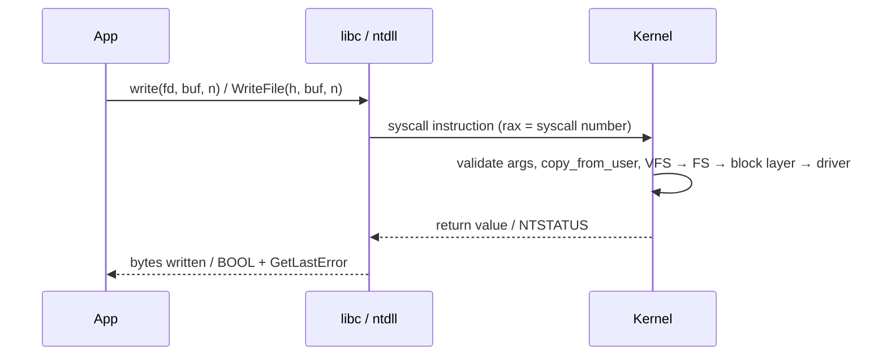

# How an Operating System Works

> **Level:** Advanced · **Related:** [CPU](../01-hardware/cpu.md) · [RAM](../01-hardware/ram.md) · [BIOS/UEFI](../01-hardware/bios.md) · [Drivers](drivers.md) · [Software/Apps](software-and-apps.md)

## 1. What an OS is

An **operating system** is the software layer that:

1. **Abstracts hardware** — files instead of disk sectors, sockets instead of NIC registers, processes instead of CPU cores.
2. **Multiplexes resources** — many programs share CPUs, memory, devices safely.
3. **Protects** — one program cannot read another's memory or crash the machine.
4. **Provides services** — file systems, networking, security, IPC, UI.

The core is the **kernel**, running in privileged CPU mode (ring 0 / EL1). Everything else — shells, desktops, services — runs in **user mode**.

```
┌────────────────────────── User mode (ring 3) ──────────────────────────┐
│ Apps (Chrome, python)  │ Services/daemons  │ Shell  │ GUI (DWM / Wayland)│
│ ─────────── System libraries: glibc/musl │ ntdll.dll, kernel32.dll ─────│
└──────────────────────────────── syscall ─────────────────────────────────┘
┌────────────────────────── Kernel mode (ring 0) ─────────────────────────┐
│ Syscall interface │ Process/thread mgmt & scheduler │ Virtual memory     │
│ VFS + file systems │ Network stack │ IPC │ Security (ACLs, LSM, tokens)  │
│ I/O manager / device model │ Drivers │ Interrupt & exception handling  │
│ Hardware abstraction (HAL on Windows; arch/ code on Linux)             │
└──────────────────────────────────────────────────────────────────────────┘
                         CPU · RAM · Devices
```

## 2. Kernel architectures

| Type | Idea | Examples |
|---|---|---|
| Monolithic | All services + drivers in one kernel address space | **Linux** (with loadable modules), BSDs |
| Microkernel | Minimal kernel (IPC, scheduling, memory); drivers/FS in user space | seL4, QNX, Minix 3 |
| Hybrid | Microkernel-inspired structure, but most services in kernel for speed | **Windows NT** (`ntoskrnl.exe`), macOS XNU |

Windows NT layering: **HAL** (`hal.dll`) → **Kernel** (scheduling, interrupts) → **Executive** (Object Manager, Memory Manager, I/O Manager, Process Manager, Security Reference Monitor, Configuration Manager/registry) → subsystems (Win32 via `win32k.sys` + `csrss.exe`). Linux: a single `vmlinuz` image + modules in `/lib/modules/$(uname -r)`.

## 3. Boot: from firmware to login

| Step | Windows | Linux |
|---|---|---|
| Firmware | UEFI → `bootmgfw.efi` | UEFI → shim → GRUB / systemd-boot (or EFI stub) |
| Boot config | BCD store (`bcdedit`) | `grub.cfg`, loader entries |
| Loader | `winload.efi` loads `ntoskrnl.exe`, HAL, boot-start drivers, SYSTEM hive | Loads `vmlinuz` + `initramfs` |
| Kernel init | Phase 0/1 init, `smss.exe` (Session Manager) | `start_kernel()` → mounts initramfs, finds real root |
| First user process | `smss` → `csrss.exe`, `wininit.exe` → `services.exe`, `lsass.exe` | PID 1: `systemd` (or OpenRC/runit) |
| Login | `winlogon.exe` → LogonUI → `userinit` → `explorer.exe` | display manager (GDM/SDDM) or `getty` → shell |

See [BIOS/UEFI](../01-hardware/bios.md) for the pre-OS phase.

## 4. Processes and threads

- A **process** = address space + resources (handles/file descriptors, security token/credentials) + ≥1 thread.
- A **thread** = execution context: registers, stack, program counter; scheduled by the kernel.

| Concept | Linux | Windows |
|---|---|---|
| Create process | `fork()` + `execve()` (or `posix_spawn`, `clone()`) | `CreateProcessW()` → `NtCreateUserProcess` |
| Create thread | `pthread_create` → `clone(CLONE_VM|CLONE_THREAD…)` | `CreateThread` |
| Kernel object | `task_struct` (threads & processes are both "tasks") | `EPROCESS`, `ETHREAD` |
| Handles | File descriptors (ints) | HANDLEs into per-process handle table |
| Inspect | `ps`, `top`, `/proc/<pid>/`, `strace` | Task Manager, Process Explorer, `tasklist`, Process Monitor |

Process creation in Python on both OSes (the library hides fork vs CreateProcess):

```python
import subprocess, os
print("parent pid", os.getpid())
r = subprocess.run(["python", "-c", "import os; print('child pid', os.getpid())"],
                   capture_output=True, text=True)
print(r.stdout)
```

Classic UNIX fork/exec in C++:

```cpp
#include <unistd.h>
#include <sys/wait.h>
#include <cstdio>
int main() {
    pid_t pid = fork();                          // duplicate process (copy-on-write)
    if (pid == 0) { execlp("ls", "ls", "-l", nullptr); _exit(127); } // child becomes ls
    int status; waitpid(pid, &status, 0);        // parent waits
    printf("child exited %d\n", WEXITSTATUS(status));
}
```

## 5. Scheduling

The scheduler decides which ready thread runs on each CPU and for how long. Triggered by timer interrupts, blocking I/O, wake-ups, and priority changes. A **context switch** saves registers, switches kernel stack, and (for a different process) switches page tables (CR3).

| | Linux | Windows |
|---|---|---|
| Algorithm | **EEVDF** (since 6.6, replaced CFS): virtual runtime + deadlines; plus RT classes (`SCHED_FIFO`, `SCHED_RR`), `SCHED_DEADLINE` | Priority-based preemptive round-robin, 32 levels (0–15 dynamic, 16–31 real-time), quantum boosts for foreground/I/O |
| Tuning | `nice`, `chrt`, `taskset`, cgroups `cpu.max`/`cpu.weight` | Priority classes, `SetThreadPriority`, affinity, "Efficiency mode" (EcoQoS) |
| Hybrid CPUs | Uses Intel HFI / capacity-aware scheduling | Thread Director hints, QoS classes |

## 6. Memory management

Each process gets a private **virtual address space** mapped to physical RAM via page tables (see [RAM](../01-hardware/ram.md)).

- **Demand paging**, **copy-on-write**, **memory-mapped files**, **shared libraries** mapped once and shared.
- **Page fault** handler: minor (page present elsewhere, just map) vs major (read from disk).
- **Reclaim**: Linux LRU lists/MGLRU + kswapd; Windows working-set trimming, standby list, **memory compression**, `pagefile.sys`.
- **Protections**: NX/DEP (no execute on data), **ASLR** (randomized layout), guard pages, SMEP/SMAP (kernel can't execute/access user pages accidentally).

```text
Linux x86-64 user address space (simplified)
0x0000_0000_0000   (unmapped, NULL guard)
   .text  .data  .bss       ← executable (ASLR'd if PIE)
   heap  → grows up (brk / mmap)
   ...   mmap region: shared libs (libc.so), anon mmaps
   stack ← grows down
0x7fff_ffff_ffff   top of user space; kernel above 0xffff_8000_0000_0000
```

## 7. System calls: crossing into the kernel

User code cannot touch hardware; it asks the kernel via **system calls**.



- Linux has a stable, documented syscall ABI (~450 syscalls): `read`, `write`, `openat`, `mmap`, `clone`, `io_uring_enter`…
- Windows' stable ABI is the **Win32 API** (`kernel32.dll`, `user32.dll`…); the underlying `Nt*` syscalls in `ntdll.dll` change numbers between builds.
- Tracing: Linux `strace -f ./app`, `perf trace`, eBPF (`bpftrace`); Windows Process Monitor, ETW, WPR/WPA.

## 8. File systems and I/O

**VFS** (Linux) / **I/O Manager + file system drivers** (Windows) give a uniform API over many file systems.

| | Linux | Windows |
|---|---|---|
| Common FS | ext4, XFS, Btrfs, bcachefs, tmpfs, ZFS (out of tree) | NTFS, ReFS, FAT32/exFAT |
| Namespace | Single tree from `/`, mounts | Drive letters + NT object namespace (`\Device\HarddiskVolume3`, `\??\C:`) |
| Metadata | inodes, dentries | MFT records |
| Caching | Page cache | Cache Manager (system cache) |
| Async I/O | `io_uring`, epoll | IOCP (I/O Completion Ports), overlapped I/O |
| Permissions | UID/GID + mode bits, POSIX ACLs, SELinux/AppArmor | Security descriptors: owner + DACL/SACL of ACEs, integrity levels |

**Journaling** (ext4, NTFS) logs metadata changes before applying them so a crash leaves a consistent structure. Btrfs/ZFS/ReFS use **copy-on-write** + checksums.

"Everything is a file" on UNIX: devices (`/dev/sda`), processes (`/proc`), kernel parameters (`/sys`). Windows' equivalent unifying abstraction is the **object** (files, events, mutexes, processes, registry keys — all handles).

## 9. Interrupts, exceptions and I/O

- **Hardware interrupt** → CPU jumps to handler via IDT → kernel runs a short **top half** (Linux hardirq / Windows ISR at DIRQL) and defers work to a **bottom half** (softirq/tasklet/workqueue; Windows **DPC** at DISPATCH_LEVEL).
- **Exceptions**: page fault, divide by zero, general protection → kernel handles or delivers a **signal** (`SIGSEGV`) / **SEH exception** (`EXCEPTION_ACCESS_VIOLATION`).
- **Windows IRQLs** (PASSIVE < APC < DISPATCH < DIRQL) define what code can run/when — violating them causes the famous `IRQL_NOT_LESS_OR_EQUAL` BSOD.

## 10. Inter-process communication (IPC)

| Mechanism | Linux | Windows |
|---|---|---|
| Pipes | `pipe()`, FIFOs | Anonymous & named pipes (`\\.\pipe\name`) |
| Shared memory | `shm_open` + `mmap` | `CreateFileMapping` + `MapViewOfFile` |
| Sockets | TCP/UDP/Unix domain sockets | Winsock, AF_UNIX (Win10+) |
| Messages / RPC | D-Bus, signals, message queues | ALPC, COM/DCOM, window messages, RPC |
| Sync | futex, eventfd | Events, mutexes, semaphores, SRW locks, WaitOnAddress |

## 11. Security model

- **Users & privilege**: Linux root (UID 0) + **capabilities** (`CAP_NET_ADMIN`…); Windows **access tokens** with SIDs, privileges, **UAC** split tokens, integrity levels.
- **Mandatory controls**: SELinux, AppArmor, seccomp-bpf; Windows AppContainer, WDAC/AppLocker, **VBS/HVCI** (Hyper-V isolates kernel code integrity), Credential Guard.
- **Namespaces + cgroups** = Linux containers (Docker); Windows has Job objects, Silos, Windows containers.

## 12. Hands-on map: "where do I look?"

| Question | Linux | Windows |
|---|---|---|
| Kernel version | `uname -a` | `winver`, `ver` |
| Kernel log | `dmesg`, `journalctl -k` | Event Viewer → System |
| Services | `systemctl status`, `journalctl -u` | `services.msc`, `sc query`, `Get-Service` |
| Loaded drivers/modules | `lsmod`, `modinfo` | `driverquery`, `fltmc`, Autoruns |
| Open files of a process | `lsof -p PID`, `/proc/PID/fd` | Process Explorer → Handles, `handle.exe` |
| Kernel tunables | `sysctl -a`, `/proc/sys` | Registry `HKLM\SYSTEM\CurrentControlSet`, `bcdedit` |
| Crash analysis | kdump + `crash` | Minidumps in `C:\Windows\Minidump`, WinDbg `!analyze -v` |

## Further reading
- Arpaci-Dusseau, *Operating Systems: Three Easy Pieces* (free, ostep.org)
- Yosifovich, Ionescu, Russinovich, Solomon, *Windows Internals* (7th ed.)
- Robert Love, *Linux Kernel Development*; kernel.org documentation; LWN.net
