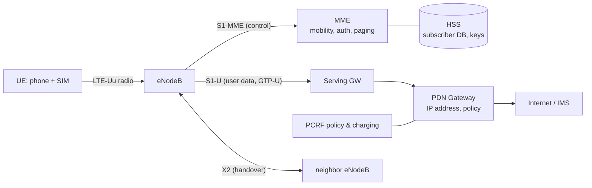
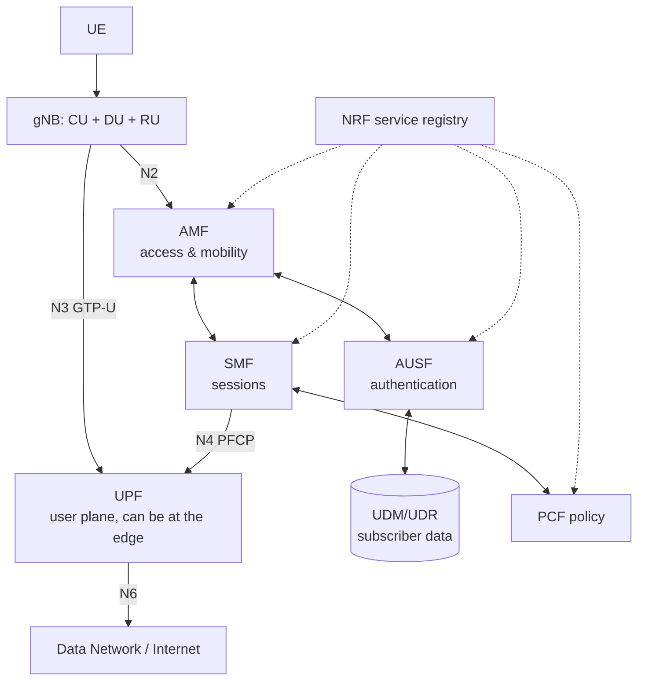

# How 3G / 4G / 5G Work

> **Level:** Advanced · **Related:** [Radio](radio.md) · [SIM/eSIM](sim-esim.md) · [GPS](gps.md) · [Web Protocols](../05-networking-and-web/web-protocols.md) · [Encryption](../06-security-and-data/encryption.md)

## 1. The cellular idea

Divide territory into **cells**, each served by a base station using a portion of licensed spectrum. Reuse the same frequencies in distant cells. As a user moves, **hand over** the connection between cells. The network tracks where every phone is, authenticates it via the [SIM](sim-esim.md), and routes calls/data to the internet and other networks.

```
       ┌── Cell A ──┐┌── Cell B ──┐
  📱 ─── radio ───▶ [gNB/eNB] ── fiber/microwave backhaul ──▶ Core network ──▶ Internet / IMS (voice)
```

Every generation has two parts: a **Radio Access Network (RAN)** and a **Core Network (CN)**.

## 2. Generations at a glance

| | 2G (GSM) | 3G (UMTS/HSPA) | 4G (LTE / LTE-A) | 5G (NR) |
|---|---|---|---|---|
| Years | 1991 | 2001 | 2009 | 2019 (5G-Advanced Rel-18 ~2024; 6G ~2030) |
| Standard body | ETSI → 3GPP | 3GPP (R99–R7) | 3GPP R8–R14 | 3GPP R15+ |
| Access | TDMA/FDMA | **WCDMA** (spread spectrum) | **OFDMA** DL / SC-FDMA UL | **OFDMA** DL & UL (CP-OFDM, DFT-s-OFDM) |
| Channel width | 200 kHz | 5 MHz | 1.4–20 MHz (CA up to 100+ MHz) | FR1 up to 100 MHz, FR2 up to 400 MHz |
| Peak DL | ~0.1 Mbps (EDGE) | 42 Mbps (DC-HSPA+) | 300 Mbps → 1–3 Gbps | 10–20 Gbps (theoretical) |
| Latency | ~500 ms | ~100 ms | ~30–50 ms | ~10 ms (URLLC target 1 ms) |
| Core | Circuit-switched MSC + GPRS | CS + PS (SGSN/GGSN) | **All-IP EPC** | **Service-Based 5GC**, cloud-native |
| Voice | Circuit-switched | Circuit-switched | **VoLTE** (IMS) | **VoNR** / VoLTE fallback |
| Base station | BTS + BSC | NodeB + RNC | **eNodeB** | **gNodeB** (CU/DU/RU split) |

Many operators have shut down 3G (and some 2G); LTE and NR are the present.

## 3. 3G: WCDMA in brief

All users transmit **at the same time on the same 5 MHz**, separated by **spreading codes** (CDMA): each bit is multiplied by a high-rate chip sequence (3.84 Mcps). The receiver correlates with the user's code; other users appear as noise. Requires tight **fast power control** (1500 Hz) so near users don't drown far ones ("near-far problem"). **Soft handover**: a phone can talk to several NodeBs simultaneously. HSPA added fast scheduling, 16/64-QAM and MIMO.

## 4. 4G LTE: the architecture



- **Control plane vs user plane** separation: signaling (NAS/RRC) vs data tunneled in **GTP-U**.
- **Bearers**: logical pipes with QoS (QCI) — e.g., default internet bearer, dedicated VoLTE bearer.

### LTE radio frame
- 10 ms frame = 10 subframes × 1 ms = 20 slots × 0.5 ms.
- Subcarrier spacing **15 kHz**; a **Resource Block (RB)** = 12 subcarriers × 1 slot. A 20 MHz carrier = 100 RBs.
- Every 1 ms (a **TTI**), the eNodeB's **MAC scheduler** decides which UE gets which RBs, with what **MCS** (QPSK…256-QAM) and MIMO rank, based on **CQI** channel reports.
- **HARQ**: fast retransmissions with soft combining, 8 ms round trip.
- **Carrier Aggregation**: bond multiple carriers (e.g., Band 3 + Band 7 + Band 20).

### Protocol stack (user plane)
```
IP packet
 ↓ PDCP  — header compression (ROHC), ciphering & integrity, reordering
 ↓ RLC   — segmentation, ARQ retransmission (AM/UM/TM modes)
 ↓ MAC   — scheduling, HARQ, multiplexing logical channels
 ↓ PHY   — coding (turbo/LDPC), modulation, OFDM, MIMO
```
Control plane adds **RRC** (radio config, handover, measurements) and **NAS** (UE↔core: attach, authentication, session management).

## 5. 5G NR: what's new

### 5.1 Three service classes
- **eMBB** — enhanced mobile broadband (speed).
- **URLLC** — ultra-reliable low latency (industrial control, 99.999%, ~1 ms).
- **mMTC** — massive machine-type communications (up to 1 M devices/km²; NB-IoT/LTE-M continue here; **RedCap** for mid-tier devices).

### 5.2 Flexible numerology
Subcarrier spacing `15 × 2^μ kHz`:

| μ | SCS | Slot length | Typical use |
|---|---|---|---|
| 0 | 15 kHz | 1 ms | Low bands, LTE coexistence |
| 1 | 30 kHz | 0.5 ms | Mid-band (3.5 GHz) — the 5G workhorse |
| 3 | 120 kHz | 125 µs | mmWave (FR2) |

Plus **mini-slots** (2–7 symbols) for low-latency transmission without waiting for a slot boundary.

### 5.3 Spectrum
- **FR1** (410 MHz – 7.125 GHz): low band (600–900 MHz, coverage), mid band **3.3–4.2 GHz (n77/n78)** — best balance.
- **FR2** (24.25–71 GHz, mmWave): huge bandwidth, short range, blocked by walls/hands → dense small cells, beamforming.

### 5.4 Massive MIMO & beam management
64T64R active antenna arrays form narrow beams; the UE measures **SSB beams** (synchronization signal blocks swept in different directions), reports the best, and beam tracking follows the user. See [Radio](radio.md#6-antennas-mimo-and-beamforming).

### 5.5 Channel coding
**LDPC** for data (high throughput, parallel decoding), **Polar codes** for control channels (first commercial use of Arıkan's 2009 codes).

### 5.6 The 5G Core (5GC): service-based architecture



- Network Functions are cloud-native microservices talking **HTTP/2 + JSON (REST)** over the SBI — run on Kubernetes.
- **CUPS**: control and user plane fully separated → UPFs deployed near users for **edge computing (MEC)**.
- **Network slicing**: logical end-to-end networks with different SLAs on shared infrastructure (identified by S-NSSAI).
- **NSA vs SA**: early 5G **Non-Standalone** used an LTE anchor + 4G EPC (EN-DC); **Standalone** uses 5GC fully (required for slicing, VoNR, URLLC).
- **O-RAN / vRAN**: open interfaces between RU/DU/CU; RAN software on commodity servers; RIC (RAN Intelligent Controller) apps.

## 6. Life of a phone: attach, authenticate, get IP

```mermaid
sequenceDiagram
  participant UE
  participant gNB
  participant AMF
  participant AUSF as AUSF/UDM
  participant SMF as SMF/UPF
  UE->>gNB: Cell search: PSS/SSS sync, read MIB/SIB
  UE->>gNB: Random access (RACH preamble) → RRC Setup
  UE->>AMF: Registration Request (SUCI = encrypted SUPI)
  AMF->>AUSF: Authenticate
  AUSF-->>AMF: 5G-AKA challenge (RAND, AUTN)
  AMF->>UE: Auth Request
  Note over UE: SIM verifies AUTN (network is genuine), computes RES* with key K
  UE->>AMF: Auth Response (RES*)
  AMF->>UE: Security Mode Command (NAS ciphering/integrity)
  AMF-->>UE: Registration Accept (5G-GUTI temporary ID)
  UE->>SMF: PDU Session Establishment (DNN "internet")
  SMF-->>UE: IP address assigned; UPF tunnel set up
```

- **Mutual authentication** via **AKA** with the secret key `K` stored only in the SIM and the operator's AuC/UDM — see [SIM/eSIM](sim-esim.md).
- 5G conceals the permanent ID (SUPI/IMSI) as **SUCI** using ECIES with the operator's public key → defeats "IMSI catchers" that 2G–4G were vulnerable to.
- Encryption algorithms: 128-NEA1/2/3 (SNOW 3G, **AES**, ZUC); integrity NIA1/2/3. 2G's A5/1 is broken — a reason to disable 2G on phones (Android: "Allow 2G" toggle).
- **Idle mode**: the phone sleeps and wakes periodically for **paging**; the network knows it only at tracking-area granularity. **Handover** in connected mode is network-controlled based on UE measurement reports (RSRP/RSRQ/SINR).

## 7. Voice: VoLTE / VoNR

Voice is just an app over IP: the phone registers with the operator's **IMS** (IP Multimedia Subsystem) using **SIP**, media flows over **RTP** with codecs AMR-WB or **EVS**, on a dedicated QoS bearer (QCI 1 / 5QI 1). If unavailable, **CSFB** falls back to 2G/3G (disappearing) or EPS fallback from 5G to LTE.

## 8. Seeing it on your devices

- **Android**: `*#*#4636#*#*` (Phone info: RSRP, band), apps like NetMonster, Network Signal Guru (root); Settings → SIM → preferred network type.
- **iPhone**: Field Test mode `*3001#12345#*`.
- **Windows** (laptops with WWAN modems): `netsh mbn show interfaces`, `netsh mbn show readyinfo *`; Mobile Broadband driver model (MBIM class driver `wmbclass.sys`).
- **Linux**: **ModemManager** + NetworkManager.

```bash
mmcli -L                           # list modems
mmcli -m 0                         # status: access tech (lte/5gnr), operator, signal quality
mmcli -m 0 --signal-setup=5 && mmcli -m 0 --signal-get   # RSRP/RSRQ/SNR
nmcli c add type gsm ifname '*' con-name mobile apn internet
```

Open-source cellular stacks for labs: **srsRAN**, **OpenAirInterface** (RAN), **Open5GS**, **free5GC** (core). Transmitting on licensed spectrum requires authorization — use Faraday cages / test licenses.

## 9. Parsing signal quality in Python (ModemManager D-Bus via `mmcli` JSON)

```python
import json, subprocess
out = subprocess.run(["mmcli", "-m", "0", "--signal-get", "-J"], capture_output=True, text=True)
sig = json.loads(out.stdout)["modem"]["signal"]
lte = sig.get("lte", {}); nr = sig.get("5g", {})
print("LTE RSRP:", lte.get("rsrp"), "dBm  | 5G RSRP:", nr.get("rsrp"), "dBm")
# Rough guide: RSRP > -80 excellent, -80..-90 good, -90..-100 fair, < -100 poor
```

## Further reading
- Dahlman, Parkvall, Sköld, *5G NR: The Next Generation Wireless Access Technology*; *4G LTE-Advanced Pro*
- 3GPP TS 38.300 (NR overall), TS 23.501 (5G system architecture), TS 33.501 (5G security)
- ShareTechnote.com (LTE/NR deep dives); Sauter, *From GSM to LTE-Advanced Pro and 5G*
