# How Radio Works

> **Level:** Advanced · **Related:** [Wi-Fi](wifi.md) · [Bluetooth](bluetooth.md) · [3G/4G/5G](cellular-3g-4g-5g.md) · [GPS](gps.md) · [NFC](nfc.md) · [Wireless Charging](wireless-charging.md)

Radio is the foundation of every wireless technology in this knowledge base. Master this page and Wi-Fi, Bluetooth, cellular and GPS become variations on a theme.

## 1. Physics: electromagnetic waves

An accelerating electric charge radiates an **electromagnetic wave** — coupled oscillating electric and magnetic fields propagating at the speed of light `c ≈ 3×10⁸ m/s`.

```
λ = c / f          (wavelength = speed of light / frequency)
100 MHz FM  → λ = 3 m          2.4 GHz Wi-Fi → λ = 12.5 cm
28 GHz 5G   → λ ≈ 1.07 cm      1575.42 MHz GPS L1 → λ ≈ 19 cm
```

| Band | Frequency | Uses | Propagation |
|---|---|---|---|
| LF/MF | 30 kHz – 3 MHz | AM radio, 13.56 MHz NFC is HF | Ground wave, long range |
| HF (shortwave) | 3–30 MHz | Amateur, international broadcast | Ionosphere reflection → global |
| VHF | 30–300 MHz | FM radio, aviation, TV | Line-of-sight-ish |
| UHF | 300 MHz – 3 GHz | TV, LTE, GPS, Wi-Fi 2.4, Bluetooth | Penetrates buildings moderately |
| SHF | 3–30 GHz | Wi-Fi 5/6 GHz, 5G FR1 upper/FR2 lower, satellite, radar | Mostly line-of-sight |
| EHF (mmWave) | 30–300 GHz | 5G mmWave, 60 GHz WiGig, radar | Blocked by walls, hands, rain |

**Key trade-off:** higher frequency → more available bandwidth (→ more data) but worse range and penetration. **Free-space path loss:**

```
FSPL(dB) = 20·log10(d_km) + 20·log10(f_MHz) + 32.44
```

Doubling distance or frequency costs 6 dB (¼ the power).

## 2. A radio link, end to end

```mermaid
flowchart LR
  subgraph TX[Transmitter]
    D[Data bits] --> ENC[Channel coding<br/>FEC: LDPC, polar, turbo]
    ENC --> MOD[Modulation<br/>bits → symbols, e.g. QAM]
    MOD --> DAC[DAC] --> UP[Mixer ↑ carrier f_c<br/>local oscillator]
    UP --> PA[Power amplifier] --> ANT1((Antenna))
  end
  ANT1 -. "channel: path loss, fading, noise, interference" .-> ANT2((Antenna))
  subgraph RX[Receiver]
    ANT2 --> LNA[Low-noise amplifier] --> DOWN[Mixer ↓ to baseband]
    DOWN --> ADC[ADC] --> SYNC[Sync, channel estimation, equalization]
    SYNC --> DEM[Demodulation] --> DEC[FEC decoding] --> OUT[Data bits]
  end
```



## 3. Modulation: putting information on a carrier

A carrier `s(t) = A · cos(2π f t + φ)` has three knobs — **amplitude A, frequency f, phase φ**.

| Analog | Digital | Example |
|---|---|---|
| AM (amplitude) | ASK / OOK | AM radio, RFID, NFC |
| FM (frequency) | FSK, GFSK | FM radio, Bluetooth Classic/LE |
| PM (phase) | PSK: BPSK, QPSK | GPS (BPSK), satellite |
| — | **QAM** (amplitude + phase) | Wi-Fi, LTE, 5G, cable |

**I/Q representation:** any modulated signal = `I(t)·cos(2πf_c t) − Q(t)·sin(2πf_c t)`. Each symbol is a point in the I/Q plane (a **constellation**):

```
 16-QAM (4 bits/symbol)         QPSK (2 bits/symbol)
   Q                               Q
 ·  ·  │ ·  ·                      │
 ·  ·  │ ·  ·                  01 ·│· 00
 ──────┼──────  I              ────┼────  I
 ·  ·  │ ·  ·                  11 ·│· 10
 ·  ·  │ ·  ·                      │
```

More points = more bits per symbol but points are closer together → need higher **SNR**. Wi-Fi 7 uses **4096-QAM** (12 bits/symbol) at very high SNR; links fall back to QPSK/BPSK at the cell edge (**adaptive modulation and coding**).

A QPSK modulator/demodulator in Python (NumPy):

```python
import numpy as np
rng = np.random.default_rng(0)
bits = rng.integers(0, 2, 2000)
sym = ((1 - 2 * bits[0::2]) + 1j * (1 - 2 * bits[1::2])) / np.sqrt(2)   # Gray-mapped QPSK
snr_db = 8
noise = (rng.normal(size=sym.size) + 1j * rng.normal(size=sym.size)) * np.sqrt(0.5 / 10**(snr_db/10))
rx = sym + noise                                                        # AWGN channel
bits_hat = np.empty_like(bits)
bits_hat[0::2] = rx.real < 0; bits_hat[1::2] = rx.imag < 0
print("BER:", np.mean(bits != bits_hat))
```

## 4. Channel capacity: the hard limit

**Shannon–Hartley theorem:**

```
C = B · log2(1 + SNR)       [bits/s]
```

- 20 MHz channel at 30 dB SNR (1000×): C ≈ 20e6 × log2(1001) ≈ **199 Mbps** per spatial stream.
- Ways to go faster: **more bandwidth** (wider channels, carrier aggregation, mmWave), **better SNR** (beamforming, closer cells), **more spatial streams** (MIMO).

## 5. OFDM: how modern radios fight multipath

Signals bounce off buildings and arrive via many paths with different delays (**multipath**), smearing symbols into each other (inter-symbol interference) and causing frequency-selective fading.

**OFDM (Orthogonal Frequency-Division Multiplexing)** splits a wide channel into hundreds/thousands of narrow **subcarriers**, each carrying slow symbols:

- Subcarriers are spaced exactly `1/T_symbol` apart → mathematically orthogonal (no interference), implemented efficiently with an **IFFT** (TX) and **FFT** (RX).
- A **cyclic prefix** (copy of the symbol's tail placed at its start) absorbs multipath delay spread.
- Each subcarrier sees flat fading → equalization is one complex multiply per subcarrier.
- **OFDMA** assigns different subcarriers (resource units) to different users simultaneously (Wi-Fi 6+, LTE/5G downlink).

```python
import numpy as np
rng = np.random.default_rng(1)
N, CP = 64, 16
data = (rng.choice([-1, 1], N) + 1j * rng.choice([-1, 1], N)) / np.sqrt(2)  # QPSK on 64 subcarriers
tx = np.fft.ifft(data) * np.sqrt(N)
tx_cp = np.concatenate([tx[-CP:], tx])            # add cyclic prefix
h = np.array([1, 0, 0.5j, 0, 0.2])                # multipath channel impulse response
rx = np.convolve(tx_cp, h)[:N + CP]
rx_freq = np.fft.fft(rx[CP:]) / np.sqrt(N)       # remove CP, FFT
H = np.fft.fft(h, N)                              # channel estimate (pilots in real systems)
eq = rx_freq / H                                  # one-tap equalizer per subcarrier
print(np.allclose(eq, data))                      # True — multipath removed
```

Used by: Wi-Fi (802.11a/g/n/ac/ax/be), LTE, 5G NR, DVB-T, DAB.

## 6. Antennas, MIMO and beamforming

- An antenna converts guided current into radiated waves (and back). Size scales with wavelength (a dipole ≈ λ/2).
- **Gain** (dBi) = focusing energy in a direction; not amplification.
- **MIMO**: multiple antennas at both ends. With rich multipath, each antenna pair sees a different channel; the receiver solves a matrix equation to separate **spatial streams** → capacity scales with `min(Ntx, Nrx)`.
- **Beamforming**: drive each antenna element with a phase offset so waves add constructively toward a target. Phased arrays with 64–256 elements (5G Massive MIMO) steer beams electronically.
- **MU-MIMO**: serve several users at once on different beams.

## 7. Sharing the spectrum (multiple access)

| Method | Idea | Examples |
|---|---|---|
| FDMA | Different frequencies | FM stations, 1G |
| TDMA | Different time slots | GSM (2G), Bluetooth |
| CDMA | Different spreading codes | 3G UMTS, **GPS** |
| OFDMA | Different subcarrier groups | LTE, 5G, Wi-Fi 6/7 |
| CSMA/CA | Listen before talk, random backoff | Wi-Fi |
| SDMA | Different beams/spatial directions | MU-MIMO |
| Frequency hopping | Hop pseudo-randomly | Bluetooth (1600 hops/s) |

**Duplexing:** FDD (separate up/down frequencies) vs TDD (same frequency, alternating time).

## 8. Receivers: superheterodyne to SDR

- **Superheterodyne** (Armstrong, 1918): mix the RF signal down to a fixed **intermediate frequency (IF)** for filtering/amplification — still the basis of most radios.
- **Direct conversion (zero-IF)**: mix straight to baseband I/Q — used in most phone chips.
- **Software-Defined Radio (SDR)**: digitize early and do filtering/demodulation in software. Cheap **RTL-SDR** dongles (~25–1700 MHz) let you receive FM, ADS-B aircraft, weather satellites; HackRF/USRP can also transmit (licensing required!).

FM demodulation from an RTL-SDR in Python:

```python
# pip install pyrtlsdr numpy sounddevice scipy
from rtlsdr import RtlSdr
import numpy as np, scipy.signal as sig, sounddevice as sd
sdr = RtlSdr(); sdr.sample_rate = 1.024e6; sdr.center_freq = 100.1e6; sdr.gain = "auto"
iq = sdr.read_samples(1024 * 1024 * 2)
fm = np.angle(iq[1:] * np.conj(iq[:-1]))              # polar discriminator: phase derivative
audio = sig.decimate(sig.decimate(fm, 8), 4)           # 1.024 MHz → 32 kHz
sd.play(audio / np.max(np.abs(audio)), 32000); sd.wait()
```

On Linux, SDR tooling: GNU Radio, `rtl_fm`, gqrx, SDR++; on Windows: SDR#, SDR++ (with Zadig to install the WinUSB driver).

## 9. Regulation

Spectrum is a regulated public resource: ITU allocates globally; national regulators (FCC in the US, Ofcom UK, CEPT/ETSI in Europe, ГКРЧ/Roskomnadzor in Russia) license bands. **ISM bands** (2.4 GHz, 5.8 GHz, 915/868 MHz) are unlicensed with power limits — that's why Wi-Fi, Bluetooth, microwave ovens and Zigbee all share 2.4 GHz.

## Further reading
- Goldsmith, *Wireless Communications*; Tse & Viswanath, *Fundamentals of Wireless Communication* (free PDF)
- PySDR (pysdr.org) — free textbook on SDR & DSP in Python
- ARRL Handbook (amateur radio practice)
