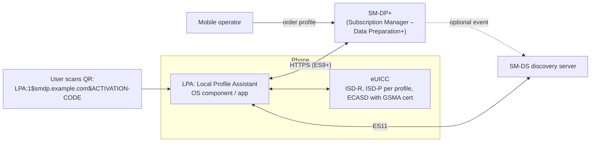

# How SIM and eSIM Work

> **Level:** Advanced · **Related:** [3G/4G/5G](cellular-3g-4g-5g.md) · [NFC](nfc.md) · [Encryption](../06-security-and-data/encryption.md) · [Payment Terminals](../06-security-and-data/payment-terminal.md)

## 1. What a SIM really is

A **SIM** is not a memory card — it's a tiny **tamper-resistant computer** (a smart card): CPU, ROM, EEPROM/flash, RAM, a crypto coprocessor and a true random number generator, running a secure OS (usually **Java Card**). Its essential job: **hold a secret key `K` that never leaves the chip**, and use it to prove the subscriber's identity to the mobile network.

Correct terminology:
- **UICC** (Universal Integrated Circuit Card) — the physical smart card platform.
- **SIM / USIM / ISIM** — *applications* on the UICC: SIM (2G GSM), USIM (3G/4G/5G), ISIM (IMS/VoLTE).
- **eUICC** — an embedded, remotely re-programmable UICC (the "e" in eSIM).
- **iSIM / iUICC** — the SIM integrated into the phone's SoC secure enclave.

| Form factor | Size (mm) | Notes |
|---|---|---|
| 1FF (full size) | 85.6 × 53.98 | Credit-card size (1991) |
| 2FF (mini) | 25 × 15 | "Standard SIM" |
| 3FF (micro) | 15 × 12 | 2010 |
| 4FF (nano) | 12.3 × 8.8 | 2012, current |
| **MFF2** | 5 × 6 (soldered) | eSIM chip in phones, IoT, cars |
| iSIM | inside SoC | Latest phones/IoT modules |

## 2. What's stored on it

| Item | Purpose |
|---|---|
| **IMSI** (International Mobile Subscriber Identity) — in 5G called **SUPI** | Subscriber ID: MCC (country) + MNC (operator) + MSIN, e.g., `250 01 1234567890` |
| **K (Ki)** — 128/256-bit secret key | Shared only with the operator's AuC/UDM. **Never readable.** |
| **OPc** | Operator-variant key for the MILENAGE algorithm |
| **ICCID** | Card serial number (printed on the card, starts with 89) |
| PIN / PUK | Local access control (3 PIN tries → PUK; 10 PUK tries → card dead) |
| Files: PLMN lists, SPN, SMSC, home network public key (for 5G SUCI) | Network selection & config |
| SIM Toolkit / Java Card applets | Operator menus, OTA management, sometimes payment/[NFC](nfc.md) secure element |

The file system is hierarchical: **MF** (master file `3F00`) → **DFs** (directories, e.g., ADF USIM) → **EFs** (elementary files, e.g., `EF_IMSI 6F07`, `EF_ICCID 2FE2`).

## 3. Talking to a SIM: APDUs

The phone's modem communicates with the UICC using **ISO 7816** electrical contacts (VCC, GND, RST, CLK, I/O — single-wire half-duplex serial at ~3.5–4 MHz clock) and the same **APDU** command format as bank cards:

```
SELECT file:       00 A4 00 04 02 6F07          (select EF_IMSI)
READ BINARY:       00 B0 00 00 09               → 08 29 05 10 ... 90 00
VERIFY PIN:        00 20 00 01 08 31323334FFFFFFFF
AUTHENTICATE:      00 88 00 81 22 [RAND][AUTN]  → RES, CK, IK  (3G/4G/5G AKA)
```

With a USB smart-card reader, reading the ICCID in Python (Windows WinSCard or Linux pcscd):

```python
from smartcard.System import readers
from smartcard.util import toHexString
c = readers()[0].createConnection(); c.connect()
def apdu(cmd):
    data, sw1, sw2 = c.transmit(cmd); return data, (sw1 << 8) | sw2
apdu([0x00, 0xA4, 0x00, 0x04, 0x02, 0x3F, 0x00])          # select MF
_, sw = apdu([0x00, 0xA4, 0x00, 0x04, 0x02, 0x2F, 0xE2])  # select EF_ICCID
data, sw = apdu([0x00, 0xB0, 0x00, 0x00, 0x0A])           # read 10 bytes
iccid = "".join(f"{b & 0x0F}{b >> 4}" for b in data)      # BCD, nibble-swapped
print("ICCID:", iccid.rstrip("f"), hex(sw))
```

(`pysim` from Osmocom is the full-featured tool for reading and programming test SIMs.)

## 4. Authentication: how the network knows it's you

**2G (GSM) — one-way, broken:** network sends RAND; SIM computes SRES = A3(K, RAND) and Kc = A8(K, RAND). The network was never authenticated → fake base stations (IMSI catchers) worked; COMP128v1 allowed cloning.

**3G/4G/5G — AKA (Authentication and Key Agreement), mutual:**

```mermaid
sequenceDiagram
  participant SIM as USIM (holds K, SQN)
  participant UE as Phone modem
  participant NET as Network (MME/AMF → HSS/UDM holds K, SQN)
  NET->>NET: Generate RAND; compute XRES, AUTN = SQN⊕AK ‖ AMF ‖ MAC, CK, IK (MILENAGE / TUAK with K)
  NET->>UE: Authentication Request (RAND, AUTN)
  UE->>SIM: AUTHENTICATE(RAND, AUTN)
  SIM->>SIM: Verify MAC → network knows K ✔; check SQN freshness (anti-replay)
  SIM-->>UE: RES, CK, IK
  UE->>NET: Authentication Response (RES)
  NET->>NET: RES == XRES → subscriber authenticated ✔
  Note over UE,NET: Keys derived from CK/IK (KASME in LTE, KAUSF→KSEAF→KAMF→KgNB in 5G) encrypt & integrity-protect traffic
```

- **MILENAGE** (AES-based) is the standard algorithm set f1–f5; **TUAK** (Keccak-based) is the alternative supporting 256-bit keys.
- The **sequence number (SQN)** prevents replaying old challenges.
- **5G** adds **SUCI**: the SIM (or phone) encrypts the SUPI with the home network's public key (ECIES, profile A X25519 / profile B P-256), so the permanent identity is never sent in clear. See [cellular](cellular-3g-4g-5g.md#6-life-of-a-phone-attach-authenticate-get-ip).

Conceptual demo of challenge-response (HMAC stands in for MILENAGE — *not* the real algorithm):

```python
import hmac, hashlib, os
K = os.urandom(16)                          # provisioned in SIM and operator DB only
def f(key, rand): return hmac.new(key, rand, hashlib.sha256).digest()
# Network
RAND = os.urandom(16); XRES = f(K, RAND)[:8]
# SIM (never reveals K)
RES = f(K, RAND)[:8]
print("authenticated:", hmac.compare_digest(RES, XRES))
```

## 5. eSIM: remote provisioning

With **eSIM**, the chip (eUICC) is soldered in; operator credentials arrive as a downloadable **profile** — an encrypted package containing IMSI, K, OPc, files and applets. One eUICC can store many profiles (typically 5–10+); one (or two with DSDS/MEP — Multiple Enabled Profiles) is active.

### 5.1 Architecture (GSMA SGP.21/22 — consumer)



**Download flow:**
1. User scans a QR code / uses carrier app / "eSIM Quick Transfer" → activation code `LPA:1$<SM-DP+ address>$<matching ID>`.
2. LPA opens TLS to the SM-DP+; **mutual authentication** using certificates chained to the **GSMA CI (Certificate Issuer)** root: SM-DP+ proves it's legitimate; the eUICC proves it's a genuine certified chip (EUM certificate + eUICC certificate in ECASD).
3. Both perform an **ECDH key agreement** (ECKA, P-256 or Brainpool) → session keys.
4. SM-DP+ sends the **Bound Profile Package (BPP)** — the profile encrypted *for that specific eUICC*. The LPA just relays opaque ciphertext; it cannot read the keys.
5. eUICC installs it into a new **ISD-P** security domain; user enables it; the modem refreshes and attaches using the new IMSI/K.

Variants: **SGP.32** (IoT eSIM, eIM remote manager for headless devices, 2023+) replacing M2M **SGP.02** (push-based SM-SR model).

### 5.2 Pros and cons

| eSIM advantages | Considerations |
|---|---|
| Instant activation, no shipping/store | Needs internet (Wi-Fi) to download |
| Multiple profiles (travel eSIMs, work + personal) | Moving to a new phone requires transfer/re-issue |
| Smaller, sealed devices (watches, IoT) | Carrier lock and support vary |
| Harder to steal SIM physically | **SIM-swap fraud** moves to social engineering carrier support |

## 6. SIM security & threats

- **Cloning**: impossible on modern USIMs without the operator's K (extraction resistant to side-channel/fault attacks per Common Criteria certification).
- **SIM swapping** (social engineering the operator to move your number) → attackers receive SMS 2FA codes. Defense: carrier port-out PIN, prefer app/hardware-key 2FA over SMS.
- **Simjacker / WIBattack** (2019): malicious binary SMS to vulnerable S@T Browser applets. Mitigated by filtering and removing legacy applets.
- **SS7/Diameter** signaling attacks exploit the network, not the SIM — 5G SBA with SEPP improves inter-operator security.

## 7. OS and device view

| Platform | Where to look |
|---|---|
| Android | Settings → Network → SIMs; `EuiccManager` API for carrier apps; `adb shell dumpsys isub`; LPA = Google "eSIM Manager" |
| iOS | Settings → Cellular → Add eSIM / Transfer |
| Windows (LTE/5G laptops) | Settings → Network & internet → Cellular → **eSIM profiles**; `netsh mbn show readyinfo *` (shows ICCID/IMSI state); MBIM UICC low-level access (`MBIM_CID_MS_UICC_*`) |
| Linux | ModemManager: `mmcli -m 0 --sim 0` (ICCID, IMSI, operator); `qmicli -d /dev/cdc-wdm0 --uim-get-card-status`; `lpac` (open-source LPA for eUICC profile management) |

```bash
mmcli -i 0                       # SIM details: imsi, iccid, operator id
qmicli -d /dev/cdc-wdm0 --uim-read-transparent=0x3F00,0x2FE2   # read EF_ICCID via QMI
lpac chip info && lpac profile list                           # eSIM profiles (supported readers/modems)
```

## Further reading
- 3GPP TS 31.102 (USIM), TS 33.102/33.401/33.501 (3G/4G/5G security), TS 35.205–35.208 (MILENAGE)
- GSMA SGP.21/SGP.22 (consumer RSP), SGP.31/SGP.32 (IoT eSIM)
- ETSI TS 102 221 (UICC-terminal interface); Osmocom pySim documentation
