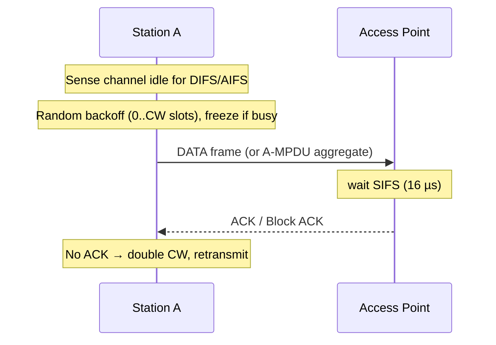
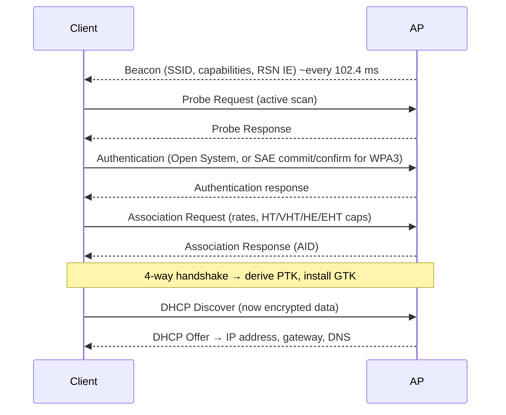

# How Wi-Fi Works

> **Level:** Advanced · **Related:** [Radio](radio.md) · [Bluetooth](bluetooth.md) · [Web Protocols](../05-networking-and-web/web-protocols.md) · [Encryption](../06-security-and-data/encryption.md) · [Drivers](../03-os-and-software/drivers.md)

## 1. What Wi-Fi is

**Wi-Fi** is the Wi-Fi Alliance's brand for devices implementing **IEEE 802.11** — a wireless LAN standard defining the **physical layer (PHY)** and **MAC layer** (OSI layers 1–2). To the rest of the network stack a Wi-Fi interface looks like Ethernet: it carries Ethernet-style frames with MAC addresses, on top of which IP, TCP/UDP and HTTP run.

## 2. Generations

| Name | IEEE | Year | Bands | Max channel | Modulation | Max PHY rate | Key features |
|---|---|---|---|---|---|---|---|
| — | 802.11b | 1999 | 2.4 | 22 MHz | DSSS/CCK | 11 Mbps | |
| — | 802.11a/g | 1999/2003 | 5 / 2.4 | 20 MHz | OFDM 64-QAM | 54 Mbps | OFDM arrives |
| Wi-Fi 4 | 802.11n | 2009 | 2.4, 5 | 40 MHz | 64-QAM | 600 Mbps | MIMO (4 streams) |
| Wi-Fi 5 | 802.11ac | 2013 | 5 | 160 MHz | 256-QAM | 6.9 Gbps | DL MU-MIMO, beamforming |
| Wi-Fi 6/6E | 802.11ax | 2019/2020 | 2.4, 5, (6) | 160 MHz | 1024-QAM | 9.6 Gbps | **OFDMA**, UL MU-MIMO, TWT, BSS coloring; 6E adds 6 GHz |
| Wi-Fi 7 | 802.11be | 2024 | 2.4, 5, 6 | **320 MHz** | **4096-QAM** | ~46 Gbps | **Multi-Link Operation (MLO)**, puncturing, 16 streams |
| Wi-Fi 8 | 802.11bn | ~2028 | | | | | "Ultra High Reliability": coordinated APs, better roaming |

Real-world throughput is typically 40–70% of PHY rate due to MAC overhead, contention and SNR.

## 3. Architecture

```
          Internet
             │
         [Router/Gateway] ── DHCP, NAT, DNS forwarder
             │ Ethernet
   ┌─────────┴──────────┐
 [AP 1]  "HomeNet"     [AP 2] "HomeNet"   ← same SSID = ESS (Extended Service Set)
 BSSID aa:..:01        BSSID aa:..:02     ← each radio = a BSS
   )))  )))              )))
 laptop phone          TV  (stations, STA)
```

- **Station (STA)**: client device. **Access Point (AP)**: bridges wireless ↔ wired.
- **SSID**: network name. **BSSID**: MAC of an AP radio.
- **Mesh** systems (EasyMesh, 802.11s) use wireless backhaul between APs.
- **Wi-Fi Direct**: peer-to-peer (Miracast, printers).

## 4. PHY layer (how bits become radio)

- Channels in 2.4 GHz (1–13, only 1/6/11 non-overlapping), 5 GHz (36–165, some require **DFS** radar avoidance), 6 GHz (up to fifty-nine 20 MHz channels / three 320 MHz).
- **OFDM/OFDMA**: a 20 MHz Wi-Fi 6 channel = 256 subcarriers at 78.125 kHz spacing, grouped into **Resource Units** assigned to different clients in the same transmission.
- **MCS index** picks modulation + coding rate (e.g., MCS 11 = 1024-QAM, 5/6) based on SNR — rate adaptation algorithms (Minstrel on Linux) choose continuously.
- **MIMO & beamforming**: explicit channel sounding (NDP) lets the AP steer energy to each client.
- **Guard interval** (cyclic prefix) 0.8/1.6/3.2 µs for multipath.

See [Radio](radio.md) for OFDM/QAM fundamentals.

## 5. MAC layer: sharing the air

Wi-Fi is **half-duplex** and uses **CSMA/CA** (Carrier Sense Multiple Access with Collision Avoidance), because a radio can't detect collisions while transmitting:



- **Hidden node problem**: two clients can hear the AP but not each other → optional **RTS/CTS** handshake reserves the medium (NAV timer).
- **EDCA / WMM**: four access categories (voice, video, best effort, background) with different backoff parameters → QoS.
- **Aggregation** (A-MSDU, A-MPDU) amortizes headers; **Block ACK** acknowledges many frames at once.
- **Wi-Fi 6 OFDMA + Trigger frames**: AP schedules uplink/downlink for many clients at once → far better in dense environments.
- **Target Wake Time (TWT)**: IoT devices negotiate sleep schedules → battery life.
- **Wi-Fi 7 MLO**: one logical link over multiple bands simultaneously (e.g., 5 + 6 GHz) → higher throughput, lower latency, seamless failover.

Frame types: **management** (beacon, probe, auth, association, deauth), **control** (RTS, CTS, ACK, trigger), **data**. An 802.11 data frame has up to four MAC addresses (receiver, transmitter, destination, source) because the AP relays.

## 6. Joining a network



## 7. Security

| Protocol | Status | Key exchange | Encryption |
|---|---|---|---|
| WEP | Broken (RC4 IV reuse, cracked in minutes) | Static key | RC4 |
| WPA (TKIP) | Deprecated | PSK/802.1X | RC4 + TKIP |
| **WPA2** | Common | PSK or 802.1X; 4-way handshake | **AES-CCMP** |
| **WPA3** | Current (required for 6 GHz) | **SAE** (Dragonfly) — resists offline dictionary attacks; forward secrecy | AES-CCMP/GCMP-256 |
| OWE ("Enhanced Open") | For open networks | Unauthenticated Diffie-Hellman | Encrypts public hotspots |

**WPA2-Personal 4-way handshake:**
1. PMK = PBKDF2-SHA1(passphrase, SSID, 4096 iterations, 256 bits).
2. AP → client: ANonce. Client → AP: SNonce + MIC.
3. Both derive **PTK** = PRF(PMK, ANonce, SNonce, MAC_AP, MAC_client) → keys for encryption and integrity.
4. AP sends encrypted **GTK** (group key for broadcast); client ACKs.

Weakness: capturing the handshake allows **offline dictionary attacks** on weak passphrases (and PMKID attacks). WPA3-SAE fixes this. **KRACK** (2017) exploited key reinstallation — patched in clients. **Enterprise** (802.1X/EAP with RADIUS: EAP-TLS, PEAP) gives per-user credentials. **Protected Management Frames** (802.11w, mandatory in WPA3) prevent spoofed deauthentication attacks. See [Encryption](../06-security-and-data/encryption.md).

## 8. Roaming and performance

- Clients decide when to roam (RSSI thresholds); **802.11k** (neighbor reports), **802.11v** (BSS transition requests), **802.11r** (Fast BSS Transition: pre-derived keys → < 50 ms handoff).
- Main performance killers: co-channel interference, legacy clients slowing airtime, too-wide channels in crowded 2.4 GHz, walls (5/6 GHz attenuate more), microwave ovens.
- Planning tips: 2.4 GHz use 20 MHz on 1/6/11; 5 GHz 80 MHz; 6 GHz 160/320 MHz; place APs centrally and high; wired backhaul beats mesh.

## 9. Operating system view

**Linux**
- Driver model: **mac80211** (softMAC framework) + **cfg80211** (configuration) + **nl80211** (netlink API). Drivers: `iwlwifi` (Intel), `ath11k/ath12k` (Qualcomm), `mt76` (MediaTek), `rtw89` (Realtek). Firmware in `/lib/firmware`.
- User space: **wpa_supplicant** (client auth/WPA), **hostapd** (turn Linux into an AP), NetworkManager / iwd.

```bash
iw dev                                   # interfaces
iw dev wlan0 link                        # current BSSID, signal, bitrate
sudo iw dev wlan0 scan | grep -E 'SSID|signal|freq'
nmcli dev wifi list ; nmcli dev wifi connect "HomeNet" password "…"
iw reg get                               # regulatory domain
sudo iw dev wlan0 set type monitor       # monitor mode for Wireshark (if supported)
```

**Windows**
- **WDI** (WLAN Device Driver Interface) driver model + Native Wifi (`wlansvc` service, WLAN AutoConfig).

```powershell
netsh wlan show interfaces           # SSID, BSSID, radio type, channel, signal, rx/tx rate
netsh wlan show networks mode=bssid  # scan results
netsh wlan show profiles
netsh wlan show wlanreport           # HTML report of connection history/issues
```

Scanning from Python (cross-platform with `pywifi`, or parse OS tools):

```python
import subprocess, sys, re
if sys.platform == "win32":
    out = subprocess.run(["netsh", "wlan", "show", "networks", "mode=bssid"],
                         capture_output=True, text=True).stdout
    print(re.findall(r"SSID \d+ : (.*)", out))
else:
    out = subprocess.run(["nmcli", "-t", "-f", "SSID,SIGNAL,CHAN", "dev", "wifi"],
                         capture_output=True, text=True).stdout
    print(out)
```

## 10. Beyond data: Wi-Fi sensing & positioning

- **802.11mc / 802.11az Fine Timing Measurement (FTM, "Wi-Fi RTT")**: time-of-flight ranging to APs → indoor positioning ~1–2 m (Android `WifiRttManager`).
- **Wi-Fi sensing (802.11bf)**: channel state information changes reveal motion/presence.

## Further reading
- Matthew Gast, *802.11 Wireless Networks: The Definitive Guide*; *802.11ac/ax* guides
- IEEE 802.11-2020 standard; Wi-Fi Alliance technology overviews
- Linux Wireless wiki (wireless.docs.kernel.org); Microsoft Learn *WLAN* driver docs
