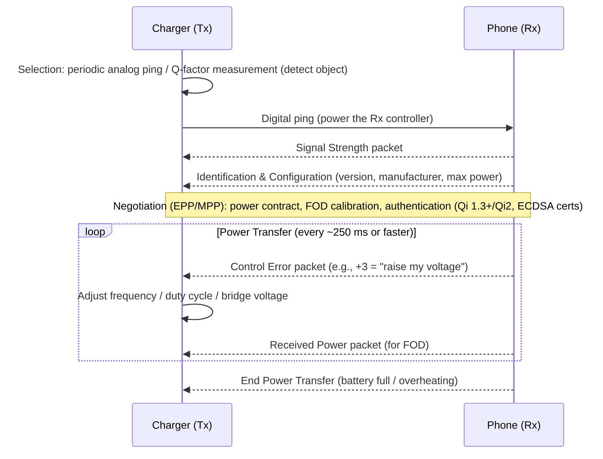

# How Wireless Charging Works

> **Level:** Advanced · **Related:** [NFC](nfc.md) · [Radio](radio.md) · [Sensors](../01-hardware/sensors-and-detectors.md)

## 1. Principle: electromagnetic induction

Wireless charging is a **transformer split in two**. A changing current in a transmitter coil creates a changing magnetic field; that field passes through a nearby receiver coil and **induces** a voltage (Faraday's law):

```
EMF = −N · dΦ/dt
```

```
  Charging pad (Tx)                               Phone (Rx)
  DC in → [Inverter: full/half bridge] → [Tx coil + Cs] ≈≈≈ magnetic flux ≈≈≈ [Rx coil + Cs] → [Synchronous rectifier] → [DC/DC or direct charger] → Battery
           ~100–205 kHz AC                  ferrite shield                        ferrite shield
```

Because the coils are not tightly coupled (air gap, alignment), only a fraction of Tx flux links the Rx coil — the **coupling coefficient** `k` is ~0.3–0.7 for Qi (vs ~0.99 in a real transformer).

## 2. Resonance: making loose coupling work

Both coils are paired with capacitors to form **LC resonant tanks** tuned to the operating frequency:

```
f₀ = 1 / (2π √(L·C))
```

At resonance the reactive impedance cancels, so a relatively small coupling can still transfer power efficiently. Link efficiency for resonant inductive coupling depends on the figure of merit `k·Q` (Q = coil quality factor):

```
η_max = (k²Q₁Q₂) / (1 + √(1 + k²Q₁Q₂))²
```

High-Q coils (low-resistance Litz wire, ferrite backing) and good alignment (high `k`) → 70–85% end-to-end efficiency for good Qi chargers (wired charging is ~90–95%).

Quick exploration in Python:

```python
import numpy as np
def eta_max(k, Q1, Q2):
    x = k**2 * Q1 * Q2
    return x / (1 + np.sqrt(1 + x))**2
for k in (0.2, 0.4, 0.6):
    print(f"k={k}: {eta_max(k, 80, 60):.1%}")
# k=0.2: ~87%, k=0.4: ~93%, k=0.6: ~95% (coil-to-coil only; add inverter, rectifier, charger losses)
```

## 3. The Qi standard (Wireless Power Consortium)

| Version | Year | Power | Highlights |
|---|---|---|---|
| Qi 1.x BPP | 2010 | 5 W | Baseline Power Profile |
| Qi 1.2/1.3 EPP | 2015–2021 | up to 15 W | Extended Power Profile, authentication (1.3) |
| **Qi2 (MPP)** | 2023 | 15 W | **Magnetic Power Profile** based on Apple MagSafe — magnet ring ensures alignment |
| **Qi2.2 / Qi2 25 W** | 2025 | 25 W | Higher power MPP |

Operating frequency ~87–205 kHz (MPP uses ~360 kHz). The magnetic alignment of Qi2 is the biggest practical improvement: misalignment was the main source of heat and slow charging.

## 4. Communication and control loop

The phone must tell the charger what it needs — without any extra radio. Qi uses the power link itself:

- **Rx → Tx: ASK backscatter (load modulation).** The receiver switches a capacitor/resistor in and out, changing the load. The transmitter senses changes in coil current/voltage (~2 kbit/s, bi-phase encoding) — the same trick as [NFC](nfc.md) tags.
- **Tx → Rx: FSK** — the transmitter slightly shifts its operating frequency (Qi 1.3+).



This is a closed-loop **PID-like control**: the receiver measures its rectified voltage and requests corrections; the transmitter adjusts by changing frequency (moving along the resonance curve), duty cycle, or input voltage.

## 5. Foreign Object Detection (FOD) — the safety core

A coin, key or foil between the coils absorbs energy via **eddy currents** and can heat to dangerous temperatures. Chargers detect this by:

1. **Q-factor measurement** before power transfer — metal lowers the Tx coil's Q and shifts resonance.
2. **Power loss accounting** during transfer: `P_loss = P_transmitted − P_received (reported by Rx)`. If loss exceeds a threshold (~few hundred mW, calibrated), stop.
3. **Temperature sensors** (NTCs) in both pad and phone — see [Sensors](../01-hardware/sensors-and-detectors.md).

## 6. Heat and efficiency trade-offs

- Losses: inverter switching, coil I²R (AC resistance ↑ with frequency — skin/proximity effect → **Litz wire**), eddy currents in nearby metal, rectifier, charger IC.
- Heat accelerates battery aging, so phones **throttle** wireless charging when warm (often > 35–40 °C) — why "15 W" chargers often deliver 5–10 W in practice.
- Glass/plastic backs are required (metal backs block/absorb flux); aluminum phones use a window.

## 7. Other wireless power technologies

| Technology | Range | Power | Principle | Examples |
|---|---|---|---|---|
| **Inductive (Qi)** | mm | 5–25 W (up to ~50 W proprietary) | Tight-ish magnetic coupling | Phones, earbuds |
| **Magnetic resonance** (AirFuel Resonant) | cm | up to ~50 W | 6.78 MHz, loose coupling, multi-device | Some laptops, furniture |
| **NFC Wireless Charging (WLC)** | ~1–2 cm | up to 1 W | 13.56 MHz via [NFC](nfc.md) | Styluses, rings, wearables |
| **Proprietary high-power** | mm | 50–80 W | Custom coils, voltage | Some Android flagships |
| **EV wireless (SAE J2954)** | 10–25 cm | 3.7–11 kW (up to 22+ kW) | 85 kHz resonant inductive | Parking-pad EV charging |
| **RF energy harvesting** | meters | µW–mW | Rectennas harvesting radio waves | Sensors, e-labels (AirFuel RF, Ossia, Powercast) |
| **Kitchen (Ki)** | mm | up to 2.2 kW | Induction | WPC Ki cordless kitchen appliances |

Reverse wireless charging ("PowerShare") turns a phone into a Tx to top up earbuds.

## 8. Observing it from the OS

- **Android**: `BatteryManager.EXTRA_PLUGGED == BATTERY_PLUGGED_WIRELESS`; `adb shell dumpsys battery` shows `Wireless powered: true`.
- **Linux** (laptops/phones with mainline kernels): power-supply class `/sys/class/power_supply/*/type` (`Wireless`), `upower -d`.
- **Windows**: battery status via `Get-CimInstance Win32_Battery` / `powercfg /batteryreport` (wireless-charging laptops are rare; the charger appears as a normal AC source).

```python
# Linux: list power supplies and whether any is wireless
from pathlib import Path
for ps in Path("/sys/class/power_supply").iterdir():
    t = (ps / "type").read_text().strip()
    online = (ps / "online").read_text().strip() if (ps / "online").exists() else "?"
    print(ps.name, t, "online=" + online)
```

## Further reading
- Wireless Power Consortium: Qi specification overview & Qi2 MPP docs
- Kurs et al., *Wireless Power Transfer via Strongly Coupled Magnetic Resonances* (Science, 2007)
- TI / NXP / Renesas application notes on Qi transmitter & receiver ICs
