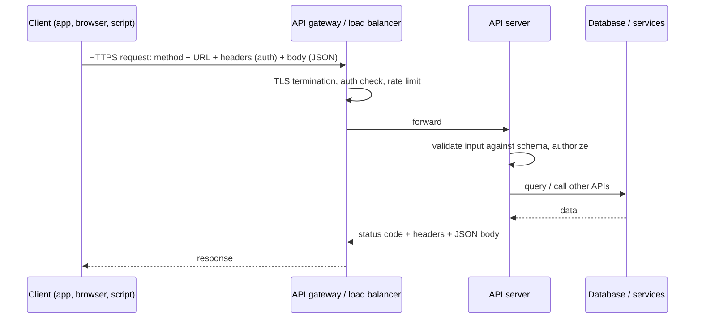

# How APIs Work

> **Level:** Advanced · **Related:** [Web Protocols](web-protocols.md) · [Web Server](web-server.md) · [OS (system calls)](../03-os-and-software/operating-system.md#7-system-calls-crossing-into-the-kernel) · [Software/Apps](../03-os-and-software/software-and-apps.md) · [LLMs](../07-ai/llm.md) · [Encryption](../06-security-and-data/encryption.md)

## 1. Definition

An **API (Application Programming Interface)** is a **contract** that lets one piece of software use another without knowing how it's implemented. It specifies:

1. **Operations** you can invoke (functions, endpoints, methods),
2. **Inputs and outputs** (types, formats, schemas),
3. **Behavior and errors** (what happens, what can fail),
4. **Rules** (authentication, rate limits, versioning, compatibility guarantees).

The implementation behind an API can change freely as long as the contract holds — that's the whole point: **abstraction and decoupling**.

## 2. APIs exist at every layer

| Layer | Example API | Mechanism |
|---|---|---|
| Hardware ↔ OS | Device registers, ACPI, UEFI services | MMIO, interrupts — see [Drivers](../03-os-and-software/drivers.md) |
| OS ↔ programs | Linux syscalls, **Win32 API**, POSIX | CPU trap instruction, DLL/shared-library calls |
| Library ↔ program | C++ STL, Python `requests`, OpenGL/Vulkan/Direct3D | Function calls (same process) |
| Language runtime | JNI, Python C API, Node-API | Foreign function interface |
| Process ↔ process | COM, D-Bus, gRPC over Unix sockets | IPC |
| Service ↔ service (network) | **REST, GraphQL, gRPC, WebSocket**, webhooks | [HTTP](web-protocols.md) + JSON/Protobuf |
| Browser ↔ page | DOM, `fetch`, Web Crypto, WebGPU | JavaScript bindings into the browser engine |

Everything from `printf` to a payment gateway is "an API"; what differs is **how the call crosses the boundary**.

## 3. Local APIs: function calls, ABIs and system calls

### 3.1 API vs ABI
- **API** = source-level contract (names, parameter types).
- **ABI** (Application *Binary* Interface) = machine-level contract: calling convention (which registers hold arguments), struct layout, name mangling, symbol versions. Breaking the ABI breaks already-compiled programs even if the API looks the same. See [Machine Code](../03-os-and-software/machine-code.md#6-calling-conventions-the-abi) and [Compilation](../03-os-and-software/code-compilation.md#9-linking).

### 3.2 Same function, two operating systems

```cpp
// Portable C++ API (the standard library) ...
#include <fstream>
std::ofstream("log.txt", std::ios::app) << "hello\n";

// ... is implemented on top of OS APIs:
// Linux (POSIX)
#include <fcntl.h>
#include <unistd.h>
int fd = open("log.txt", O_WRONLY | O_APPEND | O_CREAT, 0644);   // → openat syscall
write(fd, "hello\n", 6);                                           // → write syscall
close(fd);

// Windows (Win32)
#include <windows.h>
HANDLE h = CreateFileW(L"log.txt", FILE_APPEND_DATA, 0, nullptr, OPEN_ALWAYS, 0, nullptr);
DWORD n; WriteFile(h, "hello\n", 6, &n, nullptr);                  // → NtWriteFile in ntdll → kernel
CloseHandle(h);
```

Python wraps the same OS APIs (`open()` → CPython → C runtime → syscalls), and can call native APIs directly with `ctypes`:

```python
import ctypes, sys
if sys.platform == "win32":
    ctypes.windll.user32.MessageBoxW(None, "Called Win32 from Python", "API demo", 0)
else:
    libc = ctypes.CDLL(None); print("pid via libc:", libc.getpid())
```

## 4. Web APIs: the request/response model

A web API is a server exposing operations over [HTTP](web-protocols.md). A call is:



### 4.1 REST
**REST** (Representational State Transfer, Fielding 2000) models the API as **resources** identified by URLs, manipulated with HTTP methods:

| Operation | Request | Response |
|---|---|---|
| List | `GET /v1/orders?status=paid&limit=20` | `200` + array, pagination cursor |
| Read | `GET /v1/orders/123` | `200` or `404` |
| Create | `POST /v1/orders` + JSON body | `201 Created` + `Location` header |
| Replace / update | `PUT` / `PATCH /v1/orders/123` | `200` / `204` |
| Delete | `DELETE /v1/orders/123` | `204` |

Principles: stateless requests, uniform interface, cacheable `GET`s, meaningful status codes (`400` bad input, `401` unauthenticated, `403` forbidden, `409` conflict, `422` validation, `429` rate-limited, `5xx` server errors).

A REST API in **Python (FastAPI)** — types become validation *and* documentation:

```python
from fastapi import FastAPI, HTTPException
from pydantic import BaseModel, Field

app = FastAPI(title="Orders API", version="1.0")
class OrderIn(BaseModel):
    item: str = Field(min_length=1)
    quantity: int = Field(gt=0, le=100)
class Order(OrderIn):
    id: int

DB: dict[int, Order] = {}

@app.post("/v1/orders", response_model=Order, status_code=201)
def create_order(order: OrderIn):
    new = Order(id=len(DB) + 1, **order.model_dump()); DB[new.id] = new
    return new

@app.get("/v1/orders/{order_id}", response_model=Order)
def get_order(order_id: int):
    if order_id not in DB: raise HTTPException(404, "Order not found")
    return DB[order_id]
# uvicorn main:app  → interactive OpenAPI docs at http://127.0.0.1:8000/docs
```

The same in **Node.js (Express)**:

```js
import express from "express";
const app = express(); app.use(express.json());
const db = new Map();
app.post("/v1/orders", (req, res) => {
  const { item, quantity } = req.body ?? {};
  if (!item || !Number.isInteger(quantity) || quantity <= 0)
    return res.status(422).json({ error: "item and positive integer quantity required" });
  const order = { id: db.size + 1, item, quantity };
  db.set(order.id, order);
  res.status(201).location(`/v1/orders/${order.id}`).json(order);
});
app.get("/v1/orders/:id", (req, res) => {
  const o = db.get(Number(req.params.id));
  o ? res.json(o) : res.status(404).json({ error: "Order not found" });
});
app.listen(3000);
```

Calling it (client side, JavaScript):

```js
const res = await fetch("http://localhost:3000/v1/orders", {
  method: "POST",
  headers: { "Content-Type": "application/json", Authorization: `Bearer ${token}` },
  body: JSON.stringify({ item: "keyboard", quantity: 2 }),
});
if (!res.ok) throw new Error(`HTTP ${res.status}: ${await res.text()}`);
console.log(await res.json());
```

### 4.2 Other API styles

| Style | Transport & format | Strengths | Typical use |
|---|---|---|---|
| **REST** | HTTP + JSON | Simple, cacheable, universal | Public APIs |
| **GraphQL** | HTTP POST, one endpoint, query language | Client picks exact fields; one round trip for nested data | Complex front ends (GitHub API v4, Shopify) |
| **gRPC** | HTTP/2 + **Protocol Buffers** (binary) | Fast, strongly typed codegen, streaming | Microservices, mobile ↔ backend |
| **WebSocket / SSE** | Persistent connection | Real-time push | Chat, live dashboards, LLM token streaming |
| **Webhooks** | Server calls *your* HTTP endpoint on events | No polling | Payments ("payment succeeded"), GitHub events |
| **SOAP** | XML + WSDL | Formal contracts, WS-Security | Legacy enterprise/banking |
| **JSON-RPC** | JSON method calls | Minimal | Blockchain nodes, **MCP** (Model Context Protocol) |

GraphQL request:

```graphql
query {
  order(id: 123) { id status customer { name email } items { sku quantity } }
}
```

gRPC contract (`.proto`) — code is generated for C++, Python, JS, Go…:

```protobuf
syntax = "proto3";
service Orders {
  rpc GetOrder (GetOrderRequest) returns (Order);
  rpc WatchOrders (WatchRequest) returns (stream Order);   // server streaming
}
message GetOrderRequest { int64 id = 1; }
message Order { int64 id = 1; string item = 2; int32 quantity = 3; }
```

## 5. Describing APIs: specifications and schemas

- **OpenAPI** (formerly Swagger) — YAML/JSON description of REST endpoints, parameters, schemas, auth → generate docs, client SDKs, mocks, tests.
- **JSON Schema** — validates JSON payloads.
- **Protobuf / GraphQL SDL** — schema *is* the contract.
- **AsyncAPI** — for event-driven/message APIs.

```yaml
openapi: 3.1.0
info: { title: Orders API, version: "1.0" }
paths:
  /v1/orders/{id}:
    get:
      parameters: [{ name: id, in: path, required: true, schema: { type: integer } }]
      responses:
        "200": { description: OK, content: { application/json: { schema: { $ref: "#/components/schemas/Order" } } } }
        "404": { description: Not found }
```

## 6. Authentication & authorization

| Method | How | Notes |
|---|---|---|
| **API key** | `x-api-key: sk_live_…` header | Simple server-to-server; keep secret, rotate |
| **Bearer token / OAuth 2.0** | `Authorization: Bearer <access_token>` obtained via OAuth flows | Delegated access ("Sign in with Google", third-party apps); scopes limit permissions |
| **JWT** | Signed JSON token (`header.payload.signature`) the server can verify without a DB lookup | Validate `alg`, signature, `exp`, `aud`, `iss` |
| **mTLS** | Client presents a certificate | Service-to-service, banking |
| **HMAC request signing** | Sign method+path+body+timestamp with a secret | AWS SigV4, webhook signatures |

Verifying a webhook signature (Python) — constant-time compare, per [Encryption](../06-security-and-data/encryption.md#7-how-encryption-fails-its-rarely-the-math):

```python
import hmac, hashlib
def verify(secret: bytes, body: bytes, signature_hex: str) -> bool:
    expected = hmac.new(secret, body, hashlib.sha256).hexdigest()
    return hmac.compare_digest(expected, signature_hex)
```

**Authentication** = who you are; **authorization** = what you may do. The most common API vulnerability is **Broken Object Level Authorization** (OWASP API Top 10 #1): `GET /orders/124` returns someone else's order because the server checked login but not ownership.

## 7. Designing robust APIs

- **Versioning**: `/v1/…` in the path, or a header (`API-Version: 2026-01-01`); never break existing clients — add fields, don't remove/rename.
- **Pagination**: cursor-based (`?after=cursor`) scales better than offset.
- **Idempotency**: `PUT`/`DELETE` are idempotent; for `POST`, accept an `Idempotency-Key` header so retries don't double-charge.
- **Rate limiting**: token bucket per key; return `429` + `Retry-After`; clients retry with **exponential backoff + jitter**.
- **Errors**: consistent machine-readable bodies (RFC 9457 *Problem Details*: `type`, `title`, `status`, `detail`).
- **Timeouts** everywhere; **circuit breakers** for downstream calls.
- **Observability**: request IDs, structured logs, metrics (latency p95/p99, error rate), distributed tracing (OpenTelemetry).

A resilient client with retries (Python):

```python
import random, time, requests
def call_with_retry(method, url, max_attempts=5, **kw):
    for attempt in range(max_attempts):
        try:
            r = requests.request(method, url, timeout=10, **kw)
            if r.status_code not in (429, 500, 502, 503, 504):
                return r
            delay = float(r.headers.get("Retry-After", 0)) or (2 ** attempt)
        except (requests.ConnectionError, requests.Timeout):
            delay = 2 ** attempt
        time.sleep(delay + random.uniform(0, delay / 2))   # backoff with jitter
    raise RuntimeError(f"{method} {url} failed after {max_attempts} attempts")
```

## 8. AI APIs and tool calling

[LLM](../07-ai/llm.md) providers expose HTTP APIs (e.g., Anthropic's Messages API: `POST /v1/messages`), usually with **streaming via SSE**. LLMs can also *call* APIs: you describe tools with JSON Schema, the model returns a structured tool call, your code executes the real API request and returns the result. **MCP** (Model Context Protocol, JSON-RPC 2.0) standardizes how AI applications discover and call such tools.

## 9. Tooling

| Task | Tools |
|---|---|
| Manual calls | `curl`, HTTPie, Postman, Bruno, Insomnia; PowerShell `Invoke-RestMethod` |
| Inspect traffic | Browser DevTools → Network, mitmproxy, Fiddler (Windows), Wireshark |
| Docs & codegen | Swagger UI, Redoc, OpenAPI Generator, `protoc`, GraphiQL |
| Testing | pytest + `httpx`, Jest/Vitest + supertest, contract tests (Pact), k6 for load |
| Gateways | Kong, Envoy, NGINX, AWS API Gateway, Azure API Management |

```bash
curl -s -X POST http://localhost:3000/v1/orders -H 'Content-Type: application/json' \
     -d '{"item":"keyboard","quantity":2}' | jq
```

```powershell
Invoke-RestMethod -Method Post -Uri http://localhost:3000/v1/orders `
  -ContentType 'application/json' -Body '{"item":"keyboard","quantity":2}'
```

## Further reading
- Roy Fielding, *Architectural Styles and the Design of Network-based Software Architectures* (2000, ch. 5 REST)
- OpenAPI Specification 3.1; GraphQL spec; gRPC & Protocol Buffers docs
- OWASP API Security Top 10; RFC 6749 (OAuth 2.0), RFC 7519 (JWT), RFC 9457 (Problem Details)
- Microsoft REST API Guidelines; Google API Design Guide (AIP)
