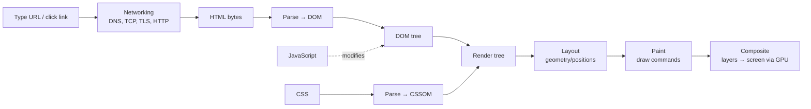

# How a Web Browser Works

> **Level:** Advanced · **Related:** [Web Protocols](web-protocols.md) · [DNS](dns.md) · [SSL/TLS](../06-security-and-data/ssl-tls.md) · [Software/Apps](../03-os-and-software/software-and-apps.md) · [GPU](../01-hardware/gpu.md) · [Code Compilation](../03-os-and-software/code-compilation.md)

## 1. What a browser is

A **web browser** is one of the most complex pieces of software most people run: it fetches untrusted content from anywhere on the internet, then parses, executes and renders it **safely** and **fast**. It's simultaneously a network client, a document renderer, a [JavaScript](../03-os-and-software/code-compilation.md#10-javascript-jit-compilation-in-v8) virtual machine, a [GPU](../01-hardware/gpu.md) application, and a security sandbox.

**Engines** (the core doing the work):

| Browser | Rendering engine | JS engine |
|---|---|---|
| Chrome, Edge, Brave, Opera | **Blink** | **V8** |
| Safari | **WebKit** | JavaScriptCore |
| Firefox | **Gecko** | SpiderMonkey |

(iOS historically required all browsers to use WebKit.)

## 2. The big picture: from URL to pixels



## 3. Multi-process architecture (why one tab can't crash the browser)

Modern browsers split work across OS [processes](../03-os-and-software/operating-system.md#4-processes-and-threads) for **security and stability**:

```
┌───────────── Browser (main) process ─────────────┐
│  UI, address bar, tabs, network, storage, policy  │
└───────────────────────┬───────────────────────────┘
        ┌───────────────┼───────────────┐
   Renderer process  Renderer process   GPU process
   (site A, sandboxed) (site B, sandboxed) (compositing)
        │                                    Network/Utility processes
   Blink + V8 per tab/site
```

- Each **renderer** runs a site's parsing, layout and JavaScript in a **locked-down sandbox** — it can't touch the filesystem or other sites directly; it asks the privileged browser process via IPC.
- **Site Isolation**: different sites get different processes, so one site's [renderer compromise](../06-security-and-data/malware.md) or a [Spectre-style](../01-hardware/cpu.md#speculation-and-its-security-cost) side channel can't read another site's data.
- A crashed tab takes down only its renderer.

## 4. Loading: the network phase

Typing a URL triggers the full [web-protocol](web-protocols.md) stack:

1. **URL parsing** — scheme, host, path; check HSTS (force HTTPS).
2. **[DNS](dns.md)** — resolve the hostname to an IP (with caches).
3. **TCP + [TLS](../06-security-and-data/ssl-tls.md)** handshake (or QUIC for HTTP/3).
4. **HTTP request/response** — with cookies, cache validation (`ETag`), compression (gzip/br) — see [Web Protocols §7](web-protocols.md#7-http-the-application-protocol).
5. **Response** — HTML arrives as a byte stream the parser consumes incrementally.

The browser aggressively **caches** (HTTP cache, memory cache), **preconnects/prefetches**, and starts parsing HTML **before** the whole document arrives.

## 5. Parsing: building the DOM and CSSOM

- **HTML → DOM**: the parser tokenizes HTML and builds the **DOM** (Document Object Model) — a tree of nodes. It's lenient (recovers from malformed markup) and **incremental**.
- **CSS → CSSOM**: stylesheets are parsed into the **CSS Object Model**; the browser computes which rules apply to each element (cascade, specificity, inheritance).
- **The blocking problem**: a plain `<script>` **pauses parsing** (it might `document.write`). Because a script can query styles, CSS can block scripts too. Fixes: `<script defer>` (run after parse, in order), `async` (run whenever ready), `<link rel="preload">`, and putting scripts at the end.

```html
<script src="app.js" defer></script>   <!-- doesn't block the parser; runs after DOM is ready -->
```

The **preload scanner** peeks ahead in the raw HTML to start fetching images/scripts/CSS even while the main parser is blocked.

## 6. Rendering: layout, paint, composite


1. **Style** — match CSS to DOM nodes → computed styles.
2. **Layout (reflow)** — compute the geometry of every box (the box model, flexbox, grid). Expensive; changing a size can cascade.
3. **Paint** — turn boxes into draw commands (fills, text, borders, images), grouped into **layers**.
4. **Composite** — the [GPU](../01-hardware/gpu.md) assembles layers, applying `transform`/`opacity`. Animating **only** compositor properties (`transform`, `opacity`) skips layout and paint → smooth 60+ fps.

**Performance implications developers care about:**
- **Reflows** (changing layout — width, font size, adding nodes) are costly and can cascade.
- **Repaints** (color changes) are cheaper; **composite-only** changes are cheapest.
- Reading layout properties (`offsetHeight`) after writing them forces **synchronous "layout thrashing"** — batch reads then writes.
- The browser aims to produce a frame every ~16 ms (60 Hz) via `requestAnimationFrame`.

## 7. The security model

The browser runs hostile code from every site you visit; isolation is everything.

- **Same-Origin Policy (SOP)**: script from origin `(scheme, host, port)` can't read data from another origin — the cornerstone. `https://a.com` ≠ `http://a.com` ≠ `https://a.com:8443`.
- **[CORS](web-protocols.md#9-caching-cookies-and-the-browser-security-model)**: servers opt in to cross-origin reads via `Access-Control-Allow-Origin`.
- **Cookies**: `HttpOnly` (hidden from JS), `Secure` (HTTPS only), `SameSite` (CSRF defense).
- **CSP** (Content-Security-Policy): restricts where scripts/styles/images may load from → mitigates **XSS**.
- **Sandbox + Site Isolation** (§3): renderers are OS-sandboxed; sites are process-isolated.
- **HTTPS/[TLS](../06-security-and-data/ssl-tls.md)**, HSTS, mixed-content blocking, Safe Browsing (malware/phishing lists), permission prompts (camera, location, notifications).

Common web attacks the model defends against: **XSS** (injecting scripts — CSP, output encoding), **CSRF** (forged requests — SameSite cookies, tokens), **clickjacking** (`X-Frame-Options`/`frame-ancestors`).

## 8. JavaScript execution

Each renderer embeds a JS engine ([V8](../03-os-and-software/code-compilation.md#10-javascript-jit-compilation-in-v8), etc.) that parses JS to bytecode, interprets it, and **JIT-compiles** hot functions to [machine code](../03-os-and-software/machine-code.md). JavaScript is **single-threaded** per page, driven by the **[event loop](../03-os-and-software/software-and-apps.md#7-concurrency-and-the-event-loop)**:

```js
console.log("1");                        // sync
setTimeout(() => console.log("4"), 0);   // macrotask
Promise.resolve().then(() => console.log("3"));  // microtask (runs before timers)
console.log("2");                        // → 1, 2, 3, 4
```

Heavy work goes to **Web Workers** (separate threads), **WebAssembly** (near-native [bytecode](../08-virtualization-and-cloud/virtual-machines.md#9-webassembly-the-modern-portable-vm)), and the GPU via **WebGL/WebGPU** (see [Computer Graphics §8](../02-graphics/computer-graphics.md#8-graphics-apis-and-platforms)). The DOM is not thread-safe, so only the main thread touches it.

## 9. What else lives in a browser

- **Storage**: cookies, `localStorage`/`sessionStorage`, **IndexedDB**, the Cache API — per-origin.
- **Rendering engine extras**: fonts (HarfBuzz shaping), images/video decode (often hardware-accelerated), PDF viewer, accessibility tree (for screen readers).
- **Web platform APIs**: `fetch`, WebSocket, [WebRTC](webrtc.md), Web Crypto, Geolocation, Notifications, Service Workers (offline/PWA), WebAuthn/passkeys, WebGPU.
- **Extensions** (WebExtensions API), devtools, sync, password manager, autofill.
- **Service Workers**: background scripts that intercept requests → offline apps, push, caching.

## 10. Developer tools

Every browser ships DevTools (F12) — indispensable for understanding the above live:

| Panel | Shows |
|---|---|
| **Elements** | Live DOM + computed CSS; edit and inspect the box model |
| **Network** | Every request: protocol (h2/h3), timing (DNS/TLS/TTFB), headers, size — see [Web Protocols](web-protocols.md) |
| **Console** | JS REPL, errors, logs |
| **Performance** | Flame chart of parse/layout/paint/scripting; find jank |
| **Application** | Cookies, storage, service workers, manifest |
| **Security** | [Certificate](../06-security-and-data/ssl-tls.md) and TLS details |
| **Lighthouse** | Automated performance/accessibility/SEO audit |

```bash
# Headless automation (testing, screenshots, scraping) — Chromium
chromium --headless --screenshot=page.png --window-size=1280,800 https://example.com
# Playwright / Puppeteer drive real browsers programmatically (JS/Python)
```

## 11. Performance model (what makes pages fast)

- **Critical rendering path**: minimize round trips, inline critical CSS, defer JS, compress and cache assets.
- **Core Web Vitals**: LCP (largest contentful paint), INP (interaction responsiveness), CLS (layout stability).
- Cheap animations (`transform`/`opacity`), lazy-load images, code-split JS, use HTTP/2–3 and a CDN.
- The renderer, network and GPU processes run in parallel; the goal is a steady 60+ fps and fast first paint.

## Further reading
- Tali Garsiel & Paul Irish, *How Browsers Work* (classic deep dive); web.dev "Inside look at modern web browser" (4-part series)
- Chromium design docs (Site Isolation, multi-process architecture); *High Performance Browser Networking* (hpbn.co)
- MDN Web Docs (rendering, event loop, security); the HTML Living Standard (parsing algorithm)
