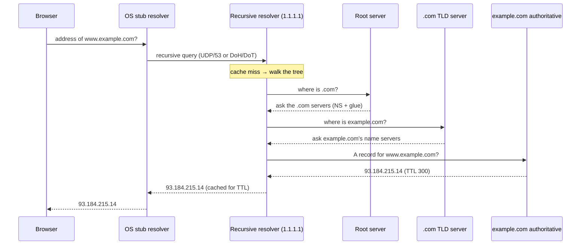

# How DNS Works

> **Level:** Advanced · **Related:** [Domains](domains.md) · [Web Protocols](web-protocols.md) · [Web Server](web-server.md) · [SSL/TLS](../06-security-and-data/ssl-tls.md) · [Proxy](proxy.md)

## 1. What DNS is

The **Domain Name System** is the internet's distributed directory that translates human-friendly **names** (`example.com`) into the **numbers** computers route with — [IP addresses](web-protocols.md#3-ip-addressing-and-routing) like `93.184.215.14` or `2606:2800:21f:cb07::1` — plus other records (mail servers, text, service locations). It's a globally distributed, hierarchical, cached database that answers billions of queries per second, usually in milliseconds.

DNS is what makes the web usable: you remember names, DNS supplies the addresses. It also decouples names from servers, so a site can move to new IPs, use a CDN, or load-balance without changing its name.

## 2. The hierarchy: a tree of authority

A domain name is read **right to left**, each dot a level of the tree:

```
                         . (root)
                         │
        ┌────────────────┼─────────────────┐
      com (TLD)        org               country: uk, de, ...
        │
     example (second-level domain — what you register)
        │
      www, mail, api  (subdomains / hosts)
```

`www.example.com.` (note the trailing dot = the root). Each level **delegates** authority to the level below via **NS (name server) records** — nobody holds the whole database; each zone knows only its own records and where to find its children.

| Tier | Who runs it | Knows |
|---|---|---|
| **Root servers** (13 logical, `a`–`m`, anycast to 1000s) | IANA/operators | Where every TLD's servers are |
| **TLD servers** (`.com`, `.org`, `.uk`…) | Registries (Verisign for `.com`, etc.) | Which name servers are authoritative for each registered domain |
| **Authoritative servers** | The domain owner / their DNS host | The actual records for the zone |

See [Domains](domains.md) for how registration and delegation are set up.

## 3. Resolving a name, step by step

Your device runs a **stub resolver** that asks a **recursive resolver** (your ISP's, or `1.1.1.1`, `8.8.8.8`), which does the legwork:



- The resolver's query is **recursive** ("get me the final answer"); its queries up the tree are **iterative** ("tell me who to ask next" → referrals).
- **Glue records**: if `example.com`'s name server is `ns1.example.com`, the `.com` server must also return that name server's IP, or you'd loop forever.

## 4. Caching and TTL — why DNS is fast

Every record has a **TTL (Time To Live)** in seconds. Resolvers, the OS, and browsers cache answers until the TTL expires, so most lookups never touch the root. This is the core of DNS's scalability — and its main gotcha: **changes propagate slowly**. Lower a record's TTL (e.g., to 300 s) a day *before* a planned IP change so caches expire quickly.

Caching layers a query may hit before reaching a resolver: browser cache → OS cache → local resolver → recursive resolver.

## 5. Record types

| Type | Purpose | Example value |
|---|---|---|
| **A** | IPv4 address | `93.184.215.14` |
| **AAAA** | IPv6 address | `2606:2800:21f:cb07::1` |
| **CNAME** | Alias to another name | `www → example.com.` (can't coexist with other records at the same name) |
| **MX** | Mail servers (with priority) | `10 mail.example.com.` |
| **TXT** | Arbitrary text | SPF, DKIM, domain verification |
| **NS** | Delegates a zone to name servers | `ns1.dnshost.com.` |
| **SOA** | Zone metadata (serial, refresh, TTLs) | one per zone |
| **PTR** | Reverse: IP → name | in `in-addr.arpa` / `ip6.arpa` |
| **SRV** | Service location (host+port) | SIP, XMPP, Minecraft |
| **CAA** | Which CAs may issue [certificates](../06-security-and-data/ssl-tls.md) | `0 issue "letsencrypt.org"` |
| **HTTPS/SVCB** | Advertise HTTP/3 (ALPN), ECH keys, hints | speeds up connection setup |

Email relies heavily on TXT: **SPF** (allowed senders), **DKIM** (signing key), **DMARC** (policy) — see [Domains §6](domains.md#6-email-and-a-domain).

## 6. Transport: the wire protocol

- Traditionally **UDP port 53** (fast, one packet each way); falls back to **TCP 53** for large responses (or zone transfers).
- **EDNS0** extends the old 512-byte UDP limit and carries flags (like client-subnet).
- Classic DNS is **unencrypted and unauthenticated** → eavesdropping and tampering are possible. Modern privacy/security:

| Tech | What it protects | Port/transport |
|---|---|---|
| **DoT** (DNS over TLS) | Confidentiality | TCP 853 |
| **DoH** (DNS over HTTPS) | Confidentiality, blends with web traffic | HTTPS 443 |
| **DoQ** (DNS over QUIC) | Confidentiality, low latency | QUIC/UDP 853 |
| **DNSSEC** | **Integrity/authenticity** (signs records; does *not* encrypt) | Any |

**DNSSEC** builds a chain of cryptographic signatures (RRSIG/DNSKEY/DS records) from the root down, so a resolver can verify an answer wasn't forged — defending against **cache poisoning** (injecting fake answers, e.g., the Kaminsky attack).

## 7. Querying DNS yourself

```bash
# Linux / macOS
dig example.com A +short
dig example.com MX
dig +trace example.com            # watch the full root → TLD → authoritative walk
dig @1.1.1.1 example.com          # query a specific resolver
dig -x 93.184.215.14              # reverse (PTR) lookup
host example.com ; nslookup example.com

# Manage the OS cache / resolver (systemd-resolved)
resolvectl query example.com
resolvectl flush-caches
cat /etc/resolv.conf              # configured resolvers
```

```powershell
# Windows
Resolve-DnsName example.com -Type AAAA
Resolve-DnsName example.com -Server 8.8.8.8
nslookup -type=MX example.com
ipconfig /displaydns             # view cache
ipconfig /flushdns               # clear cache
Get-DnsClientServerAddress       # configured resolvers
```

Programmatically — Python and JavaScript:

```python
import socket
print(socket.gethostbyname("example.com"))                 # simple A lookup
print(socket.getaddrinfo("example.com", 443, proto=socket.IPPROTO_TCP))  # A + AAAA
# richer records: pip install dnspython
import dns.resolver
for r in dns.resolver.resolve("example.com", "MX"):
    print(r.preference, r.exchange)
```

```js
import { promises as dns } from "node:dns";
console.log(await dns.resolve4("example.com"));            // A records
console.log(await dns.resolveMx("example.com"));           // mail servers
// Browsers can't do raw DNS, but can call a DoH JSON endpoint:
const r = await fetch("https://cloudflare-dns.com/dns-query?name=example.com&type=A",
  { headers: { accept: "application/dns-json" } });
console.log((await r.json()).Answer);
```

## 8. DNS as infrastructure glue

Beyond name→IP, DNS powers a lot of internet plumbing:
- **CDNs & load balancing**: return different IPs based on the client's location/health, or use short TTLs to shift traffic.
- **Service discovery**: SRV records, and internal DNS in Kubernetes (`service.namespace.svc.cluster.local`), Consul, `.local` mDNS.
- **Failover**: health-checked records swap to backups.
- **Verification**: prove domain ownership by adding a TXT record ([SSL certificates](../06-security-and-data/ssl-tls.md), Google/Microsoft services).
- **Blocking/filtering**: Pi-hole and NextDNS block ads/malware by refusing to resolve certain names.

## 9. Security threats

| Threat | Mechanism | Defense |
|---|---|---|
| **Cache poisoning / spoofing** | Inject forged answers into a resolver | DNSSEC, source-port randomization, DoT/DoH |
| **DNS hijacking** | Compromise registrar/account or router settings | Registrar lock, 2FA, monitor NS changes |
| **DDoS** (amplification) | Small query → large response reflected at a victim | Rate limiting, RRL, anycast capacity |
| **DNS tunneling** | Smuggle data in DNS queries (exfiltration/C2) | Monitor query volume/entropy — see [Malware](../06-security-and-data/malware.md#7-command-and-control-c2) |
| **Typosquatting** | Register look-alike domains | Brand monitoring, user vigilance |

## Further reading
- RFC 1034/1035 (DNS concepts and format), RFC 4033–4035 (DNSSEC), RFC 8484 (DoH), RFC 7858 (DoT)
- Cricket Liu & Paul Albitz, *DNS and BIND*
- Cloudflare Learning Center "What is DNS?"; `dig`/`resolvectl` manual pages
