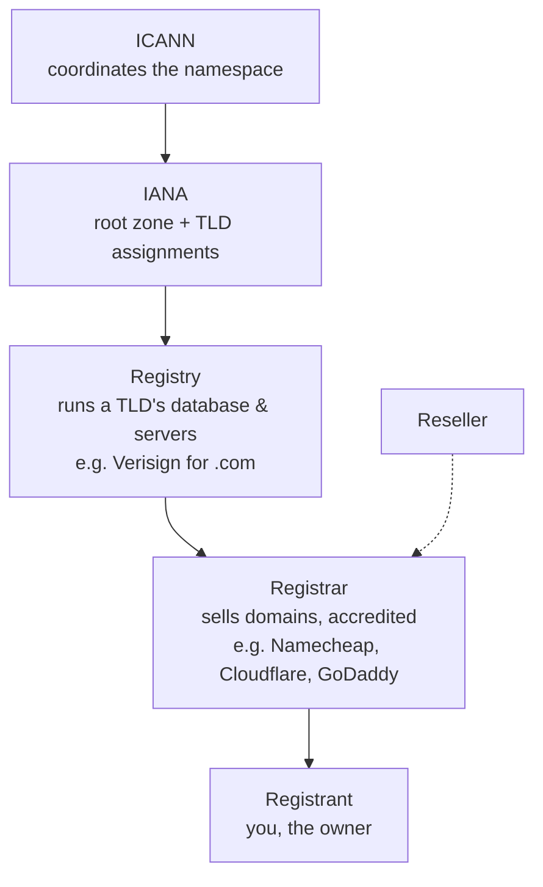

# How Domains Work

> **Level:** Advanced · **Related:** [DNS](dns.md) · [Web Protocols](web-protocols.md) · [Web Server](web-server.md) · [SSL/TLS](../06-security-and-data/ssl-tls.md) · [VPS](../08-virtualization-and-cloud/vps.md)

## 1. What a domain is

A **domain name** is a human-readable, globally unique address you **register** and control (`example.com`), which the [DNS](dns.md) system maps to servers. Registering a domain gives you the exclusive right to use that name and to publish DNS records under it — the foundation for a website, email, and any named internet service.

Two things are easy to confuse:
- **Domain** = the *name* and the right to control its records (a rental, renewed yearly).
- **[DNS](dns.md)** = the *system* that resolves that name to IP addresses at query time.

This page covers ownership, structure and registration; [DNS](dns.md) covers resolution.

## 2. Anatomy of a domain name

```
        https://blog.shop.example.co.uk:443/path
                 └─┬─┘ └┬─┘ └──┬──┘└─┬─┘
              subdomain │   2nd-level  │
                  host  │    domain    └── TLD (public suffix: "co.uk")
                        └── more subdomains
```

Read **right to left**, each label is a level in the [DNS hierarchy](dns.md#2-the-hierarchy-a-tree-of-authority):

| Part | Example | Meaning |
|---|---|---|
| **Root** | `.` (implicit trailing dot) | Top of the tree |
| **TLD** (Top-Level Domain) | `.com`, `.org`, `.io`, `.uk` | Managed by a **registry** |
| **Second-level domain** | `example` | What you register |
| **Subdomain** | `blog`, `www`, `api` | You create freely under your domain |
| **FQDN** | `blog.example.com.` | Fully Qualified Domain Name |

**TLD types:**
- **gTLD** (generic): `.com`, `.org`, `.net`, `.info`, plus hundreds of newer ones (`.app`, `.dev`, `.xyz`).
- **ccTLD** (country-code): `.uk`, `.de`, `.jp`, `.io` (assigned to countries; some marketed globally).
- **Sponsored/restricted**: `.gov`, `.edu`, `.mil` (eligibility rules).

The **Public Suffix List** defines where "the part you can register" begins — `example.co.uk` (not `co.uk`), important for cookie scoping and certificate rules.

## 3. Who runs the domain name system (governance)



- **ICANN** oversees the global namespace and accredits registrars.
- **Registry** operates a TLD (the authoritative database for all `.com` names).
- **Registrar** is who you buy from; they push your registration to the registry.
- **Registrant** = you. Your info is recorded (WHOIS/RDAP), usually behind **privacy protection** now.

## 4. Registering and pointing a domain

```mermaid
sequenceDiagram
  participant You
  participant Reg as Registrar
  participant Registry
  participant DNS as Your DNS host
  You->>Reg: Search & buy example.com (yearly fee)
  Reg->>Registry: Register; set name servers (NS)
  Registry-->>Registry: .com zone now delegates example.com → your NS
  You->>DNS: Create records (A/AAAA → server IP, MX → mail, ...)
  Note over You,DNS: Now the world can resolve example.com to your server
```

The critical link is **NS records**: at the registrar you set which **name servers** are authoritative for your domain (your registrar's, a DNS host like Cloudflare/Route 53, or your own). The [TLD registry](dns.md#2-the-hierarchy-a-tree-of-authority) then delegates queries to them. You manage the actual records there — see [DNS §5](dns.md#5-record-types).

Minimal setup to put a site live on a [VPS](../08-virtualization-and-cloud/vps.md):

```
example.com.      A      203.0.113.10        # apex → server IPv4
example.com.      AAAA   2001:db8::10        # server IPv6
www.example.com.  CNAME  example.com.        # www alias
```

(The **apex/root** domain can't be a CNAME per the standard; providers offer "ALIAS/ANAME/CNAME flattening" to point the apex at a CDN.)

## 5. Ownership lifecycle

| Stage | Meaning |
|---|---|
| **Available** | Unregistered — anyone can buy |
| **Active** | Registered; renew yearly (up to 10 years) |
| **Expired → Grace** | Missed renewal; usually reclaimable |
| **Redemption** | Costly recovery period before release |
| **Released** | Back to available (drop-catchers may grab valuable ones) |

Protections worth enabling:
- **Auto-renew** — losing a domain is catastrophic (email and site die).
- **Registrar lock** (`clientTransferProhibited`) — blocks unauthorized transfers.
- **2FA** on the registrar account — domain theft usually starts with account compromise.
- **WHOIS privacy** — hides personal contact details.
- **DNSSEC** — sign your zone ([DNS §6](dns.md#6-transport-the-wire-protocol)).

**Transfers** between registrars use an **auth/EPP code** and a 60-day post-registration lock.

## 6. Email and a domain

Owning a domain lets you run `you@example.com`. Email depends on DNS records that also prevent spoofing:

| Record | Role |
|---|---|
| **MX** | Where mail for the domain is delivered |
| **SPF** (TXT) | Which servers may send as your domain |
| **DKIM** (TXT) | Public key to verify message signatures |
| **DMARC** (TXT) | Policy for failures + reporting |

Misconfigured SPF/DKIM/DMARC is the top reason legitimate mail lands in spam — and their absence lets attackers spoof your domain (see [Malware §3](../06-security-and-data/malware.md#3-initial-access-how-it-gets-in)).

## 7. Domains, HTTPS and identity

- A **TLS certificate** is issued *for a domain name*; the CA verifies you control the domain (e.g., by a DNS TXT challenge or HTTP file) before issuing — see [SSL/TLS §4](../06-security-and-data/ssl-tls.md#4-certificates-and-the-chain-of-trust).
- **SNI** in the TLS handshake tells the server which domain you want, so one IP can host many HTTPS sites — see [Web Protocols §6](web-protocols.md#6-tls-13-encryption-and-identity).
- The domain is also the **security origin** for browsers (same-origin policy, cookie scope) — see [Browser §7](browser.md#7-the-security-model).

## 8. Internationalized domains and special cases

- **IDN**: non-ASCII names (`münchen.de`, `例え.jp`) are encoded to ASCII **Punycode** (`xn--...`) for DNS. Beware **homograph attacks** (look-alike Unicode letters used for phishing).
- **New gTLD land rush**: hundreds of TLDs since 2013; some (`.zip`, `.mov`) overlap with file extensions, creating confusion/phishing risk.
- **Subdomains vs paths**: `blog.example.com` (separate DNS host, can point anywhere) vs `example.com/blog` (same server, a route) — an architecture choice.

## 9. Inspecting domains

```bash
whois example.com                 # registrar, dates, name servers (or use RDAP)
dig NS example.com +short         # authoritative name servers
dig SOA example.com               # zone serial & timers
# RDAP (modern structured WHOIS)
curl -s https://rdap.org/domain/example.com | jq '.events, .nameservers'
```

```powershell
# Windows
Resolve-DnsName example.com -Type NS
nslookup -type=soa example.com
```

## 10. Practical checklist

1. Pick a memorable name + appropriate TLD; check trademarks.
2. Register with a reputable registrar; enable **auto-renew, lock, 2FA, WHOIS privacy**.
3. Point **NS** to your DNS host; add **A/AAAA/CNAME** for the site, **MX/SPF/DKIM/DMARC** for mail.
4. Get a [TLS certificate](../06-security-and-data/ssl-tls.md) (usually automatic via Let's Encrypt).
5. Set a **CAA** record; consider **DNSSEC**.
6. Keep contact email off the domain itself (so a DNS outage doesn't lock you out of recovery).

## Further reading
- ICANN "Registrant Rights and Responsibilities"; IANA Root Zone Database
- Public Suffix List (publicsuffix.org); RFC 5890–5894 (IDNA), RFC 7480+ (RDAP)
- Your registrar/DNS host's documentation (Cloudflare, Route 53, Namecheap)
