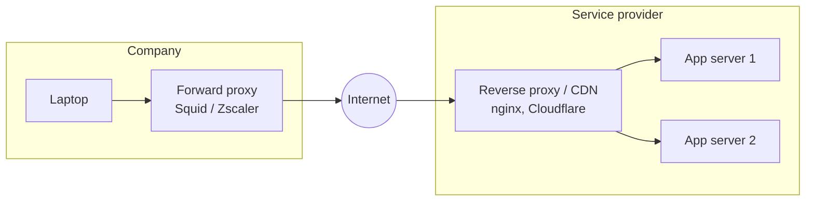
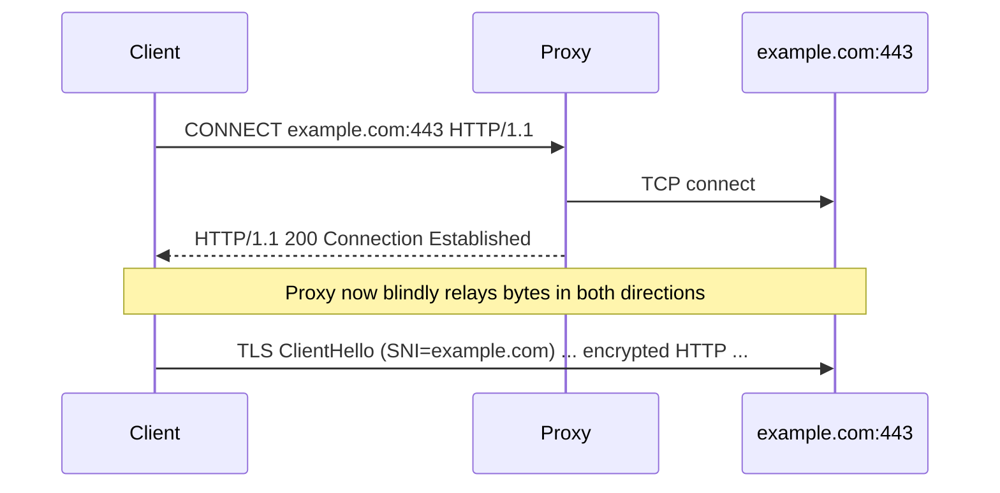

# How a Proxy Works

> **Level:** Advanced · **Related:** [VPN](vpn.md) · [Web Server](web-server.md) · [Web Protocols](web-protocols.md) · [Encryption](../06-security-and-data/encryption.md)

## 1. Definition

A **proxy** is an intermediary that receives a client's request, then makes a (possibly modified) request **on the client's behalf** to the destination, and relays the response back. The destination sees the proxy, not the client (unless headers reveal it).

```
Direct:     Client ─────────────────────────────▶ Server
Proxied:    Client ──▶ [ Proxy ] ──▶ Server        (two separate connections)
```

Unlike a router (which forwards packets), a proxy usually **terminates** the client's connection at the application or session layer and opens a **new** connection.

## 2. Types by position and purpose

| Type | Who configures it | Acts for | Typical uses |
|---|---|---|---|
| **Forward proxy** | Client (browser/OS settings, PAC file) | Clients | Corporate egress control, caching, content filtering, anonymity, geo-access |
| **Reverse proxy** | Server operator | Servers | TLS termination, load balancing, caching (CDN), WAF, compression — see [Web Server](web-server.md) |
| **Transparent (intercepting) proxy** | Network admin (traffic redirected by router/firewall) | Clients, without their config | ISP caches, captive portals, school/corporate filtering |
| **Open proxy** | Anyone on the internet | Anyone | Often abused; security risk |



## 3. Protocol-level mechanics

### 3.1 HTTP forward proxy — plain HTTP
The client sends the **absolute URI** to the proxy:

```http
GET http://example.com/page.html HTTP/1.1
Host: example.com
Proxy-Authorization: Basic dXNlcjpwYXNz
```

The proxy parses it, may check its cache or policy, connects to `example.com:80`, forwards `GET /page.html`, and relays the response. It can read and modify everything (it's plain HTTP).

### 3.2 HTTPS through a forward proxy — the CONNECT tunnel



The proxy sees only the destination host (and SNI), not URLs or content — unless it performs **TLS interception** (next section).

### 3.3 SOCKS5 (RFC 1928)
A generic **session-layer** proxy for any TCP (and UDP via `UDP ASSOCIATE`) traffic:

```
Client → Proxy: greeting [ver=5, methods: no-auth / user-pass]
Proxy  → Client: chosen method
Client → Proxy: CONNECT request [ATYP: IPv4 / domain / IPv6, address, port]
Proxy  → Client: reply [success, bound address]  → then raw relaying
```

Used by SSH dynamic forwarding (`ssh -D 1080 user@host`), Tor (`127.0.0.1:9050`), and many clients. Using the domain-name ATYP lets DNS resolution happen at the proxy (`socks5h://` in curl) — avoiding **DNS leaks**.

### 3.4 TLS-intercepting proxies (MITM by design)
Enterprise security gateways (Zscaler, Palo Alto, Blue Coat), antivirus "web shields", and debugging tools (Fiddler, mitmproxy, Charles, Burp Suite) **decrypt HTTPS**:

1. Client connects; proxy generates a **fake certificate** for `example.com` on the fly, signed by the proxy's own CA.
2. The proxy's CA certificate must be installed as trusted on the client (via GPO/MDM on corporate devices).
3. Proxy opens its own TLS connection to the real server, and inspects plaintext in the middle.

Pinning apps (banking, some mobile apps) reject such certificates. Certificate Transparency and pinning exist partly to detect unauthorized interception. Ethically/legally, only intercept traffic you are authorized to inspect.

## 4. What proxies do in practice

- **Caching** (Squid, Varnish, CDNs): serve repeated content locally, respecting `Cache-Control`.
- **Access control & filtering**: URL categories, malware scanning, DLP.
- **Anonymity/privacy**: hide client IP (but a single proxy operator sees everything; **Tor** uses 3 layered relays so no single node knows both ends — "onion routing").
- **Load balancing & TLS termination** (reverse).
- **Protocol translation**: HTTP/3 at the edge ↔ HTTP/1.1 to origin; gRPC-Web bridging.
- **API gateways**: auth, rate limiting, request transformation (Kong, Envoy, AWS API Gateway).
- **Service mesh sidecars**: Envoy next to each microservice for mTLS, retries, observability (Istio, Linkerd).

## 5. Headers that reveal the chain

| Header | Meaning |
|---|---|
| `X-Forwarded-For: client, proxy1` | Original client IP chain (de facto) |
| `X-Forwarded-Proto: https` | Original scheme |
| `Forwarded: for=192.0.2.60;proto=https;by=203.0.113.43` | Standard version (RFC 7239) |
| `Via: 1.1 squid` | Proxies traversed |

Servers must only trust these headers from **known proxies** — otherwise clients can spoof their IP.

## 6. Configuring proxies

**Windows**
- System-wide (WinINET, used by Edge/Chrome/most apps): Settings → Network & internet → Proxy; or PAC/WPAD auto-detect.
- WinHTTP (services, Windows Update): `netsh winhttp show proxy`, `netsh winhttp import proxy source=ie`.
- Registry: `HKCU\Software\Microsoft\Windows\CurrentVersion\Internet Settings` (`ProxyEnable`, `ProxyServer`).
- PowerShell: `[System.Net.WebRequest]::DefaultWebProxy`; `$env:HTTPS_PROXY` for many CLI tools.

**Linux**
- Environment variables honored by most CLI tools: `http_proxy`, `https_proxy`, `no_proxy`, `all_proxy` (e.g., `socks5h://127.0.0.1:1080`).
- GNOME: Settings → Network → Proxy (`gsettings get org.gnome.system.proxy mode`); KDE equivalent.
- APT: `/etc/apt/apt.conf.d/95proxy` → `Acquire::https::Proxy "http://proxy:3128";`
- Transparent proxying: `iptables -t nat -A PREROUTING -p tcp --dport 80 -j REDIRECT --to-port 3128` or nftables/TPROXY.

**PAC file** (JavaScript!) — browsers call `FindProxyForURL` for each request:

```js
function FindProxyForURL(url, host) {
  if (isPlainHostName(host) || dnsDomainIs(host, ".corp.local")) return "DIRECT";
  if (shExpMatch(host, "*.example-video.com")) return "PROXY video-proxy:8080";
  return "PROXY proxy.corp.local:3128; DIRECT";   // fallback chain
}
```

## 7. Code: using and building proxies

**Using a proxy — Python:**

```python
import requests
proxies = {"http": "http://proxy.local:3128", "https": "http://proxy.local:3128"}
print(requests.get("https://api.ipify.org?format=json", proxies=proxies, timeout=10).json())
# SOCKS (pip install requests[socks]); socks5h = resolve DNS at the proxy
print(requests.get("https://api.ipify.org", proxies={"https": "socks5h://127.0.0.1:9050"}).text)
```

**Using a proxy — Node.js (undici, built into Node's fetch):**

```js
import { ProxyAgent, setGlobalDispatcher } from "undici";
setGlobalDispatcher(new ProxyAgent("http://proxy.local:3128"));
console.log(await (await fetch("https://api.ipify.org?format=json")).json());
```

**A minimal forward proxy with CONNECT support — Python asyncio:**

```python
import asyncio

async def pipe(reader, writer):
    try:
        while data := await reader.read(65536):
            writer.write(data); await writer.drain()
    finally:
        writer.close()

async def handle(client_r, client_w):
    head = await client_r.readuntil(b"\r\n\r\n")
    method, target, _ = head.split(b"\r\n")[0].decode().split(" ", 2)
    if method == "CONNECT":                                   # HTTPS tunnel
        host, port = target.rsplit(":", 1)
        up_r, up_w = await asyncio.open_connection(host, int(port))
        client_w.write(b"HTTP/1.1 200 Connection Established\r\n\r\n")
    else:                                                     # plain HTTP: absolute URI
        from urllib.parse import urlsplit
        u = urlsplit(target)
        up_r, up_w = await asyncio.open_connection(u.hostname, u.port or 80)
        path = (u.path or "/") + (f"?{u.query}" if u.query else "")
        up_w.write(head.replace(target.encode(), path.encode(), 1))
    await client_w.drain()
    await asyncio.gather(pipe(client_r, up_w), pipe(up_r, client_w))

async def main():
    server = await asyncio.start_server(handle, "127.0.0.1", 8888)
    async with server: await server.serve_forever()

asyncio.run(main())
# Test: curl -x http://127.0.0.1:8888 https://example.com
```

(Production proxies add auth, ACLs, timeouts, connection limits, logging, and header sanitizing.)

## 8. Proxy vs VPN vs NAT

| | Proxy | [VPN](vpn.md) | NAT router |
|---|---|---|---|
| Layer | Application (HTTP) or session (SOCKS) | Network (IP packets) | Network |
| Scope | Per-app / per-protocol configured traffic | All traffic of the device (or split) | All traffic through the router |
| Encryption client→proxy | Not inherent (HTTP proxy is plaintext; HTTPS inside CONNECT is still end-to-end TLS) | Yes (tunnel encrypted) | No |
| Sees content | Yes for HTTP; only host for HTTPS (unless intercepting) | Sees destination IPs; content if not TLS | Headers only |

## Further reading
- RFC 9110 §9.3.6 (CONNECT), RFC 1928 (SOCKS5), RFC 7239 (Forwarded)
- Squid, HAProxy, Envoy, mitmproxy documentation
- Tor Project design paper: *Tor: The Second-Generation Onion Router*
