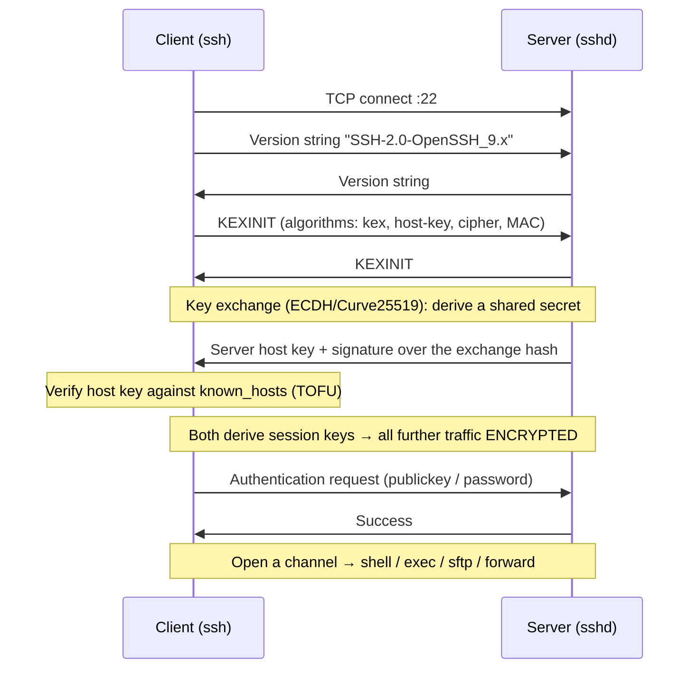
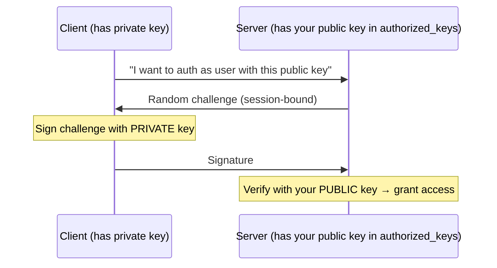
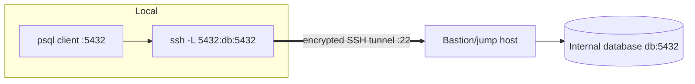

# How SSH Works

> **Level:** Advanced · **Related:** [Encryption](../06-security-and-data/encryption.md) · [VPN](vpn.md) · [Proxy](proxy.md) · [VPS](../08-virtualization-and-cloud/vps.md) · [Web Protocols](web-protocols.md) · [OS](../03-os-and-software/operating-system.md)

## 1. What SSH is

**SSH (Secure Shell)** is a protocol for **secure remote access and secure channels over an untrusted network**. Its most visible use is logging into a remote machine's command line, but it also does file transfer (SCP/SFTP), port forwarding/tunneling, and acts as the transport for tools like `git`, `rsync` and Ansible. It replaced insecure predecessors (Telnet, rlogin, FTP) that sent passwords and data in cleartext.

Three guarantees, all from cryptography ([Encryption](../06-security-and-data/encryption.md)):
1. **Confidentiality** — traffic is encrypted.
2. **Integrity** — tampering is detected.
3. **Authentication** — *both* the server (so you're not talking to an impostor) and the client (so only authorized users get in) prove their identity.

Standardized as **SSH-2** (RFC 4251–4254); the original SSH-1 is broken and disabled everywhere. The reference implementation is **OpenSSH**.

## 2. The protocol stack

SSH runs over a single TCP connection (default **port 22**) in three layered protocols:

```
┌──────────────────────────────────────────────────────────┐
│ Connection protocol (RFC 4254)                           │
│   multiplexes CHANNELS: shell, exec, sftp, port-forwards │
├──────────────────────────────────────────────────────────┤
│ User authentication protocol (RFC 4252)                  │
│   proves who the client is (key, password, ...)          │
├──────────────────────────────────────────────────────────┤
│ Transport layer protocol (RFC 4253)                      │
│   key exchange, server auth, encryption, integrity, MAC  │
├──────────────────────────────────────────────────────────┤
│ TCP (port 22)                                            │
└──────────────────────────────────────────────────────────┘
```

## 3. Connection setup, step by step



### 3.1 Key exchange & server authentication
- **Key exchange** (usually **ECDH with Curve25519**, or post-quantum hybrids like `sntrup761x25519` / `mlkem768x25519` in recent OpenSSH) produces a **shared session secret** without ever sending it — see [Diffie–Hellman](../06-security-and-data/encryption.md#43-diffiehellman-key-exchange). From it, symmetric keys are derived for encryption (**ChaCha20-Poly1305** or **AES-GCM**) and integrity.
- The server signs the exchange hash with its **host key** private key, proving it holds the matching private key for the public key it presents.

### 3.2 The host key and "Trust On First Connect" (TOFU)
The first time you connect, SSH shows the server's host-key fingerprint and asks you to accept it; it's then stored in `~/.ssh/known_hosts`. On later connections, a mismatch triggers the loud **"REMOTE HOST IDENTIFICATION HAS CHANGED!"** warning — which catches man-in-the-middle attacks (or a legitimately rebuilt server).

```
The authenticity of host 'server (1.2.3.4)' can't be established.
ED25519 key fingerprint is SHA256:oIyR0J2v...   ← verify this out-of-band the first time!
Are you sure you want to continue connecting (yes/no/[fingerprint])?
```

Stronger than TOFU: **SSH certificates** (a trusted CA signs host and user keys, so no `known_hosts` sprawl and no per-user key distribution — how large fleets do it).

## 4. Client authentication methods

| Method | How | Notes |
|---|---|---|
| **Public key** | Client proves it holds the private key matching an authorized public key | **Recommended**; no secret sent over the wire |
| Password | Sent over the encrypted channel | Convenient but brute-forceable; disable on servers |
| Keyboard-interactive | Challenge/response, often **2FA/TOTP** (via PAM) | Layered with keys for high security |
| Host-based | The client *machine* authenticates | Trusted clusters |
| GSSAPI/Kerberos | Enterprise SSO | Corporate/AD environments |

### Public-key authentication in detail
You generate a **key pair**; the **public** key goes on the server (in `~/.ssh/authorized_keys`), the **private** key stays on your machine (ideally in an agent or hardware token).



The private key never leaves your device; the signature proves possession without revealing it.

## 5. Keys in practice

```bash
# Generate a modern key pair (Ed25519 — fast, small, secure)
ssh-keygen -t ed25519 -C "me@laptop"
#   → ~/.ssh/id_ed25519  (PRIVATE — never share)  and  id_ed25519.pub (public)

# Install your public key on a server (appends to ~/.ssh/authorized_keys)
ssh-copy-id user@server        # or paste id_ed25519.pub into the server file manually

ssh user@server                # log in (key used automatically)
ssh -i ~/.ssh/work_key user@server   # pick a specific key

# ssh-agent holds decrypted keys so you type the passphrase once
eval "$(ssh-agent -s)"; ssh-add ~/.ssh/id_ed25519
```

**Windows:** OpenSSH ships built in — the same `ssh`, `ssh-keygen`, `ssh-copy-id` work in PowerShell; the agent is the **ssh-agent** service (`Get-Service ssh-agent`; `Start-Service ssh-agent`); PuTTY/Pageant are popular alternatives. **Linux/macOS:** OpenSSH is standard.

Client config keeps it tidy — `~/.ssh/config`:

```
Host prod
    HostName 203.0.113.10
    User deploy
    IdentityFile ~/.ssh/prod_ed25519
    Port 2222
# now just: ssh prod
```

**Key security:** protect private keys with a passphrase, prefer **hardware-backed keys** (`ssh-keygen -t ed25519-sk` with a FIDO2 security key, or Secure Enclave/TPM), and never commit private keys to git.

## 6. Channels: one connection, many uses

After authentication, SSH multiplexes independent **channels** over the one encrypted connection:

| Use | Command |
|---|---|
| Interactive shell | `ssh user@host` |
| Run one command | `ssh user@host 'df -h'` |
| **File transfer** | `scp file user@host:/path`, `sftp user@host`, `rsync -e ssh` |
| Copy identity/agent | `ssh -A` (agent forwarding — use cautiously) |

## 7. Port forwarding (tunneling)

SSH can tunnel arbitrary TCP through its encrypted channel — a lightweight alternative to a [VPN](vpn.md) for specific ports.



| Type | Command | Effect |
|---|---|---|
| **Local** (`-L`) | `ssh -L 5432:db.internal:5432 bastion` | Reach a remote/internal service via `localhost:5432` |
| **Remote** (`-R`) | `ssh -R 8080:localhost:3000 relay` | Expose *your* local service on the remote host |
| **Dynamic** (`-D`) | `ssh -D 1080 server` | A **SOCKS5 [proxy](proxy.md)** routing traffic through the server |
| **Jump host** | `ssh -J bastion user@internal` | Chain through a bastion to reach private machines |

## 8. The server side: sshd

The daemon **`sshd`** listens on port 22 and enforces policy via `/etc/ssh/sshd_config`. Hardening essentials for any [VPS](../08-virtualization-and-cloud/vps.md):

```
PermitRootLogin no                 # no direct root login
PasswordAuthentication no          # keys only — kills brute-force
PubkeyAuthentication yes
AllowUsers deploy admin            # allowlist accounts
KbdInteractiveAuthentication no
X11Forwarding no
MaxAuthTries 3
# Port 2222                        # optional: reduce log noise (not real security)
```

```bash
sudo sshd -t                       # test config syntax
sudo systemctl restart ssh        # apply
journalctl -u ssh -f              # watch auth attempts (Linux)
```

**On Windows Server**, `sshd` runs as a service (OpenSSH Server optional feature); config lives in `%ProgramData%\ssh\sshd_config`.

Additional hardening: **fail2ban**/sshguard to ban brute-force IPs, firewall to trusted IPs, 2FA (PAM + TOTP), key rotation, `AllowTcpForwarding no` where tunneling isn't needed, and centralized logging.

## 9. Where SSH shows up

- **Server administration** — the universal remote-admin tool for Linux/Unix and increasingly Windows.
- **Git** — `git clone git@github.com:user/repo.git` authenticates with your SSH key over port 22 (or 443 via `ssh.github.com`).
- **CI/CD & automation** — Ansible, Fabric, deploy scripts run over SSH.
- **Secure tunnels** — reach databases and internal dashboards without exposing them publicly.
- **SFTP** — secure file transfer replacing FTP.

## 10. Common problems

| Symptom | Cause / fix |
|---|---|
| `Permission denied (publickey)` | Key not in `authorized_keys`, wrong user, or file **permissions** too open |
| `WARNING: REMOTE HOST IDENTIFICATION HAS CHANGED` | Host key changed (rebuild) or MITM — verify, then edit `known_hosts` |
| Agent forgets key | Add to `ssh-agent`; use `AddKeysToAgent yes` |
| Wrong permissions | `~/.ssh` must be `700`, private keys `600`, `authorized_keys` `600` — sshd refuses loose perms |
| Debugging | `ssh -vvv user@host` (verbose handshake + auth trace) |

## Further reading
- RFC 4251–4254 (SSH-2 architecture, transport, auth, connection)
- OpenSSH manual pages: `ssh(1)`, `sshd_config(5)`, `ssh-keygen(1)`, `ssh_config(5)`
- Michael W. Lucas, *SSH Mastery*; the OpenSSH release notes (for modern algorithm defaults)
