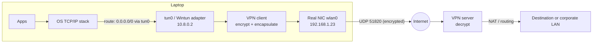

# How a VPN Works

> **Level:** Advanced · **Related:** [Proxy](proxy.md) · [Web Protocols](web-protocols.md) · [Encryption](../06-security-and-data/encryption.md) · [Drivers](../03-os-and-software/drivers.md) · [OS](../03-os-and-software/operating-system.md)

## 1. Definition

A **Virtual Private Network** creates an **encrypted tunnel** across an untrusted network (the internet, café Wi-Fi) so that two endpoints behave as if connected to the same private network. Technically: IP packets are **encapsulated** — wrapped inside other packets — and encrypted/authenticated before being sent.

```
Original packet:            [IP src=10.8.0.2 dst=93.184.215.14][TCP][HTTP data]
After VPN encapsulation:    [IP src=203.0.113.5 dst=VPN-server][UDP 51820][WG header][ ENCRYPTED( original packet ) ][tag]
```

Three main uses:
1. **Remote access** — employee laptop joins the corporate network.
2. **Site-to-site** — connect office LANs / cloud VPCs (IPsec between routers/firewalls).
3. **Consumer privacy** — hide traffic from the local network/ISP and appear to come from the VPN server's IP.

## 2. Architecture: the virtual interface

The OS gets a **virtual network interface** (TUN for IP packets, TAP for Ethernet frames). Routes send traffic into it; the VPN software reads packets from it, encrypts, and sends them via the real interface.



The receiving end decrypts, verifies, removes the outer header and injects the inner packet into its own network stack — then routes it onward (often with NAT so replies come back to the server).

| | Linux | Windows |
|---|---|---|
| Virtual interface | `/dev/net/tun` → `tun0`/`wg0` (in-kernel WireGuard module since 5.6) | **Wintun** (WireGuard's L3 driver), TAP-Windows6 (OpenVPN legacy), built-in WAN Miniport adapters for IKEv2/SSTP/L2TP |
| Routing | `ip route`, policy routing `ip rule`, `fwmark` | `route print`, `Get-NetRoute`, interface metrics |
| Built-in VPN | NetworkManager plugins, strongSwan, `wg-quick` | Settings → VPN (RAS: IKEv2, SSTP, L2TP/IPsec, PPTP-deprecated), `rasdial`, `Add-VpnConnection` |
| Always-on | systemd units | **Always On VPN** (device/user tunnels via MDM/Intune) |

## 3. Protocols

| Protocol | Layer / transport | Crypto | Notes |
|---|---|---|---|
| **WireGuard** | L3, UDP | Noise IK: Curve25519, ChaCha20-Poly1305, BLAKE2s, SipHash | ~4k lines, fast, in Linux kernel; modern default |
| **IPsec (IKEv2 + ESP)** | L3, ESP (IP proto 50) or UDP 4500 (NAT-T) | AES-GCM, DH/ECDH, certificates or EAP | Standard for site-to-site; native on Windows/macOS/iOS/Android |
| **OpenVPN** | L2/L3, UDP or TCP | TLS control channel, AES-GCM/ChaCha20 data | Very flexible, user-space, widely used |
| **SSL/TLS VPNs** (AnyConnect/ocserv, SSTP, GlobalProtect) | TLS over TCP 443 (+ DTLS) | TLS | Passes most firewalls |
| L2TP/IPsec | L2 over IPsec | IPsec | Legacy |
| PPTP | — | MS-CHAPv2 / RC4 | **Broken, don't use** |
| Obfuscated (e.g., VLESS/Reality, obfs4, AmneziaWG, Shadowsocks — proxy-like) | Various | Various | Designed to resist DPI-based blocking |

### 3.1 WireGuard in depth

Configuration is just keys and allowed IPs — **cryptokey routing**:

```ini
# /etc/wireguard/wg0.conf (client)
[Interface]
PrivateKey = <client-private-key>
Address = 10.8.0.2/32
DNS = 10.8.0.1

[Peer]
PublicKey = <server-public-key>
Endpoint = vpn.example.com:51820
AllowedIPs = 0.0.0.0/0, ::/0          # route everything through the tunnel (full tunnel)
PersistentKeepalive = 25               # keep NAT mappings alive
```

```bash
wg genkey | tee priv | wg pubkey > pub
sudo wg-quick up wg0 && sudo wg show        # handshake time, transfer counters
```

On Windows the official WireGuard client uses the same config format, running on **Wintun**; on Linux, `wg-quick` sets up `ip rule`/`fwmark` policy routing so the encrypted UDP packets themselves don't loop into the tunnel.

Handshake (Noise_IKpsk2): 1-RTT exchange of ephemeral Curve25519 keys authenticated by static keys → derive symmetric session keys; rekey every 2 minutes; cookies mitigate DoS; silent to unauthenticated packets (no response = stealthy port).

### 3.2 IPsec in depth
- **IKEv2** (UDP 500/4500) negotiates **Security Associations (SAs)**: mutual auth (certificates, PSK, EAP-MSCHAPv2/EAP-TLS), Diffie-Hellman, algorithms.
- **ESP** encapsulates packets: `[new IP][ESP hdr: SPI, seq][encrypted inner IP packet][ICV]`.
- **Tunnel mode** (whole packet encapsulated, for VPNs) vs **transport mode** (payload only, host-to-host).
- **NAT-T** wraps ESP in UDP 4500 to traverse NAT.
- Linux: strongSwan/Libreswan + kernel XFRM (`ip xfrm state`); Windows: IKEEXT service + built-in client, `Get-VpnConnection`.

## 4. Building a toy VPN (how the pieces fit)

A deliberately simplified Linux TUN-based tunnel in Python — illustrative only (no real crypto handshake, no replay protection):

```python
# pip install cryptography ; run as root on both ends
import os, fcntl, struct, socket, select
from cryptography.hazmat.primitives.ciphers.aead import ChaCha20Poly1305

TUNSETIFF, IFF_TUN, IFF_NO_PI = 0x400454CA, 0x0001, 0x1000
tun = os.open("/dev/net/tun", os.O_RDWR)
fcntl.ioctl(tun, TUNSETIFF, struct.pack("16sH", b"tun0", IFF_TUN | IFF_NO_PI))
# then: ip addr add 10.9.0.1/24 dev tun0 && ip link set tun0 up   (10.9.0.2 on the peer)

key = bytes.fromhex(os.environ["VPN_KEY"])       # 32-byte pre-shared key (real VPNs do a DH handshake)
aead = ChaCha20Poly1305(key)
sock = socket.socket(socket.AF_INET, socket.SOCK_DGRAM); sock.bind(("0.0.0.0", 5555))
peer = (os.environ["PEER_IP"], 5555)

while True:
    r, _, _ = select.select([tun, sock], [], [])
    if tun in r:                                  # packet from OS → encrypt → UDP to peer
        pkt = os.read(tun, 2048); nonce = os.urandom(12)
        sock.sendto(nonce + aead.encrypt(nonce, pkt, None), peer)
    if sock in r:                                 # UDP from peer → decrypt/verify → inject into OS
        data, _ = sock.recvfrom(4096)
        try: os.write(tun, aead.decrypt(data[:12], data[12:], None))
        except Exception: pass                    # drop forged/corrupted packets silently
```

Real VPNs add authenticated key exchange, rekeying, replay windows (sequence counters), MTU handling, roaming, and multi-peer routing.

## 5. Routing decisions: full vs split tunnel

- **Full tunnel**: default route `0.0.0.0/0` through VPN — all traffic protected, corporate policies applied.
- **Split tunnel**: only specific prefixes (e.g., `10.0.0.0/8`) go through VPN; the rest goes direct. Faster; less protection.
- The VPN server's own public IP must be excluded (a host route via the physical gateway), otherwise the tunnel would try to route itself.

## 6. MTU and fragmentation

Encapsulation adds overhead (WireGuard: 60 bytes IPv4 / 80 IPv6; IPsec ESP ~50–70; OpenVPN more). With a 1500-byte underlay, WireGuard defaults to **MTU 1420**. Mismatched MTU → PMTUD black holes → "websites half-load" symptoms. Fix: lower MTU, or **MSS clamping** (`iptables -t mangle -A FORWARD -p tcp --tcp-flags SYN,RST SYN -j TCPMSS --clamp-mss-to-pmtu`).

## 7. What a VPN does and does not protect

| Protects | Does NOT protect |
|---|---|
| Traffic from local network snooping (café Wi-Fi, ISP) | Against the VPN provider itself (it sees your traffic metadata/plaintext if not HTTPS) |
| Your IP address from destination sites | Tracking via cookies, browser fingerprinting, logged-in accounts |
| Access to private networks | Malware on your device |
| Against geo-based restrictions (policy permitting) | Anonymity against a global adversary (use Tor for stronger anonymity) |

**Leak sources:** DNS queries sent outside the tunnel (DNS leak), IPv6 traffic when only IPv4 is tunneled, WebRTC exposing local/public IPs ([WebRTC](webrtc.md)), traffic before the tunnel comes up (use a **kill switch**: firewall rules allowing only tunnel traffic). Windows-specific: "Smart multi-homed name resolution" could leak DNS; use `Set-DnsClientNrptRule`/VPN-bound DNS. Linux: `systemd-resolved` per-link DNS domains (`resolvectl dns wg0 10.8.0.1; resolvectl domain wg0 '~.'`).

## 8. Zero Trust and the future of remote access

Traditional VPNs grant broad network access once connected. **Zero Trust Network Access (ZTNA)** — Tailscale/Headscale (WireGuard mesh with identity-based ACLs), Cloudflare Access, Zscaler Private Access, Google BeyondCorp — authenticates **each connection to each application**, using device posture + identity, often built on WireGuard or TLS. **Mesh VPNs** use NAT traversal (STUN-like hole punching, relays — same techniques as [WebRTC](webrtc.md)) to connect peers directly.

## 9. Diagnostics

```bash
# Linux
ip addr show wg0; ip route; ip rule; sudo wg show
curl https://ifconfig.me                   # public IP now = VPN server's?
resolvectl status                          # which DNS servers per link
sudo tcpdump -ni wlan0 udp port 51820      # only encrypted UDP should appear
```

```powershell
# Windows
Get-VpnConnection; rasdial
Get-NetIPInterface | Sort InterfaceMetric
route print -4
Resolve-DnsName example.com
Get-NetAdapter | where InterfaceDescription -like "*WireGuard*"
```

## Further reading
- Jason Donenfeld, *WireGuard: Next Generation Kernel Network Tunnel* (NDSS 2017)
- RFC 7296 (IKEv2), RFC 4303 (ESP); strongSwan docs
- Trevor Perrin, *The Noise Protocol Framework*; Tailscale blog: *How NAT traversal works*
