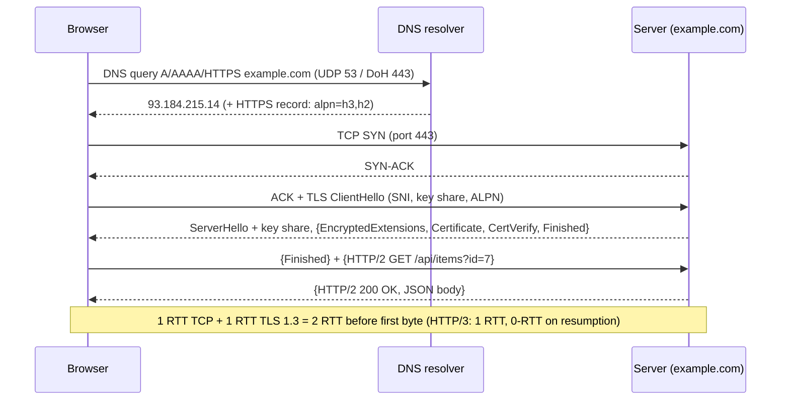

# How Web Protocols Work

> **Level:** Advanced · **Related:** [Web Server](web-server.md) · [Proxy](proxy.md) · [VPN](vpn.md) · [WebRTC](webrtc.md) · [Encryption](../06-security-and-data/encryption.md) · [Compression](../06-security-and-data/compression.md)

## 1. The stack behind one URL

Typing `https://example.com/api/items?id=7` triggers a chain of protocols, each solving one problem:

```
┌───────────────┬──────────────────────────────────────────────┬────────────────────────────┐
│ Layer         │ Protocol(s)                                  │ Solves                     │
├───────────────┼──────────────────────────────────────────────┼────────────────────────────┤
│ Application   │ HTTP/1.1, HTTP/2, HTTP/3, WebSocket, DNS     │ What to fetch, semantics   │
│ Security      │ TLS 1.3 (or built into QUIC)                 │ Confidentiality, identity  │
│ Transport     │ TCP  /  UDP + QUIC                           │ Reliable ordered delivery  │
│ Network       │ IPv4 / IPv6, ICMP                            │ Addressing, routing        │
│ Link          │ Ethernet, Wi-Fi (802.11), 5G                 │ Local delivery (MAC)       │
│ Physical      │ Copper, fiber, radio                         │ Bits on a medium           │
└───────────────┴──────────────────────────────────────────────┴────────────────────────────┘
```

**Encapsulation:** each layer wraps the one above with its own header — HTTP data inside a TLS record inside a TCP segment inside an IP packet inside an Ethernet frame.

## 2. The full journey of a request



## 3. IP: addressing and routing

- **IPv4**: 32-bit (`192.0.2.10`), exhausted → **NAT** hides many private addresses (`10/8`, `172.16/12`, `192.168/16`) behind one public IP.
- **IPv6**: 128-bit (`2001:db8::1`), SLAAC auto-configuration, no NAT needed; ~45–50% of Google traffic by 2025.
- **Routing**: each router forwards by **longest-prefix match** in its table; the internet's inter-network routing uses **BGP** between Autonomous Systems.
- **TTL/Hop Limit** prevents loops (used by `traceroute`/`tracert`). **MTU** typically 1500 bytes; **PMTUD** discovers path limits.

## 4. DNS: names to addresses

Hierarchical, distributed database:

```
Browser cache → OS stub resolver (Windows DNS Client service / Linux systemd-resolved)
→ Recursive resolver (ISP, 1.1.1.1, 8.8.8.8)
    → Root servers (.) → TLD servers (.com) → Authoritative (example.com) → answer
```

Records: `A`/`AAAA` (addresses), `CNAME` (alias), `MX` (mail), `TXT` (SPF, verification), `NS`, `SOA`, `CAA` (which CAs may issue certs), `SRV`, **`HTTPS`/`SVCB`** (advertise HTTP/3 support, ECH keys).

Security/privacy: **DNSSEC** (signed records), **DoH** (DNS over HTTPS), **DoT** (DNS over TLS, port 853), **DoQ**.

| Task | Windows | Linux |
|---|---|---|
| Query | `Resolve-DnsName example.com -Type AAAA`, `nslookup` | `dig example.com AAAA +short`, `host`, `resolvectl query` |
| Cache | `ipconfig /displaydns`, `ipconfig /flushdns` | `resolvectl statistics`, `resolvectl flush-caches` |
| Hosts file | `C:\Windows\System32\drivers\etc\hosts` | `/etc/hosts` |

## 5. TCP: reliable byte stream

- **3-way handshake** SYN → SYN-ACK → ACK, with sequence numbers.
- **Reliability**: every byte numbered; cumulative ACKs + SACK; retransmission on timeout or 3 duplicate ACKs.
- **Flow control**: receiver advertises a window.
- **Congestion control**: sender limits in-flight data by a congestion window — **CUBIC** (Linux/Windows default), **BBR** (models bottleneck bandwidth and RTT; Google). Slow start doubles the window per RTT.
- **Head-of-line blocking**: one lost segment stalls everything after it in the stream — the key motivation for QUIC.
- Teardown: FIN/ACK, `TIME_WAIT` (2×MSL).

Seeing it: `ss -tinp` (Linux: cwnd, rtt per socket), `netstat -ano` / `Get-NetTCPConnection` (Windows), Wireshark on both.

## 6. TLS 1.3: encryption and identity

Goals: confidentiality, integrity, server (optionally client) authentication.

1. **ClientHello**: supported cipher suites (`TLS_AES_128_GCM_SHA256`, `TLS_CHACHA20_POLY1305_SHA256`…), **key share** (X25519, and increasingly hybrid post-quantum **X25519MLKEM768**), **SNI** (hostname), **ALPN** (`h2`, `http/1.1`).
2. **ServerHello**: picks parameters + its key share → both compute the shared secret via **ECDHE** → derive handshake keys with **HKDF**. Everything after is encrypted.
3. Server sends its **certificate chain** and a **CertificateVerify** signature proving it owns the private key; client validates the chain up to a trusted root CA, hostname, expiry, revocation (OCSP stapling / CRLite).
4. **Finished** MACs over the transcript prevent tampering.

Properties: **forward secrecy** (ephemeral keys), 1-RTT handshake, **0-RTT** resumption (with replay caveats), **ECH** (Encrypted Client Hello) hides SNI. Details on the primitives: [Encryption](../06-security-and-data/encryption.md).

```bash
openssl s_client -connect example.com:443 -servername example.com -alpn h2 </dev/null | head -30
curl -v --http3 https://cloudflare.com -o /dev/null   # if curl built with HTTP/3
```

## 7. HTTP: the application protocol

### 7.1 Semantics (same across versions)
- **Methods**: `GET` (safe, idempotent), `HEAD`, `POST`, `PUT` (idempotent), `PATCH`, `DELETE`, `OPTIONS`.
- **Status codes**: 1xx info (`101` switching, `103` Early Hints), 2xx success, 3xx redirect (`301`, `302`, `304 Not Modified`, `307/308`), 4xx client error (`400`, `401`, `403`, `404`, `429`), 5xx server error (`500`, `502`, `503`, `504`).
- **Headers**: `Host`, `Content-Type`, `Content-Length`, `Accept-Encoding` / `Content-Encoding` (gzip, br, zstd — see [Compression](../06-security-and-data/compression.md)), `Cookie`/`Set-Cookie`, `Authorization`, `Cache-Control`, `ETag`/`If-None-Match`, CORS (`Access-Control-Allow-Origin`), security headers (`Strict-Transport-Security`, `Content-Security-Policy`).
- **Stateless**: state lives in cookies/tokens.

### 7.2 Wire formats across versions

**HTTP/1.1** (text, one request at a time per connection):

```http
GET /api/items?id=7 HTTP/1.1
Host: example.com
Accept: application/json
Accept-Encoding: gzip, br

HTTP/1.1 200 OK
Content-Type: application/json
Content-Length: 27
Cache-Control: max-age=60

{"id":7,"name":"Widget"}
```

Raw HTTP over a socket in Python:

```python
import socket, ssl
ctx = ssl.create_default_context()
with socket.create_connection(("example.com", 443)) as raw:
    with ctx.wrap_socket(raw, server_hostname="example.com") as s:
        s.sendall(b"GET / HTTP/1.1\r\nHost: example.com\r\nConnection: close\r\n\r\n")
        print(s.recv(300).decode(errors="replace"))
        print("TLS version:", s.version(), "cipher:", s.cipher()[0])
```

| | HTTP/1.1 (1997) | HTTP/2 (2015) | HTTP/3 (2022) |
|---|---|---|---|
| Format | Text | Binary frames | Binary frames |
| Transport | TCP (+TLS) | TCP + TLS | **QUIC over UDP** (TLS 1.3 built in) |
| Concurrency | 1 request per connection at a time (browsers open 6) | **Multiplexed streams** on one connection | Multiplexed, independent streams |
| Header compression | None | **HPACK** | **QPACK** |
| HOL blocking | Yes (application) | Yes (TCP level) | **No** — loss affects only its stream |
| Handshake | TCP + TLS: 2–3 RTT | 2 RTT | 1 RTT, 0-RTT resumption |
| Connection migration | No | No | **Yes** (connection IDs survive Wi-Fi → 5G switch) |

### 7.3 QUIC in brief
QUIC (RFC 9000) runs in **user space over UDP**: its own reliability, congestion control, stream multiplexing, and mandatory encryption (even most of the header). Because it's in user space (Chrome, Cloudflare quiche, msquic on Windows, ngtcp2), it evolves faster than kernel TCP. Discovery via `Alt-Svc: h3=":443"` header or DNS `HTTPS` records.

## 8. Real-time and streaming protocols on the web

| Protocol | Pattern | Transport |
|---|---|---|
| **WebSocket** (RFC 6455) | Full-duplex messages after HTTP `Upgrade` | TCP |
| **Server-Sent Events** | Server → client text stream (`text/event-stream`) | HTTP |
| **WebTransport** | Streams + datagrams | HTTP/3/QUIC |
| **gRPC** | RPC with Protobuf, streaming | HTTP/2 |
| **WebRTC** | Peer-to-peer media/data | UDP (SRTP, SCTP over DTLS) — see [WebRTC](webrtc.md) |

WebSocket handshake + usage:

```http
GET /chat HTTP/1.1
Host: example.com
Upgrade: websocket
Connection: Upgrade
Sec-WebSocket-Key: dGhlIHNhbXBsZSBub25jZQ==
Sec-WebSocket-Version: 13

HTTP/1.1 101 Switching Protocols
Upgrade: websocket
Connection: Upgrade
Sec-WebSocket-Accept: s3pPLMBiTxaQ9kYGzzhZRbK+xOo=
```

```js
// Browser
const ws = new WebSocket("wss://example.com/chat");
ws.onopen = () => ws.send(JSON.stringify({ type: "hello" }));
ws.onmessage = (e) => console.log("server:", e.data);

// Node.js server (ws library)
import { WebSocketServer } from "ws";
new WebSocketServer({ port: 8080 }).on("connection", (sock) =>
  sock.on("message", (m) => sock.send(`echo: ${m}`)));
```

## 9. Caching, cookies and the browser security model

- **HTTP caching**: `Cache-Control: max-age`, `s-maxage` (CDN), `no-store`, `stale-while-revalidate`; validation via `ETag`/`Last-Modified` → `304`.
- **Same-Origin Policy**: scripts can read responses only from the same scheme+host+port; **CORS** headers relax it explicitly.
- **Cookies**: `Secure`, `HttpOnly` (no JS access), `SameSite=Lax/Strict/None` (CSRF defense), `Partitioned` (CHIPS).
- **HSTS** forces HTTPS; **CSP** restricts script sources (XSS defense).

## 10. Tooling cheat-sheet

```bash
curl -sv https://example.com -o /dev/null          # handshake + headers
curl -I --http2 https://example.com                # headers only over h2
curl -H "Accept-Encoding: br" --compressed https://example.com
dig +trace example.com                             # full DNS resolution path
traceroute example.com   |  tracert example.com (Windows)
mtr example.com                                    # continuous traceroute (Linux)
sudo tcpdump -i any -nn port 443                   # packet capture (Linux)
pktmon start --capture ... (Windows)  or Wireshark (both; set SSLKEYLOGFILE to decrypt TLS)
```

Browser DevTools → Network tab: protocol column (h2/h3), timing waterfall (DNS, connect, TLS, TTFB).

## Further reading
- RFC 9110 (HTTP Semantics), RFC 9112/9113/9114 (HTTP/1.1, /2, /3), RFC 9000 (QUIC), RFC 8446 (TLS 1.3), RFC 1034/1035 (DNS)
- Ilya Grigorik, *High Performance Browser Networking* (free online, hpbn.co)
- Kurose & Ross, *Computer Networking: A Top-Down Approach*
