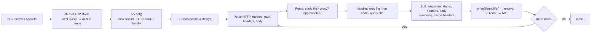

# How a Web Server Works

> **Level:** Advanced · **Related:** [Web Protocols](web-protocols.md) · [Proxy](proxy.md) · [OS](../03-os-and-software/operating-system.md) · [Software/Apps](../03-os-and-software/software-and-apps.md) · [Compression](../06-security-and-data/compression.md)

## 1. Definition

A **web server** is a program that listens on a network port (80/443), accepts connections, parses [HTTP](web-protocols.md) requests, produces responses — either **static** (files from disk) or **dynamic** (generated by application code) — and sends them back, handling thousands to millions of concurrent clients.

"Web server" can mean:
- **HTTP servers / reverse proxies**: nginx, Apache httpd, Caddy, IIS, Envoy, HAProxy, LiteSpeed.
- **Application servers**: Node.js (http/Express/Fastify), Python (Gunicorn/uWSGI for WSGI, Uvicorn/Hypercorn for ASGI), Java (Tomcat, Netty), .NET (Kestrel).
- Typically both are chained: **nginx → app server → database**.

## 2. Core loop: from socket to response

At its heart, every server does:

```
socket() → bind(:443) → listen(backlog) → loop { accept() → read request → handle → write response }
```



A complete (minimal, single-threaded) HTTP server in Python using raw sockets:

```python
import socket, pathlib, mimetypes
ROOT = pathlib.Path("public").resolve()

def handle(conn):
    req = conn.recv(65536).decode("latin-1")
    if not req: return
    method, target, _ = req.split("\r\n", 1)[0].split(" ", 2)
    rel = target.lstrip("/").split("?")[0] or "index.html"
    path = (ROOT / rel).resolve()
    if method != "GET" or not path.is_relative_to(ROOT) or not path.is_file():   # block ../ traversal
        body, status, ctype = b"Not Found", "404 Not Found", "text/plain"
    else:
        body, status = path.read_bytes(), "200 OK"
        ctype = mimetypes.guess_type(path.name)[0] or "application/octet-stream"
    headers = f"HTTP/1.1 {status}\r\nContent-Type: {ctype}\r\nContent-Length: {len(body)}\r\nConnection: close\r\n\r\n"
    conn.sendall(headers.encode() + body)

with socket.create_server(("0.0.0.0", 8080)) as srv:
    while True:
        conn, addr = srv.accept()
        with conn: handle(conn)
```

This handles one client at a time. Real servers differ mainly in **how they handle concurrency**.

## 3. Concurrency models

| Model | How | Pros / Cons | Examples |
|---|---|---|---|
| Process per connection | `fork()` per client | Isolation; heavy memory, slow | Old CGI, Apache prefork |
| Thread per connection | Thread pool, blocking I/O | Simple code; ~1 MB stack/thread, context switches (C10K problem) | Apache worker, Tomcat (classic) |
| **Event-driven, non-blocking** | Few threads, each running an event loop over thousands of sockets | Massive concurrency, low memory; CPU-heavy handlers block the loop | **nginx**, Node.js, HAProxy, Envoy |
| Async + thread pool hybrid | Event loop for I/O, pool for blocking work | Balanced | Node.js (libuv pool), Kestrel, Tokio (Rust) |
| Virtual threads / green threads | Runtime multiplexes lightweight threads over OS threads | Blocking-style code, event-driven efficiency | Go goroutines, Java 21 virtual threads |

### The OS mechanisms behind event loops

| | Linux | Windows |
|---|---|---|
| Readiness notification | **epoll** (`epoll_wait`) | `WSAPoll`/`select` (limited) |
| Completion-based I/O | **io_uring** | **IOCP** (I/O Completion Ports) — the native high-performance model |
| Zero-copy file send | `sendfile()`, `splice()` | `TransmitFile()` |
| Kernel HTTP | — (kTLS for kernel-offloaded TLS) | **HTTP.sys** (kernel-mode HTTP listener used by IIS and `HttpListener`, with kernel response cache) |
| Load-spread across processes | `SO_REUSEPORT` | Shared listening socket, HTTP.sys request queues |
| Limits | `ulimit -n` (file descriptors), `net.core.somaxconn` | Ephemeral port range, `MaxUserPort`, HTTP.sys registry settings |

nginx architecture: one **master** process (reads config, binds ports, manages workers) + N **worker** processes (usually one per CPU core), each a single-threaded epoll/kqueue event loop handling thousands of connections via non-blocking sockets.

Event-driven server in Node.js (libuv uses epoll on Linux, IOCP on Windows):

```js
import http from "node:http";
import { createReadStream } from "node:fs";
import { stat } from "node:fs/promises";

http.createServer(async (req, res) => {
  if (req.url === "/api/time") {
    res.writeHead(200, { "Content-Type": "application/json" });
    return res.end(JSON.stringify({ now: Date.now() }));
  }
  try {
    const file = "./public/index.html";
    const { size } = await stat(file);                 // non-blocking fs (thread pool)
    res.writeHead(200, { "Content-Type": "text/html", "Content-Length": size });
    createReadStream(file).pipe(res);                  // streaming with backpressure
  } catch { res.writeHead(404).end("Not found"); }
}).listen(8080, () => console.log("listening on :8080"));
```

Async Python with ASGI (FastAPI on Uvicorn — uvloop/epoll under the hood):

```python
from fastapi import FastAPI
import asyncio
app = FastAPI()

@app.get("/api/items/{item_id}")
async def get_item(item_id: int):
    await asyncio.sleep(0.05)          # e.g., awaiting a DB query — loop serves others meanwhile
    return {"id": item_id, "name": "Widget"}
# run: uvicorn main:app --workers 4   (4 processes × event loop each)
```

C++ servers use Boost.Asio / Drogon / uWebSockets on the same epoll/IOCP primitives.

## 4. Static content: fast paths

- **sendfile/TransmitFile**: kernel copies file pages directly to the socket — no user-space copy.
- **Page cache** keeps hot files in RAM.
- **Conditional requests**: `ETag`/`Last-Modified` → `304 Not Modified`.
- **Pre-compressed assets** (`.br`, `.gz`) served with `Content-Encoding` — see [Compression](../06-security-and-data/compression.md).
- **Range requests** (`206 Partial Content`) for video seeking and resumable downloads.

## 5. Dynamic content: interfaces between server and app

| Interface | Language | Notes |
|---|---|---|
| CGI | Any | New process per request (historic) |
| FastCGI | PHP-FPM, etc. | Persistent worker pool over socket |
| **WSGI** | Python (sync) | Gunicorn, uWSGI; Django, Flask |
| **ASGI** | Python (async) | Uvicorn, Hypercorn; FastAPI, Starlette, Django async |
| Rack | Ruby | Puma |
| Servlet / Jakarta EE | Java | Tomcat, Jetty |
| In-process module | Various | Apache mod_php; IIS ASP.NET Core in-process hosting |
| Reverse proxy over HTTP | Any | nginx → `proxy_pass http://127.0.0.1:3000` (most common today) |

## 6. Reverse proxy & load balancing configuration (nginx)

```nginx
worker_processes auto;                 # one worker per core
events { worker_connections 4096; }

http {
    sendfile on; tcp_nopush on;
    gzip on; gzip_types text/css application/javascript application/json;

    upstream app {
        least_conn;                    # load-balancing algorithm
        server 127.0.0.1:3000 max_fails=3 fail_timeout=10s;
        server 127.0.0.1:3001;
        keepalive 64;                  # reuse upstream connections
    }

    server {
        listen 443 ssl;
        http2 on;
        server_name example.com;
        ssl_certificate     /etc/letsencrypt/live/example.com/fullchain.pem;
        ssl_certificate_key /etc/letsencrypt/live/example.com/privkey.pem;
        add_header Strict-Transport-Security "max-age=63072000" always;

        location /static/ { root /var/www; expires 30d; }          # static fast path
        location /api/ {
            proxy_pass http://app;
            proxy_http_version 1.1;
            proxy_set_header Host $host;
            proxy_set_header X-Forwarded-For $proxy_add_x_forwarded_for;
            proxy_set_header X-Forwarded-Proto $scheme;
        }
    }
}
```

See [Proxy](proxy.md) for reverse vs forward proxies.

## 7. Windows: IIS and HTTP.sys

- **HTTP.sys** (kernel driver) owns ports 80/443, parses requests, queues them per application pool, and can serve cached responses from kernel mode.
- **IIS** (`w3svc`, **WAS**) manages sites and **application pools** — worker processes `w3wp.exe` with their own identities, recycling, and isolation.
- ASP.NET Core runs on **Kestrel**, either behind IIS (ASP.NET Core Module) or standalone.
- Tools: `netsh http show urlacl`, `netsh http show servicestate`, IIS Manager, `appcmd list sites`, Failed Request Tracing, logs in `%SystemDrive%\inetpub\logs\LogFiles`.

On Linux: `systemctl status nginx`, `nginx -t` (test config), logs in `/var/log/nginx/`, `ss -ltnp` (who listens where).

## 8. Performance & scaling

- **Keep-alive** and **HTTP/2** amortize handshakes; **TLS session resumption** avoids full handshakes.
- **Caching layers**: browser → CDN (Cloudflare, Akamai, CloudFront) → reverse-proxy cache → app cache (Redis) → DB.
- **Horizontal scaling**: stateless app servers behind a load balancer (L4: IPVS, AWS NLB; L7: nginx, Envoy, ALB); sessions in Redis/JWT.
- **Backpressure & timeouts**: limit request body size, header size, slowloris protection (`client_header_timeout`), rate limiting (`limit_req`).
- Measure with `wrk`, `hey`, `k6`, `ab`; watch p50/p95/p99 latency, not just averages.

## 9. Security checklist

- Always HTTPS (Let's Encrypt via ACME: `certbot`, Caddy/Traefik auto-TLS; win-acme on Windows).
- Principle of least privilege: bind low ports then drop to an unprivileged user (nginx `user www-data;`), app pools with virtual accounts on IIS.
- Prevent path traversal, set security headers (HSTS, CSP, X-Content-Type-Options), hide version banners.
- Validate input server-side; parameterized SQL; WAF (ModSecurity/Coraza) where appropriate.
- Keep TLS config modern (TLS 1.2+/1.3 only); patch promptly (e.g., HTTP/2 "Rapid Reset" DoS, CVE-2023-44487).

## Further reading
- nginx docs & *Inside NGINX: How We Designed for Performance & Scale*
- Dan Kegel, *The C10K problem*; io_uring docs (`man io_uring`); Microsoft Learn *I/O Completion Ports*, *HTTP Server API*
- Martin Kleppmann, *Designing Data-Intensive Applications*
