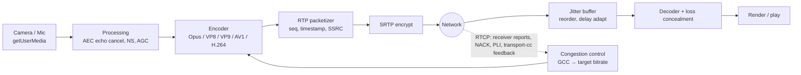

# How WebRTC Works

> **Level:** Advanced · **Related:** [Web Protocols](web-protocols.md) · [VPN](vpn.md) · [Encryption](../06-security-and-data/encryption.md) · [Compression](../06-security-and-data/compression.md)

## 1. What WebRTC is

**WebRTC (Web Real-Time Communication)** is a set of browser APIs (W3C) and network protocols (IETF) enabling **real-time audio, video and arbitrary data directly between peers** — browser-to-browser, browser-to-server, app-to-app — with sub-second latency, mandatory encryption, and no plugins. It powers Google Meet, Discord (voice/video), Microsoft Teams (web), WhatsApp web calls, cloud gaming, and live streaming (WHIP/WHEP).

The three hard problems it solves:
1. **Connectivity** — peers are behind NATs and firewalls → **ICE, STUN, TURN**.
2. **Real-time media** — capture, encode, adapt to bandwidth, conceal loss → **codecs, RTP/RTCP, congestion control, jitter buffers**.
3. **Security** — **DTLS-SRTP**, mandatory encryption.

## 2. The protocol stack

```
          Media (audio/video)                  Data channel
┌───────────────────────────────┐   ┌──────────────────────────────┐
│ Codecs: Opus, VP8/VP9/AV1/H.264│   │ Your app messages            │
│ SRTP / SRTCP (encrypted RTP)  │   │ SCTP (reliable/unreliable,   │
│                               │   │ ordered/unordered streams)   │
│   keys derived from ↓         │   │ DTLS (encryption)            │
├───────────────────────────────┴───┴──────────────────────────────┤
│ DTLS handshake (fingerprints verified via signaling SDP)          │
├──────────────────────────────────────────────────────────────────┤
│ ICE (connectivity checks) · STUN · TURN (relay)                   │
├──────────────────────────────────────────────────────────────────┤
│ UDP (preferred)  —  TCP / TLS fallback via TURN                   │
└──────────────────────────────────────────────────────────────────┘
```

Everything is multiplexed on one UDP port per connection ("BUNDLE" + "rtcp-mux").

## 3. The call setup, step by step

WebRTC deliberately does **not** define **signaling** — how peers find each other and exchange setup messages. You use anything: WebSocket, HTTP, a chat server, even copy-paste.

```mermaid
sequenceDiagram
  participant A as Peer A (caller)
  participant SIG as Signaling server (WebSocket)
  participant STUN as STUN/TURN
  participant B as Peer B (callee)
  A->>A: getUserMedia() → tracks; new RTCPeerConnection()
  A->>A: createOffer() → SDP; setLocalDescription()
  A->>SIG: offer SDP
  SIG->>B: offer SDP
  B->>B: setRemoteDescription(offer); createAnswer(); setLocalDescription()
  B->>SIG: answer SDP
  SIG->>A: answer SDP → setRemoteDescription(answer)
  A->>STUN: Binding request → learn public IP:port (srflx candidate)
  A->>SIG: ICE candidates (trickled as found)
  SIG->>B: candidates;  (and B → A likewise)
  A-->>B: ICE connectivity checks (STUN on every candidate pair)
  A-->>B: DTLS handshake → keys for SRTP & SCTP
  A-->>B: Media (SRTP) and data (SCTP) flow peer-to-peer
```

### 3.1 SDP: the session description
**SDP (Session Description Protocol)** is a text blob listing media sections, codecs, ICE credentials, DTLS fingerprint:

```
v=0
o=- 4611731400430051336 2 IN IP4 127.0.0.1
s=-
t=0 0
a=group:BUNDLE 0 1
m=audio 9 UDP/TLS/RTP/SAVPF 111
a=rtpmap:111 opus/48000/2
a=ice-ufrag:EsAw
a=ice-pwd:bP+XJMM09aR8AiX1jdukzR6Y
a=fingerprint:sha-256 D2:FA:0E:C3:22:59:5E:14:95:69:92:3D:13:B4:84:24:...
a=setup:actpass
a=mid:0
a=sendrecv
m=video 9 UDP/TLS/RTP/SAVPF 96 98
a=rtpmap:96 VP8/90000
a=rtpmap:98 AV1/90000
a=rtcp-fb:96 nack pli
a=rtcp-fb:96 transport-cc
```

This **offer/answer** negotiation (JSEP) settles which codecs, directions and transport parameters both sides use.

## 4. NAT traversal: ICE, STUN, TURN

Most devices sit behind NAT (see [Web Protocols](web-protocols.md#3-ip-addressing-and-routing)); they don't know their public address, and inbound packets are dropped unless a mapping exists.

**ICE (Interactive Connectivity Establishment, RFC 8445)** gathers **candidates** — possible addresses:

| Candidate type | Source | Example |
|---|---|---|
| **host** | Local interface | `192.168.1.23:54321` (often mDNS-obfuscated: `abc.local`) |
| **srflx** (server-reflexive) | Asked a **STUN** server "what's my public address?" | `203.0.113.7:61000` |
| **relay** | Allocated on a **TURN** server | `turn.example.com:3478` |
| **prflx** (peer-reflexive) | Discovered during checks | |

Then both sides pair candidates and send **STUN connectivity checks** on each pair (in priority order). Simultaneous outbound packets create NAT mappings on both sides — **UDP hole punching**. The best working pair wins ("nominated").

- Works directly for ~80–90% of connections.
- **Symmetric NATs** (different public port per destination — common on mobile carriers/CGNAT) defeat hole punching → fall back to **TURN**, which relays all media (costs server bandwidth). TURN can run over TCP/TLS 443 to pass strict firewalls.

```js
const pc = new RTCPeerConnection({
  iceServers: [
    { urls: "stun:stun.l.google.com:19302" },
    { urls: ["turn:turn.example.com:3478?transport=udp", "turns:turn.example.com:443?transport=tcp"],
      username: "user", credential: "secret" },
  ],
});
pc.onicecandidate = ({ candidate }) => candidate && signaling.send({ candidate });
```

Run your own TURN with **coturn** (Linux: `apt install coturn`; also available on Windows via WSL/containers).

## 5. Media pipeline



- **Codecs**: Opus (audio, 6–510 kbps, built-in FEC & DTX), VP8 & H.264 (mandatory video), VP9, **AV1** (best compression; hardware encode spreading). See [Compression](../06-security-and-data/compression.md) for the general principles.
- **RTP** carries media with sequence numbers and timestamps; **RTCP** carries statistics and feedback.
- **Loss recovery**: NACK (retransmit), FEC (redundant packets, Opus in-band FEC, FlexFEC), **PLI/FIR** (request a keyframe).
- **Congestion control**: Google Congestion Control (GCC) estimates available bandwidth from delay gradients (transport-wide CC feedback) and adapts encoder bitrate/resolution/framerate.
- **Jitter buffer** trades latency for smoothness (typically 20–200 ms).
- **Simulcast / SVC**: sender encodes several qualities (or scalable layers) so a server can forward the right one to each receiver.

## 6. Data channels

`RTCDataChannel` = **SCTP over DTLS over ICE/UDP**. Configurable per channel:

```js
// Reliable, ordered (like TCP) — chat, file transfer
const chat = pc.createDataChannel("chat");
// Unreliable, unordered (like UDP) — game state, cursor positions
const game = pc.createDataChannel("game", { ordered: false, maxRetransmits: 0 });
game.onopen = () => setInterval(() => game.send(JSON.stringify({ x, y })), 16);
pc.ondatachannel = ({ channel }) => channel.onmessage = (e) => console.log(e.data);
```

## 7. Complete minimal example (browser + Node.js signaling)

**Signaling server (Node.js, `ws`):**

```js
import { WebSocketServer } from "ws";
const wss = new WebSocketServer({ port: 8080 });
wss.on("connection", (ws) =>
  ws.on("message", (msg) => {              // broadcast to the other peer(s) in the room
    for (const c of wss.clients) if (c !== ws && c.readyState === 1) c.send(msg.toString());
  }));
```

**Browser (both peers run this; the first to click "Call" is the caller):**

```js
const signaling = new WebSocket("wss://your-host:8080");
const pc = new RTCPeerConnection({ iceServers: [{ urls: "stun:stun.l.google.com:19302" }] });
const send = (m) => signaling.send(JSON.stringify(m));

const local = await navigator.mediaDevices.getUserMedia({ video: true, audio: true });
local.getTracks().forEach((t) => pc.addTrack(t, local));
document.querySelector("#local").srcObject = local;

pc.ontrack = ({ streams: [remote] }) => (document.querySelector("#remote").srcObject = remote);
pc.onicecandidate = ({ candidate }) => candidate && send({ candidate });

signaling.onmessage = async ({ data }) => {
  const msg = JSON.parse(data);
  if (msg.sdp) {
    await pc.setRemoteDescription(msg.sdp);
    if (msg.sdp.type === "offer") {
      await pc.setLocalDescription(await pc.createAnswer());
      send({ sdp: pc.localDescription });
    }
  } else if (msg.candidate) {
    await pc.addIceCandidate(msg.candidate);
  }
};

document.querySelector("#call").onclick = async () => {
  await pc.setLocalDescription(await pc.createOffer());
  send({ sdp: pc.localDescription });
};
```

**Python peer with aiortc** (native, e.g., for bots, recording, IoT cameras):

```python
import asyncio, json
from aiortc import RTCPeerConnection, RTCSessionDescription

async def answer(offer_json):
    pc = RTCPeerConnection()
    @pc.on("datachannel")
    def on_dc(ch):
        ch.on("message", lambda m: ch.send(f"echo: {m}"))
    offer = json.loads(offer_json)
    await pc.setRemoteDescription(RTCSessionDescription(sdp=offer["sdp"], type=offer["type"]))
    await pc.setLocalDescription(await pc.createAnswer())   # aiortc gathers ICE before returning
    return json.dumps({"sdp": pc.localDescription.sdp, "type": pc.localDescription.type})
```

Native C++: Google's **libwebrtc** (the engine inside Chrome), or **libdatachannel** (lightweight C/C++); Rust: `webrtc-rs`; Go: **Pion**.

## 8. Scaling beyond two peers

| Topology | How | Scale |
|---|---|---|
| **Mesh (P2P)** | Everyone sends to everyone | ~4–6 participants (upload grows N−1×) |
| **SFU** (Selective Forwarding Unit) | Each sends once to a server; server forwards selected streams (simulcast layers) | Hundreds per room; industry standard (mediasoup, Janus, Jitsi Videobridge, LiveKit, Pion-based) |
| **MCU** (Multipoint Control Unit) | Server decodes, mixes into one stream, re-encodes | Low client load, high server CPU |

**WHIP/WHEP** (WebRTC-HTTP ingestion/egress protocols) standardize signaling for broadcasting: OBS Studio supports WHIP output for sub-second live streaming.

## 9. Security & privacy

- Encryption is **mandatory**: DTLS 1.2/1.3 handshake, whose certificate fingerprints are exchanged in the SDP → the signaling channel must be trusted (HTTPS/WSS), or add identity verification.
- SRTP (AES-GCM / AES-CM + HMAC) for media. With an SFU, the server can see media unless you add **end-to-end encryption** via **Insertable Streams / Encoded Transform** (used by Meet/Signal-style E2EE).
- `getUserMedia` requires a secure context (HTTPS) and user permission.
- **IP leak concern**: ICE candidates reveal addresses; browsers now hide local IPs with **mDNS** candidates, and VPN users can restrict WebRTC to the proxied/VPN route (`RTCPeerConnection` policy, browser settings/extensions). See [VPN](vpn.md#7-what-a-vpn-does-and-does-not-protect).

## 10. Debugging

- **Chrome**: `chrome://webrtc-internals` (live stats: bitrate, RTT, packet loss, jitter, candidate pairs, codec); **Firefox**: `about:webrtc`.
- `pc.getStats()` programmatically:

```js
const stats = await pc.getStats();
stats.forEach((r) => {
  if (r.type === "inbound-rtp" && r.kind === "video")
    console.log("fps", r.framesPerSecond, "lost", r.packetsLost, "jitter", r.jitter);
  if (r.type === "candidate-pair" && r.nominated)
    console.log("RTT", r.currentRoundTripTime, "path", r.localCandidateId, "→", r.remoteCandidateId);
});
```

- Wireshark: decode UDP as RTP/STUN/DTLS; `trickle-ice` test page for STUN/TURN servers.
- OS-level: Windows Firewall / corporate UDP blocking often forces TURN-over-TLS; on Linux check `ufw`/nftables rules for UDP ranges and coturn's `min-port/max-port`.

## Further reading
- RFC 8825–8835 (WebRTC overview & protocols), RFC 8445 (ICE), RFC 8489 (STUN), RFC 8656 (TURN), RFC 8866 (SDP)
- W3C *WebRTC 1.0: Real-Time Communication Between Browsers*
- *WebRTC for the Curious* (webrtcforthecurious.com — free book by Pion authors)
- webrtc.org samples; aiortc and libdatachannel documentation
