# How Malware Works

> **Level:** Advanced · **Perspective:** Defensive / educational · **Related:** [OS](../03-os-and-software/operating-system.md) · [Drivers](../03-os-and-software/drivers.md) · [BIOS/UEFI](../01-hardware/bios.md) · [Encryption](encryption.md) · [Software/Apps](../03-os-and-software/software-and-apps.md)

> This page explains malware mechanics so you can **recognize, detect and defend** against them. It intentionally contains no working malicious code. Only analyze samples in isolated labs you are authorized to use.

## 1. Definition and taxonomy

**Malware** (malicious software) is any code designed to act against the interests of the system's owner: steal data, extort, spy, sabotage or hijack resources.

| Category | Defining behavior | Examples |
|---|---|---|
| **Virus** | Infects other files/programs; spreads when they run | CIH, Sality |
| **Worm** | Self-propagates over networks without user action | Morris (1988), WannaCry (2017), NotPetya |
| **Trojan** | Masquerades as legitimate software | Fake installers, cracked games |
| **Ransomware** | Encrypts data and/or steals it, demands payment | LockBit, BlackCat/ALPHV, Akira |
| **Infostealer** | Harvests passwords, cookies, crypto wallets, session tokens | RedLine, Lumma, Raccoon |
| **RAT / backdoor** | Remote control of the victim | njRAT, Quasar, PlugX |
| **Botnet agent** | Joins a remotely controlled network for DDoS/spam/proxy | Mirai (IoT) |
| **Rootkit / bootkit** | Hides itself and others at kernel or firmware level | TDL4, BlackLotus (UEFI) |
| **Loader / dropper** | First-stage that fetches/installs further payloads | Emotet, QakBot, GootLoader |
| **Spyware / stalkerware** | Covert monitoring | Pegasus (mercenary spyware) |
| **Cryptominer** | Uses victim CPU/GPU to mine | XMRig-based miners |
| **Wiper** | Destroys data irrecoverably | Shamoon, HermeticWiper |
| **Fileless** | Lives in memory/registry/scripts, abusing built-in tools | PowerShell-based implants |

## 2. The attack lifecycle

Frameworks like **Lockheed Martin's Cyber Kill Chain** and **MITRE ATT&CK** model how intrusions unfold:

```mermaid
flowchart LR
  A[Initial access<br/>phishing, exploit, stolen creds] --> B[Execution<br/>user runs file, script, macro]
  B --> C[Persistence<br/>survive reboot]
  C --> D[Privilege escalation<br/>user → admin/SYSTEM/root]
  D --> E[Defense evasion<br/>hide, disable security]
  E --> F[Credential access<br/>dump passwords/tokens]
  F --> G[Discovery & lateral movement<br/>spread in network]
  G --> H[Collection & C2<br/>command-and-control]
  H --> I[Impact / exfiltration<br/>encrypt, steal, destroy]
```



## 3. Initial access: how it gets in

- **Phishing** (still #1): malicious attachments (ISO/IMG/ZIP archives with LNK files, OneNote files, HTML smuggling), links to fake login pages, **"ClickFix"** lures that trick users into pasting commands into Run/PowerShell/Terminal.
- **Exploiting vulnerabilities** in internet-facing systems (VPN appliances, Exchange, file-transfer software like MOVEit) and in clients (browser/Office zero-days).
- **Malvertising & SEO poisoning** — fake download sites for popular tools.
- **Stolen/weak credentials** — RDP/SSH brute force, infostealer logs sold on markets, MFA fatigue.
- **Supply chain** — compromised updates (SolarWinds, 3CX), malicious packages on npm/PyPI (typosquatting), backdoored open source (xz-utils CVE-2024-3094).
- **Removable media** and malicious USB devices.

## 4. Execution & persistence mechanisms

Malware needs to **run again after reboot**. Knowing these locations is core defensive knowledge (they're what tools like Autoruns and EDR monitor):

| Mechanism | Windows | Linux |
|---|---|---|
| Autostart entries | `HKCU\...\CurrentVersion\Run`, `RunOnce`, Startup folder | `~/.config/autostart/*.desktop`, shell rc files (`~/.bashrc`, `/etc/profile.d/`) |
| Scheduled execution | **Scheduled Tasks** (`schtasks`, `\Windows\System32\Tasks`) | **cron** (`/etc/crontab`, `/var/spool/cron`), **systemd timers** |
| Services | Windows services (`HKLM\SYSTEM\CurrentControlSet\Services`) | **systemd units** (`/etc/systemd/system/`), init scripts |
| Library hijacking | **DLL search-order hijacking / sideloading** (signed EXE loads malicious DLL) | `LD_PRELOAD`, `/etc/ld.so.preload` |
| Event-triggered | **WMI event subscriptions**, IFEO debugger keys, COM hijacking | udev rules, PAM modules |
| Remote access | Added accounts, RDP enabled | `~/.ssh/authorized_keys`, added users |
| Kernel | Malicious or **vulnerable signed drivers (BYOVD)** | Loadable kernel modules (LKM rootkits), eBPF abuse |
| Firmware | UEFI implants in SPI flash / ESP bootkits | same |

**Living off the land (LOLBins/LOLBAS)**: attackers abuse legitimate signed tools — `powershell.exe`, `mshta.exe`, `rundll32.exe`, `regsvr32.exe`, `certutil.exe`, `wmic`; on Linux `curl`, `bash`, `python`, `nc` — to blend in.

## 5. Privilege escalation

- Exploit kernel or service vulnerabilities (Windows: e.g., CLFS driver bugs; Linux: Dirty Pipe CVE-2022-0847, nf_tables bugs).
- Misconfigurations: writable service binaries, unquoted service paths, `AlwaysInstallElevated`; Linux SUID binaries, sudo misconfigurations, writable cron scripts.
- **UAC bypasses** (auto-elevating binaries); token theft/impersonation.
- **BYOVD**: load a legitimately signed but vulnerable driver to get kernel read/write → kill EDR processes. Countered by the Microsoft Vulnerable Driver Blocklist and HVCI (see [Drivers](../03-os-and-software/drivers.md)).

## 6. Defense evasion: how malware hides

| Technique | Idea | Defensive counter |
|---|---|---|
| **Packing / crypting** | Payload compressed/encrypted; a stub decrypts in memory | Entropy analysis, unpacking in sandboxes, memory scanning |
| **Obfuscation** | Junk code, string encryption, control-flow flattening | Behavioral detection, deobfuscation tools |
| **Polymorphism / metamorphism** | Each copy looks different | Behavior- and ML-based detection rather than hashes |
| **Process injection** | Run code inside a legitimate process (DLL injection, process hollowing, APC injection) | EDR monitors cross-process memory writes/threads (ETW-TI, kernel callbacks) |
| **Fileless / in-memory** | Scripts and reflective loading, nothing on disk | **AMSI** scans scripts at runtime, PowerShell script-block logging |
| **Anti-analysis** | Detect VMs, debuggers, sandboxes; sleep to outlast analysis | Bare-metal/sandbox hardening, time acceleration |
| **Signed binaries & sideloading** | Abuse trust in code signatures | Application control (WDAC), reputation |
| **Rootkits** | Hook kernel structures to hide files/processes/connections | Kernel integrity (PatchGuard, HVCI), Secure Boot, offline scanning |
| **Disabling security** | Stop AV services, tamper with logs | Tamper protection, centralized logging |

## 7. Command and Control (C2)

Once in, malware "phones home" for instructions:
- Protocols: HTTPS (blends with normal traffic), DNS tunneling, cloud services (Telegram, Discord, GitHub, OneDrive APIs), peer-to-peer.
- **Beaconing**: periodic check-ins with jitter.
- Resilience: **domain generation algorithms (DGAs)**, fast-flux DNS, fallback channels.
- Legitimate red-team C2 frameworks (Cobalt Strike, Sliver, Mythic) are also abused by criminals — defenders build detections for their artifacts.

Detection angle: unusual periodic connections, rare domains, new processes making network connections, JA3/JA4 TLS fingerprints, DNS query anomalies.

## 8. Case studies (mechanics in one paragraph each)

- **WannaCry (2017)** — a worm using the **EternalBlue** SMBv1 exploit (MS17-010) to spread across networks automatically, then encrypted files with per-file AES keys protected by RSA. Stopped partly by a "kill switch" domain registration. Lesson: patching and disabling SMBv1.
- **Emotet** — started as a banking Trojan, became a malware-delivery botnet spread by malicious Office macros in reply-chain emails; dismantled by law enforcement in 2021, reappeared later. Lesson: macro blocking (Office now blocks internet macros by default — Mark of the Web).
- **Mirai (2016)** — scanned for IoT devices with default Telnet credentials, built massive DDoS botnets (Dyn attack). Lesson: default passwords.
- **Stuxnet (2010)** — multi-zero-day worm targeting Siemens PLCs, using stolen driver-signing certificates and USB propagation. Lesson: air gaps aren't absolute.
- **xz-utils backdoor (2024)** — a years-long social-engineering takeover of an open-source project inserted obfuscated code into release tarballs targeting `sshd` via `liblzma`. Caught by a developer noticing ~500 ms SSH latency. Lesson: supply-chain integrity and reproducible builds.

## 9. Ransomware: how the encryption part works (conceptually)

Modern ransomware uses standard [hybrid encryption](encryption.md#44-hybrid-encryption): a fast symmetric cipher (AES or ChaCha20) with a unique key per file or per victim, and that key is encrypted with the attacker's **public key**. Without the attacker's private key, recovery is infeasible — which is why **offline/immutable backups** are the decisive defense. "Double extortion" adds data theft before encryption, threatening publication. Many groups also delete shadow copies (`vssadmin`) and target backup servers first — monitor for those actions.

## 10. Detection & analysis (defender's toolkit)

**Static analysis** (without running):
- Hashes (SHA-256) for threat-intel lookups; file type, **PE/ELF headers**, imports (`CreateRemoteThread`, `VirtualAllocEx` are suspicious combos), strings, section **entropy** (packed sections ≈ 7.9+ bits/byte), signatures.
- **YARA** rules — pattern-matching language for classifying samples:

```yara
import "pe"
import "math"

rule Suspicious_Packed_PE_With_Injection_Imports
{
    meta:
        description = "PE with high-entropy section and process-injection APIs (triage heuristic)"
    strings:
        $a1 = "VirtualAllocEx" ascii
        $a2 = "WriteProcessMemory" ascii
        $a3 = "CreateRemoteThread" ascii
    condition:
        uint16(0) == 0x5A4D and          // "MZ"
        2 of ($a*) and
        for any i in (0..pe.number_of_sections - 1): (math.entropy(pe.sections[i].raw_data_offset, pe.sections[i].raw_data_size) > 7.2)
}
```

- Python triage script (entropy + imports) with `pefile`:

```python
import math, sys, pefile, hashlib
from collections import Counter
def entropy(b):
    if not b: return 0.0
    n = len(b); return -sum(c/n * math.log2(c/n) for c in Counter(b).values())
path = sys.argv[1]
data = open(path, "rb").read()
print("sha256:", hashlib.sha256(data).hexdigest())
pe = pefile.PE(data=data)
for s in pe.sections:
    name = s.Name.rstrip(b"\x00").decode(errors="replace")
    print(f"{name:8} entropy={entropy(s.get_data()):.2f}")
SUSPICIOUS = {b"VirtualAllocEx", b"WriteProcessMemory", b"CreateRemoteThread", b"SetWindowsHookExA"}
for entry in getattr(pe, "DIRECTORY_ENTRY_IMPORT", []):
    for imp in entry.imports:
        if imp.name in SUSPICIOUS: print("suspicious import:", entry.dll.decode(), imp.name.decode())
```

**Dynamic analysis** (in an isolated VM/sandbox with no production network access): Process Monitor, Process Explorer, Sysmon, Wireshark, Regshot on Windows; `strace`, `auditd`, `tcpdump` on Linux; automated sandboxes (CAPE, ANY.RUN, Joe Sandbox). **Reverse engineering**: Ghidra, IDA, x64dbg, radare2.

**Memory forensics**: Volatility 3 (process trees, injected code via `malfind`, network connections).

## 11. Defense in depth

| Layer | Windows | Linux |
|---|---|---|
| Patch & harden | Windows Update, disable SMBv1, ASR rules | Unattended upgrades, minimal packages |
| Endpoint protection | **Microsoft Defender** (AV + EDR), tamper protection, AMSI | EDR agents, ClamAV (signature), auditd, Falco, eBPF sensors |
| Application control | **WDAC / App Control for Business**, AppLocker, Smart App Control | SELinux/AppArmor, fapolicyd, noexec mounts |
| Least privilege | Standard user accounts, LAPS, Credential Guard, Protected Users | No root logins, sudo policies, capabilities |
| Kernel/firmware | Secure Boot, **HVCI/Memory Integrity**, vulnerable driver blocklist, TPM measured boot | Secure Boot + signed modules, lockdown mode, IMA/EVM |
| Logging & monitoring | **Sysmon** + Windows Event Forwarding → SIEM; PowerShell logging | journald/auditd → SIEM; osquery |
| Identity | Phishing-resistant MFA (passkeys/FIDO2), conditional access | SSH keys + FIDO2, disable password auth |
| Network | Segmentation, egress filtering, DNS filtering | nftables, egress proxies |
| Recovery | **3-2-1 backups**, offline/immutable copies, tested restores | same (restic/borg with immutable storage) |
| People | Phishing awareness, reporting culture | same |

Incident response basics: isolate the host (network containment), preserve evidence (memory image, logs), identify scope via EDR/SIEM, eradicate persistence, reset credentials, restore from clean backups, report as required.

## Further reading
- MITRE ATT&CK (attack.mitre.org) — techniques with detection guidance
- Sikorski & Honig, *Practical Malware Analysis*; Monnappa K A, *Learning Malware Analysis*
- Microsoft Security blog, CISA advisories (#StopRansomware), The DFIR Report
- LOLBAS (lolbas-project.github.io) and GTFOBins — know what attackers abuse
