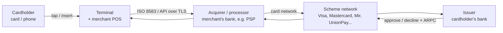
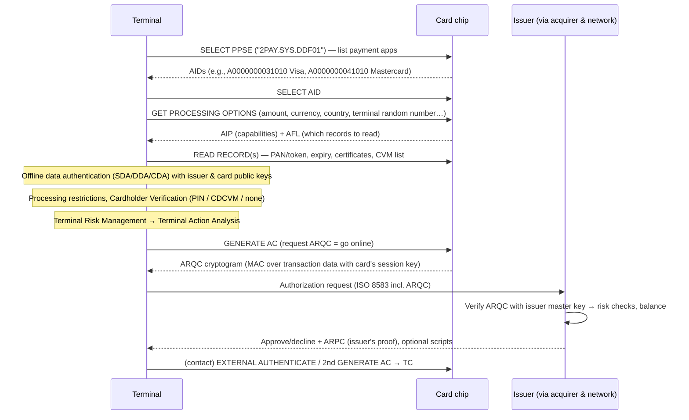

# How a Payment Terminal Works

> **Level:** Advanced · **Related:** [NFC](../04-wireless-and-telecom/nfc.md) · [Encryption](encryption.md) · [SIM/eSIM](../04-wireless-and-telecom/sim-esim.md) · [3G/4G/5G](../04-wireless-and-telecom/cellular-3g-4g-5g.md) · [Malware](malware.md)

## 1. What happens when you tap your card

A **payment terminal** (POS — point of sale, or POI — point of interaction) reads a payment credential (chip, contactless, magstripe, phone wallet), gathers cardholder verification, obtains **authorization** from the card issuer through a network of intermediaries, and records the transaction for later **clearing and settlement** — typically in 1–3 seconds.

### The players (four-party model)



- **Issuer** — bank that issued the card; decides approve/decline; owns the card's keys.
- **Acquirer** — bank/processor serving the merchant; routes transactions; guarantees settlement to the merchant.
- **Scheme / network** — Visa, Mastercard, etc.; routes messages, sets rules, performs clearing.
- (American Express and Discover are traditionally "three-party": issuer and acquirer are the same company.)

## 2. Terminal hardware

A modern terminal is a hardened embedded computer:

| Component | Role |
|---|---|
| Application processor | Runs the payment app; often **Android-based** (SoftPOS/"smart POS") or proprietary RTOS/Linux |
| **Secure processor / secure element** | Holds keys, performs PIN encryption; tamper-responsive |
| Contact chip reader | ISO 7816 interface for EMV chip cards |
| **Contactless reader** | 13.56 MHz [NFC](../04-wireless-and-telecom/nfc.md) (ISO 14443 A/B), EMVCo contactless kernels |
| Magstripe reader | Legacy, often with encrypting read head |
| **PIN pad** | Keys wired directly into the secure processor (PIN never touches the app processor) |
| Tamper mesh & switches | Detects opening/drilling/probing → **zeroizes keys** instantly |
| Connectivity | Ethernet, Wi-Fi, [4G/5G](../04-wireless-and-telecom/cellular-3g-4g-5g.md) with a [SIM](../04-wireless-and-telecom/sim-esim.md), Bluetooth to a POS |
| Printer, display, battery | |

Certified under **PCI PTS POI** (hardware security) and **EMVCo** Level 1 (electrical/RF) and Level 2 (kernel software) testing, plus scheme Level 3 certification with each acquirer.

## 3. EMV: the chip protocol

**EMV** (Europay, Mastercard, Visa — now EMVCo) replaced magstripe's static data with **cryptographic, per-transaction proof** from a chip. The chip is a secure microcontroller (like a [SIM](../04-wireless-and-telecom/sim-esim.md)) holding keys that never leave it.

### 3.1 Transaction flow (contact or contactless)



### 3.2 The cryptogram — why cloning a chip card doesn't work
- Each card has a unique key derived from the issuer master key: `MK_card = f(IMK, PAN, PSN)` (3DES or AES).
- Per transaction, a **session key** is derived using the **Application Transaction Counter (ATC)**.
- The **ARQC** = MAC over amount, currency, date, terminal **unpredictable number**, ATC, etc.
- The issuer recomputes it. A replayed or skimmed cryptogram fails (wrong ATC / unpredictable number / amount).

Conceptual demo (HMAC stands in for EMV's 3DES/AES MAC — **not** the real algorithm):

```python
import hmac, hashlib, os
IMK = os.urandom(16)                                         # issuer master key (in an HSM)
def derive(key, data): return hmac.new(key, data, hashlib.sha256).digest()[:16]
PAN = b"4111111111111111"
card_key = derive(IMK, PAN)                                  # personalized into the chip
def arqc(card_key, atc: int, amount_cents: int, un: bytes):
    session = derive(card_key, atc.to_bytes(2, "big"))
    msg = amount_cents.to_bytes(6, "big") + b"\x09\x78" + un + atc.to_bytes(2, "big")  # 0978 = EUR
    return derive(session, msg)[:8]
un = os.urandom(4)                                           # terminal's unpredictable number
card_cryptogram = arqc(card_key, atc=42, amount_cents=1999, un=un)
issuer_check = arqc(derive(IMK, PAN), 42, 1999, un)          # issuer re-derives from IMK
print("ARQC valid:", hmac.compare_digest(card_cryptogram, issuer_check))
```

### 3.3 Offline data authentication
Uses an RSA (or, in newer specs, ECC) PKI: **Scheme CA public keys** in the terminal → verify **issuer public key certificate** on the card → verify card data/dynamic signatures.
- **SDA** (static; legacy), **DDA** (card signs terminal challenge — proves chip is genuine), **CDA** (card signs the cryptogram too — prevents wedge attacks).

### 3.4 Cardholder verification (CVM)
- **Online PIN**: PIN encrypted by the PIN pad's secure processor into a **PIN block** (ISO 9564 format 0/4) and verified by the issuer.
- **Offline PIN**: verified by the chip (plaintext or enciphered).
- **CDCVM** (Consumer Device CVM): phone biometric/passcode (Apple Pay, Google Wallet).
- **No CVM** below the contactless limit (e.g., €50, varies by country).
- Signature (largely retired).

## 4. Contactless and mobile wallets

- Contactless uses the same EMV logic over ISO 14443 [NFC](../04-wireless-and-telecom/nfc.md), streamlined into one or two exchanges (Visa **qVSDC**, Mastercard **M/Chip** kernels; EMVCo's unified **Kernel C-8**) to finish within ~500 ms while the card is in the field.
- **Mobile wallets** use **tokenization** (EMVCo Payment Tokenisation): the phone holds a **Device PAN / token** instead of the real card number; the network's **Token Service Provider** maps it back. Stolen tokens are useless elsewhere (domain-restricted, device-bound).
  - Apple Pay: token + keys in the **Secure Element**.
  - Google Wallet: **HCE** with limited-use keys replenished from the cloud.
- **SoftPOS / Tap to Pay on iPhone/Android**: a normal phone becomes the terminal (PCI **MPoC** standard) — PIN entry on the glass with secure-display techniques and attestation.

## 5. Key management inside terminals

Terminals never use one static key for everything:

- **DUKPT** (Derived Unique Key Per Transaction, ANSI X9.24): a **Base Derivation Key (BDK)** lives in the acquirer's HSM; each terminal gets an initial key derived from BDK + its Key Serial Number (KSN). Every transaction derives a new key and discards the previous one → compromising one transaction key doesn't expose others (future keys can't be derived from past ones). AES-DUKPT is the modern version.
- **Master/Session keys** (TR-31 key blocks bind keys to usage attributes).
- **Remote Key Injection (RKI)** with PKI (TR-34) replaces loading keys in secure rooms.
- **P2PE** (Point-to-Point Encryption): card data encrypted in the secure reader, decrypted only in the processor's HSM → merchant systems never see card numbers (reduces PCI DSS scope).
- **HSMs** (Thales payShield, Utimaco, Futurex) at acquirers/issuers verify PINs and cryptograms without exposing keys.

## 6. The messages: ISO 8583

Authorization messages between acquirer, network and issuer follow **ISO 8583**: a message type indicator + a **bitmap** declaring which **data elements** follow.

| MTI | Meaning |
|---|---|
| 0100 / 0110 | Authorization request / response |
| 0200 / 0210 | Financial transaction request / response |
| 0400 / 0420 | Reversal |
| 0800 / 0810 | Network management (echo, sign-on, key exchange) |

Key data elements: DE2 PAN, DE3 processing code, DE4 amount, DE11 STAN, DE14 expiry, DE22 POS entry mode (`07x` contactless chip), DE38 auth code, **DE39 response code** (`00` approved, `05` do not honor, `51` insufficient funds, `55` incorrect PIN), **DE55 EMV data (TLV)** including ARQC (tag `9F26`), ATC (`9F36`), unpredictable number (`9F37`).

Newer rails use **ISO 20022** (XML/JSON) and acquirer REST APIs; terminal-to-POS integration often uses protocols like **Nexo**, OPI, or vendor SDKs.

Parsing EMV **TLV** (tag-length-value, BER-TLV) in Python:

```python
def parse_tlv(data: bytes):
    i, out = 0, {}
    while i < len(data):
        tag = data[i]; i += 1
        if tag & 0x1F == 0x1F:                   # multi-byte tag
            tag = (tag << 8) | data[i]; i += 1
            while data[i - 1] & 0x80:
                tag = (tag << 8) | data[i]; i += 1
        length = data[i]; i += 1
        if length & 0x80:                        # long-form length
            n = length & 0x7F; length = int.from_bytes(data[i:i + n], "big"); i += n
        out[f"{tag:X}"] = data[i:i + length].hex().upper(); i += length
    return out
de55 = bytes.fromhex("9F2608A1B2C3D4E5F607089F360200429F3704DEADBEEF")
print(parse_tlv(de55))   # {'9F26': 'A1B2C3D4E5F60708', '9F36': '0042', '9F37': 'DEADBEEF'}
```

## 7. After authorization: clearing and settlement

1. **Authorization** only places a hold on funds.
2. At day's end the terminal/POS performs **batch close / capture**.
3. **Clearing**: acquirer sends transaction details to the network; network forwards to issuers; **interchange fees** are computed.
4. **Settlement**: funds move issuer → network → acquirer → merchant (T+1/T+2), minus fees (interchange + scheme + acquirer markup = **MDR**).
5. **Chargebacks** allow cardholders to dispute; liability shifts depend on who used the less secure technology (e.g., merchant accepting magstripe when chip was available).

## 8. Security threats and defenses

| Threat | How | Defense |
|---|---|---|
| **Skimming** (magstripe) | Overlay reader copies track data | EMV chip, encrypting read heads, anti-skimming detection |
| **Shimming** | Thin device inside chip slot intercepts chip data | Chip data is useless for chip cloning (cryptograms); CVV differs (iCVV) |
| **POS RAM scrapers** | [Malware](malware.md) on Windows-based POS reading card data from memory (Target 2013) | P2PE/tokenization — merchant systems never hold clear PANs; app control, segmentation |
| **Relay attacks** on contactless | Forward NFC APDUs to a distant card | Transaction limits, cumulative counters, CDCVM, relay-resistance protocol (EMV 2nd gen, timing) |
| **Pre-play / downgrade** | Predictable unpredictable numbers; forcing fallback to magstripe | Certified RNGs, fallback blocking |
| **Tampering with terminal** | Open device to insert bugs | Tamper mesh zeroizes keys; PCI PTS certification; supply-chain seals |
| **Card-not-present fraud** (online) | Stolen card numbers | 3-D Secure 2 (risk-based authentication), network tokens, passkeys |

Compliance: **PCI DSS** (merchants/processors handling card data), **PCI PIN** (PIN handling), **PCI PTS** (devices), **PCI P2PE**, **PCI MPoC**.

## 9. Terminal software platforms & OS notes

- Traditional terminals (Verifone, Ingenico/Worldline, PAX) ran proprietary secure OSes; many new ones are **Android-based** with a separate secure processor (PAX, Sunmi, Verifone Carbon) — apps distributed through vendor-managed stores.
- Merchant POS software commonly runs on **Windows** (retail POS, OPOS/UPOS peripheral drivers, often Windows IoT Enterprise) or **Linux**; the terminal attaches over USB/serial/TCP with semi-integrated protocols so card data never enters the POS PC.
- Developers integrate through PSP SDKs/APIs (Adyen, Stripe Terminal, Square, SumUp) — e.g., Stripe Terminal's JavaScript SDK:

```js
// Browser POS app driving a certified card reader (card data never reaches this code)
const terminal = StripeTerminal.create({ onFetchConnectionToken: fetchTokenFromYourServer });
const { discoveredReaders } = await terminal.discoverReaders({ simulated: true });
await terminal.connectReader(discoveredReaders[0]);
const clientSecret = await createPaymentIntentOnServer(1999, "eur");    // server-side call
const { paymentIntent } = await terminal.collectPaymentMethod(clientSecret);
const result = await terminal.processPayment(paymentIntent);           // EMV + authorization
console.log(result.paymentIntent?.status);                              // "requires_capture" / "succeeded"
```

## Further reading
- EMVCo *EMV Integrated Circuit Card Specifications for Payment Systems*, Books 1–4; EMV Contactless Kernel specs
- ANSI X9.24 (DUKPT), ISO 9564 (PIN), ISO 8583
- PCI Security Standards Council documents (PTS POI, DSS v4.0, P2PE, MPoC)
- Murdoch et al., *Chip and PIN is Broken* (IEEE S&P 2010); Basin et al., *The EMV Standard: Break, Fix, Verify* (2021)
