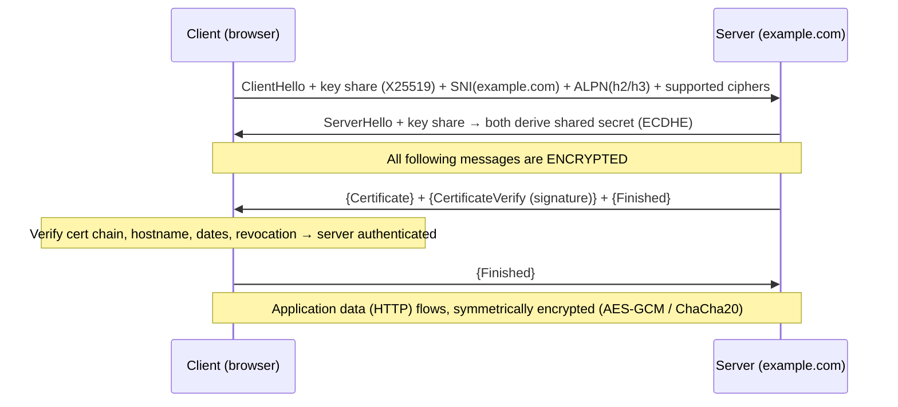

# How SSL/TLS Works

> **Level:** Advanced · **Related:** [Encryption](encryption.md) · [Web Protocols](../05-networking-and-web/web-protocols.md) · [DNS](../05-networking-and-web/dns.md) · [Domains](../05-networking-and-web/domains.md) · [Web Server](../05-networking-and-web/web-server.md) · [Browser](../05-networking-and-web/browser.md)

## 1. What SSL/TLS is

**TLS (Transport Layer Security)** — still widely called **SSL** after its predecessor — is the protocol that secures most internet traffic. It wraps an ordinary TCP (or QUIC) connection in a layer that provides:

1. **Confidentiality** — encryption, so eavesdroppers see only ciphertext.
2. **Integrity** — tampering is detected.
3. **Authentication** — the server proves it really is `example.com` (via a **certificate**), optionally the client too.

It's the **S in HTTPS**, and also secures email (SMTP/IMAP over TLS), [VPNs](../05-networking-and-web/vpn.md), databases, MQTT, and more. This page focuses on the handshake and the certificate/trust system; the cryptographic primitives live in [Encryption](encryption.md).

**Naming/versions:** SSL 2.0/3.0 (1990s) are **broken and disabled**. TLS 1.0/1.1 are deprecated. **TLS 1.2** (2008) is widely used; **TLS 1.3** (2018, RFC 8446) is the modern default — faster and simpler. "SSL certificate" is a legacy misnomer for a TLS certificate.

## 2. Where TLS sits

```
┌──────────────────────────────┐
│ Application: HTTP, SMTP, ...  │
├──────────────────────────────┤
│ TLS  (handshake + record)    │  ← encrypts everything above
├──────────────────────────────┤
│ TCP (or QUIC, which has TLS 1.3 built in)  │
├──────────────────────────────┤
│ IP                           │
└──────────────────────────────┘
```

TLS has two parts: the **handshake protocol** (negotiate parameters, authenticate, derive keys) and the **record protocol** (chop data into encrypted, authenticated records).

## 3. The handshake

The handshake solves a hard problem: two strangers must agree on a shared secret key over a wire an attacker can read — and the client must be sure of *who* it's talking to. It combines [asymmetric and symmetric crypto](encryption.md#44-hybrid-encryption): public-key math to authenticate and agree a key, then fast symmetric encryption for the data.

### TLS 1.3 handshake (1 round trip)



1. **Key agreement**: client and server exchange **ephemeral** [ECDHE](encryption.md#43-diffiehellman-key-exchange) public keys and independently compute the same shared secret — which never crosses the wire. Because keys are ephemeral (new per session), TLS 1.3 always has **forward secrecy**: stealing the server's long-term key later can't decrypt recorded past sessions.
2. **Key derivation**: the shared secret is run through **HKDF** to produce separate keys for each direction.
3. **Server authentication**: the server sends its **certificate** and signs the handshake transcript (**CertificateVerify**), proving it holds the certificate's private key. The client validates the [chain of trust](#4-certificates-and-the-chain-of-trust).
4. **Finished** messages MAC the whole transcript, so any tampering (e.g., a downgrade attempt) is detected.

TLS 1.2 needed **2 round trips** and negotiated key exchange + cipher separately (with pitfalls like static-RSA key exchange, which lacked forward secrecy). TLS 1.3 removed all the weak options, encrypts more of the handshake, and added **0-RTT** resumption (send data on the first flight using a pre-shared key — with replay caveats).

### What's negotiated
- **Cipher suite**: e.g., `TLS_AES_128_GCM_SHA256`, `TLS_CHACHA20_POLY1305_SHA256`.
- **Key exchange group**: X25519 (and hybrid **X25519MLKEM768** for [post-quantum](encryption.md#8-the-post-quantum-transition) protection against "harvest now, decrypt later").
- **SNI** (Server Name Indication): the hostname, so one IP can serve many sites — encrypted as **ECH** (Encrypted Client Hello) in the newest deployments.
- **ALPN**: which application protocol (`h2`, `h3`, `http/1.1`).

## 4. Certificates and the chain of trust

A **certificate** is a signed statement binding a **domain name** to a **public key**. It answers "is this really example.com's key?" The trust comes from a hierarchy of **Certificate Authorities (CAs)**.

```
Root CA  (self-signed; preloaded in OS/browser trust stores)
   │  signs
Intermediate CA
   │  signs
Leaf certificate for example.com
   • Subject Alternative Names: example.com, www.example.com
   • Public key
   • Validity: notBefore / notAfter (≤ 398 days, dropping toward ~47 days)
   • Issuer, serial, signature
```

The client verifies:
1. **Signature chain** — each cert is signed by the next up, ending at a **trusted root** it already has.
2. **Hostname match** — the requested name is in the cert's **SAN** list.
3. **Validity dates** — not expired, not yet valid.
4. **Revocation** — not revoked (**OCSP**/OCSP stapling, CRLs, or browser push lists like CRLite).
5. **Constraints/policies** — key usage, name constraints, and **CAA** DNS records limiting which CAs may issue for the domain.

### Certificate validation levels
| Level | What's verified | Shown as |
|---|---|---|
| **DV** (Domain Validation) | Control of the domain | Padlock; the norm (Let's Encrypt) |
| **OV** (Organization) | + org identity | Padlock; details in cert |
| **EV** (Extended) | + rigorous legal identity | Padlock (browsers no longer show the green bar) |

### Domain validation & free certs
CAs prove you control the domain via an **ACME challenge**: publish a specific [DNS](../05-networking-and-web/dns.md) TXT record, or serve a token file over HTTP. **Let's Encrypt** automated this and made certificates free and ubiquitous — see [Domains §7](../05-networking-and-web/domains.md#7-domains-https-and-identity).

**Certificate Transparency (CT)**: every issued cert is logged to public append-only logs; browsers require proof (SCTs), so mis-issued certificates are detectable.

## 5. The record protocol

After the handshake, application data is protected by **AEAD** ([authenticated encryption](encryption.md#24-aead-always-use-authenticated-encryption)) — AES-GCM or ChaCha20-Poly1305. Each record is encrypted and carries an authentication tag; a per-record nonce (from a sequence counter) prevents replay and reordering. Decryption fails closed if a single bit changed.

## 6. Setting up and inspecting TLS

**Get and use a certificate (server side):**

```bash
# Automatic HTTPS via ACME/Let's Encrypt
sudo certbot --nginx -d example.com -d www.example.com   # obtains + installs + auto-renews
# Caddy and Traefik do this automatically with zero config; win-acme on Windows/IIS
```

**Inspect a live connection:**

```bash
openssl s_client -connect example.com:443 -servername example.com </dev/null 2>/dev/null \
  | openssl x509 -noout -subject -issuer -dates -ext subjectAltName
# TLS version + cipher actually negotiated:
openssl s_client -connect example.com:443 -servername example.com </dev/null 2>/dev/null | grep -E 'Protocol|Cipher'
curl -Iv https://example.com 2>&1 | grep -E 'SSL connection|subject|issuer'
```

```powershell
# Windows
Test-NetConnection example.com -Port 443
# View trusted roots / a server cert:
Get-ChildItem Cert:\LocalMachine\Root | Select Subject, NotAfter
```

**Client code — verifying and reading the cert (Python):**

```python
import ssl, socket
ctx = ssl.create_default_context()                 # verifies chain + hostname by DEFAULT
with ctx.wrap_socket(socket.socket(), server_hostname="example.com") as s:
    s.connect(("example.com", 443))
    print("TLS:", s.version(), "| cipher:", s.cipher()[0])
    cert = s.getpeercert()
    print("issued to:", dict(x[0] for x in cert["subject"]).get("commonName"))
    print("SANs:", [v for k, v in cert["subjectAltName"]])   # e.g. [('DNS','example.com'), ...]
    print("expires:", cert["notAfter"])
```

Never disable verification (`verify=False`, `CURL_INSECURE`, `NODE_TLS_REJECT_UNAUTHORIZED=0`) in production — it silently removes the authentication guarantee, enabling man-in-the-middle attacks.

**Implementations:** OpenSSL, BoringSSL, LibreSSL, GnuTLS, and platform stacks — **SChannel** (Windows), Secure Transport/Network.framework (Apple), rustls, Go's `crypto/tls`. Browsers use their own (BoringSSL/NSS).

## 7. Mutual TLS (mTLS)

Normally only the server authenticates. In **mTLS**, the client also presents a certificate, so both sides are verified — used for service-to-service auth in microservices/service meshes, zero-trust networks, banking, and IoT. The server requests a client cert during the handshake and validates it against a trusted CA.

## 8. How TLS fails in the real world

| Problem | Cause | Fix |
|---|---|---|
| Expired certificate | Missed renewal | Automate (ACME), monitor expiry |
| Name mismatch | Cert doesn't cover the hostname | Include all names in SAN |
| Untrusted issuer | Self-signed or unknown CA, or missing intermediate | Serve full chain; use a public CA |
| Weak config | Old TLS versions, RC4, export ciphers | TLS 1.2+/1.3 only; test with SSL Labs / `testssl.sh` |
| Downgrade/stripping | Attacker forces HTTP or old TLS | **HSTS**, TLS 1.3, `Finished` MAC |
| Mixed content | HTTPS page loads HTTP assets | Serve everything over HTTPS |
| MITM interception | Corporate proxy or malware installs its own root CA | See [Proxy §3.4](../05-networking-and-web/proxy.md#34-tls-intercepting-proxies-mitm-by-design); CT + pinning detect abuse |

Historic breaks worth knowing: **Heartbleed** (2014, OpenSSL memory leak), **POODLE**/**BEAST** (SSL 3/CBC), **CRIME/BREACH** (compression + TLS — see [Compression §8](compression.md#8-security-considerations)) — most are why the modern defaults exist.

## Further reading
- RFC 8446 (TLS 1.3), RFC 5246 (TLS 1.2), RFC 6125 (hostname verification), RFC 8555 (ACME)
- Ivan Ristić, *Bulletproof TLS and PKI*; SSL Labs test + "SSL/TLS Deployment Best Practices"
- `testssl.sh`; the Let's Encrypt documentation; Cloudflare Learning Center on TLS
