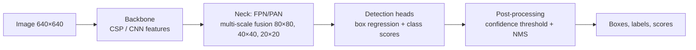

# How AI Image Detection Works

> **Level:** Advanced · **Related:** [NPU](../01-hardware/npu.md) · [GPU](../01-hardware/gpu.md) · [LLMs](llm.md) · [Offline AI](offline-ai.md) · [Sensors (cameras)](../01-hardware/sensors-and-detectors.md) · [DLSS](../02-graphics/dlss.md)

"AI image detection" covers two related families of tasks:

1. **Computer-vision recognition** — detecting *what is in* an image: classification, object detection, segmentation, face/pose recognition, OCR.
2. **Synthetic-image / deepfake detection** — detecting whether an image was *generated or manipulated by AI*.

Both rest on the same foundation: deep neural networks that learn visual features from data.

---

## Part A — Recognizing what's in an image

## 1. Images as tensors

A color image is a 3D array: **height × width × channels** (e.g., 224×224×3, values 0–255). Frameworks use `NCHW` (PyTorch) or `NHWC` (TensorFlow/most NPUs) batched layouts. Preprocessing: resize, normalize (`(x/255 − mean)/std`), augment (flips, crops, color jitter) during training.

## 2. Task taxonomy

| Task | Output | Example models |
|---|---|---|
| **Classification** | One label per image (+ probability) | ResNet, EfficientNet, ConvNeXt, ViT |
| **Object detection** | Boxes `(x, y, w, h)` + class + confidence | YOLO (v5–v11/YOLO26), Faster R-CNN, **DETR/RT-DETR** |
| **Semantic segmentation** | Class per pixel | U-Net, DeepLab, SegFormer |
| **Instance segmentation** | Mask per object | Mask R-CNN, YOLO-seg, **SAM 2** (promptable) |
| **Keypoints / pose** | Joint coordinates | OpenPose, YOLO-pose |
| **Open-vocabulary detection** | Detect anything described in text | CLIP-based, Grounding DINO, OWL-ViT, YOLO-World |
| **OCR / document** | Text and layout | CRNN, TrOCR, VLMs |

## 3. Convolutional Neural Networks (CNNs)

A **convolution** slides a small learned filter (e.g., 3×3×C) over the image, computing dot products → a **feature map** that responds to a pattern (edge, texture). Stacking layers builds a hierarchy:

```
Input → [Conv 3×3 → BatchNorm → ReLU] × n → Pool (downsample) → ... → Global pool → Fully connected → Softmax
          edges           textures           parts              objects                class probs
```

Key ideas:
- **Weight sharing** & **locality** → few parameters, translation equivariance.
- **Receptive field** grows with depth → later layers "see" whole objects.
- **ResNet skip connections** (`y = F(x) + x`) enable 50–150+ layer networks.
- Convolutions are GEMMs in disguise → perfect for [GPUs](../01-hardware/gpu.md) and [NPUs](../01-hardware/npu.md).

Convolution by hand in NumPy (what a single filter computes):

```python
import numpy as np
def conv2d(img, k):
    H, W = img.shape; kh, kw = k.shape
    out = np.zeros((H - kh + 1, W - kw + 1))
    for y in range(out.shape[0]):
        for x in range(out.shape[1]):
            out[y, x] = np.sum(img[y:y+kh, x:x+kw] * k)
    return out
sobel_x = np.array([[-1, 0, 1], [-2, 0, 2], [-1, 0, 1]])   # a hand-made "edge detector" filter
# A CNN *learns* thousands of such filters from data instead of hand-designing them.
```

## 4. Vision Transformers (ViT)

Split the image into **patches** (e.g., 16×16), linearly embed each as a token, add position embeddings, and run a **Transformer** encoder: **self-attention** lets every patch attend to every other → global context from layer one.

```
Attention(Q, K, V) = softmax(Q·Kᵀ / √d) · V
```

ViTs scale excellently with data; hybrids (ConvNeXt, Swin with windowed attention) combine CNN efficiency and Transformer flexibility. Self-supervised pretraining (**DINOv2/DINOv3**, MAE) and image–text contrastive pretraining (**CLIP**, SigLIP) produce general-purpose visual features used by nearly everything downstream, including **vision-language models** (VLMs) that describe or answer questions about images.

## 5. How object detectors work

### 5.1 Two-stage (R-CNN family)
Backbone → **Region Proposal Network** suggests candidate boxes → RoI pooling → classify + refine each. Accurate, slower.

### 5.2 One-stage (YOLO, SSD, RetinaNet)
A single pass predicts, for each grid cell / feature-map location at several scales (**FPN**), box coordinates + objectness + class scores. Modern YOLOs are **anchor-free** and predict box distances directly.



### 5.3 Non-Maximum Suppression (NMS)
Detectors output many overlapping boxes for the same object. NMS keeps the highest-scoring box and removes others whose **IoU** (Intersection over Union) exceeds a threshold:

```python
import numpy as np
def iou(a, b):  # boxes as [x1, y1, x2, y2]
    ix1, iy1 = max(a[0], b[0]), max(a[1], b[1]); ix2, iy2 = min(a[2], b[2]), min(a[3], b[3])
    inter = max(0, ix2 - ix1) * max(0, iy2 - iy1)
    area = lambda r: (r[2] - r[0]) * (r[3] - r[1])
    return inter / (area(a) + area(b) - inter + 1e-9)

def nms(boxes, scores, thr=0.5):
    order, keep = np.argsort(scores)[::-1], []
    while len(order):
        i = order[0]; keep.append(i)
        order = np.array([j for j in order[1:] if iou(boxes[i], boxes[j]) < thr])
    return keep
```

**DETR**-style transformers predict a set of boxes directly with bipartite (Hungarian) matching → no NMS needed (RT-DETR, and NMS-free YOLO variants).

### 5.4 Training
- **Loss** = box regression (L1 + **GIoU/CIoU**) + classification (cross-entropy / focal loss) + objectness.
- **Data**: labeled datasets (COCO: 80 classes, ~118k training images; Open Images; custom labels via tools like CVAT, Label Studio, Roboflow).
- **Transfer learning**: start from pretrained weights, fine-tune on your classes — hundreds to thousands of images often suffice.
- **Metrics**: precision, recall, **mAP@0.5** and **mAP@0.5:0.95** (COCO standard).

## 6. Hands-on

**Classification with a pretrained model (PyTorch):**

```python
import torch
from torchvision.models import resnet50, ResNet50_Weights
from PIL import Image
weights = ResNet50_Weights.DEFAULT
model = resnet50(weights=weights).eval()
x = weights.transforms()(Image.open("dog.jpg")).unsqueeze(0)
with torch.inference_mode():
    probs = model(x).softmax(-1)[0]
top = probs.topk(3)
print([(weights.meta["categories"][i], round(p.item(), 3)) for p, i in zip(top.values, top.indices)])
```

**Object detection (Ultralytics YOLO):**

```python
from ultralytics import YOLO
model = YOLO("yolo11n.pt")                         # small pretrained COCO model
results = model("street.jpg", conf=0.25)
for b in results[0].boxes:
    print(model.names[int(b.cls)], float(b.conf), b.xyxy.tolist())
model.train(data="my_dataset.yaml", epochs=50, imgsz=640)   # fine-tune on custom classes
model.export(format="onnx")                                  # deploy to ONNX Runtime / NPU / browser
```

**In the browser (JavaScript, TensorFlow.js or ONNX Runtime Web with WebGPU/WebNN):**

```js
import * as cocoSsd from "@tensorflow-models/coco-ssd";
import "@tensorflow/tfjs-backend-webgl";
const model = await cocoSsd.load();
const predictions = await model.detect(document.querySelector("video"));
predictions.forEach(p => console.log(p.class, p.score.toFixed(2), p.bbox));   // runs on the GPU
```

**C++ with OpenCV DNN (edge / embedded):**

```cpp
#include <opencv2/dnn.hpp>
#include <opencv2/imgcodecs.hpp>
cv::dnn::Net net = cv::dnn::readNetFromONNX("yolo11n.onnx");
net.setPreferableBackend(cv::dnn::DNN_BACKEND_OPENCV);
cv::Mat img = cv::imread("street.jpg");
cv::Mat blob = cv::dnn::blobFromImage(img, 1 / 255.0, cv::Size(640, 640), cv::Scalar(), true, false);
net.setInput(blob);
cv::Mat out = net.forward();   // [1, 84, 8400]: 4 box coords + 80 class scores per candidate → decode + NMS
```

## 7. Deployment: where inference runs

| Target | Runtime | Notes |
|---|---|---|
| Datacenter GPU | TensorRT, PyTorch, Triton | Batching, FP16/INT8/FP8 |
| PC (Windows) | ONNX Runtime + DirectML / **Windows ML** → GPU or [NPU](../01-hardware/npu.md) | Copilot+ PCs: 40+ TOPS NPUs |
| PC (Linux) | ONNX Runtime (CUDA/ROCm/OpenVINO), TensorRT | Intel NPU via OpenVINO |
| Phones | Core ML (ANE), LiteRT/TFLite, QNN (Hexagon) | INT8 quantized models |
| Browser | WebGPU/WebNN via ONNX Runtime Web, TF.js | Privacy: images stay on-device |
| Cameras / MCUs | Hailo, Coral Edge TPU, Jetson, ESP32-S3 (tiny models) | Always-on detection |

Optimization: quantization (INT8), pruning, knowledge distillation, operator fusion, reduced input resolution, TensorRT/OpenVINO compilation.

---

## Part B — Detecting AI-generated or manipulated images

## 8. Why it's hard

Modern generators — **diffusion models** (Stable Diffusion, FLUX, Midjourney, DALL·E / GPT-image, Imagen), GANs (StyleGAN), and face-swap/reenactment tools — produce photorealistic images. Detection is an **adversarial arms race**: every new generator changes the telltale traces, and simple edits (resizing, JPEG recompression, screenshots) destroy fragile signals.

## 9. Approaches

### 9.1 Learned artifact detectors (passive forensics)
Train a classifier on real vs generated images. Generators leave statistical fingerprints:
- **Frequency-domain artifacts** — upsampling layers (transposed convolutions) create periodic patterns visible in the **FFT** spectrum; diffusion decoders (VAE) leave characteristic high-frequency statistics.
- **Noise residuals** — subtract a denoised version of the image to isolate sensor noise vs synthetic noise (real cameras have **PRNU**, a per-sensor noise fingerprint; generated images lack it).
- **Semantic inconsistencies** — lighting/shadow direction, reflections in eyes, text rendering, hands, perspective geometry.
- **Foundation-model features** — using CLIP/DINO embeddings plus a light classifier generalizes better to unseen generators (e.g., UnivFD), and **reconstruction-based** methods check how well a diffusion model's autoencoder reconstructs the image (DIRE, AEROBLADE — generated images reconstruct "too well").

Frequency-spectrum inspection in Python:

```python
import numpy as np
from PIL import Image, ImageFilter
gray = Image.open("suspect.png").convert("L")
img = np.asarray(gray, dtype=np.float32)
denoised = np.asarray(gray.filter(ImageFilter.MedianFilter(3)), dtype=np.float32)
residual = img - denoised                        # high-frequency "noise residual"
spectrum = np.log1p(np.abs(np.fft.fftshift(np.fft.fft2(residual))))
Image.fromarray((255 * spectrum / spectrum.max()).astype(np.uint8)).save("spectrum.png")
# Regular grid-like peaks away from the center often indicate upsampling artifacts of generators.
```

A binary detector is just a fine-tuned classifier:

```python
import torch, torch.nn as nn
from torchvision.models import convnext_tiny, ConvNeXt_Tiny_Weights
model = convnext_tiny(weights=ConvNeXt_Tiny_Weights.DEFAULT)
model.classifier[2] = nn.Linear(model.classifier[2].in_features, 2)   # real vs synthetic
# Train on balanced data from MANY generators + heavy augmentation (JPEG, resize, blur, crops)
# so it doesn't overfit to one model's quirks; evaluate on generators held out from training.
```

**Limitations**: poor generalization to unseen generators, vulnerable to post-processing and adversarial perturbations, false positives on heavily edited real photos. Treat outputs as probabilities, not verdicts.

### 9.2 Deepfake video/face detection
Analyze faces across frames: blending boundaries, temporal flicker, lip-sync mismatch (audio-visual consistency), physiological signals (subtle skin color changes from pulse — rPPG), head-pose inconsistencies. Benchmarks: FaceForensics++, DFDC, Celeb-DF.

### 9.3 Provenance and watermarking (proactive)
Rather than guessing from pixels, **prove origin**:

| Method | How | Examples |
|---|---|---|
| **Content Credentials (C2PA)** | Cryptographically signed manifest (certificate chain) embedded in the file, recording creator, tools and edits | Adobe, Microsoft, OpenAI, Google, camera makers (Leica, Sony, Nikon), LinkedIn display |
| **Invisible watermarks** | Signal embedded in pixels or in the generation process, robust to mild edits | Google DeepMind **SynthID**, Meta Video Seal, Stable Signature |
| **Metadata** | EXIF/XMP "made with AI" tags | Easily stripped — weak |

Verify C2PA manifests with the open-source `c2patool` (Windows/Linux/macOS) or contentcredentials.org/verify. Watermark robustness is imperfect (strong edits/regeneration can remove it), and C2PA requires ecosystem adoption — so practical systems **combine** provenance checks, watermark detection, and learned forensics, plus human review for high-stakes decisions.

## 10. Evaluation pitfalls (both parts)

- **Dataset bias**: models learn shortcuts (JPEG quality, image size, watermark position) instead of the real signal.
- **Distribution shift**: new cameras, lighting, generators.
- **Calibration**: a 0.9 score is not "90% certain" unless calibrated.
- **Adversarial robustness**: small perturbations can flip predictions.
- **Fairness/ethics**: face-related systems require bias audits and legal compliance (e.g., EU AI Act restrictions on biometric identification).

## Further reading
- Goodfellow, Bengio, Courville, *Deep Learning*; Stanford **CS231n** notes
- Dosovitskiy et al., *An Image is Worth 16x16 Words* (ViT, 2020); Redmon et al., *YOLO* (2016); Carion et al., *DETR* (2020)
- Wang et al., *CNN-generated images are surprisingly easy to spot... for now* (CVPR 2020); Ojha et al., *Towards Universal Fake Image Detectors* (CVPR 2023)
- C2PA specification (c2pa.org); Google DeepMind SynthID docs
