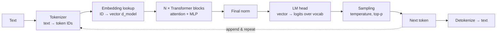

# How LLMs Work

> **Level:** Advanced · **Related:** [Tokenization](tokenization.md) · [Offline AI](offline-ai.md) · [GPU](../01-hardware/gpu.md) · [NPU](../01-hardware/npu.md) · [AI Image Detection](image-detection.md) · [APIs](../05-networking-and-web/api.md)

## 1. The one-sentence model

A **Large Language Model** is a neural network trained to predict the **next token** of text given all previous tokens. Generating an answer is running that prediction in a loop: predict a probability distribution over the vocabulary, pick a token, append it, repeat. Everything else — chat, coding, reasoning, tool use — emerges from doing this extremely well at huge scale, then shaping the behavior with further training.

```
"The capital of France is"  →  model  →  P(" Paris")=0.92, P(" a")=0.02, P(" the")=0.01 ...
                                         pick " Paris" → append → predict again → "."
```

## 2. The pipeline end to end



1. **[Tokenization](tokenization.md)** splits text into subword tokens (vocabularies of ~32k–260k).
2. **Embedding**: each token ID becomes a learned vector of size `d_model` (e.g., 4096).
3. **Transformer blocks** (dozens to 100+ layers) mix information between positions (attention) and transform each position (MLP).
4. **LM head**: a matrix projecting the final vector to one score (**logit**) per vocabulary token.
5. **Softmax + sampling** chooses the next token.

## 3. The Transformer block (decoder-only)

Modern LLMs (GPT, Claude, Llama, Qwen, Mistral, Gemma, DeepSeek) are **decoder-only Transformers** (Vaswani et al., 2017, "Attention Is All You Need").

```
x ─┬─► RMSNorm ─► Multi-head self-attention (causal) ─► + ─┬─► RMSNorm ─► MLP (SwiGLU) ─► + ─► out
   └──────────────────── residual ─────────────────────────┘└──────────── residual ─────────────┘
```

### 3.1 Self-attention: how tokens talk to each other

Each position produces three vectors by multiplying its hidden state with learned matrices:
- **Query (Q)** — "what am I looking for?"
- **Key (K)** — "what do I contain?"
- **Value (V)** — "what do I pass along if selected?"

```
Attention(Q, K, V) = softmax( Q·Kᵀ / √d_k  +  causal_mask ) · V
```

The **causal mask** sets scores for future positions to −∞ so token *t* only sees tokens ≤ *t* (you can't peek at the answer you're predicting). **Multi-head** attention runs this in parallel with e.g. 32 heads, each learning different relationships (syntax, coreference, copying, positional patterns).

A complete causal self-attention in NumPy:

```python
import numpy as np

def softmax(x, axis=-1):
    x = x - x.max(axis=axis, keepdims=True)
    e = np.exp(x); return e / e.sum(axis=axis, keepdims=True)

def causal_self_attention(x, Wq, Wk, Wv, Wo, n_heads):
    T, d = x.shape; hd = d // n_heads
    q = (x @ Wq).reshape(T, n_heads, hd).transpose(1, 0, 2)   # (heads, T, hd)
    k = (x @ Wk).reshape(T, n_heads, hd).transpose(1, 0, 2)
    v = (x @ Wv).reshape(T, n_heads, hd).transpose(1, 0, 2)
    scores = q @ k.transpose(0, 2, 1) / np.sqrt(hd)            # (heads, T, T)
    mask = np.triu(np.ones((T, T), dtype=bool), k=1)           # True above diagonal = future
    scores[:, mask] = -np.inf
    out = softmax(scores) @ v                                   # weighted sum of values
    return out.transpose(1, 0, 2).reshape(T, d) @ Wo

rng = np.random.default_rng(0)
T, d, H = 5, 16, 4
x = rng.normal(size=(T, d))
W = [rng.normal(size=(d, d)) / np.sqrt(d) for _ in range(4)]
print(causal_self_attention(x, *W, n_heads=H).shape)   # (5, 16)
```

### 3.2 Position information
Attention by itself ignores order, so positions are injected. Most current models use **RoPE** (Rotary Position Embeddings): Q and K vectors are rotated by an angle proportional to position, so their dot product depends on *relative* distance. Scaling tricks (NTK/YaRN) extend context windows to 128k–1M+ tokens.

### 3.3 The MLP (feed-forward) layer
Applied to each position independently: `MLP(x) = W_down · (SiLU(W_gate·x) ⊙ (W_up·x))` (**SwiGLU**), with a hidden size ~2.7–4× `d_model`. MLPs hold most parameters and act as the model's key–value "memory" of facts and patterns.

### 3.4 Mixture of Experts (MoE)
Instead of one MLP, have e.g. 64–256 **experts**; a small **router** sends each token to the top-k (2–8). Total parameters are huge (hundreds of billions to >1T), but **active parameters** per token are small → cheaper inference per quality. Used by Mixtral, DeepSeek-V3, Qwen3-MoE, Llama 4, and many frontier models.

### 3.5 Sizes

| Model scale | Parameters | FP16 weights | Typical hardware |
|---|---|---|---|
| Small | 0.5–4 B | 1–8 GB | Phone NPU, laptop |
| Medium | 7–14 B | 14–28 GB | Consumer GPU (quantized) |
| Large | 30–70 B | 60–140 GB | Workstation / multi-GPU |
| Frontier | hundreds of B – trillions (often MoE) | TBs | GPU/TPU clusters |

Rough compute: generating one token costs ≈ **2 × active parameters** FLOPs.

## 4. Training

### 4.1 Pre-training
- Data: trillions of tokens (web, books, code, papers, synthetic data), heavily filtered and deduplicated.
- Objective: **cross-entropy** loss on next-token prediction: `L = −Σ log P(token_t | tokens_<t)`.
- Optimization: AdamW, learning-rate warmup + cosine/WSD decay, BF16/FP8 mixed precision.
- Parallelism across thousands of GPUs: **data parallel** (FSDP/ZeRO shards optimizer state), **tensor parallel** (split matrices), **pipeline parallel** (split layers), **expert parallel** (MoE).
- **Scaling laws** (Kaplan 2020, Chinchilla 2022): loss falls predictably as a power law in parameters, data and compute; compute-optimal ≈ ~20 tokens per parameter, though modern small models are "over-trained" far beyond that for cheaper inference.

The core training step in PyTorch:

```python
import torch, torch.nn.functional as F
logits = model(input_ids[:, :-1])                       # (batch, T-1, vocab)
loss = F.cross_entropy(logits.reshape(-1, logits.size(-1)),
                       input_ids[:, 1:].reshape(-1))     # targets = inputs shifted by one
loss.backward(); optimizer.step(); optimizer.zero_grad()
```

### 4.2 Post-training: from autocomplete to assistant
A pre-trained model continues text; it doesn't follow instructions reliably. Post-training shapes it:

1. **Supervised fine-tuning (SFT)** on high-quality instruction → response demonstrations, in a **chat template** (special tokens mark system/user/assistant turns).
2. **Preference optimization**: **RLHF** (train a reward model on human comparisons, optimize with PPO), **DPO** (optimize directly on preference pairs), **RLAIF / Constitutional AI** (AI feedback guided by written principles).
3. **Reinforcement learning with verifiable rewards (RLVR)**: reward correct math answers, passing unit tests, successful tool use → produces **reasoning models** that generate long chains of thought ("thinking tokens") before answering.
4. **Safety training**, red-teaming, evaluations.

## 5. Inference: generating text fast

### 5.1 Prefill vs decode
- **Prefill**: process the whole prompt in parallel — compute-bound (big matrix multiplies), fast per token.
- **Decode**: generate one token at a time — each step must read *all weights* from memory → **memory-bandwidth-bound**. Tokens/s ≈ memory bandwidth / bytes of active weights. (A 7B model at 4-bit ≈ 3.5–4 GB; on a 1 TB/s GPU ≈ up to ~250 tokens/s single stream.)

### 5.2 KV cache
Keys and values of past tokens never change, so they're cached instead of recomputed. Size = `2 × layers × kv_heads × head_dim × seq_len × bytes`. For long contexts this dominates memory. Techniques: **GQA/MQA** (share K/V across query heads), **MLA** (DeepSeek's compressed latent KV), KV quantization, **PagedAttention** (vLLM manages KV memory like OS pages — see [RAM](../01-hardware/ram.md#8-how-the-os-uses-ram-virtual-memory)), prefix caching (reuse KV for shared system prompts).

### 5.3 Other speedups
FlashAttention (tiled attention in on-chip SRAM), **continuous batching** (servers interleave many users' requests), **speculative decoding** (a small draft model proposes tokens; the big model verifies several at once), [quantization](offline-ai.md#3-quantization-making-models-fit) (INT8/INT4/FP8/FP4).

### 5.4 Sampling

```python
import numpy as np
def sample(logits, temperature=0.8, top_p=0.9, rng=np.random.default_rng()):
    if temperature == 0:
        return int(np.argmax(logits))                     # greedy, deterministic
    p = np.exp((logits - logits.max()) / temperature); p /= p.sum()
    order = np.argsort(p)[::-1]
    cum = np.cumsum(p[order])
    keep = order[: np.searchsorted(cum, top_p) + 1]       # nucleus: smallest set with mass ≥ top_p
    q = p[keep] / p[keep].sum()
    return int(rng.choice(keep, p=q))
```

- **Temperature** < 1 sharpens (more deterministic), > 1 flattens (more random).
- **Top-k / top-p (nucleus) / min-p** cut off the unlikely tail.
- **Constrained decoding** (JSON schema, grammars) masks invalid tokens → guaranteed-valid structured output.

## 6. Context, memory and tools

- The model has **no memory between calls**; the entire conversation is resent as the prompt each turn (the KV cache just avoids recomputation).
- **Context window** = max tokens the model can attend to at once.
- **RAG** (Retrieval-Augmented Generation): embed documents into vectors, retrieve the most similar chunks for a query, insert them into the prompt → grounded answers with fresh/private data.
- **Tool use / function calling**: the model outputs a structured call (e.g., JSON `{"name": "get_weather", "arguments": {...}}`); your code executes it and sends the result back; loop → **agents**. Protocols like **MCP** (Model Context Protocol) standardize tool connections. See [APIs](../05-networking-and-web/api.md).

## 7. Calling an LLM from code

Python (Anthropic SDK):

```python
import anthropic
client = anthropic.Anthropic()          # reads ANTHROPIC_API_KEY from the environment
msg = client.messages.create(
    model="claude-opus-5-5",
    max_tokens=500,
    messages=[{"role": "user", "content": "Explain KV caching in two sentences."}],
)
print(msg.content[0].text)
```

JavaScript (streaming tokens as they are generated):

```js
import Anthropic from "@anthropic-ai/sdk";
const client = new Anthropic();
const stream = client.messages.stream({
  model: "claude-opus-5-5",
  max_tokens: 500,
  messages: [{ role: "user", content: "What is RoPE?" }],
});
stream.on("text", (t) => process.stdout.write(t));   // server-sent events under the hood
await stream.finalMessage();
```

To run models on your own machine, see [Offline AI](offline-ai.md).

## 8. Why LLMs behave the way they do

| Behavior | Mechanistic reason |
|---|---|
| **Hallucination** | The model produces *plausible* continuations; without grounding (RAG/tools) it can't distinguish recalled facts from fluent guesses |
| Bad at counting letters | It sees [tokens](tokenization.md), not characters |
| Knowledge cutoff | Weights are frozen after training |
| Sensitive to prompt wording | Different prompts shift the conditional distribution |
| Better with "think step by step" / reasoning mode | Intermediate tokens act as working memory; each token is extra computation |
| Nondeterminism | Sampling, plus floating-point/batching effects on GPUs |

**Interpretability** research (probing, sparse autoencoders, circuit tracing) studies which internal features and circuits implement these behaviors.

## Further reading
- Vaswani et al., *Attention Is All You Need* (2017); Radford et al., GPT-2/GPT-3 papers; Hoffmann et al., *Chinchilla* (2022)
- Andrej Karpathy, *Let's build GPT* and *nanoGPT*; Sebastian Raschka, *Build a Large Language Model (From Scratch)*
- Jay Alammar, *The Illustrated Transformer*; Anthropic, *Transformer Circuits* thread
