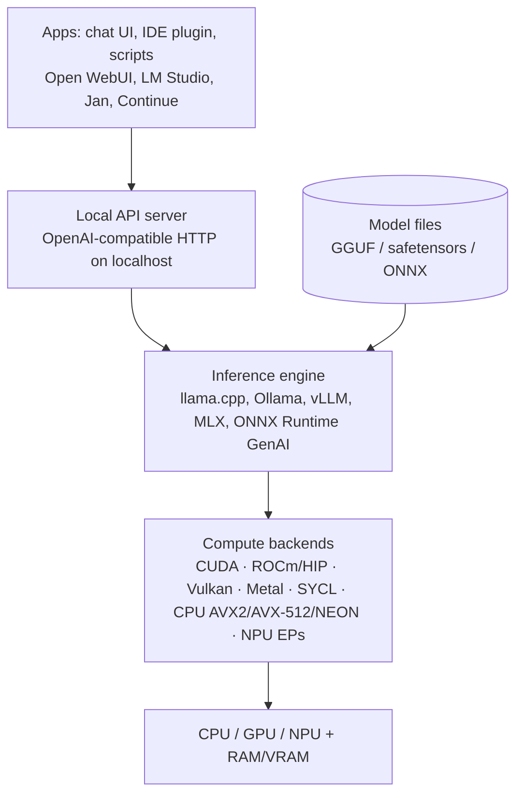

# How Offline (Local) AI Works

> **Level:** Advanced · **Related:** [LLMs](llm.md) · [Tokenization](tokenization.md) · [NPU](../01-hardware/npu.md) · [GPU](../01-hardware/gpu.md) · [RAM](../01-hardware/ram.md) · [AI Image Detection](image-detection.md)

## 1. What "offline AI" means

**Offline / local / on-device AI** runs model inference entirely on your own hardware — laptop, desktop, phone, Raspberry Pi, or an on-premises server — with **no network calls** to a cloud provider. The model's weights are files on your disk; an **inference engine** loads them into RAM/VRAM and runs the math on your CPU, GPU or [NPU](../01-hardware/npu.md).

| | Cloud AI | Offline AI |
|---|---|---|
| Privacy | Data leaves the device | Data never leaves |
| Works without internet | No | **Yes** |
| Latency | Network round trip | Local only (no network) |
| Cost | Per token | Hardware + electricity |
| Model size/quality | Frontier models (hundreds of B–T params) | Limited by your RAM/VRAM (typically 1–70 B) |
| Control | Provider's versions & policies | You pick/fine-tune/pin the model |

Everything here applies to LLMs, speech (Whisper), image generation (Stable Diffusion/FLUX), and vision models.

## 2. The core constraint: memory

A model is essentially a big bag of numbers. Memory needed ≈ **parameters × bytes per parameter** + **KV cache** + runtime overhead.

| Model | FP16 (2 B/param) | 8-bit | 4-bit (Q4) |
|---|---|---|---|
| 1 B | 2 GB | 1 GB | ~0.7 GB |
| 8 B | 16 GB | 8.5 GB | **~4.9 GB** |
| 14 B | 28 GB | 15 GB | ~8.5 GB |
| 32 B | 64 GB | 34 GB | ~19 GB |
| 70 B | 140 GB | 75 GB | ~40 GB |

And generation speed is bounded by **memory bandwidth** (every token reads all active weights — see [LLMs §5.1](llm.md#51-prefill-vs-decode)):

```
tokens/s (upper bound) ≈ memory bandwidth / model size in bytes
```

| Hardware | Bandwidth | 8B Q4 (~4.9 GB) → max tok/s |
|---|---|---|
| Laptop DDR5 dual-channel | ~90 GB/s | ~18 |
| Apple M-series Max (unified memory) | ~400–550 GB/s | ~80–110 |
| RTX 4090 / 5090 GDDR6X/7 | ~1.0–1.8 TB/s | ~200–350 |

That's why **quantization** and **unified-memory** machines (Apple Silicon, AMD Ryzen AI Max "Strix Halo") are so popular for local AI.

## 3. Quantization: making models fit

Store weights in fewer bits with a per-block scale (see also [NPU §4](../01-hardware/npu.md#4-quantization-why-low-precision-works)):

```
w ≈ scale × q      (q is a small integer, e.g. 4-bit: −8..7)
```

**Block-wise** quantization (e.g., 32 weights share one FP16 scale) keeps error low. A Q4 block quantizer in Python:

```python
import numpy as np
def quantize_q4(w, block=32):
    w = w.reshape(-1, block)
    scale = np.abs(w).max(axis=1, keepdims=True) / 7 + 1e-12
    q = np.clip(np.round(w / scale), -8, 7).astype(np.int8)   # stored as packed 4-bit nibbles
    return q, scale.astype(np.float16)
def dequantize(q, scale): return (q * scale.astype(np.float32)).ravel()

w = np.random.default_rng(0).normal(0, 0.02, 4096).astype(np.float32)
q, s = quantize_q4(w)
err = np.abs(w - dequantize(q, s))
print(f"bits/weight ≈ {4 + 16/32:.1f}, mean abs error {err.mean():.5f}")   # 4.5 bits/weight
```

Common formats:

| Format | Ecosystem | Notes |
|---|---|---|
| **GGUF** (Q2_K … Q8_0, K-quants, I-quants) | llama.cpp, Ollama, LM Studio | Single file: weights + tokenizer + chat template + metadata; CPU & GPU |
| **GPTQ / AWQ** | vLLM, Transformers, ExLlama | GPU-oriented 4-bit, calibrated to minimize output error |
| **EXL2/EXL3** | ExLlamaV2/V3 | Mixed bit-widths per layer |
| **MLX** | Apple MLX | Apple Silicon native |
| **ONNX INT4/INT8**, OpenVINO IR | ONNX Runtime, Windows ML, OpenVINO | NPUs and cross-vendor |
| FP8 / NVFP4 / MXFP4 | TensorRT-LLM, vLLM | Hardware-native low precision on recent GPUs |

Rule of thumb: **Q4_K_M / 4-bit AWQ** is the sweet spot; below ~3 bits quality degrades noticeably; a bigger model at Q4 usually beats a smaller one at Q8.

## 4. The software stack



| Tool | What it is |
|---|---|
| **llama.cpp** | C/C++ engine: GGUF, quantization, CPU+GPU offload, `llama-server` (OpenAI-compatible API) |
| **Ollama** | Friendly wrapper around llama.cpp: `ollama run`, model registry, REST API on `localhost:11434` |
| **LM Studio / Jan / GPT4All** | Desktop GUI apps (Windows/Linux/macOS) |
| **vLLM / SGLang** | High-throughput GPU serving (PagedAttention, batching) for on-prem servers |
| **MLX / mlx-lm** | Apple Silicon framework |
| **ONNX Runtime GenAI / Windows ML / Foundry Local** | Windows-native, targets GPU (DirectML) and NPUs (QNN, OpenVINO, VitisAI) |
| **whisper.cpp**, **stable-diffusion.cpp**, ComfyUI | Speech-to-text and image generation locally |

## 5. How llama.cpp runs a model

1. **mmap** the GGUF file: the OS maps weights into virtual memory and pages them in on demand (fast startup; shared page cache). See [RAM §8](../01-hardware/ram.md#8-how-the-os-uses-ram-virtual-memory).
2. Read metadata: architecture, tokenizer vocab/merges, chat template, RoPE settings.
3. Build a **compute graph** (via the `ggml` tensor library) for the transformer.
4. **Layer offloading**: `-ngl N` puts N layers on the GPU; the rest run on CPU. Lets a 70B model run split across 24 GB VRAM + system RAM (slower, but works).
5. CPU kernels use SIMD (AVX2/AVX-512/NEON) with fused dequantize-and-multiply; GPU kernels via CUDA/HIP/Vulkan/Metal.
6. Allocate the **KV cache** for the chosen context length (`-c 8192`), optionally quantized (`-ctk q8_0`).
7. Tokenize → prefill → decode loop with sampling (temperature, top-p, min-p, repetition penalty, grammar constraints).

```bash
# Linux (build with CUDA) — Windows: same with cmake + Visual Studio, or download prebuilt releases
git clone https://github.com/ggml-org/llama.cpp && cd llama.cpp
cmake -B build -DGGML_CUDA=ON && cmake --build build -j
./build/bin/llama-cli -hf ggml-org/gemma-3-4b-it-GGUF -p "Explain RAID 5" -ngl 99
./build/bin/llama-server -m model-Q4_K_M.gguf -ngl 99 -c 8192 --port 8080   # OpenAI-compatible API
```

## 6. Using local models from code

**Ollama** (Windows installer / Linux `curl -fsSL https://ollama.com/install.sh | sh`):

```bash
ollama pull qwen3:8b
ollama run qwen3:8b "Summarize the OSI model"
ollama ps                                    # loaded models, CPU/GPU split
```

Python, via Ollama's REST API — nothing leaves `localhost`:

```python
import requests
r = requests.post("http://localhost:11434/api/chat", json={
    "model": "qwen3:8b",
    "messages": [{"role": "user", "content": "Write a haiku about caches"}],
    "stream": False,
})
print(r.json()["message"]["content"])
```

JavaScript, using the **OpenAI-compatible** endpoint that llama-server, Ollama, LM Studio and vLLM all expose:

```js
const res = await fetch("http://localhost:11434/v1/chat/completions", {
  method: "POST",
  headers: { "Content-Type": "application/json" },
  body: JSON.stringify({
    model: "qwen3:8b",
    messages: [{ role: "user", content: "What is GGUF?" }],
  }),
});
console.log((await res.json()).choices[0].message.content);
```

Python directly in-process (no server) with `llama-cpp-python`:

```python
from llama_cpp import Llama
llm = Llama(model_path="model-Q4_K_M.gguf", n_gpu_layers=-1, n_ctx=8192)
out = llm.create_chat_completion(messages=[{"role": "user", "content": "Hi!"}])
print(out["choices"][0]["message"]["content"])
```

C++ (llama.cpp library, abridged):

```cpp
#include "llama.h"
llama_backend_init();
llama_model_params mp = llama_model_default_params(); mp.n_gpu_layers = 99;
llama_model* model = llama_model_load_from_file("model-Q4_K_M.gguf", mp);
llama_context* ctx = llama_init_from_model(model, llama_context_default_params());
// tokenize prompt with llama_tokenize(), run llama_decode() on batches,
// sample with a llama_sampler chain (top_p, temp, dist), detokenize with llama_token_to_piece()
```

Local **speech-to-text** (runs fully offline):

```python
import whisper                        # openai-whisper; or faster-whisper / whisper.cpp
print(whisper.load_model("small").transcribe("meeting.mp3")["text"])
```

## 7. Platform specifics

**Windows**
- NVIDIA: CUDA builds; AMD: ROCm on supported GPUs or **Vulkan** backend (works on almost any GPU); Intel Arc: SYCL/Vulkan/OpenVINO.
- **NPUs** on Copilot+ PCs via **Windows ML / ONNX Runtime** execution providers and **Foundry Local**; Windows ships built-in on-device models (e.g., Phi Silica) for app features. See [NPU §5](../01-hardware/npu.md#5-the-software-stack-compiling-a-graph).
- Check GPU memory: Task Manager → Performance → GPU ("Dedicated GPU memory"), `nvidia-smi`.
- WSL2 supports CUDA passthrough for Linux tooling.

**Linux**
- NVIDIA driver + CUDA toolkit, or AMD **ROCm**; Vulkan via Mesa works broadly.
- Intel NPU/GPU via **OpenVINO** (`/dev/accel/accel0` for NPUs).
- Monitor: `nvidia-smi -l 1`, `nvtop`, `radeontop`, `htop` for CPU inference.
- Run as a service: Ollama installs a systemd unit (`systemctl status ollama`); set `OLLAMA_HOST` to expose on LAN (secure it — it has no auth by default).

**Phones:** Apple Intelligence on-device model (Core ML/ANE), Gemini Nano via Android AICore, MLC LLM, llama.cpp-based apps; models typically 1–4 B params at 4-bit.

## 8. Building useful offline systems

- **Local RAG**: embed documents with a local embedding model (e.g., `nomic-embed-text`, `bge-m3`), store in a local vector DB (SQLite + sqlite-vec, Chroma, LanceDB, Qdrant), retrieve and pass to the local LLM → private "chat with my files". See [LLMs §6](llm.md#6-context-memory-and-tools).
- **Fine-tuning locally**: LoRA/QLoRA adapters (Unsloth, Axolotl, PEFT) train small low-rank matrices on a single GPU; merge or load the adapter at inference.
- **Air-gapped deployment**: download weights + engine binaries on a connected machine, verify **checksums** (SHA-256) and licenses, transfer by approved media.

## 9. Choosing a model

| Need | Size class (4-bit) | Hardware |
|---|---|---|
| Autocomplete, classification, phone | 0.5–4 B | Any CPU / phone NPU |
| General chat, summarization | 7–14 B | 8–16 GB RAM/VRAM |
| Strong coding/reasoning | 24–32 B (or MoE ~30B-A3B) | 24–32 GB |
| Near-frontier open models | 70 B dense / large MoE | 48 GB+ VRAM or 64–128 GB unified memory |

Open-weight families (2025–2026): Llama, Qwen, Gemma, Mistral, DeepSeek, Phi, gpt-oss, GLM, Kimi. Check the **license** (some restrict commercial use) and the **context length** your RAM can hold.

## 10. Security & pitfalls

- Only load weights in safe formats — **safetensors**/GGUF — not arbitrary Python **pickle** files (`.bin`/`.pt` via `torch.load` can execute code); use `torch.load(weights_only=True)`.
- Local API servers (Ollama, llama-server) often have **no authentication** — bind to `127.0.0.1` or put behind a reverse proxy with auth ([Proxy](../05-networking-and-web/proxy.md)).
- Wrong chat template → degraded output; wrong context settings → silent truncation.
- Smaller local models hallucinate more; ground them with RAG and verify outputs.

## Further reading
- llama.cpp repository & GGUF spec (`ggml-org/ggml` docs); Ollama docs
- Dettmers et al., *QLoRA* (2023); Frantar et al., *GPTQ* (2022); Lin et al., *AWQ* (2023)
- Microsoft Learn: *Windows ML*, *Foundry Local*; Intel OpenVINO GenAI docs; Apple MLX docs
