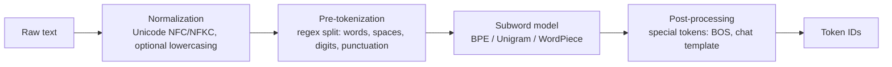

# How Tokenization Works

> **Level:** Advanced · **Related:** [LLMs](llm.md) · [Offline AI](offline-ai.md) · [Code Compilation (lexing)](../03-os-and-software/code-compilation.md#3-lexical-analysis-tokenizing) · [Compression](../06-security-and-data/compression.md)

## 1. What tokenization is

Neural networks operate on numbers, not text. **Tokenization** converts a string into a sequence of integer **token IDs** from a fixed **vocabulary**, and back again (**detokenization**).

```
"Tokenization isn't magic!"
  → ["Token", "ization", " isn", "'t", " magic", "!"]
  → [3404, 2065, 4232, 956, 11204, 0]        (IDs depend on the tokenizer)
```

(The word "tokenization" is also used for [lexers in compilers](../03-os-and-software/code-compilation.md#3-lexical-analysis-tokenizing) and for [payment card tokenization](../06-security-and-data/payment-terminal.md#4-contactless-and-mobile-wallets) — this page is about language models.)

## 2. Why subwords?

| Granularity | Vocabulary | Sequence length | Problems |
|---|---|---|---|
| Characters / bytes | ~256 | Very long (4–5× words) | Expensive attention, slow generation |
| Whole words | Millions | Short | Unknown words (OOV), misspellings, morphology, huge embedding tables |
| **Subwords** | 32k–260k | Moderate (~0.75 words/token in English) | Best trade-off — **the standard** |

Frequent words get a single token (`" the"`); rare words split into pieces (`"unbelievability"` → `"un" "believ" "ability"`); anything can fall back to bytes, so there's **never an unknown token**.

The average characters-per-token is the tokenizer's **compression ratio** — tokenization *is* a form of [compression](../06-security-and-data/compression.md), and BPE was originally a compression algorithm (Gage, 1994).

## 3. The pipeline



**Pre-tokenization** prevents merges across categories. GPT-4's `cl100k_base` regex roughly: contractions (`'s`, `'t`), letter runs with an optional leading space, 1–3 digit groups, punctuation runs, whitespace. Leading spaces are part of the token (`" world"` ≠ `"world"`).

## 4. Byte-Pair Encoding (BPE) — the dominant algorithm

Used by GPT-2/3/4/4o, Llama 3+, Mistral, Qwen, Claude and most modern LLMs (as **byte-level BPE**: base alphabet = 256 bytes, so any UTF-8 text is representable).

**Training:**
1. Start with every word split into bytes/characters.
2. Count all adjacent symbol pairs across the corpus.
3. Merge the most frequent pair into a new symbol; record the merge.
4. Repeat until the vocabulary reaches the target size.

**Encoding:** apply the learned merges, in the order learned, to new text.

A complete working BPE trainer + encoder + decoder in Python:

```python
import re
from collections import Counter

PRETOKENIZE = re.compile(r"""'s|'t|'re|'ve|'m|'ll|'d| ?[A-Za-z]+| ?\d{1,3}| ?[^\sA-Za-z\d]+|\s+""")

def train_bpe(text: str, vocab_size: int):
    words = Counter(tuple(w.encode("utf-8")) for w in PRETOKENIZE.findall(text))
    vocab = {i: bytes([i]) for i in range(256)}      # byte-level base vocabulary
    merges = {}                                       # (a, b) -> new id, in learned order
    while len(vocab) < vocab_size:
        pairs = Counter()
        for word, freq in words.items():
            for a, b in zip(word, word[1:]):
                pairs[(a, b)] += freq
        if not pairs: break
        best = max(pairs, key=pairs.get)
        new_id = len(vocab)
        merges[best] = new_id
        vocab[new_id] = vocab[best[0]] + vocab[best[1]]
        # apply merge to every word
        new_words = Counter()
        for word, freq in words.items():
            out, i = [], 0
            while i < len(word):
                if i + 1 < len(word) and (word[i], word[i + 1]) == best:
                    out.append(new_id); i += 2
                else:
                    out.append(word[i]); i += 1
            new_words[tuple(out)] += freq
        words = new_words
    return merges, vocab

def encode(text: str, merges):
    ids = []
    for w in PRETOKENIZE.findall(text):
        seq = list(w.encode("utf-8"))
        while len(seq) > 1:
            # pick the pair that was learned earliest (lowest merge id)
            pair = min(zip(seq, seq[1:]), key=lambda p: merges.get(p, float("inf")))
            if pair not in merges: break
            new_id, out, i = merges[pair], [], 0
            while i < len(seq):
                if i + 1 < len(seq) and (seq[i], seq[i + 1]) == pair:
                    out.append(new_id); i += 2
                else:
                    out.append(seq[i]); i += 1
            seq = out
        ids.extend(seq)
    return ids

def decode(ids, vocab):
    return b"".join(vocab[i] for i in ids).decode("utf-8", errors="replace")

corpus = "low lower lowest newer newest wider widest " * 50
merges, vocab = train_bpe(corpus, vocab_size=280)
ids = encode("lowest newest", merges)
print(ids, [vocab[i] for i in ids])
assert decode(ids, vocab) == "lowest newest"
```

## 5. Other algorithms

| Algorithm | Idea | Used by |
|---|---|---|
| **WordPiece** | Like BPE, but merges pairs maximizing likelihood `freq(ab)/(freq(a)·freq(b))`; greedy longest-match encoding; `##` marks continuation | BERT, DistilBERT |
| **Unigram LM** | Start with a huge vocabulary, iteratively prune tokens that least reduce corpus likelihood; encode with Viterbi (most probable segmentation); supports **subword regularization** (sampling segmentations) | T5, ALBERT, XLNet, some multilingual models |
| **SentencePiece** | A *library* (BPE or Unigram) that treats input as raw Unicode including spaces (shown as `▁`) — no language-specific pre-tokenizer | Llama 1/2, Gemma, T5, many multilingual models |
| **Byte-level / tokenizer-free** | Operate on raw bytes with architectural tricks (patches) | ByT5, MegaByte, **Byte Latent Transformer** (research) |

## 6. Special tokens and chat templates

Beyond text pieces, vocabularies contain **control tokens**: `<|begin_of_text|>`, `<|end_of_text|>` / EOS, padding, and chat-role markers. A chat is flattened into one sequence by a **chat template**:

```
<|start_header_id|>system<|end_header_id|>
You are a helpful assistant.<|eot_id|><|start_header_id|>user<|end_header_id|>
Hi!<|eot_id|><|start_header_id|>assistant<|end_header_id|>
```

Getting the template exactly right matters when running [open models locally](offline-ai.md): wrong templates cause rambling or broken output. Special tokens must not be injectable from user text — tokenizers treat the literal string `"<|eot_id|>"` in user input as ordinary text by default.

## 7. Using real tokenizers

Python — OpenAI's `tiktoken` (fast Rust BPE) and Hugging Face `tokenizers`:

```python
import tiktoken
enc = tiktoken.get_encoding("o200k_base")          # GPT-4o-family encoding
ids = enc.encode("Tokenization isn't magic!")
print(ids, [enc.decode([i]) for i in ids], len(ids))

from transformers import AutoTokenizer
tok = AutoTokenizer.from_pretrained("Qwen/Qwen2.5-0.5B-Instruct")
print(tok.tokenize("Привет, мир! 你好世界"))       # multilingual pieces
print(tok.apply_chat_template([{"role": "user", "content": "Hi"}], tokenize=False,
                              add_generation_prompt=True))
```

JavaScript:

```js
import { encoding_for_model } from "tiktoken";          // WASM build of tiktoken
const enc = encoding_for_model("gpt-4o");
const ids = enc.encode("Hello, world!");
console.log(ids, new TextDecoder().decode(enc.decode(ids)));
enc.free();
```

C++ — `llama.cpp` exposes `llama_tokenize()`; Google's `sentencepiece` has a C++ API (`sentencepiece::SentencePieceProcessor::Encode`); Hugging Face tokenizers have Rust core with C bindings.

Counting tokens via an API (Anthropic Python SDK):

```python
import anthropic
n = anthropic.Anthropic().messages.count_tokens(
    model="claude-opus-5-5", messages=[{"role": "user", "content": "How many tokens is this?"}])
print(n.input_tokens)
```

## 8. Why tokenization explains many LLM quirks

| Quirk | Cause |
|---|---|
| Can't reliably count letters in "strawberry" | The model sees `["str", "aw", "berry"]`, not letters |
| Arithmetic errors on long numbers | Digits chunked inconsistently (many tokenizers now split digits individually or in groups of 3) |
| Non-English text costs more | Vocabularies trained mostly on English → Hindi, Burmese etc. need 2–10× more tokens per word ("token tax") |
| Trailing-space sensitivity | `"Hello"` and `" Hello"` are different tokens |
| "Glitch tokens" (e.g., `SolidGoldMagikarp`) | Tokens present in the vocabulary but nearly absent in training data → untrained embeddings |
| Code indentation costs | Whitespace runs tokenized differently per tokenizer |
| Pricing & limits | APIs bill and cap context in tokens, not characters |

## 9. Designing a tokenizer: trade-offs

- **Vocabulary size**: larger → shorter sequences (faster, cheaper) but bigger embedding/output matrices and rarer tokens undertrained. Trend: 32k (Llama 2) → 128k (Llama 3) → 200k+ (GPT-4o, Gemma 256k).
- **Training corpus mix** decides which languages and code are efficient.
- **Digit and whitespace handling** affects math and code quality.
- Tokenizer and model are **married**: changing the tokenizer requires retraining (or careful embedding surgery).

## Further reading
- Sennrich et al., *Neural Machine Translation of Rare Words with Subword Units* (BPE, 2016)
- Kudo, *Subword Regularization* (Unigram, 2018); Kudo & Richardson, *SentencePiece* (2018)
- Andrej Karpathy, *Let's build the GPT Tokenizer* + `minbpe` repository
- Hugging Face *Tokenizers* course chapter; OpenAI `tiktoken` repository
