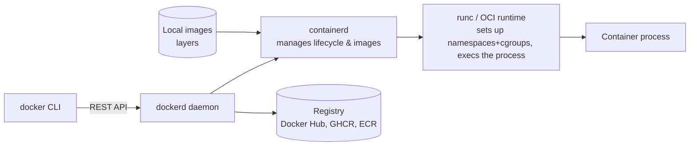

# How Containers (Docker) Work

> **Level:** Advanced · **Related:** [Virtualization/Hypervisors](virtualization.md) · [Virtual Machines](virtual-machines.md) · [VPS](vps.md) · [OS](../03-os-and-software/operating-system.md) · [Web Server](../05-networking-and-web/web-server.md)

## 1. What a container is

A **container** is an **isolated process** (or group of processes) that runs on a shared host kernel but *believes* it has its own filesystem, network, process tree and resource limits. It packages an application **with all its dependencies** — libraries, runtime, config — into a portable image that runs identically on any compatible host: "it works on my machine" becomes "it works everywhere."

The key insight: unlike a [virtual machine](virtual-machines.md), a container does **not** include a guest OS kernel. It shares the host's kernel and uses **Linux kernel features** (namespaces + cgroups) to create the illusion of isolation. That makes containers **lightweight** — megabytes, not gigabytes; milliseconds to start, not seconds.

## 2. Containers vs virtual machines

```
    Virtual Machines                         Containers
┌──────┐┌──────┐┌──────┐            ┌──────┐┌──────┐┌──────┐
│ App  ││ App  ││ App  │            │ App  ││ App  ││ App  │
│ Bins ││ Bins ││ Bins │            │ Bins ││ Bins ││ Bins │
│Guest ││Guest ││Guest │            └──────┘└──────┘└──────┘
│  OS  ││  OS  ││  OS  │            ┌────────────────────────┐
└──────┘└──────┘└──────┘            │ Container runtime       │
┌────────────────────────┐         ├────────────────────────┤
│      Hypervisor         │         │   Host OS + kernel      │  ← shared
├────────────────────────┤         ├────────────────────────┤
│      Host OS/kernel     │         │       Hardware          │
└────────────────────────┘         └────────────────────────┘
```

| | Containers | [Virtual machines](virtual-machines.md) |
|---|---|---|
| Isolation unit | Processes on shared kernel | Whole machine with own kernel |
| Boundary | Namespaces + cgroups + seccomp | [Hypervisor](virtualization.md) + hardware (VT-x, EPT) |
| Size / startup | MBs / milliseconds | GBs / seconds |
| Isolation strength | Weaker (shared kernel = bigger attack surface) | Stronger (separate kernels) |
| Guest OS | Same kernel only (Linux on Linux) | Any OS |
| Density | Hundreds per host | Tens per host |

They're complementary: cloud containers usually run **inside** VMs for a strong outer boundary, and lightweight VMs (Firecracker, Kata) wrap containers to get both — see [Virtualization §7](virtualization.md#7-virtualization-vs-containers).

## 3. The two kernel features that make it work

### 3.1 Namespaces — isolation (what a process can *see*)
Each namespace type gives a process a private view of one kind of global resource:

| Namespace | Isolates |
|---|---|
| **PID** | Process IDs — the container sees its app as PID 1, not host processes |
| **Mount (mnt)** | Filesystem mounts — its own root filesystem |
| **Network (net)** | Interfaces, IPs, routing, ports — its own `eth0`, `localhost` |
| **UTS** | Hostname |
| **IPC** | Shared memory, semaphores |
| **User** | UID/GID mapping — root *in* the container ≠ root on the host |
| **cgroup, time** | cgroup view, clock offset |

### 3.2 cgroups (control groups) — limits (what a process can *use*)
Cap and account CPU, memory, disk I/O and PIDs per container, so one container can't starve others (see [OS §11](../03-os-and-software/operating-system.md#11-security-model)).

### 3.3 Plus: layered filesystem + security
- **OverlayFS** union mount stacks read-only image layers under a thin writable layer (§5).
- **Capabilities, seccomp-bpf, AppArmor/SELinux** drop privileges and filter syscalls to shrink the attack surface.

You can build a crude "container" by hand — this is essentially what runtimes automate:

```bash
# Run a shell isolated in new namespaces with a different root filesystem (Linux, as root)
unshare --pid --mount --net --uts --ipc --fork --mount-proc \
        chroot /path/to/rootfs /bin/sh
# → inside: its own PID 1, hostname, empty network, isolated /proc
```

## 4. The Docker architecture

Docker is the most popular container platform. Its pieces:



- **`docker` CLI** → talks to **`dockerd`**, which delegates to **containerd**, which uses **runc** (the reference **OCI runtime**) to actually create the isolated process.
- **OCI** (Open Container Initiative) standardizes the **image format** and **runtime**, so images are portable across Docker, Podman, containerd, Kubernetes, etc.
- **Podman** is a popular **daemonless, rootless** alternative with a Docker-compatible CLI.

## 5. Images and layers

An **image** is a read-only template built from stacked **layers**; a **container** is a running instance with a writable layer on top.

- Each instruction in a **Dockerfile** creates a layer; layers are **content-addressed** (SHA-256) and **shared/cached** across images — pulling an image only downloads layers you don't already have.
- At runtime, **OverlayFS** presents all layers as one filesystem; writes go to the container's thin **copy-on-write** top layer, so the image stays immutable and many containers share the same underlying layers.

```dockerfile
# Dockerfile — a multi-stage build (small, secure final image)
FROM node:22-slim AS build
WORKDIR /app
COPY package*.json ./
RUN npm ci                       # cached layer unless package files change
COPY . .
RUN npm run build

FROM node:22-slim                # fresh, minimal runtime stage
WORKDIR /app
ENV NODE_ENV=production
COPY --from=build /app/dist ./dist
COPY --from=build /app/node_modules ./node_modules
USER node                        # don't run as root
EXPOSE 3000
CMD ["node", "dist/server.js"]
```

```bash
docker build -t myapp:1.0 .
docker run -d -p 8080:3000 --name web --memory 512m --cpus 1 myapp:1.0
docker ps ; docker logs -f web ; docker exec -it web sh
docker image history myapp:1.0   # see the layers
```

Best practices: small base images (`slim`, `alpine`, `distroless`), order Dockerfile steps from least- to most-frequently-changing (cache), `.dockerignore`, multi-stage builds, pinned versions, non-root user, and scanning images for CVEs (`docker scout`, Trivy).

## 6. Networking, storage, and configuration

- **Networking**: each container gets its own [network namespace](#31-namespaces--isolation-what-a-process-can-see); Docker's default **bridge** network + a NAT lets containers talk and maps host ports (`-p 8080:3000`). User-defined networks give DNS-based service discovery by container name. See [Web Server](../05-networking-and-web/web-server.md).
- **Storage**: containers are **ephemeral** — the writable layer vanishes on removal. Persist data with **volumes** (`-v data:/var/lib/db`) or bind mounts.
- **Config & secrets**: environment variables, mounted config files, and secret stores — never bake secrets into images (they're in the layers forever).

## 7. Orchestration: running containers at scale

One host runs a few containers by hand; production runs thousands across many machines with an **orchestrator**:

- **Docker Compose** — declaratively run a multi-container app on one host (dev, small deployments):

```yaml
services:
  web:
    build: .
    ports: ["8080:3000"]
    depends_on: [db]
  db:
    image: postgres:16
    environment: { POSTGRES_PASSWORD: secret }
    volumes: ["pgdata:/var/lib/postgresql/data"]
volumes: { pgdata: {} }
```

- **Kubernetes (K8s)** — the standard for clusters: schedules **pods** (one or more containers) across nodes, handles scaling, self-healing (restart failed containers), rolling updates, service discovery, load balancing and secrets. Related: managed offerings (EKS/GKE/AKS), and lighter options (Nomad, Docker Swarm).

Orchestrators turn containers into the unit of deployment for modern cloud-native and microservice architectures.

## 8. Containers on Windows and macOS

Containers are a **Linux kernel** technology. So:
- **Linux hosts** run them natively.
- **Docker Desktop / Podman** on **Windows** and **macOS** run a lightweight **Linux [VM](virtual-machines.md)** (WSL2 on Windows, a Linux VM on macOS) and run containers inside it — see [Virtualization §5](virtualization.md#5-windows-hyper-v-and-the-virtualization-stack).
- **Windows containers** also exist (Windows Server kernel, isolating Windows apps) — separate from Linux containers, using Windows equivalents of namespaces/cgroups (Server Silos, Job Objects).

```powershell
# Windows (Docker Desktop / WSL2 backend)
docker run --rm -it mcr.microsoft.com/windows/nanoserver:ltsc2022 cmd   # Windows container
wsl --status                                                            # Linux backend for Linux containers
```

## 9. Security considerations

- **Shared kernel = shared risk**: a kernel exploit can escape a container. Keep the host kernel patched.
- **Don't run as root** in the container; use **rootless** Docker/Podman; enable **user namespaces**.
- Keep default **seccomp/AppArmor** profiles; **drop capabilities** (`--cap-drop ALL`).
- **Never** mount the Docker socket (`/var/run/docker.sock`) into an untrusted container — it grants host root.
- **Scan images** for vulnerabilities; use minimal/distroless bases; pin digests.
- Set **resource limits** to prevent DoS; treat images from public registries as untrusted (supply-chain risk — see [Malware §3](../06-security-and-data/malware.md#3-initial-access-how-it-gets-in)).
- For stronger isolation, wrap containers in microVMs (Kata, Firecracker, gVisor).

## 10. Why containers won

- **Consistency**: identical environment from laptop to CI to production.
- **Density & speed**: far more workloads per host than VMs; near-instant start → elastic scaling, serverless.
- **Immutable, versioned artifacts**: deploy and roll back by image tag.
- **Ecosystem**: the OCI standard + Kubernetes made containers the substrate of modern cloud infrastructure and CI/CD.

## Further reading
- Docker documentation; the **OCI** image-spec and runtime-spec
- `man 7 namespaces`, `man 7 cgroups`; Liz Rice, *Container Security* and her "build a container in Go" talks
- Kubernetes documentation (kubernetes.io); Nigel Poulton, *The Kubernetes Book*
