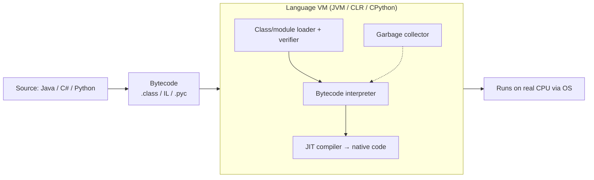

# How Virtual Machines Work

> **Level:** Advanced · **Related:** [Virtualization/Hypervisors](virtualization.md) · [VPS](vps.md) · [OS](../03-os-and-software/operating-system.md) · [Code Compilation](../03-os-and-software/code-compilation.md) · [Machine Code](../03-os-and-software/machine-code.md)

## 1. Two meanings of "virtual machine"

The term covers two related but distinct ideas. This page explains both.

| | **System VM** | **Process / language VM** |
|---|---|---|
| Virtualizes | A whole computer (CPU, RAM, devices) | A single program's execution environment |
| Runs | A full guest **operating system** | One application's **bytecode** |
| Managed by | A [hypervisor](virtualization.md) | A language runtime |
| Examples | VirtualBox VM, an AWS EC2 instance, Hyper-V VM | **JVM**, .NET **CLR**, **CPython**, V8, WebAssembly runtimes |
| Boundary | Hardware-assisted (VT-x, EPT) | Software sandbox |

They share a philosophy: present a **stable, abstract machine** so software need not care about the real hardware underneath.

---

## Part A — System virtual machines

## 2. What a system VM is

A **system VM** is a software-defined computer: a set of files and configuration that a [hypervisor](virtualization.md) runs as if it were physical hardware. A guest OS installs and boots inside it, unaware it isn't on a real motherboard.

```
A VM =  virtual CPUs (vCPUs)      → time-sliced onto real cores
     +  virtual RAM              → mapped to host physical pages (EPT/NPT)
     +  virtual disks            → .vhdx / .qcow2 / .vmdk files or block devices
     +  virtual NICs             → bridged/NAT/host-only to real networks
     +  virtual firmware         → BIOS or UEFI (OVMF), a virtual TPM
     +  virtual GPU/display, USB, serial ...
```

## 3. Anatomy of a VM

### 3.1 Virtual disks
A guest's "hard drive" is usually a file on the host:

| Format | Ecosystem | Features |
|---|---|---|
| **qcow2** | QEMU/KVM | Copy-on-write, snapshots, thin (grows on use), compression, encryption |
| **VHDX** | Hyper-V | Dynamic/fixed, resilient, up to 64 TB |
| **VMDK** | VMware | Splittable, snapshots |
| raw / block device | any | Fastest, no features |

**Thin provisioning** allocates host space only as the guest writes; **snapshots** freeze a disk state and write changes to an overlay so you can roll back.

### 3.2 Virtual devices and the boot path
The hypervisor presents virtual firmware ([BIOS or UEFI](../01-hardware/bios.md)); the guest firmware loads the guest bootloader from the virtual disk exactly as on real hardware — see [OS boot](../03-os-and-software/operating-system.md#3-boot-from-firmware-to-login). Devices are emulated, paravirtualized (virtio), or passed through, in ascending order of speed (see [Virtualization §3.3](virtualization.md#33-io-virtualization)).

### 3.3 VM images, templates and reproducibility
- **Templates / golden images**: a pre-configured VM cloned to spin up many identical machines.
- **cloud-init**: injects hostname, users, SSH keys and scripts on first boot — how clouds customize a generic image per instance.
- **Vagrant / Packer**: build and version VM images as code.
- **OVA/OVF**: portable VM packaging across hypervisors.

## 4. Using system VMs

```bash
# Linux, QEMU/KVM — create a disk and boot an installer
qemu-img create -f qcow2 disk.qcow2 40G
qemu-system-x86_64 -enable-kvm -m 4096 -smp 4 \
  -drive file=disk.qcow2,if=virtio -cdrom ubuntu.iso \
  -nic user,model=virtio-net-pci -bios /usr/share/OVMF/OVMF_CODE.fd
qemu-img snapshot -c clean disk.qcow2      # snapshot; -a to revert
```

```powershell
# Windows, Hyper-V
New-VM -Name dev -Generation 2 -MemoryStartupBytes 4GB -NewVHDPath dev.vhdx -NewVHDSizeBytes 40GB
Set-VMProcessor dev -Count 4
Add-VMDvdDrive -VMName dev -Path .\ubuntu.iso
Checkpoint-VM -Name dev -SnapshotName clean          # snapshot
Start-VM dev
```

Desktop tools: VirtualBox, VMware Workstation/Player, GNOME Boxes, Parallels (macOS). Cloud VMs are the same concept rented remotely — see [VPS](vps.md).

## 5. Resource management

- **vCPU scheduling**: the hypervisor time-slices vCPUs onto physical cores; over-committing vCPUs causes "CPU steal" (guest ready but waiting for a real core — visible as `%st` in `top`).
- **Memory**: ballooning, page sharing and swapping let hosts overcommit RAM (see [Virtualization §3.2](virtualization.md#32-memory-virtualization)).
- **Guest agents** (qemu-guest-agent, Hyper-V Integration Services, VMware Tools) improve clock sync, graceful shutdown, clipboard, dynamic memory and file copy.

---

## Part B — Process / language virtual machines

## 6. What a process VM is

A **process VM** runs a single program compiled to a portable **bytecode/intermediate representation** instead of native [machine code](../03-os-and-software/machine-code.md). The VM executes that bytecode, giving **"write once, run anywhere"** portability, memory safety, and sandboxing — at the cost of some overhead (mitigated by JIT). See [Code Compilation](../03-os-and-software/code-compilation.md).



## 7. How a bytecode VM executes

Most language VMs are **stack machines**: instructions push/pop operands on an evaluation stack (simpler and more compact than register machines).

Python's VM, inspected live:

```python
import dis
def add(a, b):
    return a + b
dis.dis(add)
#  LOAD_FAST   a       ← push a
#  LOAD_FAST   b       ← push b
#  BINARY_OP   + (0)   ← pop 2, push a+b
#  RETURN_VALUE        ← pop, return
```

Conceptual interpreter loop (the heart of every bytecode VM):

```python
def run(bytecode, consts, names):
    stack, pc = [], 0
    while pc < len(bytecode):
        op, arg = bytecode[pc]; pc += 1
        if op == "LOAD_CONST":  stack.append(consts[arg])
        elif op == "LOAD_NAME": stack.append(names[arg])
        elif op == "ADD":       b = stack.pop(); a = stack.pop(); stack.append(a + b)
        elif op == "PRINT":     print(stack.pop())
        elif op == "RETURN":    return stack.pop() if stack else None

run([("LOAD_CONST", 0), ("LOAD_CONST", 1), ("ADD", None), ("PRINT", None), ("RETURN", None)],
    consts=[40, 2], names={})   # prints 42
```

Real VMs add: a **loader/verifier** (the JVM rejects malformed or unsafe bytecode), **JIT tiers** (interpret → baseline → optimizing compiler, guided by runtime profiling — see [Compilation §10](../03-os-and-software/code-compilation.md#10-javascript-jit-compilation-in-v8)), and **garbage collection** (see [Software/Apps §6](../03-os-and-software/software-and-apps.md#6-memory-management-strategies)).

## 8. The major language VMs

| VM | Bytecode | Languages | JIT | Notes |
|---|---|---|---|---|
| **JVM** | `.class` / Java bytecode | Java, Kotlin, Scala, Clojure | HotSpot C1/C2, GraalVM | Mature GC (G1, ZGC), huge ecosystem |
| **.NET CLR/CoreCLR** | CIL/MSIL | C#, F#, VB | RyuJIT; AOT via NativeAOT | Cross-platform (.NET 8+) |
| **CPython** | `.pyc` | Python | Specializing interpreter (3.11+), experimental JIT (3.13+) | Reference implementation |
| **V8 / SpiderMonkey / JSC** | internal | JavaScript, WASM | Multi-tier JIT | Browsers, Node.js — see [Compilation](../03-os-and-software/code-compilation.md#10-javascript-jit-compilation-in-v8) |
| **BEAM** | | Erlang, Elixir | | Massive concurrency, fault tolerance |
| **WebAssembly runtimes** | Wasm binary | Rust, C++, Go → Wasm | Wasmtime, Wasmer, browser | Near-native, capability-sandboxed |

## 9. WebAssembly: the modern portable VM

**WebAssembly (Wasm)** is a compact, fast, **stack-based bytecode** designed as a portable compilation target. Originally for browsers, now server-side (WASI), plugins and edge computing.

- **Sandboxed by default**: linear memory, no ambient authority; the host grants capabilities (**WASI** for files/network) — safer than native plugins.
- **Near-native speed**: validated once, JIT/AOT compiled.
- **Language-agnostic**: C/C++/Rust/Go/C# compile to it.

```bash
# Compile C to Wasm and run outside the browser
emcc hello.c -o hello.wasm            # or: clang --target=wasm32-wasi
wasmtime hello.wasm
```

```js
// Run Wasm from JavaScript
const { instance } = await WebAssembly.instantiateStreaming(fetch("add.wasm"));
console.log(instance.exports.add(40, 2));   // 42, executed by the browser's Wasm engine
```

## 10. System VM vs process VM — quick comparison

| Aspect | System VM | Process VM |
|---|---|---|
| What's virtualized | Hardware | A program's runtime |
| Isolation from host | Strong (hypervisor) | Sandbox (weaker, but improving with Wasm) |
| Portability of workload | Any OS image | Bytecode across OSes |
| Startup | Seconds | Milliseconds |
| Overhead | Whole OS | Runtime + GC + JIT |
| Example | An EC2 instance running Ubuntu | A Java service running on that instance |

In practice they **stack**: a [VPS](vps.md) (system VM) runs a Linux guest, which runs a JVM (process VM), which runs your app — three layers of "virtual machine".

## Further reading
- Smith & Nair, *Virtual Machines: Versatile Platforms for Systems and Processes* (the definitive text on both kinds)
- Lindholm et al., *The Java Virtual Machine Specification*; ECMA-335 (CLI/CLR)
- Bill Venners, *Inside the Java Virtual Machine*; *Crafting Interpreters* by Robert Nystrom (build a bytecode VM)
- WebAssembly Core Specification (webassembly.org); WASI documentation
