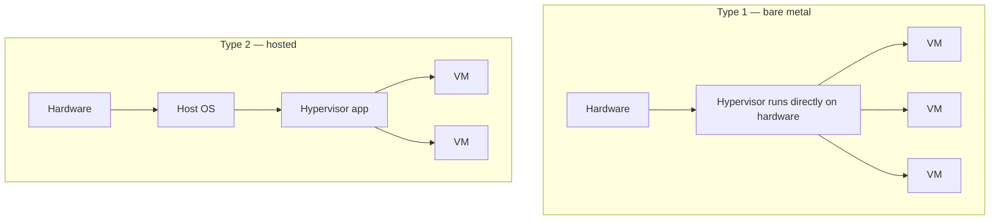
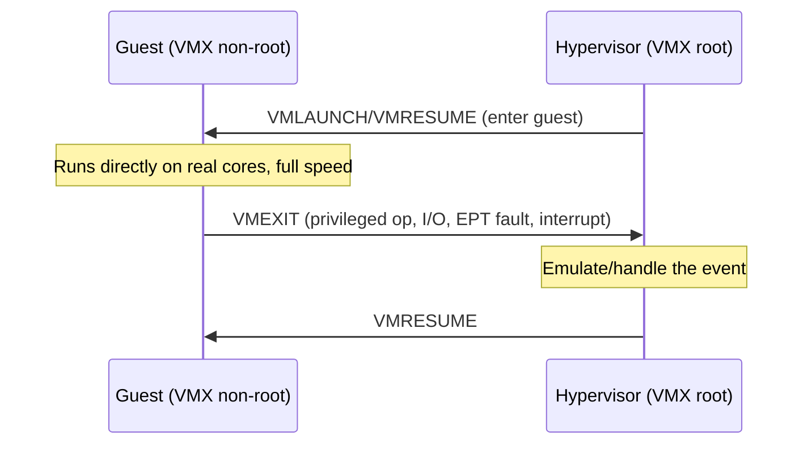

# How Virtualization (Hypervisors) Works

> **Level:** Advanced · **Related:** [Virtual Machines](virtual-machines.md) · [Containers](containers.md) · [VPS](vps.md) · [CPU](../01-hardware/cpu.md) · [OS](../03-os-and-software/operating-system.md) · [RAM](../01-hardware/ram.md) · [Drivers](../03-os-and-software/drivers.md)

## 1. The core idea

**Virtualization** lets one physical machine run many isolated **virtual machines (VMs)**, each believing it has its own CPU, memory, disks and network. The software that creates and manages them is the **hypervisor** (or Virtual Machine Monitor, VMM). It multiplexes real hardware among **guest** operating systems while keeping them isolated from each other and from the host.

```
┌─────────── VM 1 ───────────┐  ┌─────────── VM 2 ───────────┐
│  Guest OS (Linux)          │  │  Guest OS (Windows)        │
│  apps, kernel, drivers     │  │  apps, kernel, drivers     │
└────────────┬───────────────┘  └────────────┬───────────────┘
             │ virtual CPU/RAM/disk/NIC       │
┌────────────┴────────────────────────────────┴───────────────┐
│                      Hypervisor (VMM)                        │
│      CPU scheduling · memory mgmt · virtual devices          │
└──────────────────────────┬───────────────────────────────────┘
                    Physical hardware (CPU, RAM, disks, NICs)
```

The essential requirement (Popek & Goldberg, 1974): a VM must be **equivalent** (behaves like real hardware), **efficient** (most instructions run directly on the CPU), and **isolated** (the hypervisor stays in control).

## 2. Type 1 vs Type 2 hypervisors



| | Type 1 (bare-metal) | Type 2 (hosted) |
|---|---|---|
| Runs on | Directly on hardware | On top of a normal OS |
| Examples | VMware ESXi, Microsoft **Hyper-V**, KVM, Xen, Proxmox | **VirtualBox**, VMware Workstation/Player, QEMU (user), Parallels |
| Use | Servers, data centers, cloud | Desktops, dev/test |
| Overhead | Lower | Slightly higher (host OS in the path) |

**Nuance:** Hyper-V and KVM blur the line. When you enable Hyper-V or run KVM, the Linux/Windows kernel effectively *becomes* a Type 1 hypervisor with a privileged "root"/"parent" partition — the host OS is itself virtualized beneath the hypervisor.

## 3. The three things a hypervisor must virtualize

### 3.1 CPU virtualization
The hardest classic problem: a guest OS expects to run privileged instructions (in [ring 0](../01-hardware/cpu.md#9-privilege-interrupts-and-the-os-contract)), but it must not actually control the machine.

- **Trap-and-emulate**: run guest code directly; when it executes a privileged instruction, the CPU **traps** into the hypervisor, which emulates the effect. This failed on classic x86 because some instructions behaved differently in user mode without trapping.
- **Binary translation** (early VMware): rewrite guest kernel code on the fly to safe sequences — clever but slow.
- **Hardware-assisted virtualization** (today's standard): **Intel VT-x** / **AMD-V** add a new **guest mode** (non-root). The guest runs at full speed in its own rings; defined events (`VMEXIT`) transfer control to the hypervisor, which handles them and does `VMENTER` to resume. State lives in a **VMCS/VMCB** control block.



### 3.2 Memory virtualization
Each guest thinks it owns physical memory from 0. Two translation levels are needed: guest-virtual → guest-physical → host-physical.

- **Shadow page tables** (old): the hypervisor maintained combined tables — correct but expensive.
- **Second-Level Address Translation (SLAT)**: hardware does both levels — **Intel EPT** / **AMD NPT (RVI)**. The MMU walks guest tables then nested tables in hardware. See [RAM §8](../01-hardware/ram.md#8-how-the-os-uses-ram-virtual-memory).
- **Overcommit & reclamation**: assign more virtual RAM than physical using **ballooning** (a guest driver returns unused pages), page sharing (dedup identical pages), and swapping.

### 3.3 I/O virtualization
Guests need disks and networks. Three approaches, fastest last:

| Method | How | Performance |
|---|---|---|
| **Full emulation** | Hypervisor emulates a real device (e.g., an e1000 NIC, IDE disk) so unmodified drivers work | Slow (many VMEXITs) |
| **Paravirtualized (PV) drivers** | Guest uses hypervisor-aware drivers over a shared-memory ring (**virtio** on KVM, Hyper-V VMBus/"Integration Services", Xen PV) | Fast — the common choice |
| **Passthrough / SR-IOV** | Give the VM direct access to real hardware via the **IOMMU** (Intel VT-d / AMD-Vi); SR-IOV splits one NIC/GPU into virtual functions | Near-native; used for GPUs, high-speed NICs |

The **IOMMU** is critical: it restricts a device's DMA to the assigning VM's memory, so passthrough stays isolated (see [Motherboard §5](../01-hardware/motherboard.md#5-high-speed-buses)).

## 4. KVM + QEMU: a concrete stack (Linux)

The most common open-source combination:

- **KVM** (`kvm.ko` kernel module) turns the Linux kernel into a Type 1 hypervisor, exposing `/dev/kvm`. It handles CPU and memory virtualization using VT-x/AMD-V + EPT/NPT.
- **QEMU** (user-space) provides device emulation (virtio disks/NICs, display, firmware) and the management glue; it calls KVM for the fast CPU/memory path.
- **libvirt** + `virsh`/virt-manager manage VM lifecycles; cloud stacks (OpenStack, Proxmox) build on top.

Interacting with KVM is itself an [API](../05-networking-and-web/api.md) — the skeleton of the `/dev/kvm` ioctl loop:

```c
// Extremely abridged: the shape of using KVM directly (real code sets up memory, registers, etc.)
int kvm = open("/dev/kvm", O_RDWR);
int vm  = ioctl(kvm, KVM_CREATE_VM, 0);
// ioctl(vm, KVM_SET_USER_MEMORY_REGION, &region);   // give the guest RAM (mmap'd host memory)
int vcpu = ioctl(vm, KVM_CREATE_VCPU, 0);
struct kvm_run *run = mmap(NULL, run_size, PROT_READ|PROT_WRITE, MAP_SHARED, vcpu, 0);
for (;;) {
    ioctl(vcpu, KVM_RUN, 0);            // runs guest on the real CPU until a VMEXIT
    switch (run->exit_reason) {         // hypervisor handles the exit
        case KVM_EXIT_IO:   /* emulate port I/O */ break;
        case KVM_EXIT_HLT:  return 0;   /* guest halted */
    }
}
```

Managing VMs in practice:

```bash
# Linux (KVM/libvirt)
egrep -c '(vmx|svm)' /proc/cpuinfo          # CPU virtualization support (>0 = yes)
lsmod | grep kvm
virt-install --name web --ram 4096 --vcpus 2 --disk size=20 --cdrom ubuntu.iso
virsh list --all; virsh start web; virsh console web; virsh shutdown web
```

## 5. Windows: Hyper-V and the virtualization stack

- Enabling **Hyper-V** inserts the hypervisor (`hvix64.exe`/`hvax64.exe`) *below* Windows; the existing Windows install becomes the **parent partition**, with `vmms.exe` managing child VMs over the **VMBus**.
- Guests use **Integration Services** (paravirtualized drivers) and Enlightenments.
- Hyper-V also underpins **WSL2**, **Windows Sandbox**, **Docker Desktop**, and security features **VBS/HVCI** and **Credential Guard**, which run parts of Windows itself in a protected VM.

```powershell
Get-ComputerInfo -Property "HyperV*"              # virtualization capability/status
Enable-WindowsOptionalFeature -Online -FeatureName Microsoft-Hyper-V -All
New-VM -Name web -MemoryStartupBytes 4GB -Generation 2 -NewVHDPath web.vhdx -NewVHDSizeBytes 40GB
Start-VM web; Get-VM
```

## 6. Nested virtualization & live migration

- **Nested virtualization**: run a hypervisor inside a VM (VT-x/EPT exposed to the guest) — used for cloud-hosted dev, CI, and running WSL2/Hyper-V inside a cloud VM. Requires host + hypervisor support.
- **Live migration**: move a running VM between physical hosts with minimal downtime by pre-copying memory pages while it runs, then a brief final sync. Enables maintenance and load balancing in clouds. Requires shared or replicated storage and compatible CPUs.
- **Snapshots/checkpoints**: capture full VM state (memory + disk) to roll back.

## 7. Virtualization vs containers

Both isolate workloads, but at different layers (see [OS §11](../03-os-and-software/operating-system.md#11-security-model)):

| | Virtual machines | Containers (Docker, LXC, Podman) |
|---|---|---|
| Isolates | Whole machine (own kernel) | Processes sharing the host kernel |
| Boundary | Hypervisor + hardware (VT-x, EPT, IOMMU) | Kernel namespaces + cgroups + seccomp |
| Overhead | Full OS per VM (GBs, ~seconds to boot) | Megabytes, milliseconds to start |
| Isolation strength | Stronger (separate kernels) | Weaker (shared kernel = larger attack surface) |
| Guest OS | Any (Windows on Linux host, etc.) | Same-kernel only (Linux on Linux) |

**Hybrids** get the best of both: Kata Containers, Firecracker (AWS Lambda/Fargate microVMs), and gVisor wrap containers in lightweight VMs. **Firecracker** boots a minimal VM in ~125 ms with a tiny device model — purpose-built for serverless.

## 8. Why virtualization matters

- **Server consolidation**: pack many workloads onto fewer machines → higher utilization.
- **[Cloud computing](vps.md)**: the entire IaaS model (AWS EC2, Azure, GCP) is virtualization rented by the hour.
- **Isolation & security**: sandboxing, honeypots, separating tenants.
- **Dev/test**: reproducible environments, snapshots, testing across OSes.
- **Legacy**: run old OSes on new hardware.

## 9. Overhead and pitfalls

- Modern CPU/memory virtualization overhead is typically **2–10%**; I/O-heavy or interrupt-heavy workloads suffer more (mitigate with virtio/SR-IOV).
- **Noisy neighbors**: co-located VMs contend for cache, memory bandwidth, disk and network.
- **Side channels**: shared hardware enables cross-VM attacks (cache timing; speculative-execution issues like [Spectre/Meltdown](../01-hardware/cpu.md#speculation-and-its-security-cost), L1TF, MDS) — clouds mitigate with microcode, core scheduling and page-table isolation.
- Requires firmware virtualization support enabled: **VT-x/AMD-V** and **VT-d/AMD-Vi** in [BIOS/UEFI](../01-hardware/bios.md#8-firmware-setup-options-that-matter).

## Further reading
- Popek & Goldberg, *Formal Requirements for Virtualizable Third Generation Architectures* (1974)
- Intel VT-x / AMD-V programming manuals (VMCS/VMCB, EPT/NPT); *KVM* and *QEMU* documentation
- Agesen et al., *The Evolution of an x86 Virtual Machine Monitor* (VMware); AWS *Firecracker* paper (NSDI 2020)
