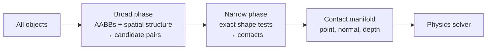

# How Collision Detection Works

> **Level:** Advanced · **Related:** [Game Physics](game-physics.md) · [Game Engines](game-engines.md) · [Ray Tracing](../02-graphics/ray-tracing.md) · [Computer Graphics](../02-graphics/computer-graphics.md)

## 1. The problem

**Collision detection** answers two questions each simulation step:
1. **Do these shapes overlap?** (boolean, for triggers/hit tests)
2. **How are they touching?** — the **contact manifold**: contact point(s), surface **normal**, and **penetration depth**, which the [physics solver](game-physics.md#4-collision-response-making-things-bounce) needs to push them apart and bounce them.

Testing every object against every other is **O(n²)** — 1,000 objects = ~500,000 pairs per frame. So collision runs in two stages: a cheap **broad phase** that prunes to likely pairs, then an exact **narrow phase**.



## 2. Collision shapes

Games rarely collide full render meshes (too expensive). They use simplified **colliders**:

| Shape | Test cost | Use |
|---|---|---|
| Sphere / circle | Cheapest | Characters (approx), projectiles |
| **AABB** (axis-aligned box) | Very cheap | Broad phase, simple objects |
| OBB (oriented box) | Cheap | Crates, doors |
| Capsule | Cheap | Characters (standard) |
| Convex hull | Moderate | Most props (via GJK) |
| Triangle mesh | Expensive | Static level geometry only |
| Heightfield | Moderate | Terrain |

**Compound colliders** combine primitives to approximate complex objects cheaply.

## 3. Broad phase: pruning the pairs

Wrap each object in an **AABB** and use a spatial structure to find overlapping AABBs fast:

| Structure | Idea | Good for |
|---|---|---|
| **Uniform grid / spatial hash** | Bucket objects by cell; check same/adjacent cells | Evenly sized/spread objects |
| **Sweep and Prune (SAP)** | Sort AABB endpoints on each axis; overlaps cluster | Objects with temporal coherence |
| **Dynamic BVH / AABB tree** | Hierarchy of AABBs, like a [ray-tracing BVH](../02-graphics/ray-tracing.md#3-acceleration-structures-the-bvh) | General, dynamic scenes (Box2D, Bullet) |
| **Quadtree / Octree** | Recursively subdivide space | Static or clustered scenes |

AABB overlap is the workhorse test — three interval checks, no square roots:

```python
def aabb_overlap(a, b):        # boxes as (min_x, min_y, max_x, max_y)
    return (a[0] <= b[2] and a[2] >= b[0] and
            a[1] <= b[3] and a[3] >= b[1])

# Spatial hash broad phase: only compare objects sharing a grid cell
from collections import defaultdict
def broad_phase(boxes, cell=64):
    grid, pairs = defaultdict(list), set()
    for i, (x0, y0, x1, y1) in enumerate(boxes):
        for cx in range(int(x0)//cell, int(x1)//cell + 1):
            for cy in range(int(y0)//cell, int(y1)//cell + 1):
                for j in grid[(cx, cy)]:
                    if aabb_overlap(boxes[i], boxes[j]): pairs.add((min(i,j), max(i,j)))
                grid[(cx, cy)].append(i)
    return pairs
```

## 4. Narrow phase: exact tests

### 4.1 Analytic primitive tests

**Sphere–sphere** (cheapest possible — compare squared distance to summed radii):
```python
def sphere_hit(c1, r1, c2, r2):
    dx, dy = c1[0]-c2[0], c1[1]-c2[1]
    return dx*dx + dy*dy <= (r1 + r2)**2    # avoid sqrt
```

**Circle–AABB** (clamp circle center to the box, measure distance):
```python
def circle_aabb(cx, cy, r, bx0, by0, bx1, by1):
    nx, ny = max(bx0, min(cx, bx1)), max(by0, min(cy, by1))   # closest point on box
    dx, dy = cx - nx, cy - ny
    return dx*dx + dy*dy <= r*r
```

### 4.2 SAT — Separating Axis Theorem (convex polygons/boxes)
Two convex shapes are **disjoint if and only if** there exists an axis on which their projections don't overlap. Test each shape's face normals (and, in 3D, cross products of edges); if any axis separates them, no collision. The axis of **minimum overlap** gives the collision normal and penetration depth.

```python
def project(poly, axis):
    dots = [p[0]*axis[0] + p[1]*axis[1] for p in poly]
    return min(dots), max(dots)

def sat_overlap(a, b):                      # a, b: lists of CCW vertices (convex)
    min_pen, normal = float("inf"), None
    for poly in (a, b):
        for i in range(len(poly)):
            x1, y1 = poly[i]; x2, y2 = poly[(i+1) % len(poly)]
            axis = (-(y2 - y1), x2 - x1)                       # edge normal
            L = (axis[0]**2 + axis[1]**2) ** 0.5
            axis = (axis[0]/L, axis[1]/L)
            amin, amax = project(a, axis); bmin, bmax = project(b, axis)
            if amax < bmin or bmax < amin: return None          # separating axis → no hit
            overlap = min(amax, bmax) - max(amin, bmin)
            if overlap < min_pen: min_pen, normal = overlap, axis
    return {"depth": min_pen, "normal": normal}                 # push-out vector

square = [(0,0),(2,0),(2,2),(0,2)]
print(sat_overlap(square, [(1,1),(3,1),(3,3),(1,3)]))          # overlapping → depth+normal
```

### 4.3 GJK + EPA (arbitrary convex shapes)
The **GJK** algorithm decides overlap for any two convex shapes using their **Minkowski difference**: the shapes intersect iff that difference contains the origin. GJK searches for a simplex enclosing the origin using only a **support function** (farthest point in a direction). If they overlap, **EPA** (Expanding Polytope Algorithm) finds the penetration depth and normal. This is what Bullet, Jolt and most 3D engines use for convex–convex contacts.

## 5. Raycasting and queries

Beyond body-vs-body, engines expose **spatial queries**:
- **Raycast**: shoot a ray, find the first hit — bullets (hitscan), line of sight, mouse picking, ground checks, AI vision. Same math as [ray tracing](../02-graphics/ray-tracing.md#2-rayprimitive-intersection).
- **Shapecast / sweep**: move a shape along a path and find first contact — character controllers.
- **Overlap queries**: everything inside a sphere/box — explosion damage, triggers.

```python
def ray_circle(ox, oy, dx, dy, cx, cy, r):
    # solve |O + t·D − C|² = r²  for smallest t ≥ 0
    fx, fy = ox - cx, oy - cy
    a = dx*dx + dy*dy
    b = 2*(fx*dx + fy*dy)
    c = fx*fx + fy*fy - r*r
    disc = b*b - 4*a*c
    if disc < 0: return None
    t = (-b - disc**0.5) / (2*a)
    return t if t >= 0 else None
```

## 6. Contact manifolds

For stable resting contact (a box on the ground), a single point isn't enough — the solver needs the full **manifold** (e.g., two points along a touching edge, or a face). Engines generate and **persist** manifolds across frames (warm-starting the solver with last frame's impulses) for stable stacking.

## 7. Continuous collision detection (fast objects)

At 60 Hz a bullet can move meters per step and **tunnel** straight through a wall — discrete tests only check start and end positions. **CCD** prevents this by testing the *swept* volume:
- **Conservative advancement** / **swept shapes**: find the earliest time-of-impact along the motion.
- **Speculative contacts**: enlarge collision margins to catch fast approaches.
CCD is costly, so engines enable it only for fast, important objects (projectiles, the player).

## 8. Performance summary

| Lever | Effect |
|---|---|
| Simple colliders (sphere/capsule/box) | Cheap narrow phase |
| Good broad phase (BVH/SAP/grid) | O(n²) → ~O(n log n) |
| Collision layers/masks | Skip pairs that can't interact (e.g., two pickups) |
| Sleeping resting bodies | Skip them entirely |
| Soft real-time budget | Cap substeps; LOD collision |

**Collision layers/matrices** are the biggest practical win: tell the engine which categories can collide (player vs world, enemy vs bullet) so most pairs are filtered before any test.

## Further reading
- Christer Ericson, *Real-Time Collision Detection* (the definitive reference)
- Gino van den Bergen, *Collision Detection in Interactive 3D Environments* (GJK/EPA)
- Erin Catto's GDC talks (Box2D, manifolds, solver); Bullet/Jolt physics documentation
