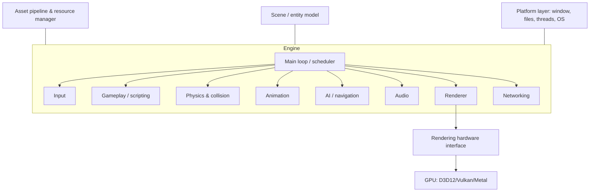
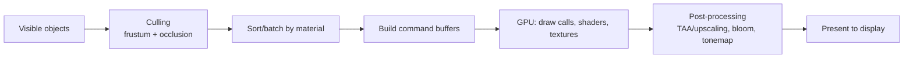

# How Game Engines Work

> **Level:** Advanced · **Related:** [Game Physics](game-physics.md) · [Collision Detection](collision-detection.md) · [Textures](textures.md) · [Computer Graphics](../02-graphics/computer-graphics.md) · [GPU](../01-hardware/gpu.md) · [Shaders](../02-graphics/shaders.md)

## 1. What a game engine is

A **game engine** is the reusable software framework that runs a game: it drives a **main loop** that reads input, updates the world (physics, AI, gameplay), and renders a frame — dozens to hundreds of times per second — while managing assets, audio, memory, threading and platform differences. It lets developers build *games* instead of re-writing rendering and physics each time.

Major engines: **Unreal Engine**, **Unity**, **Godot**, plus in-house engines (Frostbite, RE Engine, Decima, id Tech, Source 2) and frameworks/libraries (Bevy, MonoGame, raylib, three.js for the web).

## 2. The subsystems



| Subsystem | Job |
|---|---|
| **Main loop** | Order and time every update; hit the target frame rate |
| **Renderer** | Turn the scene into pixels — see [Computer Graphics](../02-graphics/computer-graphics.md) |
| **[Physics](game-physics.md)** | Move bodies, resolve [collisions](collision-detection.md), simulate forces |
| **Animation** | Skeletal animation, blending, state machines, IK |
| **Audio** | 3D positional sound, mixing, DSP effects |
| **Scene/entities** | Represent the world's objects and their components |
| **Asset pipeline** | Import, cook and stream meshes, [textures](textures.md), audio |
| **Scripting** | Gameplay logic in C#, Blueprints, GDScript, Lua |
| **Networking** | Multiplayer state sync — see [WebRTC](../05-networking-and-web/webrtc.md) for real-time transport ideas |
| **Platform layer** | Abstract OS windowing, input, file I/O, threads |

## 3. The game loop — the heartbeat

Everything hangs off a loop. The naive version couples simulation to frame rate (bad: physics changes with FPS). The correct version uses a **fixed timestep** for simulation and interpolates for rendering.

```cpp
// Fixed-timestep loop (Glenn Fiedler's "Fix Your Timestep")
const double DT = 1.0 / 60.0;          // simulate 60 Hz regardless of render FPS
double accumulator = 0.0, current = now();
while (running) {
    double newTime = now();
    accumulator += newTime - current;
    current = newTime;

    processInput();
    while (accumulator >= DT) {         // catch up simulation in fixed steps
        previousState = state;
        integrate(state, DT);           // physics, gameplay — deterministic
        accumulator -= DT;
    }
    double alpha = accumulator / DT;    // leftover fraction
    render(lerp(previousState, state, alpha));   // interpolate for smoothness
}
```

Why it matters:
- **Determinism**: fixed steps make physics reproducible (vital for replays, lockstep multiplayer).
- **Stability**: physics integrators explode with variable/large `dt`.
- **Decoupling**: render at 144 FPS while simulating at 60 Hz, or vice versa.

Delta-time-based movement (`position += velocity * dt`) keeps speeds frame-rate-independent for non-physics motion.

## 4. Scene representation: the object model

### 4.1 Scene graph
A tree of nodes with parent-child **transforms** (position/rotation/scale as [4×4 matrices](../02-graphics/computer-graphics.md#2-math-foundations)); a child's world transform = parent's × its local transform. Moving an arm moves the hand attached to it. Unity/Godot expose this as GameObjects/Nodes with hierarchy.

### 4.2 Component model & ECS
- **GameObject + Components** (Unity): an entity is a bag of components (Transform, MeshRenderer, Rigidbody, custom scripts). Composition over inheritance.
- **ECS (Entity-Component-System)**: the performance-oriented pattern.
  - **Entity** = an ID.
  - **Component** = plain data (position, velocity, health), stored in tightly packed arrays.
  - **System** = logic that iterates over entities having certain components.

ECS wins on **cache locality** (data-oriented design — see [CPU §6](../01-hardware/cpu.md#6-the-memory-hierarchy-why-caches-dominate-performance)) and parallelism. Used by Unity DOTS, Bevy, Overwatch's engine.

```rust
// Bevy (Rust) ECS — a system iterating a query of components
fn movement(time: Res<Time>, mut q: Query<(&mut Transform, &Velocity)>) {
    for (mut transform, vel) in &mut q {
        transform.translation += vel.0 * time.delta_seconds();  // data laid out contiguously
    }
}
```

The same idea in a tiny hand-rolled ECS (Python, to show the shape):

```python
positions, velocities = {}, {}                 # component stores keyed by entity id
def spawn(eid, pos, vel): positions[eid] = pos; velocities[eid] = vel
def movement_system(dt):                        # a "system" over entities that have both
    for eid in positions.keys() & velocities.keys():
        px, py = positions[eid]; vx, vy = velocities[eid]
        positions[eid] = (px + vx * dt, py + vy * dt)
spawn(1, (0, 0), (10, 0)); movement_system(0.1); print(positions[1])   # (1.0, 0.0)
```

## 5. The renderer

The engine builds a list of what to draw and submits it to the GPU through a **Rendering Hardware Interface (RHI)** that abstracts Direct3D 12/Vulkan/Metal.



Key techniques (all detailed in [Computer Graphics](../02-graphics/computer-graphics.md)):
- **Culling** (frustum, occlusion, LOD) — don't render what you can't see.
- **Batching/instancing** — minimize [draw calls](../01-hardware/gpu.md#9-performance-checklist) (each has CPU cost).
- **Materials & [shaders](../02-graphics/shaders.md)** — PBR lighting, [textures](textures.md).
- **[Ray tracing](../02-graphics/ray-tracing.md)**, **[DLSS/FSR upscaling](../02-graphics/dlss.md)**, **[frame generation](../02-graphics/frame-generation.md)**.
- **Render graph** — modern engines schedule passes (shadow, G-buffer, lighting, post) with automatic resource/barrier management.

## 6. Asset pipeline

Source art (`.fbx`, `.png`, `.wav`) is **imported and "cooked"** into engine-optimized runtime formats: meshes to GPU vertex buffers, [textures](textures.md) to compressed GPU formats (BC/ASTC) with mipmaps, audio to streaming formats. At runtime a **resource manager** loads, references-counts, and **streams** assets (open worlds page textures/geometry in and out by distance — e.g., UE5 Nanite/Virtual Textures). Handled off the main thread to avoid hitches.

## 7. Scripting and gameplay

Engines separate the C++ core from gameplay code:

| Engine | Scripting |
|---|---|
| Unity | C# (compiled to IL, JIT/AOT via Mono/IL2CPP) — see [Virtual Machines](../08-virtualization-and-cloud/virtual-machines.md#8-the-major-language-vms) |
| Unreal | C++ + **Blueprints** (visual node graphs, compiled to bytecode) |
| Godot | GDScript, C#, C++ (GDExtension) |
| Custom | Lua, C++, visual scripting |

Gameplay code hooks lifecycle callbacks (`Start`, `Update`, `OnCollision`) and reacts to an **event system**. Hot-reload and in-editor play speed iteration.

## 8. Threading

A modern engine spreads work across [cores](../01-hardware/cpu.md#8-multicore-smt-and-hybrid-designs):
- **Job/task systems**: split work (culling, animation, physics, particles) into jobs scheduled onto a worker thread pool.
- A **render thread** builds command buffers ahead of the GPU; the **game thread** simulates; sometimes an **RHI thread** submits.
- Careful synchronization avoids data races; ECS's structured access helps parallelize safely.

## 9. The editor and tooling

Engines ship an **editor**: scene composition, asset browser, inspectors, profilers (CPU/GPU frame timing), and live "play in editor". Debug tools: [RenderDoc](../02-graphics/computer-graphics.md#8-graphics-apis-and-platforms)/PIX for frames, physics visualizers, memory and network profilers. Good tooling is a major reason to use an engine at all.

## 10. Choosing / building

| Need | Fit |
|---|---|
| 3D AAA fidelity, big teams | Unreal Engine |
| Cross-platform, mobile, indies, large asset store | Unity |
| Open source, lightweight, 2D/3D | Godot |
| Learning / full control / data-oriented | Bevy, raylib, custom + Vulkan |
| Web games | three.js/Babylon.js (see [WebGPU](../02-graphics/computer-graphics.md#8-graphics-apis-and-platforms)) |

Building your own teaches the fundamentals but is a multi-year effort for anything AAA — most teams license an engine and focus on the game.

## Further reading
- Jason Gregory, *Game Engine Architecture* (the definitive book)
- Glenn Fiedler, *Fix Your Timestep!* and the *Game Physics* series (gafferongames.com)
- *Game Programming Patterns* by Robert Nystrom (free online); Unreal/Unity/Godot documentation
