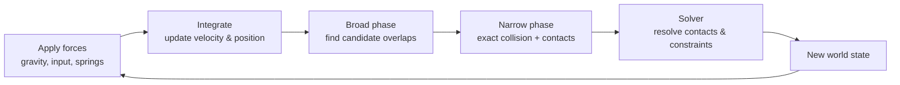

# How Game Physics Works

> **Level:** Advanced · **Related:** [Collision Detection](collision-detection.md) · [Game Engines](game-engines.md) · [CPU](../01-hardware/cpu.md) · [Sensors](../01-hardware/sensors-and-detectors.md) · [GPU](../01-hardware/gpu.md)

## 1. The goal

A **physics engine** makes a virtual world behave believably: objects fall, bounce, slide, stack, swing and shatter. It's an approximate, real-time simulation of **classical (Newtonian) mechanics** — trading physical exactness for speed, stability and fun. It runs every fixed [simulation step](game-engines.md#3-the-game-loop--the-heartbeat), typically at 60 Hz.

The loop each step:



Collision (broad + narrow phase) has its own page: [Collision Detection](collision-detection.md). This page covers motion, forces, integration and constraint solving.

## 2. Newtonian foundations

| Law | Formula | In an engine |
|---|---|---|
| Motion | `F = m·a` → `a = F/m` | Sum forces, divide by mass |
| Velocity | `v = ∫a dt` | Integrate acceleration |
| Position | `x = ∫v dt` | Integrate velocity |
| Momentum | `p = m·v` (conserved) | Governs collision response |
| Rotation | `τ = I·α` | Torque, moment of inertia, angular accel |

A **rigid body** has: mass, position, velocity, orientation (a **quaternion**), angular velocity, and inertia tensor. **Static** bodies (ground, walls) have infinite mass (never move); **kinematic** bodies move by script, unaffected by forces.

## 3. Integration: stepping time forward

Given acceleration, update velocity and position over `dt`. The choice of **integrator** decides stability and energy behavior.

**Explicit (forward) Euler — simple but leaks energy, can explode:**
```
v += a * dt
x += v * dt
```

**Semi-implicit (symplectic) Euler — the game standard: stable, energy-conserving, one-line change (update v first, then use new v):**
```
v += a * dt
x += v * dt        // uses the just-updated v
```

**Verlet — great for particles/cloth, position-based, velocity implicit:**
```
x_next = 2*x - x_prev + a * dt²
```

Compared in Python (a mass on a spring — Euler gains energy, semi-implicit stays bounded):

```python
def simulate(method, steps=2000, dt=0.05, k=1.0, m=1.0):
    x, v = 1.0, 0.0
    energy = []
    for _ in range(steps):
        a = -k * x / m                       # spring force F = -kx
        if method == "euler":
            x_new = x + v * dt; v = v + a * dt; x = x_new
        elif method == "semi_implicit":
            v = v + a * dt; x = x + v * dt     # update v first, then x
        energy.append(0.5 * m * v*v + 0.5 * k * x*x)
    return energy[0], energy[-1]

print("euler:", simulate("euler"))               # final energy >> initial (blows up)
print("semi-implicit:", simulate("semi_implicit"))  # final ≈ initial (stable)
```

This is exactly why engines use **fixed timesteps** and symplectic integrators (see [Game Engines §3](game-engines.md#3-the-game-loop--the-heartbeat)).

## 4. Collision response: making things bounce

When [collision detection](collision-detection.md) reports a contact (point, normal `n`, penetration depth), the solver computes an **impulse** `j` that instantly changes velocities to prevent interpenetration and produce a bounce.

For two bodies with the **coefficient of restitution** `e` (0 = inelastic/no bounce, 1 = perfectly elastic):

```
relative velocity along normal:  v_rel = (vA − vB) · n
impulse magnitude:  j = −(1 + e) · v_rel / (1/mA + 1/mB)
vA += (j/mA) · n
vB −= (j/mB) · n
```

```python
def resolve_collision(vA, vB, mA, mB, n, e=0.5):
    # n is the contact normal pointing from B toward A
    v_rel = (vA[0]-vB[0])*n[0] + (vA[1]-vB[1])*n[1]
    if v_rel > 0: return vA, vB                     # already separating
    j = -(1 + e) * v_rel / (1/mA + 1/mB)
    vA = (vA[0] + j/mA*n[0], vA[1] + j/mA*n[1])
    vB = (vB[0] - j/mB*n[0], vB[1] - j/mB*n[1])
    return vA, vB

# A moves +x, B moves -x; they approach, normal points from B (right) to A (left) = (-1, 0)
print(resolve_collision((1, 0), (-1, 0), 1, 1, (-1, 0), e=1.0))  # → ((-1,0),(1,0)): equal masses swap
```

**Friction** adds a second impulse along the tangent (Coulomb model: `|friction| ≤ μ·|normal impulse|`). **Positional correction** (Baumgarte stabilization or split impulses) pushes overlapping bodies apart gradually to fix penetration without adding energy.

## 5. Constraints and the solver

Most rich behavior comes from **constraints** — rules relating bodies:

| Constraint | Effect |
|---|---|
| Contact (non-penetration) | Bodies don't overlap |
| Joints (hinge, ball, slider) | Ragdolls, doors, vehicles |
| Distance/rod | Ropes, pendulums |
| Motors/springs | Suspension, actuators |

A stack of boxes has many interdependent contacts; you can't solve them one at a time. Engines use an **iterative solver** — **Sequential Impulses** / Projected Gauss-Seidel — applying impulses to each constraint repeatedly (e.g., 4–20 iterations/step) until velocities are consistent. More iterations = more stable stacks, more CPU. **Position-Based Dynamics (PBD/XPBD)** instead corrects positions directly and derives velocity — robust for cloth, soft bodies and increasingly rigid bodies.

## 6. Beyond rigid bodies

| System | Technique |
|---|---|
| **Cloth** | Mesh of particles + distance/bending constraints, Verlet/PBD |
| **Soft bodies** | Deformable meshes, shape matching, FEM |
| **Fluids** | SPH (particles) or grid (Eulerian); often on the [GPU](../01-hardware/gpu.md) |
| **Ragdolls** | Skeleton of rigid bodies joined by constrained joints |
| **Particles** | Fire, smoke, debris — many lightweight, often stateless |
| **Vehicles** | Raycast wheels + suspension springs + tire friction models |
| **Destruction** | Pre-fractured meshes released as rigid bodies on impact |

## 7. Determinism and stability

- **Fixed timestep** is essential; variable `dt` makes physics jittery and non-reproducible.
- **Determinism** (same inputs → same result) needs fixed step *and* consistent floating-point across machines — hard, because FP results vary by CPU/compiler/order. Lockstep multiplayer (RTS) sometimes uses fixed-point math for this reason. See [Machine Code](../03-os-and-software/machine-code.md).
- **Tunneling**: fast objects pass through thin walls in one step → use **continuous collision detection (CCD)** (swept shapes) — see [Collision §7](collision-detection.md#7-continuous-collision-detection-fast-objects).
- **Sleeping**: bodies at rest are deactivated to save CPU until disturbed.
- **Instability sources**: huge mass ratios, large `dt`, deep penetrations, too few solver iterations.

## 8. Engines and code

| Engine | Used by |
|---|---|
| **PhysX** (NVIDIA, open source) | Unreal, Unity (older), many |
| **Jolt** | Horizon, modern Unreal option |
| **Box2D** (2D), **Bullet**, **Havok** | Countless games |
| **Rapier** (Rust), **Chipmunk** | Indies, web |

Physics usually runs on the **[CPU](../01-hardware/cpu.md)** (branchy, latency-sensitive), with some particle/fluid work offloaded to the **[GPU](../01-hardware/gpu.md)**. It's a heavy consumer of the fixed-step budget, so engines cap substeps and use [broad-phase](collision-detection.md#3-broad-phase-pruning-the-pairs) culling and sleeping aggressively.

Using a real engine (pymunk / Chipmunk, Python) — a ball falling and bouncing:

```python
import pymunk
space = pymunk.Space(); space.gravity = (0, -900)
floor = pymunk.Segment(space.static_body, (0, 10), (600, 10), 2); floor.elasticity = 0.8
space.add(floor)
body = pymunk.Body(mass=1, moment=10); body.position = (300, 400)
ball = pymunk.Circle(body, 15); ball.elasticity = 0.8
space.add(body, ball)
for _ in range(180):                 # 3 seconds at 60 Hz — fixed timestep
    space.step(1/60)
print(round(body.position.y, 1))     # bounced back up above the floor
```

The equivalent shape in JavaScript uses [matter.js](../02-graphics/computer-graphics.md) (`Engine.create()`, `Bodies.circle`, `Engine.update(engine, 1000/60)`); C++ uses Box2D/Jolt directly.

## Further reading
- Glenn Fiedler, *Integration Basics*, *Fix Your Timestep!* (gafferongames.com)
- Erin Catto (Box2D), GDC talks on Sequential Impulses; Ian Millington, *Game Physics Engine Development*
- Müller et al., *Position Based Dynamics*; Christer Ericson, *Real-Time Collision Detection*
