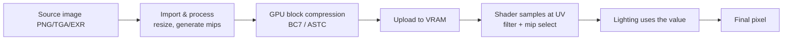

# How Textures Work

> **Level:** Advanced · **Related:** [Computer Graphics](../02-graphics/computer-graphics.md) · [Shaders](../02-graphics/shaders.md) · [GPU](../01-hardware/gpu.md) · [Game Engines](game-engines.md) · [Compression](../06-security-and-data/compression.md)

## 1. What a texture is

A **texture** is an image (usually) mapped onto 3D geometry to add surface detail — color, bumps, shininess, transparency — without adding polygons. It's a grid of **texels** (texture elements) stored in GPU memory that [shaders](../02-graphics/shaders.md) **sample** to decide what a surface looks like at each pixel. A flat, cheap triangle can look like weathered brick because a texture supplies the detail.

More generally, a texture is just **GPU-resident array data** the shader can read with hardware-accelerated filtering — used for color, lighting information, lookup tables, and general compute.

## 2. UV mapping: wrapping 2D onto 3D

Each mesh vertex carries a **UV coordinate** — a 2D position in texture space, conventionally `[0,1] × [0,1]`. The rasterizer interpolates UVs across each triangle (perspective-correct — see [Computer Graphics §3.1](../02-graphics/computer-graphics.md#31-rasterization-itself)), and the shader looks up the texel at that UV.

```
   Texture (UV space)              Model
   (0,0) ┌───────┐ (1,0)          artist "unwraps" the 3D surface
         │  ▲ ▲  │                onto the flat texture like a papercraft net
         │ face  │        ──►      each vertex ↔ a (u, v) point
   (0,1) └───────┘ (1,1)
```

**UV unwrapping** (done by artists in Blender/Maya, or auto-generated) flattens the model into 2D islands packed into the texture. Seams are where islands meet. Getting UVs right (minimal stretch, good texel density) is a core art task.

**Wrap modes** decide what happens outside `[0,1]`: `repeat` (tile — for brick/grass), `clamp` (stretch edge), `mirror`. Set per texture/sampler.

## 3. The texturing pipeline



## 4. Filtering: from texels to smooth pixels

A texel rarely maps 1:1 to a screen pixel. **Filtering** decides the sampled color:

| Filter | How | Look |
|---|---|---|
| **Nearest** | Pick the closest texel | Blocky/pixelated (retro, pixel art) |
| **Bilinear** | Weighted average of 4 nearest texels | Smooth (default) |
| **Trilinear** | Bilinear on two mip levels, blended | Smooth across distance (no mip "pops") |
| **Anisotropic (2×–16×)** | Many samples along the view-stretched direction | Sharp surfaces at grazing angles (floors, roads) |

Bilinear interpolation of the four surrounding texels:

```python
def bilinear(tex, u, v):                       # tex[y][x] = (r,g,b), u,v in texel space
    x0, y0 = int(u), int(v); x1, y1 = x0 + 1, y0 + 1
    fx, fy = u - x0, v - y0
    def px(x, y): return tex[min(y, len(tex)-1)][min(x, len(tex[0])-1)]
    def lerp(a, b, t): return tuple(a[i] + (b[i]-a[i])*t for i in range(3))
    top = lerp(px(x0, y0), px(x1, y0), fx)
    bot = lerp(px(x0, y1), px(x1, y1), fx)
    return lerp(top, bot, fy)
```

The GPU does this in dedicated **texture units** in hardware, essentially for free.

## 5. Mipmaps: the fix for distant textures

A far-away textured surface has many texels crammed into one pixel. Sampling just one texel causes ugly **aliasing/shimmering** as the camera moves. **Mipmaps** are precomputed, successively half-sized versions of the texture (a "chain": 512→256→128→…→1). The GPU picks the mip level whose texel density matches the pixel — using screen-space UV derivatives (`ddx/ddy`) — so it always samples an appropriately pre-filtered image.

```
Level 0: 512×512   (full detail, used up close)
Level 1: 256×256
Level 2: 128×128
...      (each level = average of 2×2 texels from the previous)
Level 9: 1×1       (used at extreme distance)
```

Cost: +33% memory (`1 + 1/4 + 1/16 + … ≈ 4/3`), a huge win for quality *and* performance (better cache use — distant objects read tiny mips). Trilinear filtering blends between two levels to avoid visible transitions.

## 6. Texture maps in PBR materials

Modern materials ([PBR](../02-graphics/computer-graphics.md#4-lighting-and-materials)) use **several textures per surface**, each feeding a different shader input:

| Map | Encodes | Used for |
|---|---|---|
| **Albedo / Base Color** | Surface color (no lighting baked in) | Diffuse reflectance |
| **Normal map** | Per-texel surface normal (RGB = XYZ) | Fake bumps/detail without geometry |
| **Roughness** | Micro-surface roughness | Sharp vs blurry highlights |
| **Metallic** | Metal vs dielectric | Reflection behavior |
| **Ambient Occlusion (AO)** | Baked contact shadow | Darkens crevices |
| **Height / Displacement** | Elevation | Parallax mapping, real tessellation |
| **Emissive** | Self-illumination | Glowing parts |
| **Opacity/Alpha** | Transparency | Foliage, glass, decals |

**Normal mapping** is the star trick: instead of modeling every bump, store the surface normal per texel and use it in lighting, so a flat wall catches light like rough stone. The shader reads the normal, transforms it to world space (via a **TBN** — tangent/bitangent/normal — basis), and lights with it.

Sampling maps in a GLSL fragment shader (see full example in [Shaders §4](../02-graphics/shaders.md#4-anatomy-of-a-vertex--fragment-shader-glsl)):

```glsl
vec3 albedo = texture(albedoMap, uv).rgb;                 // sRGB → auto-linearized
vec3 nTex   = texture(normalMap, uv).xyz * 2.0 - 1.0;     // [0,1] → [-1,1]
vec3 N      = normalize(TBN * nTex);                       // to world space
float rough = texture(ormMap, uv).g;                       // packed: AO/Rough/Metal in R/G/B
```

Artists often **pack** grayscale maps into one texture's RGB channels (e.g., ORM = Occlusion/Roughness/Metallic) to save memory and samples.

## 7. Texture types and formats

**Kinds of textures:**
- **2D** — the usual case.
- **Cubemaps** (6 faces) — skyboxes, reflection/environment maps.
- **3D / volume** — fog, noise, medical, color grading LUTs.
- **Texture arrays** — many same-size layers in one bind (terrain layers, sprite sheets).
- **Render targets** — textures the GPU *writes* to (G-buffer, shadow maps, post-processing — see [deferred rendering](../02-graphics/computer-graphics.md#5-rendering-architectures)).

**Storage formats** matter enormously for VRAM and bandwidth:

| Format | Bits/texel | Notes |
|---|---|---|
| RGBA8 | 32 | Uncompressed color |
| RGBA16F / RGBA32F | 64 / 128 | HDR, data maps, render targets |
| **BC1 (DXT1)** | 4 | Color, 6:1 compressed |
| **BC5** | 8 | Two channels — ideal for normal maps |
| **BC7** | 8 | High-quality color, standard on PC |
| **BC6H** | 8 | HDR color |
| **ASTC** | 1–8 (variable block) | Mobile standard, flexible quality |

## 8. GPU texture compression — why it's special

Unlike [ZIP/PNG](../06-security-and-data/compression.md), GPU **block compression** (BC/DXT/ASTC) is designed for **random access**: the GPU must decode *any single texel instantly* without decompressing the whole image. It works on fixed **4×4 texel blocks**, each compressed to a fixed size (e.g., BC1: 64 bits per 16 texels). Each block stores two endpoint colors + per-texel interpolation indices; the hardware reconstructs texels on the fly in the texture unit.

Benefits: **4–8× less VRAM**, less memory bandwidth (the real bottleneck — see [GPU §5](../01-hardware/gpu.md#5-memory-the-real-bottleneck)), and free hardware decode. Textures are compressed offline (at import) with tools like `nvcompress`, `astcenc`, or engine importers, then stored in containers like **KTX2** / **DDS** (often further packed with **Basis Universal** for cross-platform transcoding).

## 9. Streaming and virtual textures

Open worlds have more texture data than fits in VRAM. Solutions:
- **Texture streaming**: load mip levels on demand by distance; keep low mips resident, stream high mips when close (managed by the [engine's asset system](game-engines.md#6-asset-pipeline)).
- **Virtual texturing** (megatextures, UE5 Virtual Textures): treat textures like [virtual memory](../01-hardware/ram.md#8-how-the-os-uses-ram-virtual-memory) — a huge logical texture backed by physical "pages" loaded as visible. A per-frame feedback pass determines which pages are needed.
- **Bindless textures / descriptor indexing**: shaders index a giant array of textures dynamically (see [Shaders §5](../02-graphics/shaders.md#5-resources--binding-model)).

## 10. Creating and sampling a texture in code

**JavaScript (WebGL2)** — upload an image and configure sampling:

```js
const tex = gl.createTexture();
gl.bindTexture(gl.TEXTURE_2D, tex);
gl.texImage2D(gl.TEXTURE_2D, 0, gl.RGBA, gl.RGBA, gl.UNSIGNED_BYTE, image);
gl.generateMipmap(gl.TEXTURE_2D);                                  // build the mip chain
gl.texParameteri(gl.TEXTURE_2D, gl.TEXTURE_MIN_FILTER, gl.LINEAR_MIPMAP_LINEAR);  // trilinear
gl.texParameteri(gl.TEXTURE_2D, gl.TEXTURE_WRAP_S, gl.REPEAT);
const aniso = gl.getExtension("EXT_texture_filter_anisotropic");
if (aniso) gl.texParameterf(gl.TEXTURE_2D, aniso.TEXTURE_MAX_ANISOTROPY_EXT, 16);
```

WGSL/GLSL shaders then sample with `textureSample(tex, samp, uv)` / `texture(sampler2D, uv)`.

**Python** — generate a procedural texture (no image file needed):

```python
import numpy as np
from PIL import Image
N = 256
y, x = np.mgrid[0:N, 0:N]
checker = (((x // 32) + (y // 32)) % 2) * 255                # checkerboard
noise = (np.random.default_rng(0).random((N, N)) * 40).astype(np.uint8)
tex = np.clip(checker + noise, 0, 255).astype(np.uint8)
Image.fromarray(tex).save("procedural.png")                  # ready to upload to the GPU
```

**C++ (OpenGL)** uses `glTexImage2D` + `glGenerateMipmap` + `glTexParameteri`; Direct3D 12/Vulkan create a texture resource, copy via an upload buffer, and bind a sampler + shader-resource view.

## 11. Procedural and generated textures

Not all textures are painted images:
- **Procedural** — generated by math ([Perlin/simplex noise](../02-graphics/shaders.md), Voronoi) for terrain, clouds, marble; infinite detail, tiny storage.
- **Substance / node-based** — authored as graphs, rendered to maps.
- **Baked** — high-poly detail baked into normal/AO maps for low-poly meshes.
- **Render-to-texture** — dynamic content (mirrors, security-camera screens, water).

## 12. Pitfalls

- **Wrong color space**: albedo is sRGB; normal/roughness/data maps must be **linear** — mislabeling causes wrong lighting (see [Computer Graphics §9](../02-graphics/computer-graphics.md#9-color-science-essentials)).
- **No mipmaps** → shimmering aliasing in the distance.
- **Non-power-of-two** sizes limit some features; keep to 2ⁿ where possible.
- **Texture bleeding** at UV seams → add padding/dilation around islands.
- **VRAM budget**: high-res uncompressed textures are the #1 memory hog — always compress.
- **Overdraw of transparent textures** hurts performance.

## Further reading
- Akenine-Möller et al., *Real-Time Rendering* (texturing, mipmapping, compression chapters)
- LearnOpenGL.com — *Textures*, *Normal Mapping*; *WebGPU Fundamentals* texture articles
- Microsoft docs on Block Compression (BC1–BC7); ARM ASTC guide; Khronos KTX2/Basis Universal
